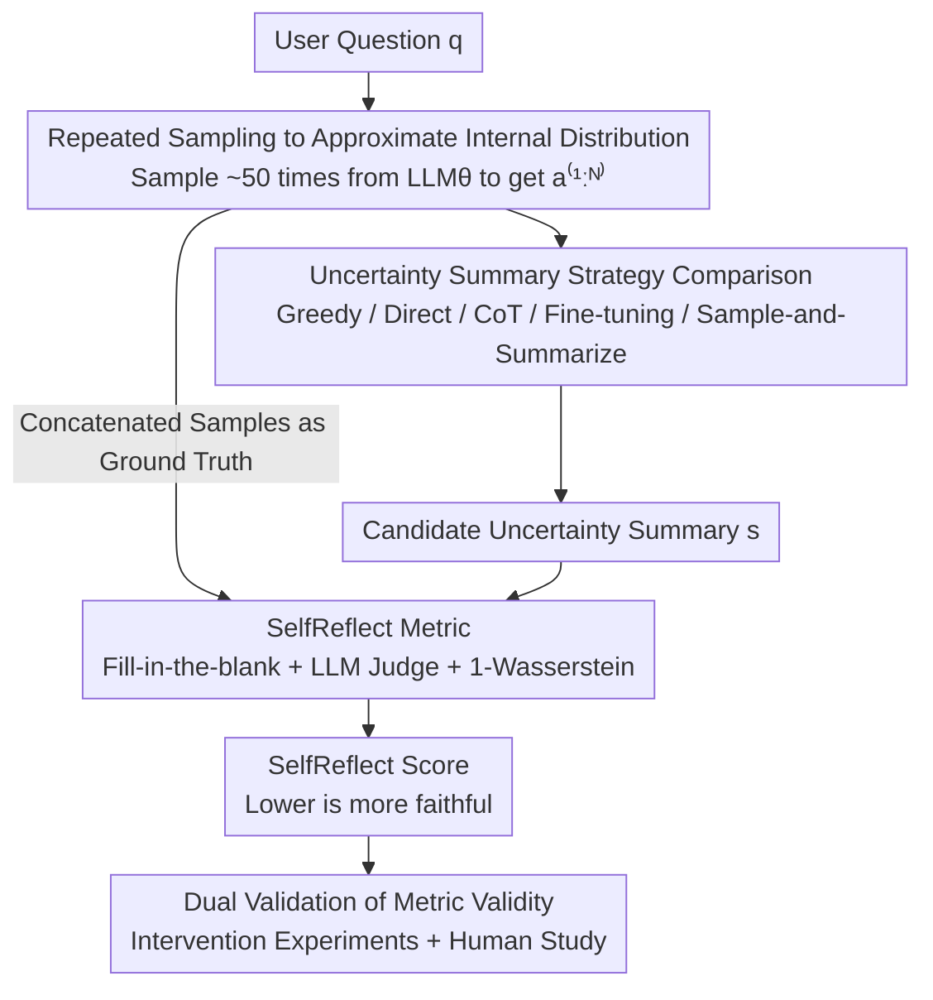

# SelfReflect: Can LLMs Communicate Their Internal Answer Distribution?

**Conference**: ICLR 2026  
**arXiv**: [2505.20295](https://arxiv.org/abs/2505.20295)  
**Code**: [apple/ml-selfreflect](https://github.com/apple/ml-selfreflect)  
**Area**: Causal Reasoning  
**Keywords**: LLM uncertainty, internal distribution, information-theoretic distance, faithfulness metric, uncertainty communication

## TL;DR
The study proposes the SelfReflect metric—an information-theoretic distance measuring the discrepancy between an LLM's self-stated uncertainty summary and its true internal answer distribution. It discovers that modern LLMs generally fail to autonomously reflect their internal uncertainty, but can generate faithful uncertainty summaries by sampling multiple outputs and feeding them back into the context.

## Background & Motivation

Communicating LLM uncertainty is critical for building trustworthy AI. Current common practices for conveying LLM uncertainty to users involve adding percentage digits or hedging words (e.g., "I'm not entirely sure, but...") to responses. However, this approach has fundamental limitations: it only modifies a single answer rather than truly reflecting the model's complete internal belief distribution.

**Core Problem**: A truly transparent LLM for users needs to be able to reflect on its internal belief distribution and output a summary of all possible options it considers and their probabilities. Does an LLM possess this capability?

**Limitations of Prior Work**:
1. Existing uncertainty quantification methods (e.g., logit calibration, confidence estimation) are primarily developer-facing; end-users cannot use them directly.
2. Hedging language ("approximately," "possibly") is too coarse for expressing precise uncertainty.
3. There is a lack of a **standardized metric** to measure the faithfulness between an "LLM's description of its own uncertainty" and the "LLM's true internal distribution."

**Key Challenge**: We desire LLMs to faithfully communicate their uncertainty, yet we lack tools to evaluate this faithfulness and do not know if LLMs possess this self-reflection capability.

**Key Insight**: Design an information-theoretic distance (SelfReflect score) to measure the distance between a natural language "uncertainty summary" (e.g., "60% answer A, 30% answer B, 10% others") and the LLM's internal answer distribution, then systematically evaluate modern LLMs' performance under this metric.

## Method

### Overall Architecture
SelfReflect is not a new model, but a "ruler + evaluation protocol." The question it addresses is: when an LLM actually has several possible answers in mind for a question, does the "uncertainty summary" it writes in one sentence (e.g., "I am 70% sure it is Barton, but it could also be Fisher or Deakin") faithfully recount its own internal answer distribution? The process works as follows: first, repeatedly sample the same question, using the model's own multiple responses as a proxy for its internal distribution ground truth; then, use various strategies to let the model write an uncertainty summary; finally, use the SelfReflect metric to score this summary—lower scores indicate the summary more faithfully reflects the model's true belief. The metric itself is established on a "fill-in-the-blank" style predictive sufficiency criterion, further validated as credible through intervention experiments and human studies.

### Key Designs

**1. Approximating Internal Distribution via Repeated Sampling: Using the Model's Own Output as Ground Truth**

The "internal answer distribution" $p_\theta(A\mid q)$ of an LLM cannot be read directly. This paper uses the empirical distribution to approximate it: query the model approximately 50 times for the same question, obtain a set of samples $a^{(1:N)}$, and use their frequency as a proxy for the distribution. This is reasonable because autoregressive decoding itself involves sampling from the conditional distribution learned by the model; given enough samples, the frequency naturally converges to this distribution. This ensures the evaluation does not rely on any externally annotated "standard uncertainty" but is benchmarked against the model's own behavior, asking: "is the summary you wrote consistent with the answers you actually provide?"

**2. Comparison of Summary Generation Strategies: Exhausting Methods for LLM Uncertainty Expression**

To answer "whether LLMs can communicate uncertainty," one must test strategies from weak to strong. Greedy decoding provides only the single most likely answer, serving as a lower bound without uncertainty information; Direct asking lets the model describe its confidence, and CoT lets it reason before describing, both representing optimistic hypotheses that "prompting is enough"; SFT and DPO fine-tuning further train the model on data with correct uncertainty descriptions, representing the "learnable" hypothesis. Finally, Sample-and-Summarize takes a different path: first sample multiple answers according to step 1, write them back into the context, and then have the model summarize the distribution of these answers—essentially feeding the internal distribution back explicitly to bypass the difficult "inner introspection." The former strategies cover the spectrum of "no change / prompt change / weight change," while the last provides an "open-book" control.

**3. SelfReflect Metric: Turning "Faithfulness" into Calculable Distance via Fill-in-the-blank**

The challenge is that summary $s$ is a string, while what it summarizes is a "distribution over strings" $p_\theta(A\mid q)$, which cannot be compared via literal matching or a single confidence value. This paper provides a criterion from the perspective of sufficient statistics—an ideal summary should be a predictive sufficient statistic of the samples $a^{(1:N)}$ for a subsequent answer $B$, i.e., $p(B\mid a^{(1:N)})=p(B\mid s)$. This condition is equivalent to a fill-in-the-blank task: remove a token $B_i$ from a new answer $B$, and use a judge model $\text{LLM}_J$ to predict the missing token under two contexts: "given summary $s$" and "given samples $a^{(1:N)}$." If the predicted distributions are consistent, the summary carries the same information as the samples. SelfReflect measures the difference between these two predicted distributions using the 1-Wasserstein distance $W_1$ and takes the expectation over questions, samples, and token positions:

$$m_{\text{SelfReflect}}(\psi)=\mathbb{E}\big[\,W_1\big(p_J(B_i\mid q,s,B_{-i}),\,p_J(B_i\mid q,a^{(1:N)},B_{-i})\big)\,\big]$$

Since it directly compares the judge model's full token prediction vectors, the score changes even if the summary slightly biases the probability of an option, allowing for fine-grained distinction between "nearly faithful" and "visibly distorted"—something LM judge scores and embedding distances cannot achieve. Because it requires full probability vectors, the implementation necessitates access to open-source LLM logit interfaces (e.g., VLLM LogitProcessor) and is not fully applicable to closed-source APIs that only expose text output.

**4. Dual Validation of Metric Validity: Intervention Experiments + Human Study**

A new metric must prove its credibility. Intervention experiments manually alter answers or probabilities mentioned in the summary to check if the SelfReflect score changes monotonically with the bias, confirming sensitivity to content rather than noise. Human studies collect human judgments on summary faithfulness to verify if the score ranking aligns with human preferences. On both free-form and closed-form QA data, SelfReflect accurately distinguishes between good, bad, and near-good summaries, proving more accurate than alternatives like LM judge or embedding distance.

## Key Experimental Results

### Main Results
SelfReflect scores (lower is better) for different uncertainty summary strategies evaluated across various LLMs and datasets:

| Summary Strategy | Overall Performance | Description |
|------------------|---------------------|-------------|
| Greedy (Baseline)| High Score          | Single answer only, no uncertainty |
| Direct Asking    | Near Baseline       | LLMs cannot autonomously reflect uncertainty |
| CoT Reasoning    | Near Baseline       | Reasoning does not help reflect uncertainty |
| SFT/DPO Tuning   | Near Baseline       | Fine-tuning fails to effectively teach self-reflection |
| Sample-and-Summarize | **Significantly Lower** | The only effective method |

### Ablation Study

| Configuration | Key Metric | Description |
|---------------|------------|-------------|
| Intervention (Prob modification) | Metric Sensitivity | SelfReflect detects minor deviations |
| Human Study | Human-Metric Agreement | High alignment with human judgment |
| Different LLMs | Cross-model Consistency | No model reflects uncertainty autonomously |
| Different Datasets | Cross-task Consistency | Consistent across QA datasets like NQ |

### Key Findings
- **Core Finding (Negative Result)**: Modern LLMs **entirely** fail to autonomously reveal their uncertainty—whether through direct asking, chains of reasoning, or explicit fine-tuning, all methods perform poorly under the SelfReflect metric.
- **Only Effective Solution**: The Sample-and-Summarize method—sampling multiple outputs before summarizing—is the only method capable of producing faithful uncertainty summaries.
- **Metric Validity**: SelfReflect is sensitive even to minor deviations and aligns highly with human judgment.
- This finding has profound implications: LLMs lack true "self-reflection" capabilities; they cannot directly access and report their internal uncertainty states.

## Highlights & Insights
- **Precise Problem Definition**: Transforms the vague intuition of "can LLMs communicate uncertainty" into a quantifiable scientific question.
- **Clever Metric Design**: SelfReflect is a fine-grained information-theoretic metric capturing subtle deviations overlooked by traditional methods.
- **Impactful Discovery**: Comprehensively negates the inherent self-reflection capability of LLM uncertainty, which is a significant negative result.
- **Pragmatic Solution**: Although simple, Sample-and-Summarize points to a viable path for uncertainty communication.
- **Work from Apple**: Code open-sourced at apple/ml-selfreflect, demonstrating industry focus on LLM trustworthiness.
- **Bridging Fields**: Connects LLM capability evaluation and uncertainty quantification, providing standardized tools for future research.

## Limitations & Future Work
- The internal distribution is approximated via repeated sampling; it may lack precision when the sample count (e.g., 50) is low, especially for long-tail distributions.
- The SelfReflect metric requires extensive sampling for the same question to establish a baseline, resulting in high computational overhead.
- Evaluation is primarily on QA tasks; applicability in open-ended generation (e.g., creative writing) is not verified.
- The Sample-and-Summarize method requires multiple inference calls, increasing inference costs.
- More complex uncertainty representations (e.g., calibration curves, confidence intervals) were not explored.
- Differences in self-reflection capabilities across model scales were not analyzed—do larger models perform better?
- SelfReflect relies on VLLM's LogitProcessor hooks, making it not fully applicable to closed-source API models (e.g., GPT-4).

## Related Work & Insights
- **LLM Uncertainty Quantification** (Token-level entropy, Conformal Prediction, etc.): Developer-oriented technologies; this paper focuses on user-oriented communication.
- **LLM Calibration**: Focuses on the accuracy of a single answer's confidence; this paper focuses on the faithful communication of the complete distribution.
- **Self-Consistency (Wang et al., 2022)**: Votes on answers after multiple samplings; this paper further requires the LLM to summarize those results.
- **Chain-of-Thought Reasoning**: Proven unable to help LLMs reflect internal uncertainty.
- Insight: The Sample-and-Summarize paradigm might be the only viable scheme for LLM uncertainty communication under current conditions; future work could explore embedding it into conversational interactions.

## Rating
- Novelty: ⭐⭐⭐⭐⭐ (Brand new problem definition and metric)
- Experimental Thoroughness: ⭐⭐⭐⭐ (Multiple models, strategies, intervention + human studies)
- Writing Quality: ⭐⭐⭐⭐ (Clear motivation, impactful findings)
- Value: ⭐⭐⭐⭐⭐ (Provides key tools and insights for LLM trustworthiness research)

<!-- RELATED:START -->

## Related Papers

- [\[ICML 2025\] Internal Causal Mechanisms Robustly Predict Language Model Out-of-Distribution Behaviors](../../ICML2025/causal_inference/internal_causal_mechanisms_robustly_predict_language_model_out-of-distribution_b.md)
- [\[ICLR 2026\] Privacy-Protected Causal Survival Analysis Under Distribution Shift](privacy-protected_causal_survival_analysis_under_distribution_shift.md)
- [\[ICLR 2026\] LLMs Struggle to Balance Reasoning and World Knowledge in Causal Narrative Understanding](llms_struggle_to_balance_reasoning_and_world_knowledge_in_causal_narrative_under.md)
- [\[ICLR 2026\] On the Eligibility of LLMs for Counterfactual Reasoning: A Decompositional Study](on_the_eligibility_of_llms_for_counterfactual_reasoning_a_decompositional_study.md)
- [\[ICLR 2026\] Ice Cream Doesn't Cause Drowning: Benchmarking LLMs Against Statistical Pitfalls in Causal Inference](ice_cream_doesnt_cause_drowning_benchmarking_llms_against_statistical_pitfalls_i.md)

<!-- RELATED:END -->
