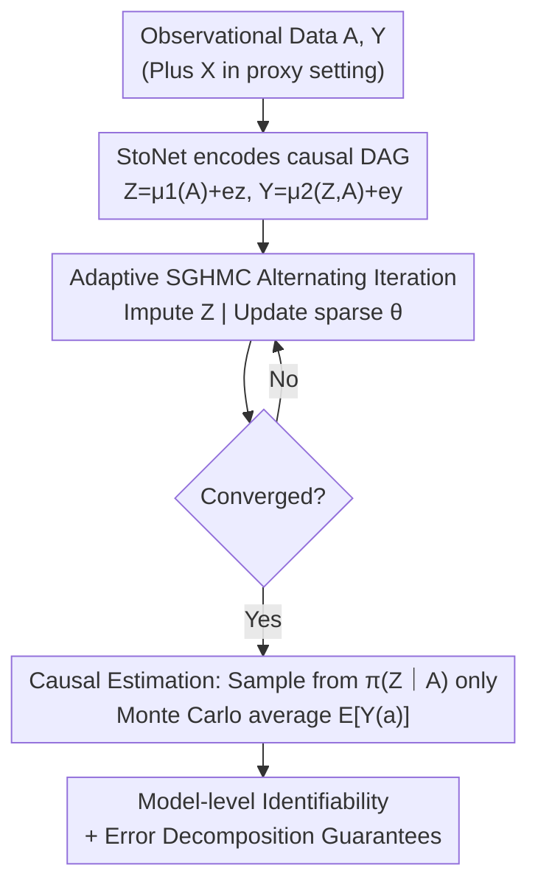

# Stochastic Neural Networks for Causal Inference with Missing Confounders

**Conference**: ICLR 2026  
**OpenReview**: [https://openreview.net/forum?id=1tTs2gZAJN](https://openreview.net/forum?id=1tTs2gZAJN)  
**Code**: https://github.com/nixay/Stochastic-Neural-Networks-for-Causal-Inference-with-Missing-Confounders  
**Area**: Causal Inference / Latent Variable Modeling / Bayesian Deep Learning  
**Keywords**: Missing Confounders, Stochastic Neural Networks, Latent Variable Imputation, SGHMC, Model Identifiability

## TL;DR
This paper proposes CI-StoNet: a stochastic neural network (StoNet) that directly encodes the Markov decomposition of a causal DAG into the network architecture. It employs adaptive Stochastic Gradient Hamiltonian Monte Carlo (SGHMC) to simultaneously impute missing latent confounders and estimate sparse network parameters. This provides causal effect estimation with model-level identifiability guarantees and strong nonlinear modeling capabilities for observational data where not all confounders are observed.

## Background & Motivation
**Background**: Under the potential outcomes framework, a key prerequisite for unbiased identification of causal effects from observational data is "strong ignorability" $A \perp\!\!\!\perp \{Y(a)\} \mid Z$, meaning all confounders $Z$ are observed. In reality, this condition rarely holds. Consequently, a mainstream approach is to model missing confounders as latent variables and impute them—representative works include the multi-factor substitute confounders by Wang & Blei, proximal variable low-rank approximations by Kallus et al., and CEVAE (Causal Effect Variational Autoencoder) by Louizos et al.

**Limitations of Prior Work**: Each of these methods has significant drawbacks. Wang & Blei’s substitute confounder essentially models the latent confounder as a deterministic function of treatments, eventually converging to a function of observed treatments rather than the true confounder. Kallus primarily remains in linear regression settings, requiring a large number of proxy variables for nonlinear scenarios. Furthermore, Rissanen & Marttinen proved that CEVAE fails to correctly estimate causal effects when latent variables are misspecified or data distributions are complex—it lacks model-level consistency guarantees.

**Key Challenge**: These latent variable methods generally **lack model-based identifiability guarantees** and are difficult to extend to richer causal structures (proxy variables, multi-cause, mediation, colliders). Variational inference pursues flexibility but lacks consistency, while deterministic factor models possess consistency but degenerate into functions of the treatment—there is a tension between "expressivity" and "identifiability + consistency."

**Goal**: Construct a framework that simultaneously satisfies: (i) the ability to model highly nonlinear treatment/outcome mechanisms; (ii) proof of model-level identifiability and consistency; (iii) structural flexibility for plug-and-play extension to different DAGs like proxy variables and multiple causes.

**Key Insight**: The authors observe that under a simple confounding structure, the conditional distribution of latent confounders can be decomposed as $\pi(Z\mid A,Y)\propto \pi(Z\mid A)\,\pi(Y\mid Z,A)$. This mathematically corresponds to a stochastic model with $A$ as exogenous input, $Z$ as latent state, and $Y$ as output—precisely the structure of a StoNet. By mapping the Markov decomposition of the causal DAG directly into a stochastic neural network, consistency guarantees can be obtained through sparse deep learning theory.

**Core Idea**: Encode the conditional structure of the causal DAG using a Stochastic Neural Network (StoNet) and alternate between "imputing latent confounders" and "estimating sparse network parameters" using adaptive SGHMC, thereby providing causal effect estimation with model-level identifiability under missing confounders.

## Method

### Overall Architecture
CI-StoNet addresses the problem where observational data contains only treatment $A$ and outcome $Y$ (and sometimes proxies $X$), while the true confounder $Z$ is missing. The goal is to unbiasedly estimate the mean potential outcome under intervention $\mathbb{E}[Y(a)]$. The approach translates the causal DAG into a two-layer stochastic neural network and uses a "impute-update" alternating MCMC algorithm to compute latent variables and network parameters together. Finally, causal effects are estimated using samples only from the $\pi(Z\mid A)$ distribution.

Taking simple confounding as an example, the true data-generating process is $A=g_1(Z,e_a),\ Y=g_2(Z,A)+e_y$, where $g_1,g_2$ are unknown complex nonlinear functions. CI-StoNet parameterizes this as two neural networks connected via the latent variable $Z$:

$$Z = \mu_1(A,\theta_1) + e_z,\qquad Y = \mu_2(Z,A,\theta_2) + e_y,$$

where $e_z\sim N(0,\sigma_z^2 I)$ and $e_y\sim N(0,\sigma_y^2 I)$. The pipeline is as follows: encode the DAG with StoNet, then iterate via adaptive SGHMC (one step to sample $Z$, one step to update sparse parameters $\theta$). After convergence, sample only from $\pi(Z\mid A)$ and use Monte Carlo averaging to obtain $\widehat{\mathbb{E}}[Y(a)]$.

### Key Designs

**1. Encoding Causal DAG Markov Decomposition with StoNet**

Addressing the pain point that deterministic factor models degenerate and variational methods lack consistency, the authors do not directly learn a black-box latent representation. Instead, they map each term of the DAG's conditional decomposition to a stochastic network module. Under simple confounding, $\pi(Z\mid A,Y)\propto \pi(Z)\pi(A\mid Z)\pi(Y\mid Z,A)\propto \pi(Z\mid A)\pi(Y\mid Z,A)$, where each term corresponds to a neural network: $\mu_1$ learns $\pi(Z\mid A)$, and $\mu_2$ learns $\pi(Y\mid Z,A)$, connected by the latent variable $Z$. Crucially, $Z$ is **stochastic** (with Gaussian noise $e_z$), not a deterministic function of $A$. This differentiates it from Wang & Blei’s work, which models the substitute confounder as a deterministic function, leading to degeneration. The authors emphasize that the mathematical form $A\to Z$ in $\mu_1(A,\theta_1)$ does not imply a causal mechanism $A\to Z$; $Z$ is not a mediator but leverages this conditional structure for imputation. This modular DAG encoding provides structural flexibility: for a proxy variable setting, one simply changes the decomposition to $\pi(Z\mid A,Y,X)\propto\pi(Z\mid X)\pi(A\mid Z)\pi(Y\mid Z,A)$ and adds a $Z=\mu_1(X,\theta_1)+e_z$ module accordingly.

**2. Adaptive SGHMC for Joint Imputation and Sparse Parameter Estimation**

Since $Z$ is missing, the likelihood cannot be maximized directly. The authors write the training as a Bayesian version of the Fisher identity: $\nabla_\theta\log\pi(\theta\mid A,Y)=\int \nabla_\theta\log\pi(\theta\mid Z,A,Y)\,\pi(Z\mid A,Y,\theta)\,dZ$, aiming to solve $\nabla_\theta\log\pi(\theta\mid A,Y)=0$. This is solved using adaptive SGHMC (Algorithm 1) via two alternating steps: the **Imputation Step** samples $Z$ from $\pi(Z\mid A,Y,\theta)$ via Hamiltonian dynamics (momentum $v$ accumulates gradients from both $\nabla_Z\log\pi(Z\mid A,\theta_1)$ and $\nabla_Z\log\pi(Y\mid Z,A,\theta_2)$ while injecting noise $\sqrt{2\epsilon\eta}\,e$); the **Parameter Step** updates $\theta_1, \theta_2$ with prior gradients given new $Z$. To achieve consistency in sparse deep learning, a mixture-of-Gaussians prior is applied to parameters:

$$\pi(\theta)=\prod_{i=1}^{K_n}\big[(1-\lambda_n)\phi(\theta_i/\sigma_0)+\lambda_n\phi(\theta_i/\sigma_1)\big],$$

consisting of a narrow peak $\sigma_0$ (driving toward 0 for sparsification) and a wide peak $\sigma_1$ (retaining important connections), acting as Bayesian regularization. This design synchronizes imputation and estimation, with convergence guaranteed by adaptive stochastic gradient MCMC—a consistency CEVAE lacks when using large networks for variational inference. The noise variance $\sigma_z^2$ is inherently unidentifiable due to the universal approximation property of networks; the authors provide a Bayesian estimate via an inverse Gamma prior $\hat\sigma_z^2=\frac{\beta+\frac12\sum_j(z_j-\mu_1(A_j,\theta_1))^2}{n/2+\alpha-1}$ (setting $\alpha=\beta=1$), though it has minimal impact on downstream inference.

**3. Causal Estimation via $\pi(Z\mid A)$ Sampling to Eliminate Collider and Mediator Contamination**

In the imputation step, $Z$ is conditioned on both $A$ and $Y$. However, the authors point out that **this $Z$ cannot be used directly for causal estimation**: if a collider $C$ exists (influenced by both $A$ and $Y$), conditioning on $Y$ introduces a spurious correlation between $A$ and $Y$, biasing the estimate. The solution is to sample from $\pi(Z\mid A,\hat\theta_1^*)$ (conditioning only on $A$) after convergence to exclude collider-related information. Specifically, for each sample $i$, $M$ samples $z_i^{(l)}\sim\pi(z\mid a_i;\hat\theta_1^*)$ are drawn, followed by Monte Carlo averaging:

$$\widehat{\mathbb{E}}(Y(a)\mid\hat\theta^*)=\frac{1}{nM}\sum_{i=1}^{n}\sum_{l=1}^{M}\mu_2(z_i^{(l)},a,\hat\theta_2^*).$$

For mediation cases, if mediator $M$ is unobserved, its effect is absorbed by $Z$, preventing path decomposition; however, $Z$ as a latent adjustment variable still allows for the estimation of the **total causal effect**. If $M$ is observed without unobserved confounding, $M$ can be incorporated into the latent confounder layer to estimate direct effects via the front-door criterion.

**4. Model-level Identifiability and Error Decomposition**

The authors distinguish between "non-parametric identifiability" (recovering causal effects from the observational distribution alone) and "model-level identifiability" (uniqueness within a restricted model class); this paper focuses on the latter. Under Assumption 3, structural conditional means $m_A(z)=\mathbb{E}[A\mid Z]$ and $m_Y(a,z)=\mathbb{E}[Y\mid A,Z]$ are restricted to function classes approximable by sparse DNNs at rate $\omega_n\to0$. Although $Z$ and $\theta$ are non-unique due to "loss-invariant transformations," the **causal functional is invariant within each observational equivalence class**: as long as two sets of parameters induce the same observational distribution, $\psi_\theta(a)=\psi_{\theta'}(a)$. Total error is decomposed into statistical estimation error and model misspecification error: $\|\psi(\hat P_\theta)-\psi(P_0)\|\le\underbrace{\|\psi(\hat P_\theta)-\psi(P_{\theta^*})\|}_{\text{Estimation Error}}+\underbrace{\|\psi(P_0)-\psi(P_{\theta^*})\|}_{\text{Specification Error}}$. Theorem 1 proves the estimation error converges to 0 as $n,M\to\infty$. Theorem 2 provides a specification error bound $\|\psi(P_0)-\psi(P_{\theta^*})\|\le C_2\omega_n$. Notably, consistency of the estimator is unaffected even if the imputed $Z$ deviates from the truth due to invariant transformations.

### Loss & Training
Training is equivalent to solving the target equation $\nabla_\theta\log \pi(\theta \mid A, Y) = 0$ induced by the Bayesian Fisher identity, executed via adaptive SGHMC. Hyperparameters include: prior mixing ratio $\lambda_n$, standard deviations $\sigma_0, \sigma_1$ for the two Gaussian components; $\sigma_z, \sigma_y$ are scalars which can be specified or updated per iteration via Eq. (8), with minimal performance sensitivity. For proxy variable settings, model (12) is used ($A=\mu_2(Z,\theta_2)+e_a$), which is asymptotically equivalent to (11) for binary treatments ($P(A=1\mid Z,\theta_2)$) while being computationally efficient.

## Key Experimental Results

### Main Results
On heterogeneous treatment effect estimation with proxy variables (10 datasets, 2000 train / 500 val / 500 test each, lower PEHE is better):

| Method | In-Sample PEHE | Out-of-Sample PEHE |
|------|----------------|--------------------|
| **CI-StoNet** | **0.3614 (0.0328)** | **0.3731 (0.0350)** |
| DragonNet | 0.4217 (0.0356) | 0.4305 (0.0361) |
| CEVAE | 0.6190 (0.0350) | 0.6246 (0.0384) |
| X-learner-Bart | 0.6489 (0.0168) | 0.6570 (0.0151) |
| CMDE | 0.9019 (0.0746) | 0.9059 (0.0699) |
| Ganite | 1.2099 (0.0558) | 1.1797 (0.0499) |
| X-learner-RF | 0.8308 (0.0200) | 1.4272 (0.0132) |
| CFRNet-Wass | 1.7127 (0.1668) | 1.7258 (0.1667) |
| CMGP | 1.8823 (0.0836) | 2.2116 (0.1682) |
| CFRNet-MMD | 2.0238 (0.0537) | 2.0250 (0.0582) |

CI-StoNet leads significantly in both in-sample and out-of-sample PEHE, showing the smallest gap (0.3614 → 0.3731), indicating stable generalization. It achieves a ~13% relative improvement over the strongest baseline, DragonNet, and nearly halves the error compared to the latent variable method CEVAE.

### Ablation Study
While the paper does not provide a module-by-module ablation table, it performs mechanism validation using synthetic data with nonlinear generation (treatments $A_1,\dots,A_9$, latent confounders $Z_1,\dots,Z_6$) under two settings: **Separable Confounding** ($Y=f_1(A)-\theta_0 f_2(A)+\xi(Z)+\epsilon$) and **Non-separable Confounding** ($Y=f_1(A)-\xi(Z)f_2(A)+\xi(Z)+\epsilon$, with $A$–$Z$ interaction).

| Setting | Key Findings | Notes |
|------|---------|------|
| Separable Confounding | Most estimated marginal effects fall within ±0.5 std of truth | Low bias when A and Z affect Y independently |
| Non-separable Confounding | Accurately recovers marginal effects of all treatments | Successfully handles $A$–$Z$ interactions |
| ATE / CATE | MAE and PEHE outperform baselines | Consistently leads on Twins and ACIC 2019 benchmarks |

### Key Findings
- Latent confounders are only identified up to a "loss-invariant transformation," but the causal functional remains invariant within observational equivalence classes—this is the theoretical root of CI-StoNet's consistency and its superiority over CEVAE.
- The causal estimation phase must sample from $\pi(Z\mid A)$ rather than $\pi(Z\mid A,Y)$; otherwise, colliders introduce spurious correlations. This distinction is key to unbiasedness.
- The method does not rely on the "no single-cause confounder" assumption, unifying multi-cause and single-cause confounding in one framework and broadening applicability compared to Wang & Blei.

## Highlights & Insights
- **"Compiling" Causal DAGs into Stochastic Networks**: Instead of learning a black-box representation and forcing a causal interpretation, the network topology directly mirrors the DAG's Markov decomposition. Structural flexibility is a design feature, not an afterthought.
- **Sparse Deep Learning + Bayesian Regularization for Consistency**: The spike-and-slab prior grants large networks provable parameter consistency, bridging the gap left by variational autoencoder approaches (like CEVAE) which lack consistency guarantees for large architectures.
- **"Full-conditional Imputation, Half-conditional Estimation"**: Using $\pi(Z\mid A,Y)$ for efficient imputation and $\pi(Z\mid A)$ for unbiased estimation is a practical trick transferable to other latent variable causal methods.

## Limitations & Future Work
- **Strong Dependence on Correct DAG Specification**: Both the structure and parameter estimation rely on the pre-specified causal DAG being correct; unobserved mediators absorbed into surrogate confounders under multiple treatments may bias estimates.
- **Lack of Native Uncertainty Quantification**: The current form does not provide model-based posterior intervals for causal functionals; confidence intervals are constructed via bootstrap post-processing. Rigorous UQ would require returning to the full Bayesian framework of the original StoNet.
- **Noise Variance $\sigma_z$ is Inherently Unidentifiable**: While bypassed via inverse Gamma prior point estimation with minimal impact, its robustness in small-sample or heavy-confounding scenarios requires further validation.

## Related Work & Insights
- **vs Wang & Blei (2018)**: They use deterministic factor models for multi-cause confounding, which converge to functions of observed treatments and require "no single-cause confounder" assumptions. CI-StoNet retains latent randomness and unifies both cases.
- **vs CEVAE (Louizos et al., 2017)**: CEVAE uses variational autoencoders; CI-StoNet uses sparse DNN theory and Bayesian regularization to achieve consistency relative to pseudo-true parameters that CEVAE lacks.
- **vs Proximal Causal Inference (Kallus 2018; Tchetgen 2020)**: These often rely on linear assumptions or two sets of proxies. CI-StoNet handles nonlinear modeling with standard proxies within a unified StoNet framework.
- **vs DragonNet / X-learner**: These are discriminative representation learners that do not explicitly impute missing confounders; CI-StoNet outperforms them in PEHE and provides theoretical identifiability support.

## Rating
- Novelty: ⭐⭐⭐⭐⭐ Integrating StoNet, sparse deep learning, and adaptive SGHMC for causal inference with missing confounders is a novel path.
- Experimental Thoroughness: ⭐⭐⭐⭐ Strong results on synthetic, Twins, and ACIC benchmarks; however, lacks a module ablation table and UQ is bootstrap-based.
- Writing Quality: ⭐⭐⭐⭐ Rigorous theory and clear discussion on DAGs/colliders; dense notation requires statistical background.
- Value: ⭐⭐⭐⭐⭐ Provides a practical framework that reconciles flexibility and consistency for the difficult "missing confounding + nonlinear" problem.

<!-- RELATED:START -->

## Related Papers

- [\[ICLR 2026\] Foundation Models for Causal Inference via Prior-Data Fitted Networks](foundation_models_for_causal_inference_via_prior-data_fitted_networks.md)
- [\[ICLR 2026\] Exploratory Causal Inference in SAEnce](exploratory_causal_inference_in_saence.md)
- [\[ICLR 2026\] Causal Structure Learning in Hawkes Processes with Complex Latent Confounder Networks](causal_structure_learning_in_hawkes_processes_with_complex_latent_confounder_net.md)
- [\[NeurIPS 2025\] GST-UNet: A Neural Framework for Spatiotemporal Causal Inference with Time-Varying Confounding](../../NeurIPS2025/causal_inference/gst-unet_a_neural_framework_for_spatiotemporal_causal_inference_with_time-varyin.md)
- [\[ICLR 2026\] Adjusting Prediction Model Through Wasserstein Geodesic for Causal Inference](adjusting_prediction_model_through_wasserstein_geodesic_for_causal_inference.md)

<!-- RELATED:END -->
