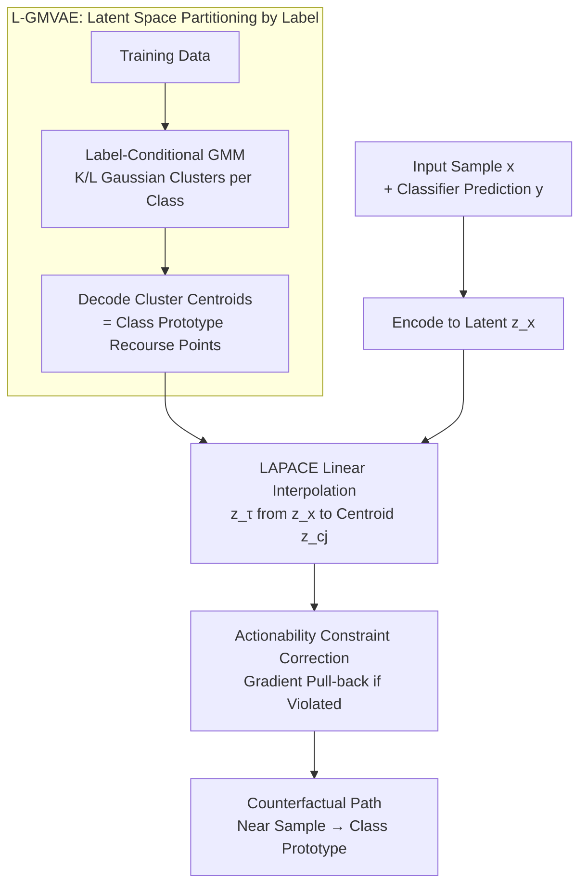

# Synthesising Counterfactual Explanations via Label-Conditional Gaussian Mixture Variational Autoencoders

**Conference**: ICLR 2026  
**arXiv**: [2510.04855](https://arxiv.org/abs/2510.04855)  
**Code**: None (Uses CARLA library)  
**Area**: Explainable AI / Causal Inference  
**Keywords**: Counterfactual Explanations, Variational Autoencoders, Gaussian Mixtures, Robustness, Algorithmic Recourse

## TL;DR
The paper proposes L-GMVAE (Label-Conditional Gaussian Mixture VAE) and the LAPACE algorithm. By learning multiple class-specific Gaussian cluster centroids in the latent space and performing linear interpolation from the input latent representation to these target centroids, the method generates path-based counterfactual explanations that simultaneously ensure validity, plausibility, diversity, and perfect robustness to input perturbations.

## Background & Motivation

**Background**: Counterfactual Explanations (CE) provide recourse suggestions for individuals affected by algorithmic decisions (e.g., how to change one's profile after a loan rejection). Ideal CEs should satisfy validity, proximity, plausibility (lying on the data manifold), and diversity.

**Limitations of Prior Work**: Most existing methods treat these attributes in isolation, making it difficult to guarantee multiple types of robustness (robustness to input perturbations and model changes) within a single framework. VAE-based approaches are typically unconditional, ignoring classifier label information and requiring complex latent space searches.

**Key Challenge**: How to simultaneously satisfy the multidimensional requirements of CE—achieving plausibility alongside validity, robustness alongside proximity, and stability alongside diversity?

**Goal**: Design a unified framework to generate CEs that concurrently satisfy validity, proximity, plausibility, diversity, input robustness, and model robustness.

**Key Insight**: Identify a diverse set of prototypical recourse points for the target class and guide all CEs to converge toward these points. These prototypes are naturally learned through a label-conditional GMM within the VAE latent space.

**Core Idea**: Partition the GMVAE clusters based on class labels (assigning $K/L$ clusters per class). The decoded cluster centroids serve as valid, plausible, and robust CE targets. Linear interpolation paths from the input latent representation to these target centroids provide a range of CE options.

## Method

### Overall Architecture

The method is implemented in two stages. During training, a label-conditional Gaussian Mixture VAE (L-GMVAE) encodes data into a latent space where each class corresponds to a dedicated set of Gaussian clusters; decoding these cluster centroids yields "prototypical recourse points" for each class. During inference, the LAPACE algorithm encodes the sample to be explained into the latent space and performs linear interpolation toward a specific cluster centroid of the target class. The resulting path is decoded point-by-point to obtain a continuous counterfactual trajectory from "near the original sample" to "reaching the class prototype." Actionability constraints are corrected in situ during interpolation by pulling latent vectors back into the feasible region.

### Key Designs

**1. L-GMVAE: Partitioning Latent Space by Label to Make Cluster Centroids Natural Counterfactual Targets**

Standard VAE latent spaces are unconditional, requiring complex searches to find counterfactuals without classifier label information. This work uniformly partitions a set of $K$ Gaussian clusters $\mathcal{C} = \mathcal{C}_1 \cup \dots \cup \mathcal{C}_L$ among $L$ classes, with $K/L$ clusters per class. The generative model is defined as $p(x,c,z\mid y) = p(c\mid y)\,p_\theta(z\mid c)\,p_\theta(x\mid z)$, and the inference model as $q(z,c\mid x,y)$, where $y$ is the predicted label from the classifier, thereby injecting decision information into the latent structure. The training objective is the ELBO, comprising a cluster assignment term $\mathrm{KL}(c)$ to encourage uniform use of clusters (preventing prototype collapse and ensuring diversity), a latent variable term $\mathrm{KL}(z)$ to separate clusters (ensuring clear boundaries), and a reconstruction term. Post-training, the decoded cluster centroids are inherently on the data manifold (plausible), classified as the target class (valid), and spatially separated (diverse).

**2. LAPACE: Linear Interpolation Toward Fixed Centroids for Perfect Input Robustness**

With prototypical centroids established, CE generation shifts from search to interpolation. For an input $x$ encoded as $z_x$, and for each target cluster centroid $z_{c_j}$, the method follows the line $z_\tau = (1-\tau) z_x + \tau z_{c_j}$ where $\tau$ ranges from 0 to 1. Decoding points along this path provides a counterfactual continuum: points with small $\tau$ are close to the original sample (proximity), while points with large $\tau$ approach the prototype (robustness). Because the path endpoints are fixed cluster centroids determined during training and independent of the specific input $x$, the CE becomes insensitive to input perturbations. This enables "perfect" input robustness compared to heuristic distance thresholds used in methods like DRCE. The local smoothness of the VAE latent space ensures that interpolated points remain near the manifold.

**3. Actionability Constraints: In-situ Correction of Latent Vectors to Satisfy Real-world Limitations**

Real-world recourse often involves hard constraints (e.g., age cannot decrease). LAPACE checks the decoded results against constraints $g(\mathrm{Dec}(z_\tau))$ at each step $\tau$. If a violation occurs, gradient descent is applied to $z_\tau$ to pull it back into the feasible region before continuing interpolation. This ensures every counterfactual candidate along the path, rather than just the final point, complies with user-specified feature constraints.

### Loss & Training

The training loss is the ELBO mentioned above, equaling $\mathrm{KL}(c) + \mathrm{KL}(z) +$ Reconstruction Loss. Reconstruction utilizes binary cross-entropy for categorical features and MSE for continuous features. An L-GMVAE is trained separately for each dataset-classifier pair, typically with 5 clusters assigned per class.

## Key Experimental Results

### Main Results

| Method | Validity | Proximity | Plausibility (LOF) | Diversity | Model Robust. | Input Robust. |
|------|--------|--------|-----------|--------|---------|---------|
| LAPACE-Last | 100% | Medium | **Best** | High | **100%** | **Perfect** |
| LAPACE-First | 100% | **Competitive** | Best | High | Medium | Perfect |
| NNCE | 100% | Best | Good | N/A | - | Good |
| DiCE | <100% | Good | Poor | Good | - | - |
| DRCE | 100% | Good | Good | Good | - | Good |

### Ablation Study

| Dataset | Trained on Real vs Synthetic | Gap | Centroid Accuracy |
|--------|------------------|------|---------|
| heloc-RF | 73.97% vs 71.07% | 2.9% | 100% |
| wine-RF | 89.70% vs 87.42% | 2.3% | 100% |
| adult-RF | 93.82% vs 81.13% | 12.7% | 100% |
| compas-RF | 90.79% vs 85.03% | 5.8% | 100% |

### Key Findings
- **100% Centroid Accuracy**: Decoded cluster centroids are correctly classified by the original classifier across all datasets.
- **Superior Plausibility**: LAPACE achieves the lowest LOF scores (closest to 1.0) across all datasets.
- **Perfect Input Robustness**: Because all paths converge to fixed centroids, the output remains invariant under input perturbations.
- **100% Actionability Satisfaction**: LAPACE-constrained successfully finds effective CEs that satisfy all specified constraints.
- Classifier probabilities for path points increase monotonically with $\tau$, confirming the alignment between the latent space and the classifier.

## Highlights & Insights
- **Utility of Path-based CE**: Users can choose between "close but less robust" and "robust but requiring more change" options, which is more practical than single-point CEs.
- **Effectiveness of Label-Conditional Clustering**: Simply partitioning GMM clusters by label naturally yields diverse prototypical recourse points.
- **Privacy Protection**: Generates synthetic CEs rather than exposing actual training data points.

## Limitations & Future Work
- CE validity depends on the quality of L-GMVAE training; cluster centroids must be verified as correctly classified.
- Performance gap in synthetic data quality for datasets with high categorical feature counts (e.g., 12.7% gap on adult).
- Linear interpolation assumes local latent smoothness, which may not hold for complex decision boundaries.
- Causal constraints (causal relationships between features) are not yet considered.

## Related Work & Insights
- **vs DRCE**: DRCE uses nearest neighbors for input robustness, but heuristic distance thresholds cannot guarantee it perfectly. LAPACE achieves perfect robustness via fixed centroid convergence.
- **vs DiCE**: DiCE uses multi-objective optimization for diversity but suffers from poor plausibility. LAPACE ensures plausibility via the VAE manifold.
- **vs RobXCE**: RobXCE enhances model robustness by pushing against decision boundaries but does not guarantee diversity.

## Rating
- Novelty: ⭐⭐⭐⭐ The combination of label-conditional GMVAE and path-based CE is novel and intuitive.
- Experimental Thoroughness: ⭐⭐⭐⭐⭐ Comprehensive evaluation across 8 metrics, 5 baselines, 4 datasets, actionability, and path analysis.
- Writing Quality: ⭐⭐⭐⭐ Clear, well-structured, and includes intuitive illustrations.
- Value: ⭐⭐⭐⭐ Provides a unified framework addressing the multi-attribute requirements of CE.

<!-- RELATED:START -->

## Related Papers

- [\[ICLR 2026\] Counterfactual Explanations on Robust Perceptual Geodesics](counterfactual_explanations_on_robust_perceptual_geodesics.md)
- [\[ACL 2025\] Counterfactual Explanations for Aspect-Based Sentiment Analysis](../../ACL2025/causal_inference/counterfactual_explanations_for_aspect-based_sentiment_analysis.md)
- [\[ICLR 2026\] Direct Doubly Robust Estimation of Conditional Quantile Contrasts](direct_doubly_robust_estimation_of_conditional_quantile_contrasts.md)
- [\[ICML 2026\] Density-Guided Robust Counterfactual Explanations on Tabular Data under Model Multiplicity](../../ICML2026/causal_inference/density-guided_robust_counterfactual_explanations_on_tabular_data_under_model_mu.md)
- [\[NeurIPS 2025\] Performative Validity of Recourse Explanations](../../NeurIPS2025/causal_inference/performative_validity_of_recourse_explanations.md)

<!-- RELATED:END -->
