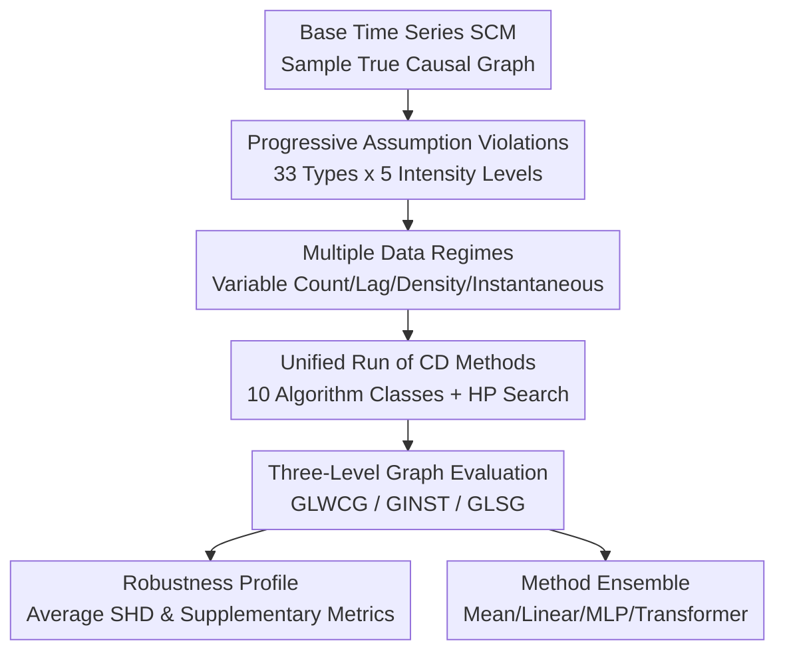

# TCD-Arena: Assessing Robustness of Time Series Causal Discovery Methods Against Assumption Violations

**Conference**: ICLR2026  
**OpenReview**: [https://openreview.net/forum?id=MtdrOCLAGY](https://openreview.net/forum?id=MtdrOCLAGY)  
**Code**: https://github.com/TCD-Arena  
**Area**: Causal Inference / Time Series Causal Discovery  
**Keywords**: Time Series Causal Discovery, Causal Discovery Benchmark, Assumption Violations, Robustness Evaluation, Model Ensemble

## TL;DR
TCD-Arena proposes an extensible robustness testing suite for time series causal discovery, systematically evaluating 10 categories of methods through 33 types of progressively intensified real-world assumption violations and approximately 36 million causal discovery attempts. The study finds that different algorithms exhibit vastly different robustness profiles, and simple ensembles can further improve stability on both lag and summary graphs.

## Background & Motivation
**Background**: Time series causal discovery aims to recover causal structures between variables from multivariate observational sequences $X \in \mathbb{R}^{D \times T}$. Typical outputs include windowed causal graphs with specific lag orders, summary graphs aggregating lagged influences, and instantaneous graphs representing contemporaneous relationships. Many methods utilize Granger causality, conditional independence tests, non-Gaussian Structural VARs, continuous optimization, or pre-trained models, achieving strong recovery results on synthetic data.

**Limitations of Prior Work**: The primary difficulty lies not in the availability of methods, but in the fact that their theoretical guarantees usually rely on strong assumptions: no hidden confounding, faithfulness, structural stability, independent additive noise, appropriate functional forms, sufficient sample size, and no severe missingness. In real-world data, these conditions are often unverifiable or clearly violated. If benchmarks only run on ideal synthetic data, high scores may mislead practitioners into believing methods are reliable in real scenarios.

**Key Challenge**: Causal discovery requires ground truth for evaluation, but real-world time series with complete causal ground truth are scarce. Conversely, pure theoretical analysis struggles to cover practical perturbations like complex data quality issues, non-stationarity, observational noise, and hidden confounding. Thus, evaluation protocols must find a compromise between controllable synthetic data and real-world complexity: knowing the true causal graph while allowing the data generation process to systematically deviate from ideal assumptions.

**Goal**: The authors aim to provide a unified testing tool rather than just reporting scores for a few algorithms on small datasets. Specifically, TCD-Arena aims to answer three questions: first, how time series causal discovery methods degenerate under different types of assumption violations; second, how robustness changes when modeling parameters (such as maximum lag) are misspecified; third, whether ensembling multiple causal discovery methods yields more stable causal graphs.

**Key Insight**: The paper observes that assumption violations should not be treated as "on/off" binary switches. For instance, the mere presence of observational noise is insufficient; the critical factor is the degradation curve across noise intensity, structure, and algorithm performance. Therefore, the authors design 5 intensity levels for each violation type and repeat sampling across various data regimes (scales, graph densities, presence of instantaneous edges) to obtain robustness profiles for the methods.

**Core Idea**: Use a composable, intensity-adjustable time series SCM generator to inject 33 common real-world assumption violations into synthetic/semi-synthetic data, then compare the robustness of different causal discovery methods across multiple graph structures, hyperparameters, and perturbations using unified metrics.

## Method
### Overall Architecture
The overall workflow of TCD-Arena can be described as "Generate Controllable Problems → Apply Assumption Violations → Run Causal Discovery → Aggregate Robustness Profiles." The input consists of a base time series structural causal model (SCM) and a set of violation configurations. The output includes normalized SHD, AUROC, F1, and Accuracy for each method across different graph structures, with the main text emphasizing threshold-agnostic minimum normalized SHD.

The base data generation follows an SCM with lagged and optional instantaneous effects. For variable $X_{i,t}$, the primary constraint is defined as:
$$X_{i,t}=\sum_{d=1}^{D}\sum_{l=0}^{L} A_{i,d,l} \cdot f_{i,d,l}(X_{d,t-l})+\epsilon_{t,i}$$
Non-zero $A_{i,d,l}$ values correspond to true causal edges. When not testing non-linearity violations, $f_{i,d,l}$ is the identity function, and the system reduces to a linear additive process.

The three evaluated graph structures address different granularities. $G_{LWCG}$ (Lagged Windowed Causal Graph) preserves specific lags, answering "Does $X_j$ at $t-l$ affect $X_i$ at $t$?". $G_{LSG}$ (Lagged Summary Graph) aggregates all lagged influences into variable-level directed edges. $G_{INST}$ (Instantaneous Graph) focuses only on contemporaneous relationships, which is typically harder as temporal directionality cannot assist in orientation.

### Key Designs
**1. Progressive Assumption Violation Bank: Turning Real Complexity into Adjustable Experimental Knobs**

The most significant design is not making another synthetic dataset, but decomposing "assumption violations" into 33 modular, intensity-adjustable, and composable tokens. Observational noise covers additive, signal-dependent, time-varying, autoregressive, common-source, impulse, and real-world noise. Innovation noise follows a similar structure, adding non-Gaussian distributions and heteroscedasticity. Hidden confounding includes both instantaneous and lagged types. Faithfulness violations are created via path cancellation or shrinking edge weights to near-zero to produce near-undetectable dependencies.

Consistency with $\hat X_{i,t}=X_{i,t}+\zeta_{i,t}$ allows for different noise structures: for example, multiplicative noise $\zeta_{i,t}=X_{i,t}\eta_{i,t}$ reduces accuracy in high-signal regions, while common-source noise simulates multiple variables being simultaneously contaminated by unobserved perturbations.

**2. Multi-Granularity Graph Evaluation: Avoiding Single-Score Compression**

TCD-Arena evaluates $G_{LWCG}$, $G_{LSG}$, and $G_{INST}$ simultaneously to ensure method strengths are not obscured by a single metric. The paper finds that VarLiNGAM and Dynotears are generally more stable on $G_{LWCG}$, GVAR is best on average for $G_{LSG}$, and Dynotears and NTS-NOTears are stronger on $G_{INST}$. These differences suggest that "the most robust method" is not a global label but depends on the target structure (exact lag edges, summary relations, or instantaneous structure).

**3. Large-Scale Robustness Profiling: Comparing Methods under a Fixed Protocol**

The experimental scale is massive: 33 violation types, 5 intensity levels, 16 data regimes, 100 SCM samples per setting, multiplied by 10 CD strategies and 143 hyperparameter configurations, totaling approximately 36 million attempts. Data regimes cover $T \in \{250,1000\}$, $(D,L) \in \{(5,3),(7,4)\}$, sparse/dense graphs, and presence/absence of instantaneous effects.

The study also isolates modeling misspecification. While main experiments assume the model knows the true maximum lag $L$, the paper tests cases where $L_{model}$ is too small or too large, finding that underestimating the lag significantly degrades performance for nearly all methods, while moderate overestimation is generally more stable.

**4. Causal Discovery Ensemble: Converting Method Variance into Robustness**

Finally, the study investigates method ensembling. By inputting prediction graphs $\{\hat G_1,\dots,\hat G_M\}$ from multiple base methods into a meta-model, the authors test Mean, Linear, MLP, and Transformer ensembles. Results show that simple ensembles, particularly EnsembleLinear, outperform any single method on $G_{LWCG}$ and $G_{LSG}$.

### Loss & Training
TCD-Arena is not a new end-to-end causal discovery model, so it lacks a unified task loss. Training occurs within the ensemble modules. The ensemble models take graph tensors of shape $B \times M \times D \times D \times L_{model}$ as input. Linear ensembles use a single-layer fully connected network, while MLP and Transformer versions incorporate deeper architectures. The training utilizes BCE, MSE, and Focal loss, with hyperparameter search across batch size and learning rate. Simple models (Linear/Mean) proved more stable than complex MLP/Transformer architectures, which failed to extrapolate reliably to test distributions.

## Key Experimental Results

### Main Results
The main experiment uses normalized SHD to measure average robustness (lower is better).

| Method | $G_{LWCG}$ SHD↓ | $G_{INST}$ SHD↓ | $G_{LSG}$ SHD↓ | Key Conclusion |
|------|----------------:|----------------:|---------------:|----------|
| CrossCorrelation | 0.582 | N/A | 0.453 | Weak baseline, used for reference |
| CausalPretraining | 0.530 | N/A | 0.440 | No $L_{model}$ required, but robustness is mid-range |
| GVAR | 0.424 | N/A | 0.330 | Best single method for summary graph $G_{LSG}$ |
| VarLiNGAM | 0.408 | 0.692 | 0.334 | Best single method for windowed graph $G_{LWCG}$ |
| PCMCI | 0.601 | N/A | 0.447 | Constraint-based methods were less stable overall |
| PCMCI+ | 0.539 | 0.998 | 0.405 | SHD is unfavorable for its undirected instantaneous graph |
| Dynotears | 0.445 | 0.515 | 0.365 | Strong on instantaneous graphs and stable on lagged |
| NTS-NOTears | 0.445 | 0.674 | 0.358 | Stable on large graphs and non-linear settings |
| EnsembleLinear | 0.362 | 0.527 | 0.281 | Strongest practical ensemble, outperforms single methods |

Model misspecification experimental results (lower is better):

| Method | $G_{LWCG}$: Underest. $L_{model}$↓ | $G_{LWCG}$: Overest. $L_{model}$↓ | $G_{LSG}$: Underest. $L_{model}$↓ | $G_{LSG}$: Overest. $L_{model}$↓ |
|------|------------------------------:|------------------------------:|-----------------------------:|-----------------------------:|
| GVAR | 0.782 (-0.36) | 0.467 (-0.04) | 0.636 (-0.31) | 0.358 (-0.03) |
| VarLiNGAM | 0.784 (-0.38) | 0.429 (-0.02) | 0.640 (-0.31) | 0.346 (-0.01) |
| Dynotears | 0.789 (-0.34) | 0.468 (-0.02) | 0.664 (-0.30) | 0.378 (-0.01) |

### Ablation Study
| Analysis | Key Findings |
|--------|----------|
| Per-Violation HP Selection | Minimal ranking shifts compared to the main protocol, but HP sensitivity remains critical. |
| Average HP Performance | Dynotears and NTS-NOTears decline more, indicating higher reliance on tuning. |
| Non-linear CI Tests | PCMCI+ using GPDC improved from 0.473 to 0.420 on non-linear data, but at 100x computational cost. |
| Combined Violations | Multi-violation cases (e.g., dual confounding) significantly increase SHD relative to single violations. |
| Real Data (CausalRivers) | Ensemble methods (0.659-0.666) outperformed the best single method (Dynotears: 0.715). |

### Key Findings
- VarLiNGAM is most robust for windowed graphs $G_{LWCG}$ but weak for instantaneous graphs; GVAR excels at summary graphs.
- Underestimating the maximum lag is far more dangerous than overestimating it.
- Simple ensembling is a highly practical discovery of this paper. EnsembleLinear outperforms all single methods on lagged and summary graphs.
- Constraint-based methods performed poorly under this protocol, likely due to the use of linear CI tests against non-linear/complex noise.

## Highlights & Insights
- TCD-Arena transforms "assumption violations" from verbal caveats into reproducible experimental objects.
- The progressive intensity design is more valuable than binary testing, revealing degradation curves and threshold behaviors.
- Parallel evaluation of three graph structures prevents "single-score worship."
- Ensemble results provide a new roadmap for practical causal discovery systems: when algorithms rely on different assumptions, ensembling prediction graphs acts as a robust fuser.

## Limitations & Future Work
- Experimental focus remains on synthetic/semi-synthetic data; SCM design choices (functional families, weight ranges) can introduce biases into method rankings.
- Main experiments focus on single violations; real-world data involves simultaneous noise, missingness, and non-stationarity.
- The 5-level intensity scale may miss non-monotonic curves or sudden phase transitions.
- Ensembles, while promising on CausalRivers, require broader real-world validation to verify cross-domain generalization of meta-models.

## Related Work & Insights
- **Comparison to CauseMe/OCDB**: These focus on benchmark platforms; TCD-Arena focuses specifically on progressive intensity of assumption violations in time series.
- **Comparison to TimeGraph/CausalDynamics**: TCD-Arena provides a modular approach to 33 types of reality-driven violations rather than just providing static datasets.
- **Insight**: Future causal discovery methods should not merely report SHD on ideal data but should use TCD-Arena to report a full robustness profile across expected real-world perturbations.

## Rating
- Novelty: ⭐⭐⭐⭐☆
- Experimental Thoroughness: ⭐⭐⭐⭐⭐
- Writing Quality: ⭐⭐⭐⭐☆
- Value: ⭐⭐⭐⭐⭐

<!-- RELATED:START -->

## Related Papers

- [\[ICLR 2026\] Designing Time Series Experiments in A/B Testing with Transformer Reinforcement Learning](designing_time_series_experiments_in_ab_testing_with_transformer_reinforcement_l.md)
- [\[ICLR 2026\] Causal Discovery via Quantile Partial Effect](causal_discovery_via_quantile_partial_effect.md)
- [\[ICLR 2026\] Causal Discovery in the Wild: A Voting-Theoretic Ensemble Approach](causal_discovery_in_the_wild_a_voting-theoretic_ensemble_approach.md)
- [\[ICLR 2026\] Independence Test for Linear Non-Gaussian Data and Applications in Causal Discovery](independence_test_for_linear_non-gaussian_data_and_applications_in_causal_discov.md)
- [\[ICLR 2026\] Ice Cream Doesn't Cause Drowning: Benchmarking LLMs Against Statistical Pitfalls in Causal Inference](ice_cream_doesnt_cause_drowning_benchmarking_llms_against_statistical_pitfalls_i.md)

<!-- RELATED:END -->
