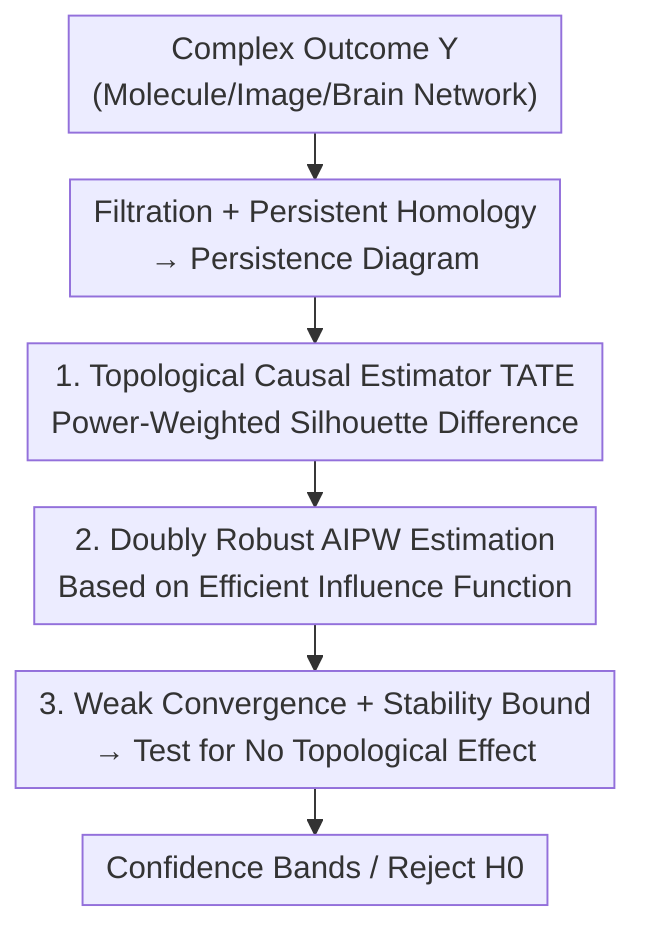

# Topological Causal Effects

**Conference**: ICLR 2026  
**OpenReview**: [https://openreview.net/forum?id=dYaos1ITw4](https://openreview.net/forum?id=dYaos1ITw4)  
**Code**: https://github.com/kwangho-joshua-kim/top-causal-effect (Available)  
**Area**: Causal Inference / Topological Data Analysis  
**Keywords**: Causal Inference, Persistence Homology, Topological Data Analysis, Doubly Robust Estimation, Functional Outcome

## TL;DR
This paper defines causal treatment effects on the **topological structure** of outcomes. By using power-weighted silhouette functions of persistence diagrams to characterize "treatment-induced topological changes," the authors propose a fully non-parametric, $\sqrt{n}$-consistent doubly robust AIPW estimator. Furthermore, they construct a formal hypothesis test for the existence of topological effects based on functional weak convergence and silhouette stability bounds.

## Background & Motivation

**Background**: Classical causal inference, under the potential-outcome framework, defines treatment effects (such as Average Treatment Effect, ATE) by comparing counterfactual outcomes. This approach typically assumes outcomes are scalars or can be summarized by simple Euclidean statistics (mean, variance).

**Limitations of Prior Work**: In many modern scientific contexts, outcomes are inherently **non-Euclidean, high-dimensional, and unstructured**, such as macromolecular folding conformations, brain connectivity networks, or lesion distributions in medical imaging. What the treatment truly alters in these objects is often the **structural/shape variation** (e.g., the emergence of a loop or merging of connected components), rather than a shift in a scalar mean. Measuring such changes with Euclidean summaries often results in significant information loss.

**Key Challenge**: Differences in topological structures (e.g., an added loop or changed number of voids) are nearly invisible in Euclidean feature vectors. Even if outcomes are forced into ad-hoc Euclidean features for standard ATE estimation, there is **no principled connection** between these features and the underlying topological objects. Consequently, the resulting "effects" are difficult to interpret and lack valid statistical inference.

**Goal**: (i) Define a causal estimator directly using topological summaries; (ii) Provide corresponding non-parametric estimation and statistical inference; (iii) Provide a formal test for the presence of topological effects.

**Key Insight**: Persistent homology from Topological Data Analysis (TDA) extracts **multi-scale and perturbation-stable** topological descriptors (birth and death of connected components, loops, and voids along a resolution parameter). By embedding the persistence diagram into a function space—specifically using the **power-weighted silhouette function** $\phi(t;D)$—the outcome becomes a curve residing in a separable Hilbert space, allowing the application of functional causal inference machinery.

**Core Idea**: The causal effect is defined as the "expected difference between the silhouette functions of the treatment and control groups," $\psi_d(t)=\mathbb{E}[\phi^1_{i,d}(t)-\phi^0_{i,d}(t)]$. This is termed the **Topological Average Treatment Effect (TATE)**. Doubly robust estimation and weak convergence inference are then developed for this functional estimator.

## Method

### Overall Architecture

The method addresses how to rigorously estimate the treatment's impact on the outcome's topology. The pipeline transforms each complex outcome $Y$ into a topological descriptor, then into a functional curve treated as a potential outcome. This reduces the causal problem to **treatment effect estimation and inference for functional outcomes**.

Given observed samples $\{Z_i=(X_i,A_i,Y_i)\}_{i=1}^n$, where $A_i\in\{0,1\}$ is the binary treatment, $X_i\in\mathbb{R}^l$ are covariates, and $Y_i$ is the complex outcome, the process follows: ① Choose a filtration for outcome $Y_i$ based on data modality (Vietoris–Rips/α for point clouds, cubical sublevel/superlevel for images, clique for graphs) to construct nested simplicial complexes; ② Compute $d$-th order persistence homology to obtain the persistence diagram $D_{i,d}$ (recording birth $a$ and death $b$ of features); ③ Embed the diagram into a function space to calculate the power-weighted silhouette $\phi_{i,d}(t)$; ④ Define the TATE $\psi_d(t)$ on silhouettes and estimate it using AIPW; ⑤ Conduct inference and testing based on weak convergence and stability bounds.

### Key Designs

**1. Topological Average Treatment Effect (TATE): Defining the estimator on topological summaries**

Addressing the limitation that Euclidean summaries ignore structural changes, the authors embed the persistence diagram $D$ into a function space. For each point $p=(a_p,b_p)$ in the diagram, a tent function $\Lambda_p(t)=\max\{0,\min\{t-a_p,\,b_p-t\}\}$ is defined. The power-weighted silhouette is then:

$$\phi(t;D,r)=\frac{\sum_{p\in D}(b_p-a_p)^r\,\Lambda_p(t)}{\sum_{p\in D}(b_p-a_p)^r},\quad t\in T.$$

The exponent $r$ controls the emphasis on long-lived features: larger $r$ highlights persistent (likely meaningful) topological features, while smaller $r$ accounts for short-lived ones. The $d$-th order TATE is the expected difference between silhouettes of potential outcomes:

$$\psi_d(t):=\mathbb{E}\big[\phi^1_{i,d}(t)-\phi^0_{i,d}(t)\big],\quad t\in T.$$

This is a **functional** causal effect in Hilbert space. $\psi_d(t)>0$ implies the treatment group has stronger/more $d$-dimensional topological features at scale $t$. This definition offers scale-awareness (indexed by filtration parameter $t$), robustness to noise (power weighting suppresses spurious features), vectorizability (facilitating theoretical analysis), and compatibility with functional causal inference. Under standard causal assumptions (Consistency C1, Unconfoundedness C2, Positivity C3), $\psi_d(t)$ is identified as:
$$\psi_d(t)=\mathbb{E}\Big[\tfrac{A_i\,\phi_{i,d}(t)}{\pi(X_i)}-\tfrac{(1-A_i)\,\phi_{i,d}(t)}{1-\pi(X_i)}\Big],$$
where $\pi(x)=P(A=1\mid X=x)$ is the propensity score. Unlike ad-hoc vectorization, this estimator is **principled and anchored to the geometry** of the persistence diagram.

**2. Doubly Robust AIPW Estimator: $\sqrt{n}$ rate via Efficient Influence Function**

Identification formulas suggest two naive estimators: plug-in regression $\hat\psi_{\mathrm{PI},d}$ (fitting $\mu_a(t,x;d)=\mathbb{E}\{\phi_d(t)\mid X=x,A=a\}$) and IPW $\hat\psi_{\mathrm{IPW},d}$ (requiring $\hat\pi$). However, their convergence rates depend strictly on single nuisance parameters. Under flexible non-parametric learning, achieving $\sqrt{n}$ inference requires restrictive rate conditions.

The authors utilize semiparametric efficiency theory to construct the uncentered Efficient Influence Function (EIF):

$$\phi_d(t,Z;\eta)=\mu_1(t,X;d)-\mu_0(t,X;d)+\Big(\tfrac{A}{\pi(X)}-\tfrac{1-A}{1-\pi(X)}\Big)\{\phi_d(t)-\mu_A(t,X;d)\},$$

whose expectation is $\psi_d(t)$. The corresponding Augmented IPW estimator $\hat\psi_{\mathrm{AIPW},d}(t)=\mathbb{P}_n\{\hat\phi_d(t)\}$ provides the classical second-order remainder structure and **doubly robust** behavior: the estimator is consistent if **either** the propensity score $\hat\pi$ or the regression $\hat\mu_a$ is correctly estimated. Under product rate conditions (e.g., $o_P(n^{-1/4})$), it achieves $\sqrt{n}$ convergence and the semiparametric efficiency bound. Sample splitting is used to avoid Donsker-class restrictions on complex nuisance learners.

**3. Functional Weak Convergence + Silhouette Stability Bound: Formalizing the "No Topological Effect" test**

Since the outcome is a curve indexed by scale $t$, point-wise normality is insufficient. The authors prove (Theorem 5.2) that under regularity conditions,
$$\sqrt{n}\{\hat\psi_{\mathrm{AIPW},d}(t)-\psi_d(t)\}\rightsquigarrow G_d(t)\ \text{in}\ \ell^\infty(T),$$
where $G_d$ is a zero-mean Gaussian process. A key support is the Lipschitz property of the silhouette with respect to $t$ (Lemma 2.1).

To test for "no topological effect," the authors prove a **stability bound for power-weighted silhouettes** (Theorem 5.3):
$$\|\phi-\phi'\|_\infty\le(1+2Lr\,c^{\,r-1})\,W_1(D,D'),$$
showing the sup-norm of the silhouette difference is controlled by the 1-Wasserstein distance between diagrams. For the null hypothesis $H_0:W_1(D^1_d,D^0_d)=0$, the statistic $T_n=\sqrt{n}\,\|\hat\psi_{\mathrm{AIPW},d}\|_\infty$ converges to $\|G_d\|_\infty$. Critical values $c_{1-\alpha}$ are estimated via bootstrap, providing a test with asymptotic size $\alpha$ that is consistent against any fixed alternative where $\|\psi_d\|_\infty>0$.

### Loss & Training
No deep network training is involved. "Training" refers to fitting two nuisances: the propensity score $\pi$ using a Random Forest classifier, and the conditional silhouette regression $\mu_a$ using function-on-scalar regression (Fourier basis expansion). These are fitted on the sample-splitting set $\hat{\mathbb{P}}$. The power index $r$ is treated as a problem-specific hyperparameter.

## Key Experimental Results

Experiments were conducted on two semi-synthetic datasets and one synthetic dataset (ORBIT). Covariates $X\in\mathbb{R}^5$ follow a multivariate Gaussian with subgroup structures, and treatment is assigned via $\pi(X)=\mathrm{expit}(-0.5X_1-0.1X_2+0.6X_3+\dots+0.5X_2X_3-0.7X_1X_3)$. The core comparison involves PI, IPW, and AIPW estimators against **ground truth TATE**.

### Main Results

| Dataset / Homology Order | Ground Truth Effect | PI | IPW | AIPW |
|------|------|------|------|------|
| SARS-CoV-2 (CT Image, 0D) | Designed causal effect | Systematic **underestimation** | Systematic **overestimation** | Minimum bias, matches shape |
| GEOM-Drugs (Molecule, 0D) | Negative (components merged) | Close fit | Close fit | Most accurate |
| GEOM-Drugs (Molecule, 1D) | Positive (new loops induced) | Misses complex curvature | **Overestimates** 1D effect | Most accurate and reliable |

In the SARS-CoV-2 experiment, ground-glass opacities in CT scans manifest as isolated regions in 0D persistence diagrams. In GEOM-Drugs, treatment induces new loops (1D features).

### Ablation Study

| Estimator | Nuisance Dependency | Performance | Description |
|------|---------|------|------|
| PI (plug-in) | $\hat\mu_a$ only | **Underestimation**, misses curvature | Limited by first-order regression error |
| IPW | $\hat\pi$ only | **Overestimation** | Limited by first-order propensity error |
| AIPW (**Ours**) | $\hat\pi$ and $\hat\mu_a$ | Minimum bias, best fit | Double robustness + second-order remainder |

### Key Findings
- AIPW consistently provides the most accurate reconstruction of ground truth silhouettes across all dimensions (0D CT, 0D/1D molecules).
- Topological causal effects distinguish between outcomes that are "Euclidean-similar but structurally distinct" (e.g., detecting new loops in 1D silhouettes).
- The **sign** of the silhouette difference curve encodes the direction of topological change: positive values indicate emerging features under treatment, while negative values indicate vanishing features, providing scale-specific interpretability.

## Highlights & Insights
- **Defining causal estimators directly on topological objects**: Rather than vectorizing first, TATE is defined theoretically on the persistence-silhouette, ensuring principled correspondence with the underlying geometry.
- **Dual Silhouette Properties**: The Lipschitz property (Lemma 2.1) supports functional weak convergence, while the Wasserstein stability bound (Theorem 5.3) links curve differences to diagram metric differences, creating a valid test in the diagram space.
- **Power index $r$ as an interpretable "scale knob"**: It determines the emphasis on persistent vs. transient features without affecting the statistical validity of the inference.
- **Generalizable Pipeline**: The "filtration → diagram → silhouette → TATE → AIPW" framework can be adapted to various modalities (brain networks, dynamical systems) by simply swapping the filtration method.

## Limitations & Future Work
- **Silhouette blurs precise counts**: Combining multiple tent functions into one curve makes it difficult to determine the exact number of changed homology features; using persistence landscapes might offer finer resolution.
- **Sensitivity to macro-changes**: The method is less sensitive to micro-scale, local structural changes.
- **Computational Overhead**: Computing persistent homology is computationally expensive; more efficient summaries like Euler characteristic curves could be considered.
- **Binary Setup**: Currently limited to binary treatments in cross-sectional settings. Extensions to continuous treatments, instrumental variables, or longitudinal exposures are needed.

## Related Work & Insights
- **vs. Standard ATE (Euclidean)**: Standard methods miss structural effects (e.g., merging components); this method captures them at the cost of higher complexity.
- **vs. TDA-regularized Pipelines (e.g., Farzam et al. 2025)**: Previous works use TDA as a regularizer for Euclidean targets; this work defines the **target itself** as a topological quantity.
- **vs. Functional Causal Inference (Ecker et al. 2024)**: This paper belongs to this emerging line of work but specializes in persistence diagram outcomes and utilizes weaker regularity conditions for inference.

## Rating
- Novelty: ⭐⭐⭐⭐⭐ First to define causal estimators directly on persistent homology summaries with a complete chain of inference.
- Experimental Thoroughness: ⭐⭐⭐⭐ Clear comparisons across multiple datasets, though limited to synthetic/semi-synthetic ground truths.
- Writing Quality: ⭐⭐⭐⭐⭐ Rigorous progression from motivation to testing.
- Value: ⭐⭐⭐⭐⭐ Establishes a new paradigm for causal analysis of complex, non-Euclidean outcomes.

<!-- RELATED:START -->

## Related Papers

- [\[ICLR 2026\] Debiased Front-Door Learners for Heterogeneous Effects](debiased_front-door_learners_for_heterogeneous_effects.md)
- [\[ICML 2025\] Isolated Causal Effects of Natural Language](../../ICML2025/causal_inference/isolated_causal_effects_of_natural_language.md)
- [\[ICLR 2026\] Influence without Confounding: Causal Discovery from Temporal Data with Long-term Carry-over Effects](influence_without_confounding_causal_discovery_from_temporal_data_with_long-term.md)
- [\[ICLR 2026\] Learning Exposure Mapping Functions for Inferring Heterogeneous Peer Effects](learning_exposure_mapping_functions_for_inferring_heterogeneous_peer_effects.md)
- [\[NeurIPS 2025\] Transferring Causal Effects using Proxies](../../NeurIPS2025/causal_inference/transferring_causal_effects_using_proxies.md)

<!-- RELATED:END -->
