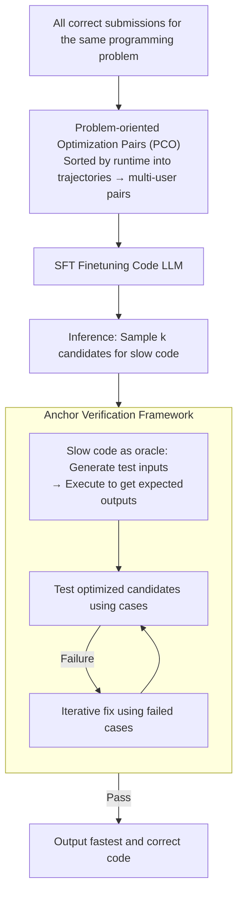

# A Problem-Oriented Perspective and Anchor Verification for Code Optimization

**Conference**: ICLR 2026  
**arXiv**: [2406.11935](https://arxiv.org/abs/2406.11935)  
**Code**: None  
**Area**: Code Intelligence  
**Keywords**: Code Optimization, LLM, Problem-Oriented, Anchor Verification, Program Performance  

## TL;DR
The paper proposes a problem-oriented (rather than user-oriented) approach to construct optimization pairs to integrate strategic diversity from multiple programmers. It also designs an anchor verification framework that utilizes "slow but correct code" to generate test cases, mitigating the "optimization tax" (correctness loss), thereby increasing the optimization ratio from 31.24% to 71.06% and the speedup from 2.95x to 6.08x.

## Background & Motivation

**Background**: LLMs have demonstrated outstanding performance in code generation tasks, yet their capability in code performance optimization (minimizing execution time) remains under-explored.

**Limitations of Prior Work**: Existing methods (e.g., PIE) construct optimization pairs from iterative submissions by the same user. This limits LLMs to local optimizations while ignoring global algorithmic innovations. Furthermore, code optimization faces an "optimization tax"—optimized code generated by LLMs frequently exhibits correctness issues.

**Key Challenge**: Code optimization is essentially a dual-objective problem (efficiency and correctness), which are often in conflict. User-oriented optimization pairs reflect only the mental models of individual programmers, lacking strategic diversity.

**Goal**: (a) Construct more diverse optimization pairs to stimulate the global optimization capabilities of LLMs; (b) Mitigate correctness loss in code optimization.

**Key Insight**: Shift from a user-oriented perspective to a problem-oriented one—sorting all user submissions for the same problem by runtime to form new optimization trajectories. Leverage the "slow but correct" property of pre-optimized code to generate test cases for verification.

**Core Idea**: Stimulate global algorithmic innovation via problem-oriented optimization pairs from a multi-user perspective, and utilize the original slow code as a correctness anchor within an anchor verification framework to fix the optimization tax.

## Method

### Overall Architecture
The paper addresses two intertwined problems in LLM-based code optimization: the lack of global algorithmic diversity in training data and the frequent loss of correctness in optimized code (referred to as the "optimization tax"). The overall approach involves changing the data construction perspective followed by a validation stage. The first part is Problem-oriented Code Optimization (PCO) pair construction, which aggregates submissions from all users for the same problem, sorts them by runtime, and builds pairs across users. The second part is the Anchor Verification framework, which uses the pre-optimized slow code as a correctness reference to generate test cases and iteratively fix the optimized code. During training, a Code LLM is finetuned using PCO data via SFT; during inference, each candidate undergoes anchor verification.

### Key Designs

**1. Problem-oriented Code Optimization (PCO): Breaking user boundaries to incorporate multi-programmer algorithmic strategies**

The previous PIE approach extracted optimization pairs from iterative submissions by the same user. This is problematic because a single user's consecutive submissions often involve only local refinements (variable renaming, loop unrolling) without changing the algorithmic core—indicated by small Graph Edit Distance (GED) and clustered semantic embeddings. PCO shifts to a problem-centric approach: for a problem $\mathcal{P}$, it collects correct submissions from all users, sorts them into a trajectory $[A_1, C_1, B_1, A_2, ...]$ based on runtime, and builds pairs along this trajectory. Such pairs may originate from completely different programmers, naturally spanning multiple solutions and encompassing global algorithmic transformations from $O(n^2)$ to $O(n \log n)$ (corresponding to high GED and dispersed semantic embeddings). This also addresses data scarcity: the number of pairs increases from $\sum_u C_{n_u}^2$ (per-user) to $C_{\sum_u n_u}^2$ (cross-user), which is an order of magnitude higher even with few users per problem.

**2. Anchor Verification Framework: Using "slow but correct" code as an oracle to recover the optimization tax**

There is a structural difference between code optimization and code generation: while the pre-optimized code is slow, it is guaranteed to be correct. This allows it to serve as a test oracle, avoiding the need to synthesize test cases from scratch where the expected outputs might be incorrect. The framework consists of four steps: the LLM understands the slow code and generates test inputs; these inputs are fed into the slow code for actual execution (rather than predicting outputs with the LLM) to obtain precise expected outputs; the input-output pairs form trusted verification test cases; finally, the optimized code is executed against these cases, and any failures are targeted for iterative fixing. If an optimized version fails on a boundary case, the correct result from the slow code provides a clear reference for repair. Consequently, correctness and efficiency are no longer mutually exclusive; experiments show both optimization ratios and correctness improve simultaneously.

### Loss & Training
The Code LLM (e.g., DeepSeek-Coder, Qwen2.5-Coder) is finetuned using SFT on PCO optimization pairs. During inference, a best@k strategy is employed (sampling $k$ candidates and selecting the fastest correct one). Performance is measured using runtime on a gem5 CPU simulator.

## Key Experimental Results

### Main Results

**PIE vs. PCO SFT Performance (best@8):**

| Model | Training Data | %Opt↑ | Speedup↑ | Correct↑ |
|------|---------|-------|----------|----------|
| DS-Coder 6.7B | PIE | 31.24% | 2.95x | 61.14% |
| DS-Coder 6.7B | **PCO** | **58.90%** | **5.22x** | 61.55% |
| DS-Coder 6.7B | PCO+Anchor Var. | **71.06%** | **6.08x** | **74.54%** |

### Ablation Study

| Configuration | %Opt | Speedup | Correct |
|------|------|---------|---------|
| PIE (User-oriented) | 31.24% | 2.95x | 61.14% |
| PCO (Problem-oriented) | 58.90% | 5.22x | 61.55% |
| + Anchor Verification | 71.06% | 6.08x | 74.54% |

### Key Findings
- The problem-oriented perspective nearly doubles the optimization ratio (+27.66pp) and significantly increases speedup (2.95x $\rightarrow$ 5.22x), highlighting the importance of cross-user strategy integration.
- Manual analysis reveals that global algorithmic optimizations dominate PCO, whereas PIE is characterized mostly by local optimizations.
- The anchor verification framework further enhances correctness (+12.99pp) and the optimization ratio (+12.16pp), proving that correctness and efficiency are not strictly in conflict.
- The problem-oriented method not only improves performance but also mitigates data scarcity by increasing the number of optimization pairs by an order of magnitude.

## Highlights & Insights
- **Power of Perspective Shift**: Moving from "user iterations" to "problem aggregation" is a simple but highly effective concept—the key insight is that code optimization requires algorithmic innovation (e.g., $O(n^2)$ to $O(n \log n)$), which rarely comes from iterative improvements by the same person.
- **Slow Code as Oracle**: Leveraging the structural difference between code optimization and generation—the original code is a natural oracle. This insight is clever and unique to the optimization scenario.
- **Data Scaling Effect**: The combinatorial nature of the problem-oriented approach ($C_{\sum n_u}^2 \gg \sum C_{n_u}^2$) naturally solves the data scarcity problem.

## Limitations & Future Work
- The study focuses solely on execution time optimization for C++ code; generalization to other languages and dimensions (memory, energy) is unexplored.
- The anchor verification framework depends on the LLM's ability to generate valid test inputs—if generated inputs lack diversity, some errors may remain undetected.
- Performance is evaluated using the gem5 simulator rather than real hardware; runtime metrics may differ from actual deployments.
- There remains a gap between competitive programming code optimization and real-world engineering project optimization.

## Related Work & Insights
- **vs. PIE (Shypula et al.)**: PIE pioneered optimization pairs but used only a user-oriented perspective; PCO surpasses it through the problem-oriented perspective and anchor verification.
- **vs. Code Generation Verification**: Methods like CodeT synthesize test cases but require bidirectional execution filtering; anchor verification is more reliable as it uses the original code as an oracle.
- **vs. Compiler Optimization**: Compilers handle hardware-level (-O3) optimizations; this work focuses on algorithmic level optimization, making the two approaches complementary.

## Rating
- Novelty: ⭐⭐⭐⭐ The perspective shift and anchor verification are innovative, though the core logic is relatively intuitive.
- Experimental Thoroughness: ⭐⭐⭐⭐⭐ Includes multi-dimensional analysis (structural/semantic/manual), multi-model comparisons, and detailed ablation studies.
- Writing Quality: ⭐⭐⭐⭐ Clear logic and well-articulated motivation.
- Value: ⭐⭐⭐⭐ Provides an effective methodology for data construction and verification in LLM-based code optimization.

## Related Papers

- [\[ICLR 2026\] SpotIt: Evaluating Text-to-SQL Evaluation with Formal Verification](spotit_evaluating_text-to-sql_evaluation_with_formal_verification.md)
- [\[ICLR 2026\] Local Success Does Not Compose: Benchmarking Large Language Models for Compositional Formal Verification](local_success_does_not_compose_benchmarking_large_language_models_for_compositio.md)
- [\[ICLR 2026\] From Large to Small: Transferring CUDA Optimization Expertise via Reasoning Graph](from_large_to_small_transferring_cuda_optimization_expertise_via_reasoning_graph.md)
- [\[ACL 2026\] QiMeng-PRepair: Precise Code Repair via Edit-Aware Reward Optimization](../../ACL2026/code_intelligence/qimeng-prepair_precise_code_repair_via_edit-aware_reward_optimization.md)
- [\[ICLR 2026\] BOAD: Discovering Hierarchical Software Engineering Agents via Bandit Optimization](boad_discovering_hierarchical_software_engineering_agents_via_bandit_optimizatio.md)

<!-- RELATED:END -->

<!-- RELATED:START -->

## Related Papers

- [\[ICLR 2026\] SpotIt: Evaluating Text-to-SQL Evaluation with Formal Verification](spotit_evaluating_text-to-sql_evaluation_with_formal_verification.md)
- [\[ICLR 2026\] Local Success Does Not Compose: Benchmarking Large Language Models for Compositional Formal Verification](local_success_does_not_compose_benchmarking_large_language_models_for_compositio.md)
- [\[ICLR 2026\] From Large to Small: Transferring CUDA Optimization Expertise via Reasoning Graph](from_large_to_small_transferring_cuda_optimization_expertise_via_reasoning_graph.md)
- [\[ICLR 2026\] BOAD: Discovering Hierarchical Software Engineering Agents via Bandit Optimization](boad_discovering_hierarchical_software_engineering_agents_via_bandit_optimizatio.md)
- [\[ICLR 2026\] Behavioral Embeddings of Programs: A Quasi-Dynamic Approach for Optimization Prediction](behavioral_embeddings_of_programs_a_quasi-dynamic_approach_for_optimization_pred.md)

<!-- RELATED:END -->
