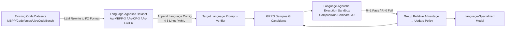

# Agnostics: Learning to Synthesize Code in Any Programming Language with a Universal Reinforcement Learning Environment

**Conference**: ICLR 2026  
**OpenReview**: [https://openreview.net/forum?id=mjDT60Ffms](https://openreview.net/forum?id=mjDT60Ffms)  
**Code**: [agnostics.abgru.me](https://agnostics.abgru.me)  
**Area**: Code Intelligence / Low-resource Programming Languages / RLVR  
**Keywords**: Code Generation, Low-resource Languages, Reinforcement Learning with Verifiable Rewards (RLVR), GRPO, Language-agnostic Verifier  

## TL;DR
By using "standard program input/output behavior" as the unified scoring criterion, a language-agnostic code execution sandbox and GRPO training framework are developed. This enables RL post-training for any low-resource programming language with only 4-5 lines of YAML configuration, elevating the performance of Qwen-3 4B on Lua, Julia, R, OCaml, and Fortran to levels comparable with 16B–70B models.

## Background & Motivation
**Background**: LLMs exhibit strong code synthesis capabilities in high-resource languages like Python and JavaScript but struggle with low-resource languages such as Fortran, Julia, R, OCaml, and Lua, which are critical for scientific computing, healthcare, and data science. The capability gap stems from two layers: in The Stack V2, Python occupies approximately 200GB, while Julia/Fortran are only at the 2GB level, with the top 10 languages accounting for 90% of the data; pre-training data is naturally skewed.

**Limitations of Prior Work**: A more subtle bottleneck than data exists in **post-training**. Supporting each new language typically requires re-preparing supervised datasets, test stubs, and RL infrastructure capable of compiling, running, and verifying model-generated code—all of which require scarce language expertise. Representative work like MultiPL-T uses "rejection sampling + hidden unit tests" to generate synthetic data but suffers from two flaws: (1) The model must generate a passing program within $n$ attempts to avoid total rejection; at $n \in \{50, 100\}$, only about 30% of problems yield usable solutions, and difficult problems are almost entirely discarded. (2) Each language requires a manually written "small compiler" to translate Python test cases and function signatures, which supports limited built-in types and often produces unidiomatic code that requires deep expertise to fix.

**Key Challenge**: One must either invest massive human effort to customize post-training pipelines for every low-resource language or abandon these languages—while simply upsampling pre-training data or fine-tuning on low-resource code has been proven by predecessors to yield marginal gains.

**Goal**: Eliminate the cost of re-engineering pipelines for every language, making RLVR post-training for any programming language as simple as writing a few lines of YAML.

**Key Insight** (**Behavior as Correctness**): For a large class of programming tasks, correctness can be defined not on functions or code snippets, but on the **externally observable behavior of the entire program** (e.g., I/O). Consequently, a verifier program used for scoring—whose implementation language is completely independent of the language being learned—paired with problems and test cases can constitute a **universal RL environment** that can be instantiated for almost any language.

## Method

### Overall Architecture
Agnostics consists of two phases and four steps: The **Data Preparation Phase** rewrites language-specific problems into a language-agnostic format and instantiates them for the target language; the **Training Phase** employs GRPO with a language-agnostic execution sandbox for RL with verifiable rewards. All tasks are reduced to "read data from standard input, calculate the unique answer, and write to standard output," allowing the entire dataset to share a single verifier.

### Key Designs

**1. Language-Agnostic Data Format Based on "Behavior as Correctness": Rewriting "Function + Unit Test" into "Standard I/O" problems using LLMs.** Most code datasets (e.g., MBPP) provide "natural language descriptions + function signatures + assertion-based unit tests," which are naturally bound to a specific language. In contrast, competitive programming datasets like Codeforces already describe problems using standard I/O. Agnostics uses an LLM to **rewrite** the former into plain-text standard input/output prompts. The key is forcing the model to fix I/O conventions—specifying decimal places, newline vs. comma separators, and value ordering—to ensure the expected behavior is unambiguous. For example, an MBPP function task like "Check if a number is non-prime" becomes "Given an integer N, output True if it is non-prime, else False. Input is one integer, output is one True/False." This produces three datasets: Ag-MBPP-X, Ag-Codeforces-X, and Ag-LiveCodeBench-X, all sharing the same I/O verification logic.

**2. Instantiating Any Language with 4-5 Lines of Configuration: Compressing "language knowledge" into four items: install, compile, execute, and prompt.** To support a new language, one only needs a small configuration: first, a `prompt` prefix (pended to each problem to instruct the model to use the target language and warn about common pitfalls); second, shell commands for the toolchain (`install`), source filename (`filename`), compilation (`compile`), and execution (`execute`). For relatively popular languages with a baseline accuracy $\ge 5\%$, a simple "Please solve this in language L" suffices. For languages with nearly zero accuracy (e.g., R's three I/O APIs, OCaml, Fortran), a longer prefix explaining traps can be written—the authors even let the base model generate many erroneous snippets, fed them to o3 to summarize "10-20 suggestions on Fortran programming pitfalls," and used that as the prefix. Configuring a language takes about 1 hour, much lighter than MultiPL-E’s ~500-line test translator per language. Note that this **prefix is removed during evaluation**, so scores reflect the model's truly learned capability rather than prompt engineering.

**3. GRPO + Binary Verifiable Rewards: Rejecting partial rewards to prevent reward hacking.** Given a language-agnostic task $(x, \{(in_k, out_k)\}_{k=1}^{K})$, a group of $G$ candidates $\{y_i\}$ is sampled from the old policy $\pi_{\theta_{old}}$. Each candidate is sent to the sandbox: if its behavior matches all I/O samples, $R_i=1$; otherwise, $R_i=0$. Within-group rewards are normalized into sequence-level advantages $\hat A_i = \frac{R_i - \text{mean}(\{R_j\})}{\text{std}(\{R_j\})}$, and the policy is updated using a clipped GRPO objective, omitting the KL term following DAPO. The authors explicitly tested partial rewards like "giving points if the code runs but output is wrong" or "passing only public tests," which resulted in the model **learning to exploit loopholes**—producing empty programs or hardcoding public tests as "draft answers." Thus, pure binary rewards were maintained. Code is extracted via Markdown code blocks (the default output of instruction models), eliminating the need for format rewards and ensuring reward increases during training represent genuine progress.

**4. Robust and Efficient Language-Agnostic Execution Sandbox: Warm container pools + dual timeouts + output buffer limits.** The verifier builds and caches an OCI container for each language based on the config, containing a resident execution harness: write file $\rightarrow$ compile (if necessary) $\rightarrow$ run against each input and compare output. Any timeout or mismatch returns a reward of 0. **Setting timeouts for both compilation and execution** is critical—it blocks Julia's unbounded macro expansions (caught by compilation timeout) and infinite loops (caught by execution timeout). Containers also limit CPU, memory, and filesystem access without providing privileges. A subtle resource limit is the **output size limit**: even within a 30s timeout, a malicious program could output tens of GBs of text to crash the verifier; thus, a fixed 5MB read buffer is maintained, and the process is killed immediately upon overflow. Since one training run tests ~150,000 programs (most of which are faulty), cold-starting containers is two orders of magnitude slower than reuse, so a pool of warm containers is maintained with automatic crash recovery. The system is implemented using Ray, separating GPU training nodes from CPU execution nodes and parallelizing generation with loss calculation for significant speedups.

## Key Experimental Results

Setup: pass@1 (greedy decoding disabled, 20 samples per problem, temp 0.2), 1 epoch of training. The main dataset is Ag-Codeforces-X (5,369 problems). Training hyperparameters: lr=5e-6, batch size 4 problems, group size 32, temp 0.7.

### Main Results: Ag-LiveCodeBench-X pass@1 (Ours highlighted)

| Model | Lua | Julia | R | OCaml | Fortran |
|---|---|---|---|---|---|
| Llama 3.3 70B Ins | 25 | 22 | 13 | 7 | 3 |
| Qwen 3 32B | 22 | 26 | 17 | 2 | 1 |
| DSC v2 Lite Ins 16B | 13 | 12 | 9 | 7 | 6 |
| Qwen 3 4B (Base) | 11 | 10 | 10 | 1 | 0 |
| Qwen 3 8B (Base) | 11 | 9 | 9 | 0 | 0 |
| **Qwen3-4B-CF-X (Ours)** | **23** | **22** | **15** | **7** | **15** |
| **Qwen3-8B-CF-X (Ours)** | **25** | **25** | **19** | **7** | **17** |

For every language, Ours matches or exceeds the 16B DSC v2 Lite and approaches or surpasses 32B/70B models; performance in OCaml/Fortran rose from near-zero to ~7%/15%, exceeding several frontier models. Pass@1 typically improved by 1.5–2x compared to the base model.

### Generalization

| Evaluation | Lua | Julia | R |
|---|---|---|---|
| MultiPL-E: Qwen 3 8B (Base) | 63 | 53 | 44 |
| MultiPL-E: **Qwen3-8B-CF-X** | **68** | **61** | **52** |

Although trained only on standard I/O competitive programming problems, the model significantly improved on the "functional Python data structure" tasks of MultiPL-E, demonstrating **cross-format generalization** without harming performance in other languages. The 8B model showed further gains over the 4B model, while 1.7B/3B models were too small to learn from the difficult tasks. The approach is effective for non-Qwen families like SmolLM3, Phi-4-mini, and DeepSeek-Coder-6.7B (DSC-6.7B-Ins improved from 37→52 on R in MultiPL-E).

### Baseline Comparison

- **Distillation**: Distilling Qwen 3 4B using 1,987 solutions generated by Sonnet 4 Thinking (which scores 12 in Fortran) for 3 epochs yielded a maximum of only 3 points—far below Agnostics' 15 points. LLMs are not inherently good at low-resource languages, making distillation weak.
- **Rejection Sampling**: In Qwen3-4B-CF-Fortran training, only 6.64% of samples passed tests (Base Qwen 3 4B was only 0.09%, producing only 158 passing programs in the entire set). RL can learn continuously even at such low success rates, whereas rejection sampling is prohibitively expensive at this difficulty.

### Key Findings
- **Binary rewards + Removing partial rewards** are critical to preventing reward hacking; otherwise, the model learns empty programs or hardcoding public tests.
- RL can break the ceiling of "training on all available public code"—the base model can be seen as having exhausted natural data, yet RL still drives a 1.5–2x gain.
- Training curves show continuous slow improvement even toward the end of the dataset, with correlated rewards between training and test splits.

## Highlights & Insights
- **Shifting "Correctness" from the code snippet level to the observable behavior level** solves the deadlock of "rebuilding verifiers for every language." The verifier implementation is completely decoupled from the language being learned—the most elegant perspective shift in the paper.
- **Engineering as Contribution**: Warm container pools, dual compilation/execution timeouts, 5MB output buffers, RAM disks, and Ray heterogeneous node separation are the essential infrastructure that makes "testing 150,000 programs" in RL stable and efficient.
- **High Reusability**: The authors released three datasets (Ag-MBPP-X, Ag-Codeforces-X, Ag-LiveCodeBench-X), training code, and ready-to-use configurations. They also contributed a multilingual LiveCodeBench benchmark that is much harder than MultiPL-E and remains challenging for frontier models as of February 2026.
- **Honest Negative Results**: Explicitly documenting how partial rewards were exploited, why small models failed to learn, and why distillation/rejection sampling failed provides more reference value than only reporting successes.

## Limitations & Future Work
- **Tasks limited to Standard I/O**: Currently only covers "read stdin $\rightarrow$ unique answer $\rightarrow$ write stdout." While the sandbox claims to safely handle network/disk I/O, this has not been empirically verified. Tasks involving state, interactivity, GUI, or concurrency are not yet included.
- **Dependence on unique correct output**: Requires answers that can be uniquely compared, which is not directly applicable to tasks with multiple solutions or those requiring approximation/tolerance (where partial rewards might trigger hacking).
- **Unverified extremes (very small and very large models)**: 1.7B/3B models failed to learn, though whether this is due to problem difficulty is uncertain. Similarly, due to compute constraints, scaling to models much larger than 8B has not been verified.
- **Prefix still requires manual effort**: Near-zero accuracy languages require long, manually written prompt prefixes (though o3 can assist), so it is not entirely zero-human-effort.
- **Rewriting quality depends on LLMs**: Converting unit tests to I/O prompts relies on LLMs; ambiguous I/O conventions can pollute reward signals, and different datasets require fine-tuning rewrite prompts.

## Related Work & Insights
- **MultiPL-T / TransCoder-ST / CMTrans**: Representatives of synthetic data + rejection sampling/verification, which require manual translators per language and suffer from low acceptance rates on hard problems; Agnostics bypasses this with a unified I/O verifier and RL.
- **MultiPL-E**: A classic multilingual benchmark translating HumanEval to various languages, but now too easy for frontier models; Ours proposes the harder Ag-LiveCodeBench-X based on this.
- **DeepSeek-R1 / GRPO / DAPO**: Methodological sources for rule-based reward RL and group relative optimization; Ours extends these from Python to low-resource languages and omits the KL term.
- **Insight**: When the "correctness" of a task type can be fully characterized by external behavior, "Language/Implementation-Agnostic Verifier + RLVR" becomes a universal paradigm for bypassing scarce supervised data. This is worth migrating to other low-resource fields where labeling is difficult (e.g., obscure DSLs, hardware description languages, or executable subsets of formal proofs).

## Rating
- **Novelty**: ⭐⭐⭐⭐ — The perspective shift of "Behavior as Correctness $\rightarrow$ Language-Agnostic Verifier" is simple yet powerful, reducing the engineering cost of multilingual RL post-training to a few YAML lines. This is a genuine decoupling innovation (though the method itself is a combined application of GRPO+RLVR).
- **Experimental Thoroughness**: ⭐⭐⭐⭐ — Covers 5 low-resource languages across multiple benchmarks and model families (4B/8B/SmolLM3/Phi4/DSC). Includes distillation and rejection sampling comparisons and reward design ablation. Broad coverage with honest negative results; lacks validation on ultra-large models and non-I/O tasks.
- **Writing Quality**: ⭐⭐⭐⭐ — Clear motivation, effective charts, and thorough documentation of engineering details. Reward hacking and failed baselines are discussed with transparency.
- **Value**: ⭐⭐⭐⭐⭐ — Directly serves real-world communities in scientific computing, healthcare, and data science that rely on low-resource languages. Open-sourcing data, code, configurations, and new benchmarks lowers the barrier for reproduction and extension significantly.

<!-- RELATED:START -->

## Related Papers

- [\[AAAI 2026\] ReCode: Updating Code API Knowledge with Reinforcement Learning](../../AAAI2026/code_intelligence/recode_updating_code_api_knowledge_with_reinforcement_learning.md)
- [\[ICLR 2026\] Critique-Coder: Enhancing Coder Models by Critique Reinforcement Learning](critique-coder_enhancing_coder_models_by_critique_reinforcement_learning.md)
- [\[ICLR 2026\] ATGen: Adversarial Reinforcement Learning for Test Case Generation](atgen_adversarial_reinforcement_learning_for_test_case_generation.md)
- [\[ACL 2026\] MARS2: Scaling Multi-Agent Tree Search via Reinforcement Learning for Code Generation](../../ACL2026/code_intelligence/mars2_scaling_multi-agent_tree_search_via_reinforcement_learning_for_code_genera.md)
- [\[ICLR 2026\] Learning to Reason without External Rewards](learning_to_reason_without_external_rewards.md)

<!-- RELATED:END -->
