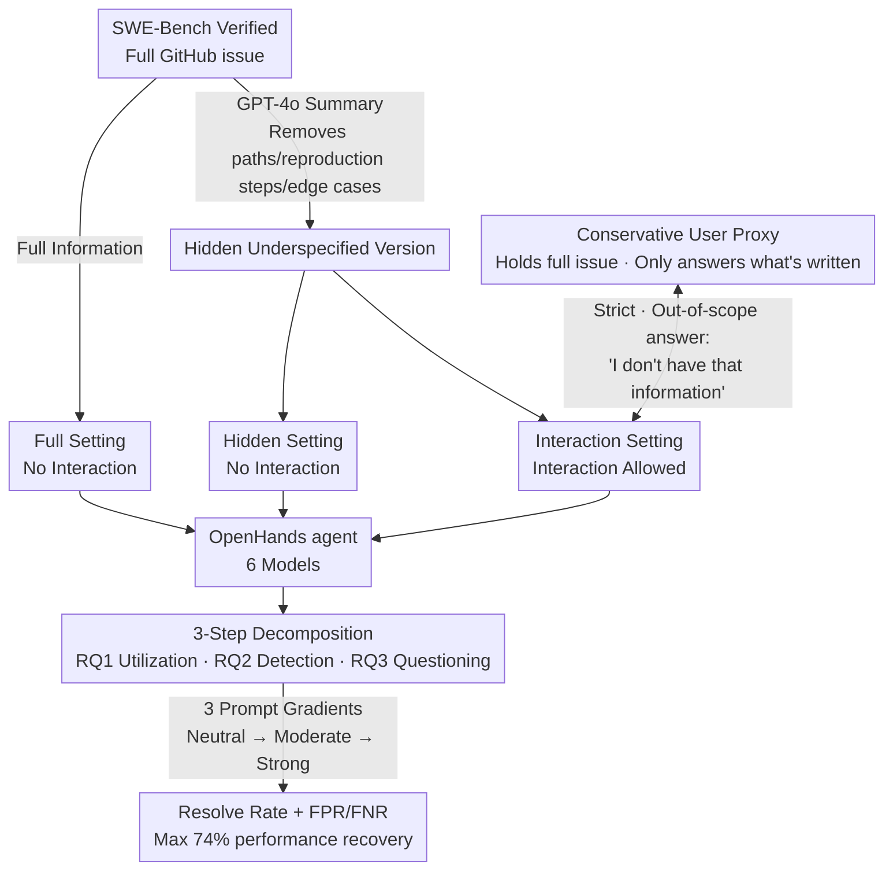

# Ambig-SWE: Interactive Agents to Overcome Underspecificity in Software Engineering

**Conference**: ICLR 2026  
**arXiv**: [2502.13069](https://arxiv.org/abs/2502.13069)  
**Code**: [https://github.com/sani903/InteractiveSWEAgents](https://github.com/sani903/InteractiveSWEAgents)  
**Area**: Code Intelligence  
**Keywords**: underspecification, interactive agent, SWE-Bench, clarification, software engineering  

## TL;DR
The authors construct Ambig-SWE (an underspecified variant based on SWE-Bench Verified) to systematically evaluate the interaction capabilities of LLM programming agents across three dimensions: detecting underspecification, asking clarifying questions, and utilizing interactive information. They find that interaction can improve resolution rates in underspecified scenarios by up to 74%, yet models default to non-interactive behavior and struggle to distinguish between sufficient and underspecified instructions.

## Background & Motivation
**Background**: LLM agents are widely deployed in software engineering (e.g., OpenHands on SWE-Bench), but user instructions are frequently underspecified. While human developers proactively ask for clarification when information is insufficient, AI agents often make assumptions and proceed.

**Limitations of Prior Work**: (1) Underspecified instructions lead to incorrect outputs, security risks, and wasted computational resources; (2) existing research on underspecification focuses on missing single details, whereas real-world software engineering tasks involve multiple interdependent information gaps; (3) LLMs default to non-interactive behavior—they do not proactively ask even when faced with severe information deficits.

**Key Challenge**: Interaction can effectively recover performance lost due to underspecification (up to 74%), but models do not know when to interact, what to ask, or how to utilize the acquired information.

**Goal**: Systematically evaluate and quantify the ability of LLM agents to handle underspecified instructions, decomposed into atomic capabilities that can be independently improved.

**Key Insight**: Construct underspecified variants of SWE-Bench Verified and design three evaluation settings (Full/Hidden/Interaction), utilizing GPT-4o to simulate a user.

**Core Idea**: Decompose underspecification handling into three steps—"detect-ask-utilize"—and use interactive experiments to quantify the capability and room for improvement in each step.

## Method

### Overall Architecture
Ambig-SWE constructs an "underspecified" twin version for each task in SWE-Bench Verified. The same agent is then placed into three information conditions for comparison: **Full**, receiving the complete GitHub issue; **Hidden**, receiving a concise summary by GPT-4o; and **Interaction**, which allows asking follow-up questions to a user proxy holding the full information based on the Hidden setting. All three settings are run within the OpenHands framework across six models. The "value of interaction" is measured by decomposing the process into three measurable steps: "detecting underspecification → asking clarifying questions → utilizing interactive information." The following diagram illustrates the evaluation pipeline:

### Key Designs

**1. Underspecified Data Construction: Making "Information Gap" a Controllable Variable**

The original issues in SWE-Bench Verified were manually filtered and are relatively complete, making them unsuitable for testing interaction. To address this, the authors used GPT-4o to summarize each issue into a "Hidden" version that retains only high-level intent while stripping critical details like specific file paths, reproduction steps, and edge cases. The only difference between Full and Hidden is the volume of information. The performance loss caused by underspecification is the Full resolve rate minus the Hidden resolve rate. How much the Interaction setting recovers from Hidden toward Full serves as a direct measure of interaction value (up to 74% recovery reported). Unlike previous studies that remove single details, this approach strips multiple interdependent details, better mimicking real-world software engineering data gaps.

**2. Conservative User Proxy: Isolating Information Acquisition**

In the Interaction setting, another GPT-4o instance holding the full issue acts as the user. To prevent proxy hallucinations from contaminating results, it is designed to be "conservative"—it only answers details explicitly written in the source issue. If asked for anything outside the issue, it responds with "I don't have that information." This ensures that any performance gain is tied strictly to the agent's own information acquisition ability rather than the proxy being overly helpful.

**3. Three-Step Decomposed Evaluation: Breaking Down "Interaction Capability"**

The authors split interaction into three research questions. **RQ1** compares resolve rates across Hidden, Interaction, and Full to quantify overall recovery. **RQ2** measures "should I ask"—randomly feeding the model Full or Hidden inputs to see if it can detect insufficiency, using Accuracy, False Positive Rate (FPR, asking when info is sufficient), and False Negative Rate (FNR, proceeding despite insufficient info). **RQ3** measures "quality of asking"—analyzing whether clarifying questions target truly missing information, categorized into *informational* (expected behavior) and *navigational* (redundant info like paths solvable via codebase search). This decomposition allows pinpointing exactly where a model fails.

**4. Three-Level Interaction Gradients: Distinguishing "Cannot Ask" from "Not Allowed to Ask"**

Models rarely interact by default. To determine if this is a capability gap or a behavioral constraint, the authors used three prompt tiers: **Neutral** (informs interaction is possible), **Moderate** (reminds to verify information), and **Strong** (emphasizes that asking is critical). If a model fails to interact even under Strong prompts (e.g., Qwen3 Coder maintains an FNR of $1.0$), it indicates that non-interactive behavior is "baked" into its reasoning protocol, showing a fundamental flaw in current training paradigms focusing on SWE-Bench benchmarks.

## Key Experimental Results

### Main Results (Resolve Rate %)

| Model | Hidden | Interaction | Full | Gain (Recovery Rate) |
|------|--------|------------|------|-------|
| Claude S4 | 49.0 | 52.4 | 58.8 | **89%** |
| Claude S3.5 | 27.3 | 35.0 | 43.8 | ~80% |
| Qwen3 Coder | 45.6 | 53.6 | 59.2 | ~85% |
| Haiku 3.5 | 13.0 | 20.8 | 26.0 | ~80% |
| Deepseek-v2 | 2.0 | 7.2 | 12.2 | 59% |
| Llama 70B | 1.4 | 3.6 | 6.6 | 54% |

### Underspecification Detection (Strong prompt)

| Model | Accuracy | FPR↓ | FNR↓ |
|------|----------|------|------|
| Claude S4 | **0.89** | 0.03 | 0.18 |
| Claude S3.5 | 0.76 | 0.36 | 0.10 |
| Qwen3 Coder | 0.50 | 0.00 | **1.00** |

### Key Findings
- **Qwen3 Coder FNR = 1.0**: Even under Strong prompts, it never initiates interaction—completely ignoring underspecification in favor of a rigid SWE-Bench solving protocol.
- Interaction can provide a gain of up to 74% (Hidden → Interaction), but performance remains significantly lower than Full, indicating limited ability to utilize interactive information.
- **Information Type Analysis**: Acquiring navigational information (file paths) helps weaker models the most, while stronger models benefit less from it as they can locate code themselves.
- **Model Scale/Coding Ability $\neq$ Interaction Capability**: Haiku (a smaller model) shows information utilization rates comparable to Sonnet 3.5.
- Claude S4 explores the codebase extensively (65 steps avg.) to compensate for missing info in Hidden; interaction increases this to 75 steps, suggesting interaction improves efficacy but not necessarily efficiency.

## Highlights & Insights
- **Decomposition Framework**: Breaking down "interaction" into detect-ask-utilize provides high methodological value for evaluating and improving agents.
- **Paradigm Flaws**: Currently, model training optimizes for task completion rate rather than "knowing when to ask," leading to systemic non-interactive behavior.
- **Rigid Behavior**: Some models like Qwen3 Coder re-explore the codebase even after receiving the answer from the user, showing they do not truly "understand" the purpose of the interaction.

## Limitations & Future Work
- Underspecified versions generated by GPT-4o might be "cleaner" than real-world messy user issues.
- The GPT-4o proxy in the Interaction setting might not perfectly reflect nuanced human behavior.
- Evaluation is limited to SWE-Bench (Python repositories); other languages or domains are not covered.
- The paper diagnoses the issue but does not propose a specific training method to fix interactive shortcomings.

## Related Work & Insights
- **vs AQuA VQA**: While AQuA studies VLM strategies for visual ambiguity, Ambig-SWE studies coding agents' interaction for missing text info—different modalities, same core problem of handling uncertainty.
- **vs SWE-Bench**: SWE-Bench assumes complete instructions; Ambig-SWE specifically tests behavior when instructions are incomplete, which is closer to real-world scenarios.
- **vs ClearVQA**: ClearVQA trains models for a "binary choice" (answer vs. ask); Ambig-SWE decomposes it into three steps within complex software engineering environments.

## Rating
- Novelty: ⭐⭐⭐⭐⭐ First systematic evaluation of SWE agent interaction; novel 3-step framework.
- Experimental Thoroughness: ⭐⭐⭐⭐⭐ 6 models, 3 settings, 3 prompt levels, multidimensional analysis.
- Writing Quality: ⭐⭐⭐⭐⭐ Rigorous experimental design and deep analysis.
- Value: ⭐⭐⭐⭐⭐ Critical diagnosis of agent interaction capabilities, directly guiding future training research.

<!-- RELATED:START -->

## Related Papers

- [\[ICLR 2026\] SWE-RM: Execution-Free Feedback for Software Engineering Agents](swe-rm_execution-free_feedback_for_software_engineering_agents.md)
- [\[ICML 2025\] Training Software Engineering Agents and Verifiers with SWE-Gym](../../ICML2025/code_intelligence/training_software_engineering_agents_and_verifiers_with_swe-gym.md)
- [\[NeurIPS 2025\] SWE-rebench: An Automated Pipeline for Task Collection and Decontaminated Evaluation of Software Engineering Agents](../../NeurIPS2025/code_intelligence/swe-rebench_an_automated_pipeline_for_task_collection_and_decontaminated_evaluat.md)
- [\[ICLR 2026\] BOAD: Discovering Hierarchical Software Engineering Agents via Bandit Optimization](boad_discovering_hierarchical_software_engineering_agents_via_bandit_optimizatio.md)
- [\[ICLR 2026\] Process-Level Trajectory Evaluation for Environment Configuration in Software Engineering Agents](process-level_trajectory_evaluation_for_environment_configuration_in_software_en.md)

<!-- RELATED:END -->
