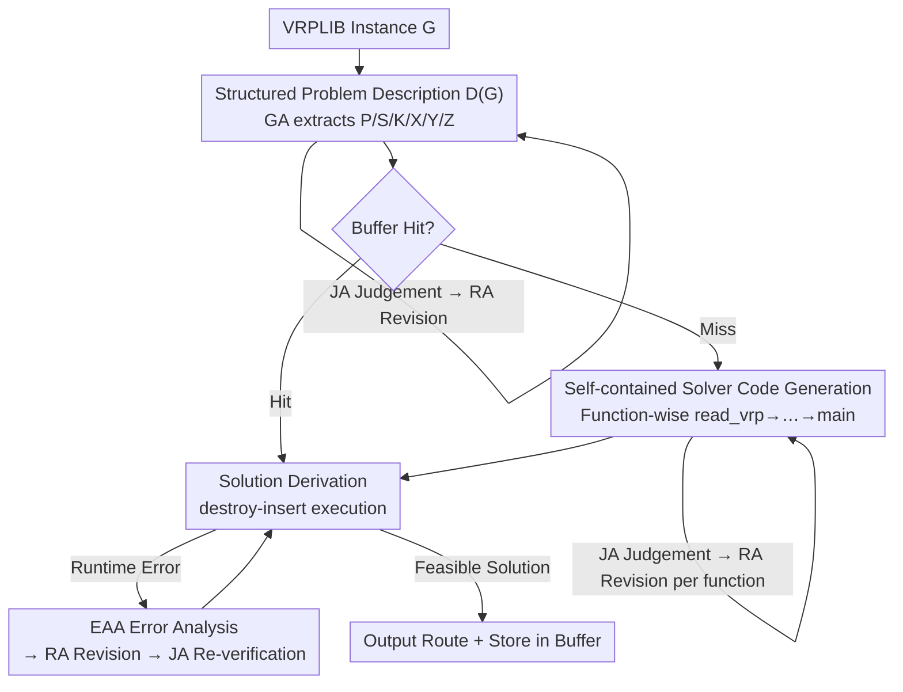

# An Agentic Framework with LLMs for Solving Complex Vehicle Routing Problems

**Conference**: ICLR 2026  
**OpenReview**: [https://openreview.net/forum?id=BMOgYw4EhQ](https://openreview.net/forum?id=BMOgYw4EhQ)  
**Code**: https://github.com/ZHANG-NI/AFL (Available)  
**Area**: LLM Agent / Combinatorial Optimization  
**Keywords**: Vehicle Routing Problem, LLM Multi-Agent, Code Generation, Self-contained Solver, Trustworthy Code

## TL;DR
AFL decomposes "using LLMs to solve complex Vehicle Routing Problems (VRP)" into three subtasks: problem description, code generation, and solution derivation. It utilizes four specialized agents (Generation, Judgement, Revision, and Error Analysis) to oversee each other, automatically producing a self-contained Python solver from raw VRPLIB instances. Across 60 VRP variants, AFL reduces the runtime error rate to 0%, achieves a 100% feasible solution rate, and maintains an optimality gap mostly within 3% compared to manually designed algorithms.

## Background & Motivation

**Background**: The Vehicle Routing Problem (VRP) is a core combinatorial optimization problem in logistics and scheduling, characterized by numerous variants (capacitated, time windows, open routes, electric vehicle range, etc.). Traditional approaches either rely on experts to manually formulate mathematical models (HGS, OR-Tools) or train neural solvers (POMO series), both requiring significant manual adaptation for new variants.

**Limitations of Prior Work**: While LLMs were introduced to "reduce manual coding and automatically adapt to variants," existing methods have failed to achieve full automation. They generally follow two paths: evolving heuristics (EoH, ReEvo), which only handle standard variants, or building general frameworks (ARS, DRoC), which remain impractical. ARS requires retrieving templates from a predefined constraint library, and DRoC calls OR-Tools after RAG—neither is **self-contained** (relying on manual modules or external solvers), and neither is **fully automatic** (requiring manual extraction of instance information during execution). This mismatch between LLM-generated code and external systems leads to runtime errors and infeasible solutions. SGE, the only self-contained approach, can only solve simple problems like TSP and lacks a constraint-handling mechanism.

**Key Challenge**: While LLMs can "understand problems + write code," **expecting them to generate a complete VRP solver in one shot is highly unreliable**. Ensuring consistency across multiple functions and embedding complex constraints almost inevitably leads to single-shot failures. Conversely, introduced external solvers or manual intervention compromises automation and generality. Reliability and automation are currently in opposition.

**Goal**: Develop a general VRP framework that is simultaneously **self-contained** (no reliance on manual modules/external solvers), **fully automatic** (zero manual intervention from raw instance to solution), and **highly credible** (reliable code with feasibility rates near 100%).

**Key Insight**: Instead of hoping for a correct single-shot generation, the process is decomposed into manageable stages. Specialized agents are assigned to each stage for mutual review and iterative error correction—transforming uncontrollable end-to-end generation into a supervised, rollback-capable pipeline.

**Core Idea**: Replace "single-prompt single-shot generation" with "three-subtask decomposition + four-specialized-agent collaboration." LLMs act as developers of a self-contained solving framework, leveraging a judgement-revision-error analysis closed loop between agents to maximize credibility.

## Method

### Overall Architecture

AFL receives a VRPLIB-formatted instance $G$ and outputs executable Python solver code that produces feasible solutions. The pipeline is divided into three subtasks: **Problem Description → Code Generation → Solution Derivation**, completed by four agents: Generation Agent (GA), Judgement Agent (JA), Revision Agent (RA), and Error Analysis Agent (EAA).

The workflow involves: given instance $G$, GA extracts domain knowledge to generate a structured problem description $D(G)$; JA evaluates its accuracy, and RA revises it until JA approves. After obtaining $D(G)$, the framework checks a Buffer (cached "description-code" pairs): if a match is found, it proceeds to derivation; otherwise, GA generates code **function-by-function** in the order of `read_vrp → distance → cost → initial → destroy → insert → validate → main`, with JA/RA reviewing each function. If execution fails, EAA analyzes the cause, RA fixes the code, and JA re-verifies until a feasible solution is found. Finally, $D(G)$ and the code are stored in the Buffer.

### Key Designs

**1. Three-subtask decomposition + Four-agent collaboration: Managing uncontrollable generation**
Relying on an LLM to write a complete VRP solver correctly requires simultaneous consistency, constraint embedding, and logic accuracy, which typically fails. AFL addresses this by splitting the pipeline into description, generation, and derivation, where every output is "reviewed before use." GA produces, JA performs "quality control," RA handles "repairs" based on JA's feedback, and EAA diagnoses runtime root causes. This ensures errors are intercepted and fixed locally rather than accumulating.

**2. Structured Problem Description $D(G)$: A "contract" for code generation**
Inconsistencies often arise from LLMs misunderstanding objectives, inputs, or constraints. AFL's GA automatically extracts a six-tuple $D(G)=\{P, S, K, X, Y, Z\}$: $P$ is the problem type (e.g., CVRP), $S$ is a textual description, $K$ is the set of constraints, $X$ defines required inputs (e.g., coordinates, demands), $Y$ defines expected outputs, and $Z$ is the objective function. Crucially, **input variable names in the code are forced to align with $X$**. JA reviews $D(G)$ for consistency with the instance and internal coherence.

**3. Self-contained destroy–insert solver + Sequential function generation: Removing external solvers**
To remain self-contained, AFL adopts a **destroy–insert heuristic** as the skeleton, which is more flexible than fixed algorithms. The solver consists of interdependent functions. GA generates these **sequentially based on dependencies** rather than all at once. Each new function builds on reviewed code. JA/RA verify each segment for requirement compliance and syntax/logic, ensuring all constraints in $K$ are embedded. This reduces the burden of single-shot generation and eliminates dependencies on modules like OR-Tools.

**4. EAA Error Analysis Loop + Buffer Reuse: Transforming bugs into fix signals**
Even with generation constraints, runtime errors can occur. AFL introduces EAA during derivation: if code fails, EAA analyzes the "why and how" using the description and traceback, passing suggestions to RA for fixing and JA for re-verification. Additionally, once a problem is solved, $D(G)$ and its code are buffered. Future instances of the same problem type can **reuse validated code**, significantly reducing generation overhead.

## Key Experimental Results

The evaluation covers **60 VRP variants**: 48 standard literature variants, 8 practical Electric VRP (EVRP) variants, and 4 classic benchmark extensions (TSP/ATSP/ACVRP/SOP).

### Main Results

Compared to traditional/neural solvers (using HGS-PyVRP as SOTA reference):

| Benchmark | n | Metric | AFL (T=10,000) | Note |
|------|---|------|---------------|------|
| CVRP | 50 | Gap | 2.12% | Within the 3% acceptable range |
| CVRP | 100 | Gap | 2.38% | Consistently stable |
| CVRPTW | 100 | Gap | 1.46% | Complex time windows < 3% |
| OCVRPBLTW | 100 | Gap | 0.68% | Stable under stacked constraints |

The goal is not to surpass decades of traditional SOTA research but to achieve "full automation + self-contained with Gap ≤ 3%." For the 8 practical EVRP variants (where advanced solvers are scarce), AFL achieved a **negative gap** compared to ACO/Greedy baselines (e.g., -24.45% for ECVRP at T=10,000).

Credibility comparison with LLM methods:

| Method | RER (Runtime Error Rate) ↓ | SR (Success Rate) ↑ | Coverage |
|------|------|------|------|
| SGE | 94.1% | 5.9% | TSP only |
| DRoC | 82.4% | 17.6% | TSP/CVRP/VRPL |
| **AFL** | **0%** | **100%** | All 17 tested variants |

### Ablation Study

Removing Judgement (JA) and Revision (RA) agents to test necessity:

| Configuration | Description Accuracy | Phenomenon |
|------|---------------|------|
| None (No JA/RA) | Significantly lower | Frequent wrong descriptions/invalid code |
| Revision (+RA) | Higher | More accurate descriptions/executable code |
| Judgement+Revision (+JA+RA) | ~100% | Near-perfect descriptions and reliable code |

### Key Findings
- **JA+RA are crucial for credibility**: The "judgement-revision" loop ensures description accuracy nears 100%, leading to full constraint adherence in code and reducing RER from 90%+ to 0%.
- **Runtime randomness**: Runtime is dominated by the complexity of the generated algorithm (e.g., redundant sorting) rather than problem complexity itself.
- **Wide applicability**: Competitive results on ATSP, ACVRP, and SOP demonstrate the framework's generalizability beyond Euclidean VRP.

## Highlights & Insights
- **Reliability via "Decomposition + Mutual Review"**: AFL transforms LLM-for-CO's long-standing pain point (high error rates) into a controllable engineering process using a GA/JA/RA/EAA loop. This "production-QC-repair-diagnosis" roleset is transferable to any structure-heavy code generation task.
- **Structured Representation $D(G)$ as a glue**: Converting fuzzy natural language into the $\{P,S,K,X,Y,Z\}$ contract and enforcing variable naming creates a strong interface between the LLM and code, mitigating data reading and constraint omission errors.
- **Efficiency through Buffer reuse**: Caching verified "description-code" pairs allows the framework to solve repeated variants with near-zero marginal cost, similar to the "train once, infer anywhere" paradigm of neural solvers.

## Limitations & Future Work
- **Dependency on strong LLM backbones**: AFL relies on GPT-4.1. The 100% feasibility rate might decrease significantly with weaker backbones.
- **Fixed heuristic framework**: Generality comes from the destroy–insert metaheuristic; however, the optimality gap is bounded by this choice, making it difficult to reach < 1% gaps for certain variants.
- **Interaction costs**: Multiple agent iterations incur high API costs and latency. While cold-start costs are amortized via buffering, the initial overhead is notable.

## Related Work & Insights
- **vs. ARS / DRoC**: These rely on predefined templates or external solvers. AFL is end-to-end automatic and self-contained, ensuring correctness via its multi-agent loop.
- **vs. SGE**: SGE is self-contained but fails on complex constraints. AFL's structured $D(G)$ and sequential generation enable it to handle 17+ variants with 0% error.
- **vs. EoH / ReEvo**: These evolve heuristic operators for standard problems. AFL focuses on a general framework for varied, practical variants.

## Rating
- Novelty: ⭐⭐⭐⭐ 
- Experimental Thoroughness: ⭐⭐⭐⭐⭐ 
- Writing Quality: ⭐⭐⭐⭐ 
- Value: ⭐⭐⭐⭐ 

<!-- RELATED:START -->

<!-- RELATED:END -->

## Related Papers

- [\[ACL 2025\] Rethinking Repetition Problems of LLMs in Code Generation](../../ACL2025/code_intelligence/rethinking_repetition_problems_of_llms_in_code_generation.md)
- [\[NeurIPS 2025\] Learning to Solve Complex Problems via Dataset Decomposition](../../NeurIPS2025/code_intelligence/learning_to_solve_complex_problems_via_dataset_decomposition.md)
- [\[ACL 2026\] Discover and Prove: An Open-source Agentic Framework for Hard Mode Automated Theorem Proving in Lean 4](../../ACL2026/code_intelligence/discover_and_prove_an_open-source_agentic_framework_for_hard_mode_automated_theo.md)
- [\[ICLR 2026\] FHE-Coder: Benchmarking Secure Agentic Code Generation for Fully Homomorphic Encryption](fhe-coder_benchmarking_secure_agentic_code_generation_for_fully_homomorphic_encr.md)
- [\[ICLR 2026\] AetherCode: Evaluating LLMs' Ability to Win In Premier Programming Competitions](aethercode_evaluating_llms_ability_to_win_in_premier_programming_competitions.md)

<!-- RELATED:END -->
