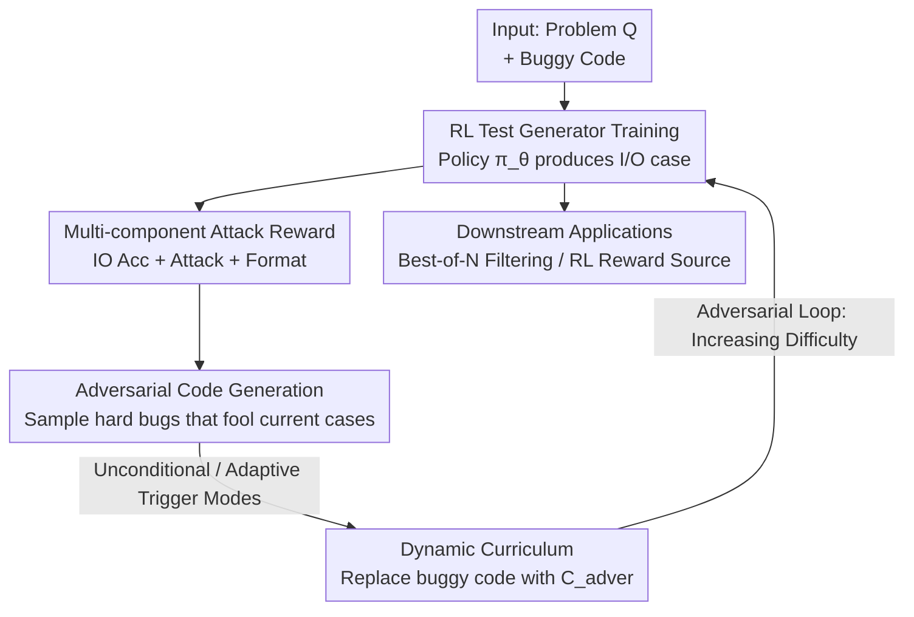

# ATGen: Adversarial Reinforcement Learning for Test Case Generation

**Conference**: ICLR2026  
**OpenReview**: [https://openreview.net/forum?id=Sxj4o3qXtl](https://openreview.net/forum?id=Sxj4o3qXtl)  
**Code**: https://github.com/SIMONLQY/ATGen  
**Area**: Code Intelligence / Test Case Generation  
**Keywords**: Test Case Generation, Adversarial Reinforcement Learning, GRPO, Dynamic Curriculum, Code Reliability

## TL;DR
ATGen places a "test case generator" and an "adversarial code generator" into a competitive reinforcement learning loop. As the generator strengthens, the opponent is forced to produce more subtle bugs. This self-escalating dynamic curriculum breaks the "fixed-difficulty ceiling" of static datasets, doubling the attack success rate of a 7B model compared to the SFT-based UTGen (36.99% vs 16.24%).

## Background & Motivation
**Background**: While LLMs have become proficient at code generation, they frequently produce code with subtle bugs. Detecting these bugs requires high-quality test cases. An effective test case must satisfy two objectives: **Output Accuracy** (the output $y$ paired with input $x$ must be correct, i.e., $y = C_{gold}(x)$) and **Attack Success / Error-triggering** (the case must cause the buggy code to fail, i.e., $C_{buggy}(x) \ne y$). Existing automated test generation methods typically follow two paths: directly prompting general large models (e.g., GPT-4) or performing Supervised Fine-Tuning (SFT) on pre-collected static "code-test" datasets, such as UTGen.

**Limitations of Prior Work**: Both paths are strictly bound to **static data**. During training, the test generator faces a **fixed set** of buggy code where the types and difficulties of bugs are predetermined. Models learn to identify this specific batch of bugs but fail when encountering newer, more complex bugs outside the training distribution. The authors define this as the **"fixed-difficulty ceiling"**: static training inevitably causes the model to plateau at a certain capability level, appearing increasingly inadequate as code generators become more sophisticated.

**Key Challenge**: The objective of Attack Success is inherently **dynamic**—its difficulty is determined by how well the bug is hidden in the opposing buggy code. However, static training uses a pool of fixed-difficulty bugs, analogous to a boxer who only ever trains against opponents of a mid-level skill trying to face a world champion. Furthermore, the authors observed a real trade-off between Output Accuracy and the "attack power of the input": inputs that are more likely to trigger bugs are often edge cases where correctly predicting the output is more difficult for the model.

**Goal**: To equip the test generator with (1) sufficiently strong reasoning capabilities to correctly map "input $\to$ output" and (2) the ability to continuously evolve to detect increasingly subtle bugs, thereby breaking the fixed-difficulty ceiling.

**Key Insight**: The authors observe that since the ceiling stems from the "static bug set," the training environment should **strengthen alongside the model**. By placing the test generator in an adversarial loop, a code generator can be tasked with creating code that "fools the current test generator but is fundamentally incorrect," serving as a continuous, increasingly difficult dynamic curriculum.

**Core Idea**: Use Reinforcement Learning (GRPO) to train the test generator to directly optimize for IO Accuracy and Attack Success. Simultaneously, introduce an adversarial code generator that continuously produces "hard bugs" that bypass the current policy, creating a self-upgrading adversarial curriculum to break the fixed-difficulty ceiling of static training.

## Method

### Overall Architecture
ATGen addresses how to train a test generator without being bottlenecked by fixed difficulty. The framework consists of two interlocking components: the upper half is the **RL-based Test Generator Training**, modeling the generator as a policy $\pi_\theta$. It takes the state $s_t=(Q, C_{buggy})$ (problem description + current buggy code) and produces an action $a_t = T_{gen}=(x,y)$ (an I/O test case), driven by a multi-component reward. The lower half is **Adversarial Code Generation**, acting as a data augmentation engine that samples new, harder buggy code $C_{adver}$ targeting the current policy and feeds $(Q, C_{adver})$ back into the training pool. These two parts form an "adversarial loop": the generator improves $\to$ forcing the opponent to create subtler bugs $\to$ subtler bugs pushing the generator to the next level.

### Key Designs

**1. RL Test Generator + GRPO: Replacing "Mimicry" with "Trial-and-Error Reasoning"**

Static SFT essentially forces models to **mimic** test cases in a dataset, which naturally caps performance and limits generalization across tasks. ATGen switches to Reinforcement Learning, formalizing test generation as a single-step MDP where the state is $(Q, C_{buggy})$, the action is the generated I/O pair $(x,y)$, and the policy $\pi_\theta(a_t|s_t)$ is the test generator itself. Training uses **GRPO** (Shao et al., 2024), an actor-only method that eliminates the need for a separate critic model, saving memory and compute. Consequently, the model no longer "memorizes" test cases but learns to **reason** through the "input $\to$ correct output" mapping via trial and error, explicitly navigating the trade-off between Output Accuracy and Attack Success. In experiments, the non-adversarial version (ATGen w/o Adver) alone improved IO Acc from 26.56% (base Qwen2.5-7B) to 71.56%, proving RL is a far superior paradigm compared to static fine-tuning.

**2. Multi-component Attack Reward: Decomposing "Accuracy and Attack" into Optimizable Signals**

The dual objectives of a good test case are explicitly integrated into the reward function $R_t$, composed of three weighted parts:

$$R_t = w_{acc}\cdot R_{acc} + w_{attack}\cdot R_{attack} + w_{format}\cdot R_{format}$$

Here, $R_{acc}$ (IO Acc Reward) uses the gold code $C_{gold}$ to verify the generated I/O pair. $R_{attack}$ (Attack Reward) is positive if the buggy code $C_{buggy}$ fails or produces an inconsistent output—**crucially, this reward is only granted if the I/O pair is already correct**. This forces the model to learn to "calculate the right answer" before attempting to "attack," preventing it from guessing inputs that it cannot accurately solve. $R_{format}$, following DeepSeek-R1, requires reasoning within `<think>` tags and the answer within `<answer>` tags to activate the model's reasoning potential. Each component ranges from $[-0.5, 1.0]$, and the weights are equal. Reward ablation (Table 2) demonstrates that reward tuning alone cannot break the ceiling; the usable Attack Rate consistently plateaus around 30% regardless of weighting, necessitating adversarial training.

**3. Adversarial Code Generation: Online Creation of "Hard Bugs That Bypass You"**

This is the core mechanism for breaking the fixed-difficulty ceiling. Given a problem $Q$ and a test case $T_{gen}$ generated by the current policy, ATGen uses an **independent code generator** to produce an adversarial code $C_{adver}$ that must satisfy two conditions: (1) it remains incorrect—at least one case in the full human-gold test suite $T_{gold}$ must fail ($\exists (x',y')\in T_{gold},\ C_{adver}(x')\ne y'$); and (2) it passes the current case—$C_{adver}(x)=y$. In other words, the opponent specifically produces bugs that the current model cannot detect. As the generator improves, the opponent hides bugs deeper, naturally forming a **dynamic curriculum** of increasing difficulty.

**4. Unconditional vs. Adaptive Sampling Modes: Trade-offs Between Real Bugs and Compute**

There are two approaches to generating $C_{adver}$. One is to directly command the code generator to "create code that passes a specific test case but is globally wrong." This is cheap, but the bugs are **artificially engineered**, which may introduce distribution shift and lead the model to detect artificial defects rather than natural ones. ATGen instead uses a more robust **sampling-based approach**: the code generator is only given the problem description $Q$ and asked to sample multiple candidate solutions. These are then **filtered** to find those that happen to satisfy the adversarial conditions, ensuring the bugs are natural. Since sampling for every instance is expensive, two modes are provided: **Unconditional Mode** resamples $C_{adver}$ for **every** instance in the training batch to replace the original $C_{buggy}$; **Adaptive Mode** only triggers sampling when the current generator can already successfully attack the original $C_{buggy}$. If the original bug is still challenging enough to fool the model, it is reused, saving compute for cases that truly require more difficulty. Experiments show that the optimal mode depends on model scale: 7B performs best with Adaptive (focused curriculum), while 3B benefits more from Unconditional (continuous, diverse challenges).

### Loss & Training
The RL algorithm uses GRPO (actor-only, no critic). The backbones are Qwen2.5-3B-Instruct and Qwen2.5-7B-Instruct, implemented using the veRL framework. The adversarial code generator uses GPT-4o-mini. The three reward weights $w_{acc}, w_{attack}, w_{format}$ are set equal. Key GRPO hyperparameters include sampling numbers per optimization step (128 / 64) and group generations (6 / 8). Smaller sampling numbers per step correspond to a more "online" learning setup.

## Key Experimental Results

### Main Results
The training and evaluation data comprise a subset of 3,000 problems from APPS and Codeforces. Buggy code was sampled via GPT-4o-mini, yielding 16,822 training pairs and 911 test pairs (problem, buggy code). The test set was divided into Easy, Medium, and Hard tiers based on the initial attack success rate of Qwen2.5-7B. Metrics include IO Accuracy and Attack Rate (proportion of cases that are both correct and successfully trigger the bug).

| Method | IO Acc(%) | Attack Rate(%) | Hard Attack(%) |
|--------|------|------|------|
| GPT-4-turbo (Strong Prompt Baseline) | 41.16 | 23.38 | 20.06 |
| Qwen2.5-32B-Instruct | 35.01 | 21.62 | 16.77 |
| UTGen (7B) (SFT SOTA) | 31.83 | 16.24 | 8.55 |
| **ATGen w/o Adver (7B)** | 71.56 | 34.02 | 18.42 |
| **ATGen Unconditional (7B)** | 74.97 | 34.57 | 19.73 |
| **ATGen Adaptive (7B)** | **74.42** | **36.99** | 21.05 |

The best model, ATGen-Adaptive (7B), achieved an Attack Rate relative improvement of nearly 60% over the strongest proprietary baseline, GPT-4-turbo, and more than double that of UTGen (7B) (36.99% vs 16.24%). IO Acc also jumped from the 30% range to over 74%. The advantage is maintained across the Hard tier.

### Ablation Study
Table 2 uses the non-adversarial version to investigate whether reward weightings alone can resolve the accuracy-attack trade-off:

| Reward Configuration | IO Acc(%) | Attack Rate(%) | Input Attack Rate(%) |
|------|------|------|------|
| IO Acc + Input Attack | 44.67 | 30.07 | 62.56 |
| Attack Rate Only | 67.72 | 29.74 | 47.53 |
| Three Combined (Full) | 65.64 | 30.29 | 47.09 |

Table 3 compares adversarial vs. non-adversarial performance under different GRPO hyperparameters (excerpt):

| Hyperparams (samples, group) | Metric | w/o Adver | ATGen | ∆ |
|------|------|------|------|------|
| (128, 6) | IO Accuracy | 71.56 | 74.09 | +2.53 |
| (64, 6) | IO Accuracy | 73.76 | 74.96 | +1.20 |
| (64, 8) | IO Accuracy | 69.59 | 75.30 | **+5.71** |

### Key Findings
- **Reward engineering treats symptoms, not the cause**: Table 2 shows that regardless of the reward configuration, the usable Attack Rate plateaus at ~30%. Prioritizing Input Attack Rate can push it to 62.56%, but IO Acc collapses to 44.67%. This confirms the existence of the trade-off and suggests only adversarial training can elevate the overall frontier.
- **Adversarial training is win-win**: In the (64, 8) configuration (Table 3), the non-adversarial version is forced to sacrifice IO Acc, whereas the full ATGen achieves an absolute boost of +5.71% in IO Accuracy while maintaining a competitive Input Attack Rate. The dynamic curriculum prevents overfitting to a single metric.
- **Downstream Best-of-N Filtering**: Applying Best-of-N on APPS, ATGen-Adaptive pushed the pass@1 of selected code to 35.00% at $k_{test}=10$, outperforming UTGen’s 30.67% by 4.3 points and approaching the human expert upper bound of 38.33%. The performance curve reaches a plateau after $k_{test}>10$, indicating the RL objective trains the model to find single high-impact cases rather than needing a high volume of tests.
- **Downstream RL Reward Source**: The test suites generated by ATGen serve as superior reward signals for training code-generating models compared to UTGen and prompt-based baselines, providing a valid proxy for problems where ground-truth test suites are unavailable.

## Highlights & Insights
- **Adversarial curriculum transforms static bottlenecks into dynamic engines**: The ingenious design is to let the training environment evolve. The opponent specifically creates bugs that bypass the current model, ensuring the difficulty remains at the edge of the model's capability. This self-improving ecosystem can be transferred to any "discriminator vs generator" scenario (e.g., jailbreak detection, fact-checkers).
- **The "Accuracy-before-Attack" constraint is vital**: The requirement that $R_{attack}$ is contingent on IO pair correctness prevents "guesswork attacks." This design choice is a reusable trick for balancing trade-offs in reward engineering.
- **Insight from the Input Attack Rate diagnostic**: Decoupling the "intrinsic bug-finding capability of the input" from the "final usable attack rate" clearly reveals why corner-case inputs are difficult for predicting correct outputs.
- **Coupling of mode selection and model scale**: Larger models benefit from focused (Adaptive) curricula, while smaller models thrive on continuous variety (Unconditional). This observation is valuable for designing difficulty schedulers in curriculum learning.

## Limitations & Future Work
- The adversarial code generator uses GPT-4o-mini, an external closed-source model. The quality and distribution of generated bugs are constrained by its capabilities. The impact of using weaker or stronger generators has not been fully isolated.
- The evaluation focuses on competitive programming problems (APPS / Codeforces). Bugs are primarily logical or boundary-related. Generalization to real-world engineering code (multi-file, external dependencies, concurrency) remains unverified.
- Even with the Adaptive mode, sampling-based adversarial data generation is significantly more expensive than static SFT. The full compute-benefit curve is not provided.
- Best-of-N experiments show performance plateaus after $k_{test}>10$, indicating a preference for single high-impact cases over diverse bug-covering test suites. If downstream applications require full coverage, this preference might become a limitation.

## Related Work & Insights
- **vs UTGen (SFT SOTA)**: UTGen uses SFT on static code-test datasets to balance attack and accuracy but is limited by the fixed difficulty of those datasets. ATGen adopts RL trial-and-error and an adversarial curriculum, evolving from "mimicking fixed bugs" to "chasing evolving bugs," doubling the attack rate.
- **vs Prompt Baselines (GPT-4-turbo, etc.)**: Prompting relies on the general reasoning of LLMs without task-specific optimization. ATGen uses RL to specialize the policy to be both accurate and aggressive.
- **vs Code-related RL (CodeRL / Repair-R1 / DeepSeek-R1)**: These works apply RL to "writing correct code" or "repairing code," learning policies against a fixed verifier. ATGen reverses this, learning strategies to **explore the input space to falsify a program**, aiming to produce reward signals for other downstream agents.

## Rating
- Novelty: ⭐⭐⭐⭐⭐ Introducing an adversarial dynamic curriculum to test generation RL to solve the "fixed-difficulty ceiling" is highly impactful.
- Experimental Thoroughness: ⭐⭐⭐⭐ The main results, reward/hyperparameter ablations, and two downstream applications are comprehensive, though real-world engineering verification is missing.
- Writing Quality: ⭐⭐⭐⭐⭐ Logic is clear, and the trade-off analysis (Input Attack Rate) is very persuasive.
- Value: ⭐⭐⭐⭐⭐ Test generation is a key bottleneck for LLM code reliability. This provides a new, deployable paradigm with available code.

<!-- RELATED:START -->

## Related Papers

- [\[ICLR 2026\] Critique-Coder: Enhancing Coder Models by Critique Reinforcement Learning](critique-coder_enhancing_coder_models_by_critique_reinforcement_learning.md)
- [\[ICLR 2026\] Agnostics: Learning to Synthesize Code in Any Programming Language with a Universal Reinforcement Learning Environment](agnostics_learning_to_synthesize_code_in_any_programming_language_with_a_univers.md)
- [\[ACL 2026\] MARS2: Scaling Multi-Agent Tree Search via Reinforcement Learning for Code Generation](../../ACL2026/code_intelligence/mars2_scaling_multi-agent_tree_search_via_reinforcement_learning_for_code_genera.md)
- [\[ACL 2026\] ChipSeek: Optimizing Verilog Generation via EDA-Integrated Reinforcement Learning](../../ACL2026/code_intelligence/chipseek_optimizing_verilog_generation_via_eda-integrated_reinforcement_learning.md)
- [\[AAAI 2026\] ReCode: Updating Code API Knowledge with Reinforcement Learning](../../AAAI2026/code_intelligence/recode_updating_code_api_knowledge_with_reinforcement_learning.md)

<!-- RELATED:END -->
