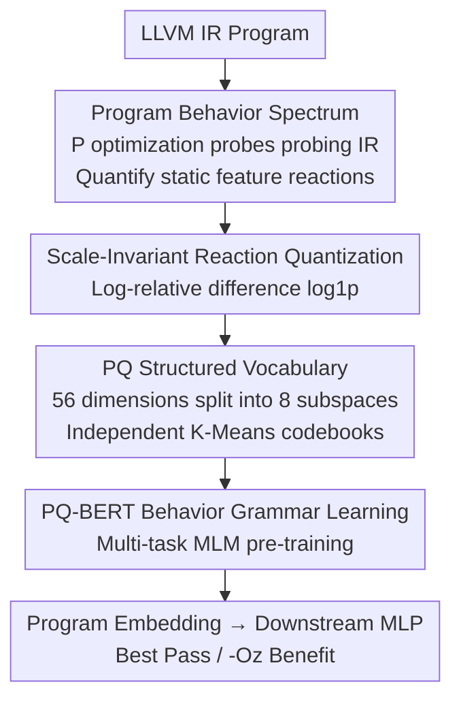

# Behavioral Embeddings of Programs: A Quasi-Dynamic Approach for Optimization Prediction

**Conference**: ICLR2026  
**OpenReview**: [https://openreview.net/forum?id=QDmoLEJifR](https://openreview.net/forum?id=QDmoLEJifR)  
**Code**: https://github.com/Panhaolin2001/PREP/  
**Area**: Code Intelligence / Program Representation Learning / Compiler Optimization  
**Keywords**: Program Embeddings, Compiler Optimization, Quasi-Dynamic Representation, Product Quantization, Pre-trained Transformer

## TL;DR
To address the dilemma of "static representations being too rigid and dynamic profiling being too expensive" in compiler optimization, this paper proposes a **quasi-dynamic** program representation. By "probing" LLVM IR with a set of optimization sequences, the changes in static features before and after optimization are quantified as a **Program Behavior Spectrum**. Product Quantization (PQ) is then used to discretize continuous reaction vectors into structured "sub-words," and a multi-task Transformer (PQ-BERT) is pre-trained to learn their syntax. This approach significantly outperforms static embeddings like inst2vec and IR2Vec in Best Pass Prediction and -Oz Benefit Prediction tasks.

## Background & Motivation

**Background**: Applying machine learning to compiler optimization requires learning an effective numerical embedding for programs, providing a semantic interface for downstream tasks such as "selecting optimization passes" or "estimating optimization benefits." Current mainstream embeddings are divided into two categories: static methods extract features from source code, IR, AST, or control flow graphs (e.g., manual Autophase, learned IR2Vec, inst2vec, ProGraML), while dynamic methods collect runtime features like hardware performance counters during execution.

**Limitations of Prior Work**: Static representations are inexpensive and deterministic but "shortsighted"—they only describe **what a program looks like** (structure) but rarely indicate **how it reacts** to complex code transformations. Dynamic representations observe real performance bottlenecks but suffer from high profiling overhead and non-determinism, making them impractical for large-scale tasks.

**Key Challenge**: Compiler optimization is primarily concerned with "how sensitive a program is to various transformations," information that static representations lack and dynamic representations provide at a high cost. This gap between efficiency and insight limits the upper bound of learned compilers.

**Goal**: Construct a representation that reflects "optimization sensitivity" without paying the price of dynamic profiling, and encode this high-dimensional continuous "sensitivity spectrum" into a format digestible by Transformers.

**Key Insight**: Instead of running the program, the authors "lightly poke" it by applying pre-designed optimization sequences to the IR and measuring the magnitude of change in **static features**. The reaction magnitude itself represents the program's sensitivity to specific transformations, serving as a "quasi-dynamic" signal between purely static and purely dynamic.

**Core Idea**: Replace "static structure" with the "reaction spectrum of a program to a set of optimization probes," then use Product Quantization and a multi-task Transformer to learn the "syntax" of these reactions.

## Method

### Overall Architecture
The framework aims to output a program embedding reflecting optimization sensitivity from LLVM IR. It decomposes this into three sequential stages: **Extracting the Behavior Spectrum** (probing IR and quantifying reactions), **Constructing a Structured Vocabulary** (discretizing continuous reaction vectors into PQ sub-words), and **Learning Behavior Grammar** (pre-training with PQ-BERT to capture contextual dependencies among $P$ reactions). The pre-trained Transformer encoder serves as the final embedding generator for downstream MLP tasks.

### Key Designs

**1. Program Behavior Spectrum: Measuring reactions as high-dimensional spectra**

This step addresses the "shortsightedness" of static representations. Instead of describing structure, authors measure reactions to optimization. A set of **probes** is constructed—each probe is a fixed-length optimization sequence. Probes are selected by representing each program in the pre-training corpus as a 56D Autophase feature vector $h_{orig}$ and clustering them into $P$ clusters. For each cluster, a heuristic search (genetic algorithm/greedy) identifies a sequence that **maximizes the average instruction reduction** for that cluster. This yields $P$ probes that are both "strong" (empirically optimal) and "diverse." For any program $p$, the baseline vector $h_{orig}\in\mathbb{R}^{56}$ is compared against features $h_{opt,i}$ obtained after applying each probe $i$, forming a rich behavior spectrum.

**2. Scale-Invariant Reaction Quantization: Comparing large and small programs**

Using absolute feature differences is problematic—a reduction of 100 instructions is transformative for a small kernel but negligible for a million-line application. Thus, reactions are quantified using **log-relative differences** for scale invariance. For the $j$-th feature and $i$-th probe, the reaction value is:

$$d_{i,j} = \log\bigl(1 + \max(0, h_{opt,i,j})\bigr) - \log\bigl(1 + \max(0, h_{orig,i,j})\bigr)$$

Where $\log(1+x)$ (log1p) handles zero values and compresses large absolute changes, focusing on "multiplicative changes at the order-of-magnitude level." The complete spectrum for program $p$ is a matrix $S_p\in\mathbb{R}^{P\times 56}$.

**3. PQ Structured Vocabulary: Decomposing reactions into reusable sub-words**

Transformers require discrete tokens. Simple clustering would force vectors into a single ID, losing fine-grained internal structures. The authors use **Product Quantization (PQ)**: each $D=56$ dimensional reaction vector is split into $M=8$ non-overlapping sub-vectors ($D_{sub}=7$). An independent K-Means quantizer $q_i$ is trained for each subspace with a codebook $C_i$ containing $k^*=256$ centroids. Each vector is quantized independently:

$$c_i = q_i(d_i) = \arg\min_j \lVert d_i - c_{i,j}\rVert^2$$

The final representation is a **composite code**—a tuple of $M=8$ integer IDs $c=(c_1,\dots,c_8)$. This represents a "virtual vocabulary" of $256^8$ while only learning $8\times 256$ centroids.

**4. PQ-BERT Behavior Grammar Learning: Capturing contextual dependencies**

PQ converts each program into a $P\times M$ matrix of discrete codes. To model dependencies between the $P$ reactions (e.g., sensitivity to unrolling often correlates with vectorization), **PQ-BERT** is designed. Predicting $M$ sub-word IDs is treated as **multi-task learning**. Architecturally, each code $c_t$ is mapped via $M$ independent embedding layers $E_i$ and concatenated into a $D_{model}=256$ vector $x_t$. After passing through a standard Transformer encoder, $M$ independent linear heads predict sub-words. Pre-training uses a **multi-task Masked Language Model (MLM)**:

$$\mathcal{L}(C) = \sum_{i=1}^{M} \frac{1}{|I_{mask,i}|} \sum_{(t,i)\in I_{mask,i}} -\log P(c_{t,i}\mid C_{masked})$$

This forces the model to learn cross-correlations between subspaces.

### Loss & Training
The pre-training objective is the multi-task MLM loss. The corpus consists of over 220k LLVM IR files (diverse competitive programming solutions), trained for 30 epochs with Adam ($10^{-4}$, batch size 32). Downstream tasks use the pre-trained encoder followed by a two-layer MLP for classification (Best Pass) or regression (-Oz benefit), trained on A100 GPUs for 100 epochs.

## Key Experimental Results

### Main Results
Two tasks from CompilerGym: **Best Pass Prediction** (124-way classification) and **-Oz Benefit Prediction** (regression of instruction reduction ratio). The test set is strictly out-of-domain (cbench/mibench).

| Task | Metric | Ours (Behavioral-PQ) | Prev. SOTA (inst2vec) | Other Static Embeddings |
|--------|------|------|----------|------|
| Best Pass (test) | Top-1 Acc. | **64.48%** | 39.27% | — |
| Best Pass (test) | Top-5 Acc. | **89.55%** | — | — |
| -Oz Benefit (test) | MAE↓ | **8.19%** | 16.23% | IR2Vec 25.40% / Autophase 25.92% |

Top-1 accuracy is over 25 percentage points higher than inst2vec. The gap is even larger in regression, suggesting static representations struggle to predict cumulative gains of long sequences, whereas behavior spectra provide more effective signals.

### Ablation Study
Comparing three variants: KMeans (no PQ), No-Relative (absolute differences), and No-Transformer (simple pooling).

| Configuration | Best Pass Top-5 (test) | -Oz MAE (test)↓ | Description |
|------|---------|------|------|
| Ours (Full) | 89.55% | **8.19%** | Full model |
| Ours (KMeans) | 93.43% | 8.24% | Hard clustering instead of PQ |
| Ours (No-Relative) | **94.33%** | 10.96% | Absolute differences |
| Ours (No-Transformer) | 87.46% | 10.08% | No Transformer |

### Key Findings
- **Scale invariance is critical for generalization** in complex regression tasks. The MAE drops significantly with relative quantification.
- **Transformer context is essential** for modeling long-range optimization effects.
- **Geometric Analysis**: Using a k-NN classifier ($k=5$), the proposed embedding achieves **79.70%** Top-1 accuracy, higher than InstCount (75.82%) and IR2Vec (74.33%). t-SNE shows distinct clusters for programs sharing the same optimal pass.

## Highlights & Insights
- **Smart "Quasi-Dynamic" Positioning**: By using "static feature changes under optimization," the model approximates "program reaction" at the cost of static analysis, effectively bypassing the static/dynamic trade-off.
- **Data-Driven Probing**: Probes are optimized per cluster to maximize instruction reduction, ensuring reactions are strong signals rather than noise.
- **Effective use of PQ**: Decomposing 56 dimensions into 8 subspaces allows fine-grained signal retention while meeting Transformer discretization requirements.
- **Multi-task MLM**: Synchronously predicting $M$ sub-words maintains subspace synchrony and forces the model to learn internal correlations.

## Limitations & Future Work
- **Limitations**: ① Probe diversity might be insufficient for some program classes; ② Preprocessing requires $P+1$ Autophase extractions (~0.2s/program); ③ Evaluations are limited to compiler tasks; ④ Interpretability of the behavior vocabulary is limited.
- **Future Work**: Adaptive probe selection, reduction of Autophase overhead, incorporating limited dynamic information, and expanding to more downstream tasks.

## Related Work & Insights
- **vs. Manual Features (Autophase/InstCount)**: These count instructions but lack expression and generalization. Ours uses these as "readings" for probes rather than ends.
- **vs. Static Embeddings (inst2vec/IR2Vec)**: These describe "what a program is." Ours describes "how it reacts," leading to a significant Gain in long-range regression.
- **vs. Graph Embeddings (ProGraML)**: Ours outperforms ProGraML (70.75%) in k-NN semantic alignment.
- **vs. Dynamic Methods**: Ours provides a "quasi-dynamic" compromise, offering insight without execution cost.

## Rating
- Novelty: ⭐⭐⭐⭐⭐ 
- Experimental Thoroughness: ⭐⭐⭐⭐ 
- Writing Quality: ⭐⭐⭐⭐ 
- Value: ⭐⭐⭐⭐ 

<!-- RELATED:START -->

## Related Papers

- [\[ICLR 2026\] Sharing State Between Prompts and Programs](sharing_state_between_prompts_and_programs.md)
- [\[ICLR 2026\] Code2Bench: Scaling Source and Rigor for Dynamic Benchmark Construction](code2bench_scaling_source_and_rigor_for_dynamic_benchmark_construction.md)
- [\[ICLR 2026\] LLM-Guided Evolutionary Program Synthesis for Quasi-Monte Carlo Design](llm-guided_evolutionary_program_synthesis_for_quasi-monte_carlo_design.md)
- [\[AAAI 2026\] MoSE: Hierarchical Self-Distillation Enhances Early Layer Embeddings](../../AAAI2026/code_intelligence/mose_hierarchical_self-distillation_enhances_early_layer_embeddings.md)
- [\[ICLR 2026\] BOAD: Discovering Hierarchical Software Engineering Agents via Bandit Optimization](boad_discovering_hierarchical_software_engineering_agents_via_bandit_optimizatio.md)

<!-- RELATED:END -->
