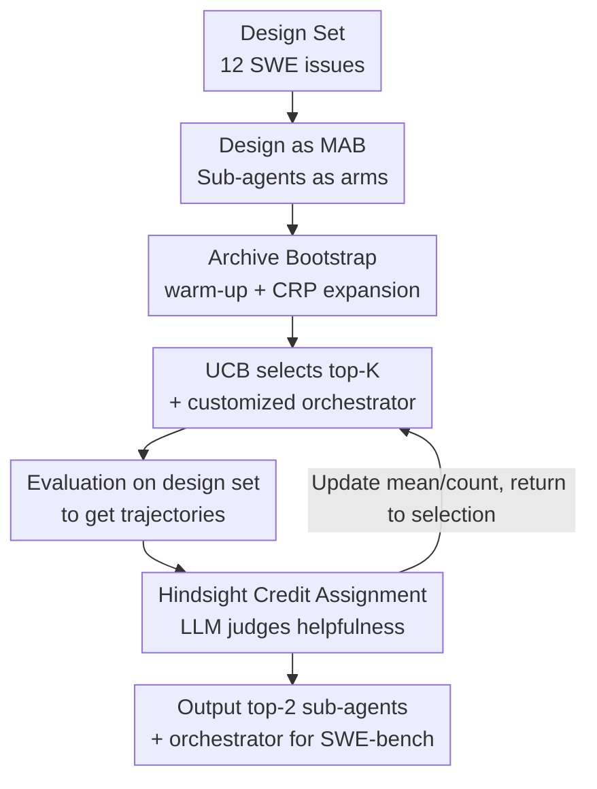

# BOAD: Discovering Hierarchical Software Engineering Agents via Bandit Optimization

**Conference**: ICLR2026  
**OpenReview**: [https://openreview.net/forum?id=O6stE173BD](https://openreview.net/forum?id=O6stE173BD)  
**Code**: https://github.com/iamxjy/BOAD-SWE-Agent  
**Area**: LLM Agent / Software Engineering  
**Keywords**: Software Engineering Agent, Multi-Armed Bandit, Hierarchical Multi-Agent, Credit Assignment, SWE-bench

## TL;DR
BOAD reformulates the design of a hierarchical multi-agent system for software engineering as a multi-armed bandit (MAB) problem. Each candidate sub-agent is treated as an arm, and the reward is its "helpfulness" within team collaboration. It employs UCB for exploration-exploitation, uses the Chinese Restaurant Process (CRP) to dynamically expand the agent archive, and applies hindsight credit assignment to avoid the "free-rider" problem. This approach automatically discovers a structure consisting of "one orchestrator + two specialized sub-agents" under a limited evaluation budget. On SWE-bench-Verified, a 36B model achieved 53.2%; on the more out-of-distribution SWE-bench-Live, it reached 20.0%, ranking second on the leaderboard and outperforming larger models like GPT-4o and Claude 3.7.

## Background & Motivation
**Background**: While LLMs have significantly improved in natural language reasoning and code generation, solving real-world software engineering (SWE) problems—which are long-horizon, require navigation in large repositories, and necessitate robustness against OOD (out-of-distribution) issues—remains challenging. Current mainstream SWE agents are mostly monolithic, where a single agent handles all sub-tasks (understanding issues, locating files, editing code, running tests) within a single reasoning chain.

**Limitations of Prior Work**: This monolithic design forces the model to maintain irrelevant context throughout the chain. For instance, when editing code, the model only needs to know which line to change, yet it carries the history of how that file was initially located. Such redundant context introduces spurious correlations, causing models to overfit the training distribution and suffer performance drops on newer, more OOD issues like SWE-bench-Live.

**Key Challenge**: A natural solution is to mimic human engineers by delegating tasks to an orchestrator coordinating several specialized sub-agents (localization, editing, verification). However, two main difficulties arise: first, manually designed hierarchies often do not align with actual LLM behavior (adding manual sub-agents sometimes performs worse than the baseline); second, automatically discovering effective hierarchies faces combinatorial explosion (the number of subsets grows exponentially with sub-agents) and ambiguous credit assignment (team success does not imply every sub-agent was helpful, as weak ones may "free-ride").

**Goal**: To automatically discover effective orchestrator–sub-agent structures under the constraint that SWE evaluation is expensive, without relying on manually specified roles.

**Key Insight**: Adopt a bottom-up strategy—first identify promising sub-agents individually and then team them up, reducing the search space from exponential to linear. For credit assignment, instead of looking at final team success, use LLM-as-a-judge to evaluate the intermediate contribution of each sub-agent within the trajectory.

**Core Idea**: Treat multi-agent design directly as a multi-armed bandit problem, where each arm is a candidate sub-agent and the reward is its helpfulness. This framework, named **B**andit **O**ptimization for **A**gent **D**esign (BOAD), uses mature exploration-exploitation algorithms to efficiently discover strong sub-agents under a limited budget.

## Method

### Overall Architecture
BOAD aims to solve for a set of $K$ sub-agents $\Omega=\{\omega_1,\dots,\omega_K\}$ and an orchestrator $\pi$ that maximize the expected task reward: $\max_{\pi,\Omega}\,\mathbb{E}_{x\sim D_{\text{design}},\,\tau\sim\pi}[r(s_T,a_T)]$. Direct evolutionary or random search on $(\pi, \Omega)$ is infeasible because evaluating each candidate requires running full long-horizon trajectories, which is too costly.

The BOAD approach maintains an **archive** $\Gamma$ of candidate sub-agents and treats individual sub-agents, rather than subsets, as arms. The process is an online loop of $B$ rounds: first, bootstrap an initial archive and "warm-up" each sub-agent (to ensure it can be called by the orchestrator). In each round, a new sub-agent is added to the archive with a certain probability via the Chinese Restaurant Process. Then, the top-$K$ sub-agents are selected based on UCB scores, a customized orchestrator is instantiated, and evaluations are run on the design set to obtain trajectories. Using hindsight credit assignment, a helpfulness score is assigned to each participating sub-agent to update their means and counts. After the loop, the two sub-agents with the highest helpfulness scores and a customized orchestrator are deployed to SWE-bench.

### Key Designs

**1. Transforming Multi-Agent Design into MAB: Sub-agents as Arms**
The fatal flaw of joint searching for $(\pi, \Omega)$ is combinatorial explosion—the number of subsets $\Omega$ grows exponentially with the number of sub-agents. BOAD breaks this by **treating each individual sub-agent $\omega$ in the archive $\Gamma$ as a single arm**. Each round $t$, $K$ arms are selected to form $\Omega_t$, an orchestrator $\pi_t$ is instantiated, and $(\pi_t, \Omega_t)$ is evaluated. Feedback is then returned **independently** to each participating sub-agent to update its estimate $u_\omega$. Since the same sub-agent appears in many different subsets, a single evaluation provides signals for multiple configurations simultaneously. This reduces the search space to **linear** growth and allows information sharing across subsets, significantly reducing waste on poor designs.

**2. Archive Generation, Warm-up, and CRP Expansion**
To ensure the archive contains usable and updated candidates, the initial archive $\Gamma_0$ is generated by an LLM via template prompts. However, generated agents might not be immediately callable. The orchestrator treats sub-agents as **tools** (following the SWE-agent tool-calling protocol) and relies on docstrings to understand functions and required inputs. BOAD includes a **warm-up** phase ($W=4$ rounds) using random instances from the design set to iteratively rewrite docstrings into precise specifications. To avoid stagnation where UCB exclusively utilizes strong agents, BOAD uses the **Chinese Restaurant Process (CRP)** for dynamic expansion: in each round, a new sub-agent is generated with probability $\Pr(\text{new at }t)=\frac{\theta}{\theta+|\Gamma_{t-1}|}$.

**3. UCB for Exploration-Exploitation and Customized Orchestrator**
Candidate selection uses the classic **UCB** strategy. For each $\omega$, the empirical mean $\hat\mu_\omega(t)$ and selection count $n_\omega(t)$ are tracked:

$$\text{UCB}_\omega(t)=\hat\mu_\omega(t)+\sqrt{\frac{2\ln t}{n_\omega(t)}}.$$

The first term favors known high-performers, while the second provides an "optimistic bonus" for under-sampled agents. For $n_\omega=0$, UCB is set to $+\infty$.
Furthermore, the orchestrator is adapted to its team. BOAD uses a customized prompt generated by Claude-4 that **explicitly names the top-2 sub-agents and provides a coordination plan**. Ablation shows this customization improves Live results from 16.7% to 20.0%.

**4. Hindsight Credit Assignment: Learning from Helpfulness, Not Just Success**
Using "trajectory success rate" as a score $u_\omega$ leads to the **free-rider** problem: a contributor-less agent appearing alongside strong agents appears useful.
BOAD uses **hindsight credit assignment**: credit is given if a sub-agent's actions helped the orchestrator move towards a solution, regardless of final success. Specifically, for each $\omega$ in trajectory $\tau$, an LLM judge provides a binary label $\ell_\omega(\tau)\in\{0,1\}$ (helpfulness). The performance score is:

$$u_\omega=\frac{1}{|T^t_\omega|}\sum_{\tau\in T^t_\omega}\ell_\omega(\tau).$$

This signal is more informative than binary success and effectively eliminates free-riders.

### Loss & Training
BOAD does not train model weights; the entire process is an outer-loop online design search (Algorithm 1): $B=20$ rounds, $K=3$ sub-agents per round, 12 design set issues, $W=4$ warm-up rounds. Execution uses Seed-OSS-36B-Instruct (temperature 0), while candidate generation and judging use Claude-4. The optimization takes approx. 12 hours, though the top-2 sub-agents often converge within 10 rounds (approx. 7 hours).

## Key Experimental Results

### Main Results
Using Seed-OSS-36B-Instruct + SWE-agent scaffold across Verified (500 tasks) and Live (300 tasks):

| Dataset | Scaffold (Seed-OSS-36B) | Resolved % |
|---------|-------------------------|------------|
| Verified | SWE-agent (baseline)    | 49.8       |
| Verified | + Manual Sub-agents     | 47.4       |
| Verified | + Evolutionary Search   | 46.0       |
| Verified | **+ BOAD**              | **53.2**   |
| Live     | SWE-agent (baseline)    | 12.3       |
| Live     | + Manual Sub-agents     | 14.0       |
| Live     | + Evolutionary Search   | 17.0       |
| Live     | **+ BOAD**              | **20.0**   |

On Live, BOAD reached 20.0%, a ~63% relative improvement over the baseline, outperforming GPT-4o (10.0%) and Claude 3.7 Sonnet (13.7%). Token costs were also reduced (Table 2):

| Metric | Setting | Verified | Live |
|--------|---------|----------|------|
| Total Tokens (M) | SWE-agent | 0.92 | 1.49 |
| Total Tokens (M) | + BOAD | 0.93 (+0.7%) | 1.13 (-23.8%) |
| Max Input Tokens | SWE-agent | 34.6k | 49.0k |
| Max Input Tokens | + BOAD | 30.5k (-11.6%) | 36.7k (-25.0%) |

Task decomposition significantly shortened input context, reducing total tokens on Live by nearly a quarter.

### Ablation Study
(Results on SWE-bench Live with Seed-OSS-36B):

| Question | Configuration | Live % |
|----------|---------------|--------|
| Prompt optimization only? | w/o sub-agent / w sub-agent | 16.3 / 20.0 |
| More sub-agents better? | top-1 / 2 / 3 / 4 / 5 | 16.3 / **20.0** / 16.3 / 16.7 / 13.7 |
| Need customized orchestrator? | No / Yes | 16.7 / 20.0 |
| Need credit assignment? | Success rate / Helpfulness | 15.3 / 20.0 |
| Cross-model migration? | Claude 3.7 / +top-2 sub-agents | 13.7 / 16.3 |

### Key Findings
- **Team size is not "the more the better"**: Exactly 2 sub-agents performed best. Larger teams (3–5) suffered from communication and coordination overhead.
- **Hindsight credit is critical**: Success-rate-based sorting dropped performance (15.3% vs 20.0% for top-2), proving that addressing the free-rider problem is vital.
- **Auto-discovery > Manual/Evolution**: Evolutionary search reached only 17.0% and cost twice as much in API fees.

## Highlights & Insights
- Reformulating "agent architecture search" as MAB with "archive-as-arms" is highly effective, reducing search complexity from exponential to linear.
- Using "intermediate contribution" (helpfulness) via hindsight LLM-judging is a reusable trick for sparse team rewards.
- The "two sub-agents optimal" finding warns against blindly scaling multi-agent systems without considering coordination costs.

## Limitations & Future Work
- **Partial Transfer**: Sub-agents optimized for one model show reduced gains when migrated to others (e.g., Claude 3.7).
- **Error Propagation**: Orchestrators sometimes accept sub-agent outputs as ground truth without verification.
- **Domain Specificity**: Evaluated only on SWE; the design set (12 issues) is small.
- **Future Work**: Implementing evolution on larger models, adaptive team sizes, and more robust verification mechanisms.

## Related Work & Insights
- **Vs. Manual Hierarchies**: Prior works use fixed roles; BOAD proves that manual roles often mismatch LLM behavior and that auto-discovery is superior.
- **Vs. Scaffold Optimization**: Instead of just optimizing single-agent prompts, BOAD addresses the dynamic coordination of multiple agents.
- **Vs. Workflow Optimization (ADAS)**: While workflows often use fixed pipelines, BOAD enables online, fine-grained coordination for long-horizon tasks.

## Rating
- Novelty: ⭐⭐⭐⭐⭐ 
- Experimental Thoroughness: ⭐⭐⭐⭐ 
- Writing Quality: ⭐⭐⭐⭐ 
- Value: ⭐⭐⭐⭐⭐ 

<!-- RELATED:START -->

## Related Papers

- [\[ICLR 2026\] Ambig-SWE: Interactive Agents to Overcome Underspecificity in Software Engineering](ambig-swe_interactive_agents_to_overcome_underspecificity_in_software_engineerin.md)
- [\[ICLR 2026\] SWE-RM: Execution-Free Feedback for Software Engineering Agents](swe-rm_execution-free_feedback_for_software_engineering_agents.md)
- [\[ICLR 2026\] Process-Level Trajectory Evaluation for Environment Configuration in Software Engineering Agents](process-level_trajectory_evaluation_for_environment_configuration_in_software_en.md)
- [\[ICML 2025\] Training Software Engineering Agents and Verifiers with SWE-Gym](../../ICML2025/code_intelligence/training_software_engineering_agents_and_verifiers_with_swe-gym.md)
- [\[ACL 2026\] EET: Experience-Driven Early Termination for Cost-Efficient Software Engineering Agents](../../ACL2026/code_intelligence/eet_experience-driven_early_termination_for_cost-efficient_software_engineering_.md)

<!-- RELATED:END -->
