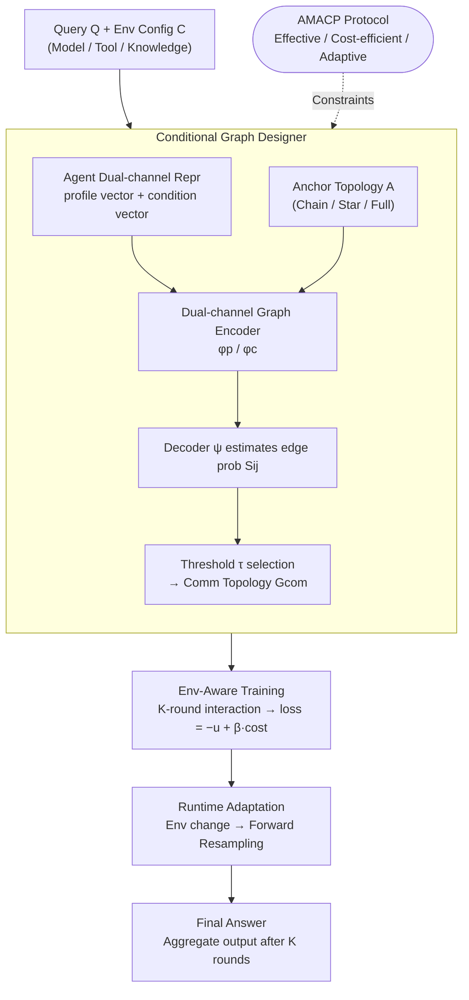

# CARD: Towards Conditional Design of Multi-agent Topological Structures

**Conference**: ICLR 2026  
**arXiv**: [2603.01089](https://arxiv.org/abs/2603.01089)  
**Code**: [https://github.com/Warma10032/CARD](https://github.com/Warma10032/CARD)  
**Area**: Code Intelligence  
**Keywords**: Multi-agent communication topology, conditional graph generation, graph neural networks, dynamic environmental signals, agent collaboration

## TL;DR
CARD proposes a conditional graph generation framework (Conditional Agentic Graph Designer) that utilizes a conditional variational graph encoder and environment-aware optimization to adaptively design multi-agent communication topologies based on dynamic environmental signals—such as model capabilities, tool availability, and knowledge source changes—consistently outperforming static and prompt-based baselines on HumanEval, MATH, and MMLU.

## Background & Motivation
LLM-based multi-agent systems exhibit strong capabilities in tasks like code generation and collaborative reasoning, but their effectiveness and robustness largely depend on the communication topology between agents. Current methods suffer from two critical flaws: (1) Communication topologies are typically **fixed** (e.g., chain, hierarchy) or **statically learned**, ignoring dynamic real-world factors such as model upgrades, API changes, varying tool capabilities, and knowledge source updates; (2) There is a lack of a systematic protocol to describe and adapt to these environmental changes. The **Key Challenge** is that static topologies cannot adapt to dynamic changes in deployment environments, while manual redesign is non-scalable. The **Key Insight** of this paper is to treat multi-agent topology design as a **conditional graph generation problem**, allowing environmental signals to drive the adaptive construction of the topology.

## Method

### Overall Architecture
CARD views a multi-agent system as a directed communication graph $G=(V,E)$, where nodes are agents (each bound to a role, base model, available tools, and knowledge sources) and directed edges represent "who passes messages to whom." The difficulty lies in the fact that these graphs were previously either manually hard-coded or learned in static environments; once base models are upgraded, tools fail, or knowledge sources change, the original topology becomes suboptimal, and manual redesign is non-scalable.

CARD's **Core Idea** is to let an "environment-conditioned" graph designer generate the graph on the fly. It follows four steps: First, the **AMACP protocol** explicitly formalizes deployment environments (model capability, tool availability, knowledge source status) as conditions, specifying that a valid topology must be effective, cost-efficient, and adaptive. Second, the static profile and dynamic condition of each agent are encoded into dual-channel vectors fed into a **Conditional Graph Designer**—where a dual-channel graph encoder produces latent representations and a decoder estimates pairwise edge probabilities $S_{ij}$. Edges are selected based on a threshold $\tau$ to obtain the communication topology $G_{com}$. During training, $K$ rounds of multi-agent interaction are executed under various environmental configurations, learning a **mapping from environment to topology** with an objective of "task utility $-\,\beta\cdot$ communication cost." At deployment, if the environment changes, the new topology is obtained via a single **forward resampling** without retraining.

### Key Designs

**1. AMACP Protocol: Transforming dynamic environments from implicit assumptions into input conditions**

Existing multi-agent topologies are fragile when environments change (model upgrades, API changes, tool failures), leading to redundant interactions or information flow interruptions. The AMACP (Adaptive Multi-Agent Communication Protocol) **formalizes the environmental state as model input**: each agent is described by profile attributes (role, base model, tools) and condition attributes (runtime model availability, token cost, API reliability); it dictates that a valid topology must satisfy three criteria—effectiveness (producing valid solutions), cost-efficiency (minimizing model/API/token overhead), and adaptivity (adjusting structure as condition $C$ changes). These are unified into an optimization objective $\min_{G}\ -u(G(Q\mid C)) + \beta\cdot w(G;C)$, where $u$ is task utility and $w$ is condition-aware communication cost. By treating the environment as model input rather than hard-wiring it into the structure, the system can "perceive changes and modify connections accordingly."

**2. Conditional Graph Designer: Dual-channel representation + Encoder-Decoder for edge probability**

This **Mechanism**, the core of CARD, maps "agent profile + environment conditions" to a topology. Agent profile texts and condition texts are embedded as $X^p_i$ and $X^c_i$ respectively. The edge set is initialized from an anchor topology $A$ (chain/star/fully connected) to provide structural priors. The encoding side uses two learnable graph encoders $\phi_p$ and $\phi_c$ to produce latent representations $H^p$ and $H^c$. A decoder $\psi$ treats the query as an auxiliary node $h^Q$ and estimates pairwise edge probabilities:

$$\psi(S\mid H^p,H^c)=\prod_{i,j}\psi\big(S_{ij}\mid h^p_i,h^c_i,h^p_j,h^c_j,h^Q;\Theta_d\big),$$

Edges are selected via a threshold to obtain $E_{com}=\{(v_i,v_j)\mid S_{ij}>\tau\}$. This utilizes a conditional variational graph encoder, allowing multiple candidate topologies to be sampled for a single task and environment to improve robustness. **Dual-channel encoding** ensures that "static role division" and "dynamic environmental resources" are fully expressed, so the generated edges consider both functional division and real-time resource status.

**3. Environment-aware Training: Mapping environmental signals to optimal topologies**

Traditional graph generation only learns "what topology is good," which becomes obsolete when the deployment environment changes. CARD iterates through sampled $(Q,C)$ pairs during training, running $K$ rounds of interaction on $G_{com}$ and aggregating the final output $\alpha^{(K)}$. Parameters $\Theta_p, \Theta_c, \Theta_d$ are optimized via gradient descent on $L_{CARD}=-u(\alpha^{(K)})+\beta\,w(G_{com};C)$. Condition-aware cost weights the expected token cost of each edge by its activation probability, $w(G_{com};C)=\sum_{(i,j)}\text{Cost}_{ij}\,p_{ij}$ ($p_{ij}=S_{ij}$), encouraging sparse, precise communication. Since training data covers multiple configurations, the generator learns a **mapping from environmental signals to optimal topologies** rather than a single fixed structure.

**4. Runtime Adaptation: Forward resampling instead of retraining**

Adapting via retraining is non-scalable as models/tools change constantly. Since the generator compresses the "environment → topology" mapping into a single forward pass, runtime adaptation only requires feeding the real-time perceived condition $C$ into the encoder-decoder to recalculate the adapted topology $G_{com}$. The execution engine then runs this topology: a scheduling function $\varphi$ determines an execution order respecting acyclic dependencies, and each agent generates responses based on system/user prompts and upstream messages for $K$ rounds before an aggregation operator provides the final answer. This reduces the cost of adaptation from "retraining" to "one forward sampling."

### Loss & Training
Training is performed on sampled $(Q,C)$ pairs. The topology is initialized from an anchor topology. After $K$ rounds of interaction and output aggregation, parameters for the profile encoder $\phi_p$, condition encoder $\phi_c$, and decoder $\psi$ are jointly optimized using $L_{CARD}=-u(\alpha^{(K)})+\beta\,w(G_{com};C)$. Gradients are backpropagated through the soft adjacency probability matrix $S$, with $\beta$ balancing task utility and communication cost.

## Key Experimental Results

### Main Results

Average scores (%) across LLM backbones on three benchmarks:

| Method | Multi-Agent | Auto-Topology | Condition | HumanEval | MATH | MMLU |
|------|:---:|:---:|:---:|------|------|------|
| Vanilla | ✗ | ✗ | ✗ | 85.50 | 63.33 | 81.04 |
| CoT | ✗ | ✗ | ✗ | 87.66 | 64.33 | 84.18 |
| Random-graph | ✓ | ✗ | ✗ | 86.00 | 64.67 | 83.27 |
| LLM-Debate | ✓ | ✗ | ✗ | 86.00 | 66.83 | 83.92 |
| GPT-Swarm | ✓ | ✓ | ✗ | 86.66 | 70.16 | 84.05 |
| Aflow | ✓ | ✓ | ✗ | 89.83 | 73.83 | 82.87 |
| G-Designer | ✓ | ✓ | ✗ | 86.50 | 72.66 | 84.44 |
| **Ours (CARD)** | ✓ | ✓ | ✓ | **90.50** | **74.50** | **86.67** |

CARD achieved the highest average scores across all benchmarks and secured the top (or tied) performance in 13 out of 15 "Base Model × Benchmark" combinations.

### Ablation Study: How to inject conditions into topology generation

| Injection Method | Effect |
|------|------|
| w/o Cond. | Degenerates to unconditional graph generation (baseline). |
| Prompt-level (w/ Cond.p, concatenating conditions into system prompt) | Unstable or detrimental—up to **−12.50%** on MATH (M5) and −2.00% on MMLU (M1). |
| CARD (Condition-embedded graph generation) | Consistent non-negative gains: MATH +0.83~+3.34%, MMLU +0.66~+2.62%, HumanEval +2.50~+23.33%. |

### Key Findings
- **Structural Injection > Prompt Concatenation**: Directly appending conditions to prompts can cause performance drops (up to −12.5pp), whereas embedding conditions into the graph generation module provides stable gains—indicating topology-level adaptation is far more reliable.
- **Cumulative Gains with Richer Abstractions**: Single Agent (Vanilla/CoT) → Fixed Topology (Random-graph/LLM-Debate, +0.5~2.0pp) → Static Auto-Topology (GPT-Swarm/Aflow/G-Designer, +1.0~4.0pp) → CARD Condition Adaptivity adds another +0.5~3.0pp.
- **Maximum Advantage in Out-of-Domain (OOD) Scenarios**: When switching from DeepSeek-v3 to Qwen-72B on MATH, G-Designer dropped from 91.66% to 79.16% (−12.5pp), while CARD only dropped from 91.66% to 82.50%, showing significantly better generalization.
- **Scaling with Agent Count**: CARD's advantage over G-Designer expands as the number of agents increases, showing gains up to +1.99pp in OOD settings.
- **Robustness**: CARD showed the smallest performance degradation under node attacks (having been trained on both attacked and clean conditions), outperforming LLM-Debate and G-Designer.

## Highlights & Insights
- **Analogy from NAS to Agent Topology Search**: Just as Neural Architecture Search (NAS) automated network design, CARD automates the design of multi-agent collaboration structures with the added capability of conditional adaptation for dynamic environments.
- **Fusion of Graph Generation + Agent Systems**: Combining GNN-based graph structure learning with LLM agent systems is a promising research direction.
- **Generality of the AMACP Protocol**: While evaluated on code/math/knowledge tasks, the AMACP protocol is designed for general use and can extend to any multi-agent collaboration scenario.
- **Explicit Modeling of Environment Signals**: This is the key innovation over prior work like GDesigner—learning not just "what topology is good," but "what topology is good under what conditions."

## Limitations & Future Work
- Validated only on code generation, mathematical reasoning, and QA; lacks evaluation in more complex scenarios like debate or creative writing.
- Environment signal collection may be challenging in real deployment—how to automatically detect subtle model capability changes?
- Conditional VAE training requires collecting sufficient data across various environment configurations, leading to high initial training costs.
- The number of agents is fixed at 5; dynamic agent addition/removal was not fully explored.
- Topology generation is currently one-shot; future work could explore dynamic topology adjustments during execution.

## Related Work & Insights
- **GDesigner**: The primary baseline; uses GNNs to design multi-agent topologies but lacks conditional adaptation. CARD builds on this by introducing conditional generation.
- **MetaGPT / AutoGen / CrewAI**: Popular frameworks using fixed topologies (e.g., SOP workflows) that struggle with environmental shifts.
- **CVAE in Graph Generation**: Methods like Graph VAE provide the theoretical foundation for CARD's generator.
- **Insight**: The "Meta-design" of multi-agent systems (designing how to design the system) is an under-explored area; CARD pioneers the path for conditional design.

## Rating
- Novelty: ⭐⭐⭐⭐⭐
- Experimental Thoroughness: ⭐⭐⭐⭐
- Writing Quality: ⭐⭐⭐⭐
- Value: ⭐⭐⭐⭐

<!-- RELATED:START -->

## Related Papers

- [\[NeurIPS 2025\] VeriMaAS: Automated Multi-Agent Workflows for RTL Design](../../NeurIPS2025/code_intelligence/automated_multi-agent_workflows_for_rtl_design.md)
- [\[ICLR 2026\] WebGen-Agent: Enhancing Interactive Website Generation with Multi-Level Feedback and Step-Level Reinforcement Learning](webgen-agent_enhancing_interactive_website_generation_with_multi-level_feedback_.md)
- [\[ICML 2026\] How can we assess human-agent interactions? Case studies in software agent design](../../ICML2026/code_intelligence/how_can_we_assess_human-agent_interactions_case_studies_in_software_agent_design.md)
- [\[ICLR 2026\] LLM-Guided Evolutionary Program Synthesis for Quasi-Monte Carlo Design](llm-guided_evolutionary_program_synthesis_for_quasi-monte_carlo_design.md)
- [\[ICLR 2026\] ReasoningBank: Scaling Agent Self-Evolving with Reasoning Memory](reasoningbank_scaling_agent_self-evolving_with_reasoning_memory.md)

<!-- RELATED:END -->
