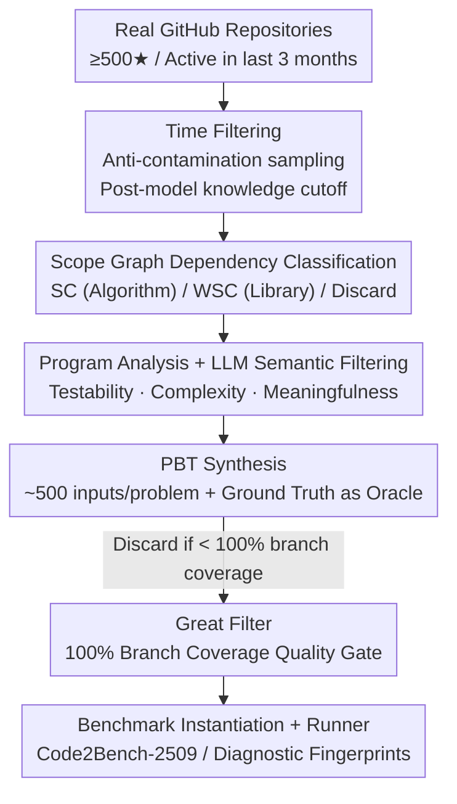

# Code2Bench: Scaling Source and Rigor for Dynamic Benchmark Construction

**Conference**: ICLR2026  
**OpenReview**: [https://openreview.net/forum?id=QZmKyAy1VK](https://openreview.net/forum?id=QZmKyAy1VK)  
**Code**: https://code2bench.github.io/  
**Area**: Code Intelligence / Benchmarking  
**Keywords**: Code Generation Evaluation, Dynamic Benchmarks, Property-Based Testing (PBT), Data Contamination, Dependency Classification

## TL;DR
To address the persistent issues of "static sources prone to contamination" and "superficial testing" in code generation evaluation, this paper proposes the **Dual Scaling** philosophy. It dynamically extracts problems from real-world repositories based on model knowledge cutoff dates (Scaling the Source) and automatically generates high-rigor test suites using Property-Based Testing (PBT) coupled with a 100% branch-coverage "Great Filter" (Scaling the Rigor). The instantiated end-to-end framework, Code2Bench, produces a benchmark (Code2Bench-2509) featuring native Python and Java instances, providing fine-grained diagnostics for 10 mainstream LLMs.

## Background & Motivation
**Background**: Performance evaluation for code LLMs has long relied on static benchmarks like HumanEval and MBPP, which consist of "hand-crafted problems + minimal example tests." Recently, "live" benchmarks like LiveCodeBench have emerged to mitigate timeliness issues, alongside benchmarks such as RepoBench, DevEval, and EvoCodeBench that extract problems from real engineering repositories to handle dependencies.

**Limitations of Prior Work**: The authors identify two intertwined flaws in the current landscape. First, **static and easily contaminated sources**—problems in HumanEval/MBPP have existed for years and are likely part of LLM training corpora, turning "evaluation" into "memorization detection" rather than a test of generalization. Dynamic benchmarks often rely on competitive programming, which does not reflect the complexity of real-world software engineering. Second, **superficial testing**—most benchmarks use only a few sample inputs, creating an "illusion of correctness" that fails to expose boundary case failures distinguishing "runnable code" from "production-ready code."

**Key Challenge**: These flaws stem from the lack of systematic scaling in both "source" and "rigor." Solving only one is insufficient: switching to real-world sources introduces many dependent, untestable, or trivial functions that require rigorous testing for validation; conversely, increasing rigor on static sources cannot bypass data contamination. As shown in Table 1, no existing method excels across all four dimensions: "Dynamic Source / Dependency Handling / Rigorous Testing / Multi-language."

**Goal**: Design a benchmark construction paradigm that is both contamination-resistant and capable of providing deep diagnostics, while being sustainably scalable (continuous injection of new problems) and cross-linguistic.

**Key Insight**: The authors advocate for a paradigm shift—**simultaneously** scaling along two axes: Scaling the Source (dynamically and continuously sampling from real repositories) and Scaling the Rigor (generating deep-coverage test suites via Property-Based Testing).

**Core Idea**: The "Dual Scaling" philosophy is operationalized into an automated pipeline called Code2Bench. The primary technical levers are **Scope Graph dependency classification** (categorizing problems into pure algorithm SC or library-reliant WSC) and a **100% branch-coverage "Great Filter"** (filtering out weak tests and untestable functions).

## Method

### Overall Architecture
Code2Bench is an end-to-end pipeline: the input consists of active, well-maintained open-source repositories from GitHub, and the output is a versioned, executable benchmark suite (Code2Bench-2509) containing native Python/Java instances. The pipeline is built on two pillars: **Scaling the Source** to extract and classify "real and untrained" candidate functions, followed by **Scaling the Rigor** to automatically generate tests for each candidate and strictly screen them using a 100% branch-coverage "Great Filter." The paper reveals that only approximately 40% of high-quality candidates pass this rigor gate, resulting in a "compact yet elite" benchmark.

### Key Designs

**1. Time Filtering: Cutting off Data Contamination at the Root**

Anti-contamination is the starting point. The authors apply a simple axiom: "A model cannot have been trained on code that did not exist before its knowledge cutoff date." This is turned into a deterministic strategy: for each model, the pipeline only extracts functions from GitHub commits created **after that model's official knowledge cutoff date**. Code2Bench-2509 is sourced from code submitted between May and September 2025, post-dating the cutoffs of all evaluated models. Unlike competitive programming-based live benchmarks, this uses real engineering code, ensuring it is both fresh and representative of actual software development.

**2. Scope Graph Dependency Classification: Categorizing Skills into "Algorithm SC" and "Library WSC"**

Functions in real repositories vary widely. They must be categorized by dependency structure to evaluate different capabilities. The authors use **Scope Graph analysis** (a formal, cross-language method for precisely identifying external dependencies) for a two-step deterministic classification: first, the set of unresolved references $D$ is calculated for each function. Then, according to a predefined set of allowed libraries $L_{allowed}$: if $D=\varnothing$, it is **Self-Contained (SC)** (pure algorithm, zero-dependency logic, similar to HumanEval); if all dependencies in $D$ fall within $L_{allowed}$, it is **Weakly Self-Contained (WSC)** (API applications of common libraries, similar to BigCodeBench); otherwise (e.g., Project-Dependent), it is discarded. This classification allows the benchmark to target "algorithm synthesis" and "API application" separately.

**3. Program Analysis + LLM Semantic Filtering: Ensuring Testability and Significance**

Following classification, an automated program analysis layer filters for quality. For testability, Control Flow Graph (CFG) analysis removes functions without verifiable, input-dependent outputs (e.g., no return). For complexity, functions are filtered by Cyclomatic Complexity (CC) to lock into a range that is challenging yet solvable (e.g., $[2, 10]$). Since structural validity does not guarantee "meaningfulness," **LLM-as-a-Judge** is used for semantic filtering to remove trivial problems. The appendix validates that this aligns closely with human experts (Cohen’s $\kappa=0.95$).

**4. PBT Synthesis + 100% Branch Coverage "Great Filter": Maximizing Testing Rigor**

This is the core of Scaling the Rigor. Traditional sample tests only validate a few fixed inputs. This work adopts **Property-Based Testing (PBT)**: for each candidate, the signature (parameter types, type hints) is analyzed to automatically orchestrate testing strategies, generating hundreds to thousands of structured random inputs (covering typical values, edge cases like empty lists or min/max, and complex nested structures). The core property tested is functional equivalence to the ground truth: for any PBT-generated valid input $x$, the output of the LLM-generated function $f_{LLM}(x)$ must equal the output of the original GT function $f_{gt}(x)$, where the **GT function acts as the perfect oracle**.

Quantity does not equal rigor. Thus, the "Great Filter" is introduced: once the test suite is synthesized, it is run against $f_{gt}$ to measure branch coverage. **A function and its test suite are included in the benchmark if and only if 100% branch coverage is achieved.** This filter works in two ways: it **discards insufficient tests** (where input generation failed to explore all logic paths) and **discards untestable functions** (where branches are unreachable due to defensive code or external coupling). This "rigor over quantity" tradeoff is why only ~40% of candidates remain.

**5. Instruction Generation + Instantiated Runner: Ensuring Fairness and Executability**

To ensure fair evaluation, each problem requires clear instructions. GPT-4o generates instructions based on the function's original docstring and signature, using back-translation to mitigate bias. Instruction styles are **adaptive to dependency class**: SC problems use native language conventions (docstrings for Python, Javadoc for Java), while WSC problems are "library-aware," explicitly naming required libraries (e.g., NumPy) and using precise idiomatic types (e.g., `numpy.ndarray`). Each problem is packaged as an executable instance with a runner. The runner handles test deserialization, LLM code execution, and deep comparison with GT outputs. A "dry run" using the GT function ensures the test framework's correctness.

## Key Experimental Results

### Benchmark Scale and Rigor
Code2Bench-2509 includes SC-Python (217 problems), WSC-Python (194 problems), and SC-Java (249 problems), sourced from 220 Python and 189 Java repositories across 10 diverse domains.

| Dimension | SC-Python | WSC-Python | SC-Java | HumanEval | MBPP |
|------|-----------|-----------|---------|-----------|------|
| Problems | 217 | 194 | 249 | 164 | 974 |
| Avg LoC | 20.6 | 18.3 | 14.1 | 7.3 | 6.5 |
| Avg CC | 5.3 | 2.6 | 3.6 | 2.8 | 2.3 |
| Tests per problem | ~500 | ~500 | ~500 | ~7.8 | ~3.0 |
| Coverage Guarantee | 100% Branch | 100% Branch | 100% Branch | Variable | Variable |
| Source | Real Code | Real Code | Real Code | Manual | Crowdsourced |

Structural complexity (CC 5.3 vs. 2.8) and testing rigor (~500 cases vs. ~7.8) are significantly higher than traditional benchmarks.

### Main Results: Pass@1 (%) for 10 LLMs

| Model | SC-Python | WSC-Python | SC-Java |
|------|-----------|-----------|---------|
| Claude-4-sonnet | 40.1 | 38.7 | 47.4 |
| Gemini-2.5-Flash | 37.8 | 36.6 | 45.0 |
| DeepSeek-V3 | 34.4 | 37.6 | 47.8 |
| Qwen3-235b-a22b | 34.6 | 36.6 | 46.6 |
| Mistral-small-3.1 (24B) | 30.4 | 38.7 | 43.4 |
| Qwen3-32b | 31.3 | 34.5 | 43.0 |
| Llama-4-scout | 25.8 | 32.5 | 44.2 |
| Qwen3-8b | 25.1 | 34.0 | 39.0 |
| Gemma-3n-e4b-it | 22.6 | 26.3 | 34.5 |
| Qwen3-1.7b | 14.3 | 16.5 | 17.7 |

Even the strongest model, Claude-4-sonnet, only achieves 40.1% on SC-Python, indicating the benchmark is substantially more difficult.

### Key Findings
- **Algorithm Synthesis $\neq$ API Application**: Using "diagnostic fingerprints" (distribution from SyntaxErr to Perfect), it was found that SC-Python failures are dominated by **LogicErr** (difficulty in first-principles reasoning). In WSC-Python, this peak disappears, and **RuntimeErr** becomes the main obstacle (difficulty in correct API usage).
- **Language Paradigm as "Performance Scaffolding"**: Comparing SC-Python and SC-Java, the significant LogicErr/RuntimeErr peaks in Python are flattened in Java, with "Perfect" ratios soaring. The authors argue this isn't due to models being "naturally better at Java," but rather Java's **static type system pruning potential errors at compile-time**, acting as performance scaffolding.
- **PBT Shuttering the "Illusion of Correctness"**: "Near-Perfect failures" are defined as submissions passing $\geq 98\%$ of tests but ultimately failing. In SC-Python, **6.94%** of submissions fall into this category (reaching ~8% for DeepSeek-V3 and Claude-4-sonnet). These "nearly correct" solutions would be misclassified as successful under sparse testing.

## Highlights & Insights
- **Deterministic Anti-contamination**: Using version control timestamps and knowledge cutoffs provides a clean and indisputable strategy for anti-contamination, transferable to other domains like RAG or Math.
- **"Great Filter" Efficiency**: The 100% branch-coverage gate simultaneously filters for test adequacy and problem quality using a single quantifiable threshold.
- **GT Oracle + PBT**: By using the original function as a reference and PBT for input generation, the need for manual expected outputs is eliminated, creating a scalable paradigm for rigorous code evaluation.
- **Diagnosis via Fingerprints**: Transforming a single Pass@1 score into a distribution from SyntaxErr to Perfect allows for identifying *how* and *where* a model fails, which is more useful for targeted improvement.

## Limitations & Future Work
- **Dependency on GT as Oracle**: For functions without a unique correct output or those involving randomness, I/O, or side effects, the functional equivalence oracle does not hold, biasing the benchmark toward pure functional logic.
- **Gap with Large-Scale Engineering**: Project-Dependent problems are discarded for testability, whereas real-world development often involves cross-module dependencies. The benchmark remains at the "single function" level.
- **Temporal Decay**: The anti-contamination strategy depends on specific cutoff dates; as models are updated, benchmarks must be continuously refreshed, leading to high maintenance costs.
- **LLM Bias in Construction**: While LLM-as-a-Judge and GPT-4o instruction generation are mitigated by high $\kappa$ and back-translation, LLM preferences may still subtly influence problem selection.

## Related Work & Insights
- **vs. HumanEval / MBPP**: These rely on manual static problems and sparse tests; Code2Bench uses real dynamic sources and ~500 cases/100% coverage.
- **vs. EvalPlus**: EvalPlus adds rigor to static benchmarks via mutation; Code2Bench adds the dimensions of "source dynamics" and "real-world complexity."
- **vs. LiveCodeBench**: Both are dynamic/anti-contamination, but LiveCodeBench uses competitive programming with shallow tests; Code2Bench uses real engineering functions with maximum rigor.
- **vs. RepoBench / DevEval / EvoCodeBench**: These handle real repositories but often lack rigorous testing or multi-language support. Code2Bench is the first to check all boxes in Table 1.

## Rating
- Novelty: ⭐⭐⭐⭐ Dual Scaling unifies source and rigor scaling into an automated pipeline; the Great Filter is a solid contribution.
- Experimental Thoroughness: ⭐⭐⭐⭐ Extensive testing across 10 models and 3 tracks, with deep diagnostic analysis.
- Writing Quality: ⭐⭐⭐⭐⭐ The progression from problem to philosophy to framework is exceptionally clear.
- Value: ⭐⭐⭐⭐⭐ Provides a sustainable, scalable, and diagnostic paradigm for next-generation code LLM evaluation.

<!-- RELATED:START -->

## Related Papers

- [\[ACL 2025\] DynaCode: A Dynamic Complexity-Aware Code Benchmark for Evaluating Large Language Models in Code Generation](../../ACL2025/code_intelligence/dynacode_a_dynamic_complexity-aware_code_benchmark_for_evaluating_large_language.md)
- [\[ICLR 2026\] TikZilla: Scaling Text-to-TikZ with High-Quality Data and Reinforcement Learning](tikzilla_scaling_text-to-tikz_with_high-quality_data_and_reinforcement_learning.md)
- [\[ICLR 2026\] Behavioral Embeddings of Programs: A Quasi-Dynamic Approach for Optimization Prediction](behavioral_embeddings_of_programs_a_quasi-dynamic_approach_for_optimization_pred.md)
- [\[ICLR 2026\] ReasoningBank: Scaling Agent Self-Evolving with Reasoning Memory](reasoningbank_scaling_agent_self-evolving_with_reasoning_memory.md)
- [\[ICLR 2026\] CodeSense: a Real-World Benchmark and Dataset for Code Semantic Reasoning](codesense_a_real-world_benchmark_and_dataset_for_code_semantic_reasoning.md)

<!-- RELATED:END -->
