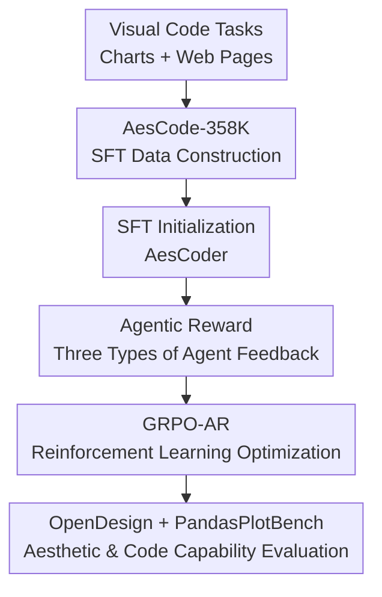

# Code Aesthetics with Agentic Reward Feedback

**Conference**: ICLR 2026  
**OpenReview**: [https://openreview.net/forum?id=Q87kwGI6bx](https://openreview.net/forum?id=Q87kwGI6bx)  
**Paper**: [Project Page](https://bangx7.github.io/code-aesthetics)  
**Code**: Not disclosed  
**Area**: Code Intelligence  
**Keywords**: Code Aesthetics, Web Generation, Visual Code, Agentic Reward, GRPO  

## TL;DR
This paper defines programming tasks where visual outcomes are critical, such as web design and chart generation, as "code aesthetics" problems. It constructs the AesCode-358K dataset, the OpenDesign evaluation set, and an agentic reward framework consisting of execution, static aesthetic, and interactive aesthetic agents. By training small-scale AesCoder models using GRPO-AR, a 4B model outperforms GPT-4o, GPT-4.1, and various large-scale open-source code models on OpenDesign.

## Background & Motivation
**Background**: Large Language Models (LLMs) for code can now reliably complete traditional programming tasks, such as function completion, bug fixing, algorithmic problem solving, or software engineering workflows. Mainstream training and evaluation revolve around text-verifiable objectives: whether the code runs, passes unit tests, or matches a reference output. This paradigm is effective for algorithmic code because results can be directly determined by rules or test cases.

**Limitations of Prior Work**: Visually-oriented programming tasks are not as straightforward. When a model is asked to write a website, draw a chart, or create a browser game, grammatical correctness is merely the baseline. User experience is driven by layout clarity, color harmony, text readability, and functional buttons or controls. Traditional rewards focused only on execution success tend to reward code that "opens but is ugly" or has "good-looking screenshots but non-responsive buttons." Relying solely on static screenshot scoring ignores page interaction and HTML structural standards.

**Key Challenge**: Code aesthetics simultaneously spans three dimensions: text, vision, and interaction. The code itself is text, the rendered result is a visual object, and web pages require user actions to trigger state changes. A single reward struggle to cover all three aspects, causing models to optimize toward reward blind spots: either pursuing superficial visual effects at the expense of executability, meeting syntax requirements without design sense, or creating beautiful static pages where core interactions fail.

**Goal**: The authors aim to systematically answer two questions: first, whether LLM-generated code can exhibit "aesthetic awareness"; second, if so, whether this aesthetic capability can be explicitly trained through data and reward feedback. To this end, the paper requires a code aesthetics dataset, a benchmark for automatic evaluation of web aesthetics and interaction, and a training method that integrates multi-source feedback into reinforcement learning.

**Key Insight**: The paper selects Python chart generation and HTML web design as representative tasks. The former emphasizes chart clarity, information expression, and visual layout, while the latter tests page structure, visual style, and offline interaction. This choice is practical: both tasks produce observable results from code rendering, enabling the creation of supervised data and automated feedback loops using browsers, screenshots, and GUI agents.

**Core Idea**: Formulate an "agentic reward" comprising "executability checks + static visual review + interactive web exploration" to transform subjective aesthetic preferences into multi-perspective training signals suitable for GRPO.

## Method

### Overall Architecture
The complete workflow is divided into four stages: first, constructing AesCode-358K to let the model learn high-quality code patterns for charts and web design via SFT; second, building OpenDesign to evaluate static and interactive aesthetics using real-world web design cases; third, using three reward agents to score model outputs; and finally, integrating weighted rewards into GRPO to train AesCoder-4B and AesCoder-7B. Overall, the dataset teaches "how to write," while the agentic reward teaches "what is better-looking and more usable."

The contribution nodes in the diagram follow the same main line as the key designs: AesCode-358K addresses the lack of high-quality training data, Agentic Reward solves the inability of single rewards to perceive vision/interaction, GRPO-AR converts feedback into optimizable policy updates, and OpenDesign scales web aesthetic evaluation from manual voting to reproducible experiments.

### Key Designs
**1. AesCode-358K: Transforming "Aesthetic Code Results" into Supervised Learning Corpora**

The code aesthetics task is primarily limited by data: standard code datasets do not guarantee high-quality rendering, and web data often lacks controllable instructions and execution verification. The paper splits the data into two sources. For charts, it starts with instructions from VisCode-200K, regenerates Python visualization code using Qwen3-Coder-480B-A35B while restricting dependencies to common stacks like matplotlib, seaborn, and plotly, and verifies execution via Jupyter Notebook, filtering down to 158K executable chart data points.

For web pages, large-scale instructions are generated from five design scenarios: General Website, 3D Design, Data Visualization, Game Dev, and UI Component. The authors first use GPT-4o to generate seed keywords and web instructions, then use embedding + t-SNE + K-Means deduplication to retain 200K representative samples from 400K instructions. HTML is generated using GPT-5 and Qwen3-Coder-480B, screenshots are rendered via Playwright/Selenium, and GPT-5 selects the higher-scoring version. The resulting data is not just "HTML text" but design code filtered for executability and visual quality.

**2. Agentic Reward: Using Three Agents to Complete Textual, Visual, and Interactive Feedback**

A blind spot of traditional code rewards is that they only know "if it ran," not "how it looks" or "how it performs." This paper decomposes the reward into three complementary agents. The Execution Agent first extracts HTML from the model's raw output; if no code block is found, the entire output is treated as HTML. It then uses HTMLHint for basic syntax and structural checks, assigning $s_{exec}=1$ for success and $s_{exec}=-1$ for failure. This gate is crucial as it prevents the model from tricking aesthetic evaluations with a beautiful but structurally invalid page.

The Static Aesthetics Agent examines the rendered full-page screenshot. Using Playwright to open the HTML locally, it captures a full-page screenshot and asks GPT-5 to score it based on instruction alignment, visual elements, and layout structure. The Interactive Aesthetics Agent treats the webpage as an operational environment. Based on the WebVoyager framework and GPT-4o, it plans elements to click, input, or operate on, recording whether each interaction produces reasonable feedback. The final interaction score is $s_{interact}=\sum_{i=1}^{N}s_i$, where 1 point is awarded only if the page state changes as expected. Together, the reward no longer just rewards "decent code text," but "executable code, beautiful pages, and usable interactions."

**3. GRPO-AR: Converting Multi-Agent Feedback into Optimizable Reinforcement Learning Objectives**

For training, the paper first performs SFT using AesCode-358K, then extracts 20K RL data points from WebSight v0.2 that do not overlap with the SFT data. To clarify instructions, GPT-4o is used to rewrite the original instructions. In the GRPO phase, for each prompt $p$, the old policy samples a set of outputs $\{o_1,o_2,\ldots,o_G\}$, and each output is processed through the agentic reward framework to obtain a total reward $r_i$.

The total reward is defined as a weighted sum of three terms: $r=w_{exec}\cdot r_{exec}+w_{static}\cdot r_{static}+w_{interact}\cdot r_{interact}$. By default, $w_{exec}=0.1$, $w_{static}=0.8$, and $w_{interact}=0.1$, reflecting realistic trade-offs in web tasks: execution is the threshold, static design constitutes the primary aesthetic quality, and interaction provides additional constraints. GRPO uses intra-group reward normalization to obtain the advantage $\hat{A}_{i,t}=\frac{r_i-mean(r)}{std(r)}$, and updates the policy using a clipped objective while maintaining KL regularization to prevent the model from drifting too far from the reference policy.

**4. OpenDesign: Replacing Hard-to-Scale Manual Voting with Automated Web Aesthetic Evaluation**

Web aesthetics lack public benchmarks similar to unit tests. The paper proposes OpenDesign, which includes 840 real-world web design cases and evaluates both static and interactive aesthetics. For the static part, model-generated HTML is rendered into screenshots and scored by the Static Aesthetics Agent. For the interactive part, the Interactive Aesthetics Agent performs offline operations on the page to test whether buttons, input fields, game controls, or component behaviors align with the task intent.

To prove OpenDesign is not biased toward an arbitrary judge, the authors conducted two layers of validation. First, the ranking of 10 mainstream models on OpenDesign is highly consistent with Design Arena rankings, with a Spearman correlation of 0.98 and a Kendall correlation of 0.91. Second, in 200 pairs of human/GPT preference comparisons for HTML pages, GPT-human agreement was 80.9%, higher than the human-human agreement of 68.7%. This indicates that while the benchmark relies on LLM-as-a-judge, its ranking trends closely match large-scale human preferences.

### Mechanism Example
Suppose a user asks to "make a pizza restaurant website, highlighting the menu and online ordering." A standard code reward would only check if the HTML opens. The model might generate a static menu page where the "Order Now" button does nothing when clicked. The proposed reward system would first have the Execution Agent check for a valid `<!DOCTYPE html>`, unique ids, viewports, and closed tags. If this fails, subsequent aesthetic agents are not triggered, and a negative execution reward is given.

If the page is executable, the Static Aesthetics Agent observes the screenshot: is the menu prominent, is the text readable, and are colors/layouts appropriate for a restaurant site? Is the ordering entry clearly visible in the visual hierarchy? The Interactive Aesthetics Agent would then actually click the menu, order button, or input field to observe if a cart pops up, quantities update, or order status is displayed. A page with a beautiful hero section but a non-functional order button would receive a high static score but a low interaction score. In GRPO, the model sees this comprehensive feedback and is pushed toward "both beautiful and usable" web code.

### Loss & Training
Training occurs in two stages. Stage I uses AesCode-358K for SFT on Qwen3-4B-Instruct-2507 and Qwen2.5-Coder-7B-Instruct for 3 epochs with the AdamW optimizer, 10% linear warmup followed by cosine decay, a maximum learning rate of $1e^{-5}$, a batch size of 128, and a maximum sequence length of 8K.

Stage II implements GRPO-AR using VeRL, with a policy learning rate of $3\times 10^{-6}$, a batch size of 64, and a micro batch size of 8. For each rollout, 64 prompts are collected with 8 responses sampled per prompt. The KL coefficient is set to 0.001, and the clip parameter $\epsilon=0.5$. Given the limited current success rates of GUI agents, each page is evaluated for a maximum of 3 interactive elements during training, requiring the agent to prioritize the most critical controls to reduce noise from interaction failures.

## Key Experimental Results

### Main Results
The paper primarily evaluates two directions: PandasPlotBench for chart code generation and OpenDesign for static and interactive web aesthetics. A key conclusion from Table 1 is that small models, after AesCode-358K + GRPO-AR, can approach or even exceed larger general-purpose models on aesthetic-oriented tasks.

| Model | Scale | PandasPlotBench Err.↓ | PandasPlotBench Avg.↑ | OpenDesign Total↑ | InterAes.↑ |
|------|------|----------------------|-----------------------|-------------------|------------|
| GPT-4o | - | 0.09 | 68 | 48.08 | 0.44 |
| GPT-4.1 | - | 0.09 | 69 | 65.79 | 0.74 |
| GPT-5 (minimal) | - | 0.04 | 75 | 81.03 | 1.37 |
| Claude Sonnet 4 | - | 0.04 | 74 | 81.05 | 0.92 |
| Qwen3-Coder-480B-A35B | 480B | 0.05 | 73 | 79.90 | 0.70 |
| DeepSeek-R1-0528 | 685B | 0.08 | 70 | 78.86 | 0.77 |
| Qwen3-4B-Instruct-2507 | 4B | 0.13 | 65 | 73.26 | 0.67 |
| AesCoder-4B | 4B | 0.09 | 70 | 81.92 | 1.04 |
| AesCoder-7B | 7B | 0.09 | 67 | 81.23 | 0.94 |

AesCoder-4B achieves an OpenDesign total score of 81.92, higher than GPT-5 minimal (81.03), Claude Sonnet 4 (81.05), and Qwen3-Coder-480B (79.90). On PandasPlotBench, it also reduces the 4B baseline error rate from 0.13 to 0.09 and improves the average score from 65 to 70. AesCoder-7B's OpenDesign total score of 81.23 is also a significant improvement over the 7B baseline (46.27).

### Ablation Study
The authors compared RFT, DPO, GRPO without agentic rewards, and full GRPO-AR using the same Stage II data. The most important contrast is that using a low-level reward model to score HTML statically, without allowing execution/static/interactive agents to form a complete feedback loop, yields results significantly weaker than GRPO-AR.

| Training Strategy | Align↑ | Aes↑ | Struct↑ | InterAes↑ |
|----------|--------|------|---------|-----------|
| Qwen3-4B baseline | 28.50 | 25.27 | 24.36 | 0.62 |
| Qwen3-4B + RFT | 29.32 | 25.30 | 24.67 | 0.71 |
| Qwen3-4B + DPO | 28.79 | 25.31 | 24.38 | 0.70 |
| Qwen3-4B + GRPO-AR w/o Agentic Reward | 29.16 | 25.20 | 24.67 | 0.71 |
| Qwen3-4B + GRPO-AR | 30.42 | 26.19 | 25.31 | 1.04 |
| Qwen2.5-Coder-7B baseline | 28.85 | 25.23 | 24.37 | 0.70 |
| Qwen2.5-Coder-7B + RFT | 29.73 | 25.35 | 24.85 | 0.75 |
| Qwen2.5-Coder-7B + DPO | 29.75 | 25.33 | 24.87 | 0.71 |
| Qwen2.5-Coder-7B + GRPO-AR | 30.03 | 25.98 | 25.18 | 0.94 |

Full GRPO-AR yields the best static and interactive scores across both base models. For Qwen3-4B, InterAes improves from 0.62 in the baseline to 1.04, whereas GRPO without agentic reward only reaches 0.71. This indicates that the interactive agent is not merely decorative; it significantly alters the model's optimization direction.

### Key Findings
- AesCoder’s gains primarily stem from "aesthetic task specialization." The 4B model outperforming 480B/685B open-source models on OpenDesign does not mean it is a stronger general-purpose code model, but that the data and rewards focused its capabilities on visual code tasks.
- The reliability of OpenDesign is supported by two pieces of evidence: its high correlation with Design Arena rankings and the 80.9% agreement rate between the GPT judge and human preferences. This makes LLM-as-a-judge in this context a scalable proxy metric rather than mere self-validation.
- Reward weight experiments show a smooth trade-off between static and interaction components: increasing $w_{static}$ improves static scores while lowering interactive scores, and vice versa. The training curves did not collapse, indicating that the multi-agent reward combination in GRPO-AR is controllable.
- The cost is also evident: AesCoder shows a decline in general coding capabilities on LiveCodeBench, MBPP, and MBPP+ compared to the base models. For example, Qwen3-4B's LiveCodeBench score dropped from 32.5 to 19.0, and MBPP dropped from 86.8 to 73.5.

## Highlights & Insights
- **Defining "code aesthetics" as a code intelligence problem rather than pure vision**: The paper does not just judge screenshots but integrates source code executability, page rendering, and user interaction into a single loop. This is critical because web code quality is not a unimodal attribute.
- **Agentic reward design fits the task structure**: The Execution Agent handles the baseline, the Static Aesthetics Agent handles visual preferences, and the Interactive Aesthetics Agent handles usability. The boundaries between the three are clear, explaining why static scoring from a standard reward model is insufficient.
- **OpenDesign validation is robust**: The authors did not simply claim "we used GPT-5 for scoring," but validated it against Design Arena rankings and human preferences, reducing the risk of the benchmark being dominated by a single judge's bias.
- **Superiority of small models is insightful**: AesCoder-4B's performance demonstrates that for highly specialized visual code tasks, targeted data and rewards can be more effective than simply increasing parameter counts. This serves as a reference for training "vertical code assistants."
- **Honest reporting of the alignment tax**: The decline in general code benchmarks serves as a reminder that aesthetic reinforcement is not a free lunch. Transitioning from a generalist to a design-oriented specialist involves a trade-off in algorithmic coding ability.

## Limitations & Future Work
- The current rewards still rely on strong proprietary models as judges. The Static Aesthetics Agent uses GPT-5 and the Interactive Aesthetics Agent uses GPT-4o, incurring high training and evaluation costs. The stability of scores when migrating to open-source or cheaper evaluators requires validation.
- Interactive evaluation is constrained by GUI agent capabilities. The paper acknowledges that web agents may be misled by page elements; a failure results in a score of 0 for that interaction. A score of 0 can represent poor page design or simply agent failure, and these are not always distinguishable.
- OpenDesign primarily covers single-page offline HTML. Real-world front-end development involves cross-page navigation, backend APIs, state persistence, component engineering, accessibility, and performance optimization, which are not currently at the core of the benchmark.
- Aesthetic preferences are inherently influenced by cultural and platform differences. While the paper validates general consistency with Design Arena and human labels, definitions of "beauty" vary by industry, region, and brand style. Future work could introduce configurable aesthetic preferences.
- GRPO-AR causes regression in general code capabilities. A more practical future direction might be hybrid training: adding algorithmic, unit test, and software engineering retention terms alongside visual code rewards to mitigate the specialist's forgetting of general coding.

## Related Work & Insights
- **vs. Traditional Code RL / Unit-Test Feedback**: Methods like RLEF, RLTF, and CodeRL primarily use execution results or unit tests to optimize correctness. This paper extends rewards to rendered images and page interactions. Its advantage is covering the true quality dimensions of visual code tasks, while its disadvantage is a heavier evaluation chain reliant on external models.
- **vs. RLHF / DPO / RFT**: DPO and RFT utilize preference or filtered samples to improve output quality, but they typically do not explicitly run web pages, capture screenshots, or click controls. This paper's experiments show that directly integrating agentic rewards into GRPO is more effective for web aesthetic tasks than simple preference optimization.
- **vs. Image/Text Aesthetic Evaluation**: Existing AIGC aesthetics work mostly evaluates static images or text layout. This paper focuses on "actionable visual products of code generation," inspiring future research to extend aesthetic evaluation from the content itself to the generation process and interactive states.
- **vs. Design Arena**: Design Arena relies on community voting, making it suitable for public leaderboards but not for large-scale automated feedback in training loops. OpenDesign approximates human preferences via LLM judges and GUI agents, making aesthetic evaluation scalable and reproducible, though it inherits automated judge biases.

## Rating
- Novelty: ⭐⭐⭐⭐⭐ First to systematically combine code aesthetics, web interaction evaluation, and reinforcement learning rewards.
- Experimental Thoroughness: ⭐⭐⭐⭐ Covers main experiments, ablations, human evaluation, and reward weights, though true engineering-grade front-end tasks require further validation.
- Writing Quality: ⭐⭐⭐⭐ Clear structure with a comprehensive pipeline diagram, though detailed data construction and long judge prompts make some parts read like a system report.
- Value: ⭐⭐⭐⭐⭐ Directly inspires code intelligence, front-end generation, visual code, and agentic rewards, particularly as a paradigm for training specialized code models.

<!-- RELATED:START -->

## Related Papers

- [\[ICLR 2026\] RECODE-H: A Benchmark for Research Code Development with Interactive Human Feedback](recode-h_a_benchmark_for_research_code_development_with_interactive_human_feedba.md)
- [\[ICLR 2026\] SWE-RM: Execution-Free Feedback for Software Engineering Agents](swe-rm_execution-free_feedback_for_software_engineering_agents.md)
- [\[ICLR 2026\] FHE-Coder: Benchmarking Secure Agentic Code Generation for Fully Homomorphic Encryption](fhe-coder_benchmarking_secure_agentic_code_generation_for_fully_homomorphic_encr.md)
- [\[ACL 2026\] QiMeng-PRepair: Precise Code Repair via Edit-Aware Reward Optimization](../../ACL2026/code_intelligence/qimeng-prepair_precise_code_repair_via_edit-aware_reward_optimization.md)
- [\[ICLR 2026\] An Agentic Framework with LLMs for Solving Complex Vehicle Routing Problems](an_agentic_framework_with_llms_for_solving_complex_vehicle_routing_problems.md)

<!-- RELATED:END -->
