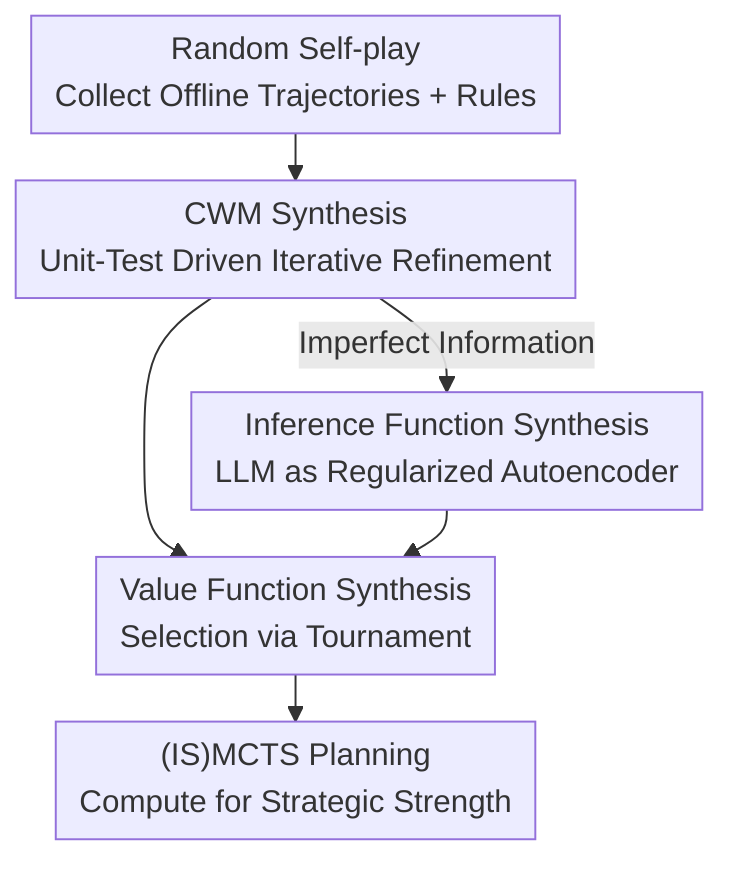

# Code World Models for General Game Playing

**Conference**: ICLR 2026  
**OpenReview**: [https://openreview.net/forum?id=1UoB7IWiku](https://openreview.net/forum?id=1UoB7IWiku)  
**Code**: None (Experiments based on OpenSpiel)  
**Area**: Code Intelligence / Agent / LLM Reasoning  
**Keywords**: Code World Models, General Game Playing, MCTS, Imperfect Information Games, Program Synthesis

## TL;DR
Instead of using the LLM as a direct "player," it is tasked with **translating game rules and a few match trajectories into executable Python Code World Model (CWM)** (including state transitions, legal actions, terminal state detection, plus value functions and hidden state inference functions). This code is then processed by classical planners like MCTS/ISMCTS for deep search. Across 10 games (including 4 entirely new OOD games), the approach tied with or outperformed Gemini 2.5 Pro in 9 games.

## Background & Motivation
**Background**: In classical games like Chess, Go, Poker, or Bridge, the mainstream LLM approach is "LLM-as-policy"—feeding the observed observation/action trajectory into a prompt and letting the model output a move. This essentially treats the model's pattern-matching ability as an "intuitive player."

**Limitations of Prior Work**: This approach faces three major issues. First, **frequent illegal moves**—models rely on fragile implicit pattern matching to understand rules, often resulting in illegal actions or timeouts. Second, **shallow strategy**—strong gameplay requires multi-step lookahead (System 2 thinking), which general-purpose LLMs lack even with "thinking" steps enabled. Third, **poor generalization**—performance drops significantly when encountering Out-of-Distribution (OOD) games not seen in the training set.

**Key Challenge**: Compressing "rule understanding" and "deep search" into a single LLM forward pass leads to failure in both. LLMs excel at semantic understanding but struggle with precise multi-step deduction. Classical planners (MCTS) excel at converting compute into Elo rating but require an **executable, verifiable environment model**—which is precisely what is missing in new games.

**Goal**: Delegate the "data → code translation" meta-task to the LLM and leave deep search to mature planners to achieve verifiability, strategic depth, and generalization. Furthermore, the goal is to cover **partially observable + stochastic** games (e.g., Poker), which previous CWM works typically avoided.

**Key Insight**: Game rules themselves are world models that can be precisely characterized by code. Rather than making fragile policy decisions at every step, the LLM can inductively synthesize rules and trajectories into a program once. This program can be verified by unit tests and called infinitely by planners, shifting the burden from "generating good moves" to "generating good models."

**Core Idea**: Use LLMs to synthesize "natural language rules + random trajectories" into an executable **Code World Model (CWM)**, then use (IS)MCTS to perform deep planning on this code—turning compute, rather than pattern matching, into strategic strength.

## Method

### Overall Architecture
For a new game, the agent workflow begins with random self-play to collect trajectories containing observations, rewards, legal actions, and (if provided in setup) hidden states. These rules and trajectories are fed to an LLM to synthesize a CWM in OpenSpiel API format. The model is **iteratively refined** using automatically generated unit tests until transition accuracy reaches 1.0 or the budget is exhausted. For Imperfect Information Games (IIG), a **hidden state inference function** is synthesized for ISMCTS belief state sampling, and an optional **value function** is synthesized to accelerate leaf node evaluation. Finally, an (IS)MCTS policy based on this synthesized code plays against opponents. The key shift is: the LLM produces the model offline, and the planner converts search compute into strength during gameplay.

### Key Designs

**1. CWM Synthesis and Unit-Test Driven Iterative Refinement**

The fundamental flaw of "LLM-as-policy" is unverifiable output and illegal moves. This work shifts the task to "synthesizing an executable replica of the target game." The CWM is a set of deterministic functions: state transitions, legal actions, observations (which differ from states in IIG), chance node distributions, and rewards. To handle generation errors, **iterative refinement** is introduced. Unit tests are generated from every transition in offline trajectories to verify CWM predictions. Success rate serves as **transition accuracy**. Refinement follows two modes: **Conversation** (appending failed tests to chat history) or **Tree search** (maintaining a refinement tree using Thompson sampling to select CWM candidates for further editing based on accuracy). Tree search is used for its robustness in difficult games.

**2. IIG Inference Functions: LLM as a Rule-Regularized Autoencoder**

In IIGs, ISMCTS must estimate the hidden state $s_t$ by sampling from the belief state $p_M(s_t \mid o^i_{1:t}, a^i_{1:t})$. Since exact inference is exponential, the LLM synthesizes code for **approximate posterior sampling**. The primary method is **hidden history inference**: since CWM functions are deterministic, the state posterior can be derived from the history posterior. The LLM synthesizes a function to sample $\tilde h_t \sim p_M(h_t \mid o^i_{1:t}, a^i_{1:t})$. Unit tests verify if the sampled $\tilde h_t$ matches real evidence ($\tilde o^i_t = o^i_t$, $\tilde a^i_t = a^i_t$).

In **closed deck** scenarios (where the agent never sees hidden states, even post-hoc), unit tests requiring latent information are discarded. Only "observation → hidden state → observation reconstruction" is verified. This forms an **autoencoder**: the inference function is the encoder ($o^i_{1:t}, a^i_{1:t} \to \tilde h_t$) and the CWM is the decoder ($\tilde h_t \to \text{observations}$). The **game rules + OpenSpiel API** acts as the regularizer, preventing the learning of trivial latent spaces.

**3. Value Function Synthesis**

MCTS/ISMCTS typically uses random rollouts for leaf evaluation, which is slow and noisy. The LLM synthesizes a deterministic value function $V(s)$. Unlike CWMs, **value functions have no ground truth and are not refined via unit tests**. Instead, multiple candidates are generated and the best is selected via a **tournament**.

### Loss & Training
No neural networks are trained. "Training" refers to the LLM code synthesis and refinement loop. Optimization signals come from the pass rate of unit tests generated from offline trajectories. (IS)MCTS runs 1,000 simulations during play, with leaf nodes evaluated by the value function or 10 random rollouts.

## Key Experimental Results

### Main Results
Evaluation covers 10 games (5 perfect information + 5 imperfect information, including 2 OOD games each). Opponents include Random, GT-(IS)MCTS (ground-truth performance upper bound), and Gemini 2.5 Pro as a direct policy.

| Setting | Conclusion | vs Gemini 2.5 Pro |
|------|------|---------------------|
| Perfect Information | CWM-MCTS matches GT-MCTS (high synthesis quality) | **Won all 5 games** |
| IIG - Open Deck | Tied or won except for Hand of War | Tied/Won 9/10 games overall |
| IIG - Closed Deck | Synthesis quality drops, but performance remains robust | Continued to Tie/Win |

### Ablation Study

| Game (Open, Tree Search, History Inf.) | Transition Accuracy (test) | Inference Accuracy (test) | LLM Calls |
|------|------|------|------|
| Bargaining | 0.983 | 1.000 | 23.0 |
| Leduc poker | 0.998 | 1.000 | 4.4 |
| Gin rummy | 0.746 | 0.538 | 500.0 |
| Quadranto (OOD) | 1.000 | 0.986 | 6.0 |
| Hand of war (OOD) | 0.981 | 0.936 | 144.0 |

| Config | Key Findings | Note |
|------|---------|------|
| History vs State Inf. | Hidden history is slightly superior and ensures valid states | Default for CWM-ISMCTS |
| Closed Gin rummy | Train acc: 0.055, Test acc: 0.095 | Multi-stage scoring is extremely hard to synthesize |
| Value Function | Gain in Gen. tic-tac-toe / Bargaining | Negligible change elsewhere |

### Key Findings
- **Synthesis quality is the ceiling**: CWM-MCTS matches GT-MCTS, indicating synthesized models are nearly equivalent to real rules.
- **Gin rummy is the hardest**: complex subroutines (knocking, deadwood, undercuts) are difficult to synthesize from trajectories.
- **Closed deck can be better**: In Hand of War, closed deck performance slightly exceeded open deck, potentially because the LLM had the freedom to synthesize a simpler state space.
- **Compute for Strength**: As long as the model is correct, increasing search simulations stabilizes performance near the optimum.

## Highlights & Insights
- **Separation of Concerns**: Delegating "understanding" to code synthesis and "searching" to planners avoids overloading a single forward pass.
- **Unit Tests as Feedback**: Automatically generating binary tests provides a scalable, objective optimization signal for code synthesis.
- **Autoencoder Perspective**: Using game rules as a regularized latent space for IIGs is a powerful formalization for unsupervised hidden state learning.
- **Generalization via Meta-task**: Focusing on the "data → code" translation allows the agent to handle OOD games by bypassing training data contamination.

## Limitations & Future Work
- **Dependency on Synthesis**: All advantages rely on the correctness of the synthesized model; errors in CWM lead to misleading searches.
- **Complex Procedural Games**: LLMs struggle to synthesize multi-stage scoring or complex logic from limited trajectories.
- **Realism of Open Deck**: Open deck assumes access to post-hoc latent states, which is not always available.
- **Offline Limitation**: The model is frozen once play begins; it does not update online to correct errors based on new data.

## Related Work & Insights
- **vs WorldCoder**: Both use LLM for CWM synthesis with Thompson sampling, but WorldCoder uses ReAct for decisions. Ours uses (IS)MCTS and handles IIGs.
- **vs GIF-MCTS**: Both use synthesized CWM for MCTS, but ours handles partial observability and adds inference functions.
- **vs POMDP Coder**: Ours tackles the "closed deck" scenario where hidden states are never observed.
- **vs LLM-as-policy**: CWM avoids illegal moves and enables deep strategic foresight.

## Rating
- Novelty: ⭐⭐⭐⭐⭐ First framework to systematically handle IIGs with CWM, including the closed-deck autoencoder paradigm.
- Experimental Thoroughness: ⭐⭐⭐⭐ Coverage of 10 games, OOD settings, and open/closed decks, though complex games like Gin Rummy highlight limits.
- Writing Quality: ⭐⭐⭐⭐ Clear motivation, solid formalization, and insightful autoencoder derivations.
- Value: ⭐⭐⭐⭐⭐ The paradigm of decoupling LLM understanding from classical planning is highly influential for general agents.

<!-- RELATED:START -->

## Related Papers

- [\[ICLR 2026\] EDIT-Bench: Evaluating LLM Abilities to Perform Real-World Instructed Code Edits](edit-bench_evaluating_llm_abilities_to_perform_real-world_instructed_code_edits.md)
- [\[ICLR 2026\] CodeSense: a Real-World Benchmark and Dataset for Code Semantic Reasoning](codesense_a_real-world_benchmark_and_dataset_for_code_semantic_reasoning.md)
- [\[ICLR 2026\] DiffuCoder: Understanding and Improving Masked Diffusion Models for Code Generation](diffucoder_understanding_and_improving_masked_diffusion_models_for_code_generati.md)
- [\[ICLR 2026\] CrossPL: Systematic Evaluation of Large Language Models for Cross Programming Language Interoperating Code Generation](crosspl_systematic_evaluation_of_large_language_models_for_cross_programming_lan.md)
- [\[ACL 2026\] ReFEree: Reference-Free and Fine-Grained Method for Evaluating Factual Consistency in Real-World Code Summarization](../../ACL2026/code_intelligence/referee_reference-free_and_fine-grained_method_for_evaluating_factual_consistenc.md)

<!-- RELATED:END -->
