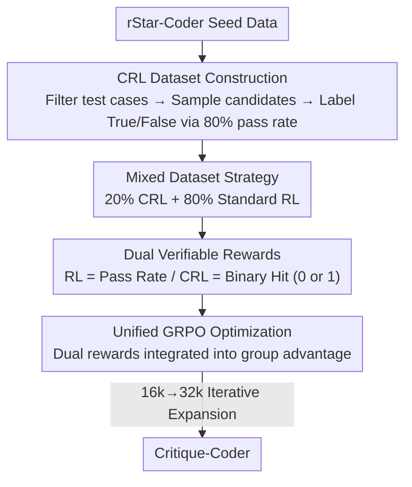

# Critique-Coder: Enhancing Coder Models by Critique Reinforcement Learning

**Conference**: ICLR2026  
**OpenReview**: [https://openreview.net/forum?id=tsuxIeLUsz](https://openreview.net/forum?id=tsuxIeLUsz)  
**Code**: [Project Page](https://tiger-ai-lab.github.io/Critique-Coder)  
**Area**: Code Intelligence / LLM Reasoning / Reinforcement Learning  
**Keywords**: Critique Reinforcement Learning, Code Generation, GRPO, Verifiable Reward, Reflection Ability

## TL;DR
This paper proposes "Critique Reinforcement Learning" (CRL), which requires the model to make True/False judgments on "question-solution" pairs. The accuracy of these judgments serves as a verifiable reward. By mixing this with standard code RL at a 20%:80% ratio, the resulting Critique-Coder consistently outperforms pure RL models across multiple code benchmarks. The 8B model exceeds 60 on LiveCodeBench(v5) and transfers its critique capability to logical reasoning tasks.

## Background & Motivation
**Background**: The current mainstream paradigm for enhancing the reasoning capabilities of large code models is "Reinforcement Learning with Verifiable Rewards" (RLVR). Given a problem $q$, the policy samples several candidate solutions, and the test case pass rate is used as a reward signal to optimize the policy (e.g., via GRPO/PPO). Works like AceCoder, HardTests, KodCoder, and SWE-RL follow this path, achieving significant gains through rule-based test rewards.

**Limitations of Prior Work**: RLVR only rewards "generating the correct solution." Throughout the training process, the model is never explicitly required to "judge whether an existing solution is correct." Consequently, standard RL lacks a mechanism to stimulate **critique/reflection** behaviors—the model learns to write code but does not specifically learn to scrutinize it.

**Key Challenge**: Recent works (e.g., Critique-Fine-Tuning, CFT; Critique-Guided-Distillation, CGD) demonstrate that "explicitly teaching the model to critique" can unlock reasoning capabilities. however, they follow a **supervised imitation** route, where models imitate critique traces provided by a teacher. This means the critique capability is bounded by teacher data and is essentially distillation, failing to incorporate "critique" into an exploratory, rewardable RL loop.

**Goal**: To transform "critique" into a **verifiable and exploratory RL task**, allowing the model to receive rewards for "correct judgment" in addition to solution generation, and to investigate whether this critique signal should replace or supplement standard RL.

**Key Insight**: The authors observe that judging whether "a solution satisfies the problem requirements" is naturally a binary classification task with ground truth that is automatically verifiable. This perfectly fits the "verifiable reward" requirement of RLVR. Thus, critique can be turned into a reward source isomorphic to "passing test cases" and integrated into the same GRPO optimization.

**Core Idea**: Use whether " the model's self-generated judgment $c\in\{\text{True},\text{False}\}$ equals the ground-truth label $c^*$" as a binary reward (CRL). This is mixed with the standard test pass rate reward (RL), and the policy is updated uniformly using GRPO. The "reflection signal" from critique supplements the "problem-solving signal" of RL.

## Method

### Overall Architecture
Critique-Coder is trained using a mixed RL framework with **dual data sources and a single optimizer**. it simultaneously processes two types of samples: standard RL samples (problem $q$ + test cases $T$) and CRL samples (problem-solution pair $[q;s]$ + ground-truth judgment $c^*$). For the former, the policy samples multiple solutions and scores them by test pass rate. For the latter, the policy samples multiple critiques and is awarded 0/1 based on whether the judgment hits the ground truth. Both rewards are converted into group relative advantages $\hat A_{i,t}$ within GRPO to update the same policy $\pi_\theta$. The pipeline consists of four parts: constructing a verifiable CRL dataset, designing dual rewards, mixing at a 20% ratio, and iterative training with context expansion from 16k to 32k.

### Key Designs

**1. Critique Reinforcement Learning (CRL): Turning "Judgment" into Verifiable Rewards**

This design directly addresses the lack of reflection in standard RL. While standard RLVR lets policy $\pi_\theta$ sample $n$ solutions for problem $q$ and scores them by correctness, CRL shifts the task surface. Given a labeled dataset $D=\{([q_k;s_k],c^*_k)\}$, where each sample is a "problem-solution" pair with a binary ground-truth label $c^*\in\{0,1\}$, the policy must generate a judgment $c$ to answer whether solution $s$ satisfies the requirements of $q$. The reward is determined solely by the judgment's accuracy:

$$R_{crl}(c,c^*)=\begin{cases}1,& c=c^*\\0,& \text{otherwise}\end{cases}$$

Missing judgments (failure to parse the `\conclusion{}` field) are also scored 0. The key difference from CFT is that while CFT uses **teacher-provided critique traces** for supervised imitation, CRL uses the **model's own generated judgments** compared against ground truth for rewards. It is exploratory reinforcement learning rather than distillation, meaning it does not rely on a stronger teacher, and critique capability can emerge through RL itself.

**2. CRL Dataset Construction: Building Verifiable Critique Data via "Weak Model Generation + Test Case Labeling"**

To perform CRL, one needs "problem-solution-judgment" triplets where the ground truth is reliable. The authors start with human-annotated seed data from rStar-Coder. However, the original data often has too many test cases per problem (>100) or extremely long individual cases (>10,000 tokens), which leads to exploding verification overhead during RL. They first **filter** the data: cases longer than 200 tokens are discarded, and 30 cases are randomly sampled per problem, reducing the average input characters from 96,208 to 40 and cases from 87 to 24, significantly shortening verification time. They then use Qwen3-Coder-30B-A3B-Instruct to generate candidate solutions and execute them against the **filtered test cases**, labeling them True/False based on pass rates. An engineering detail: since timeouts can cause correct solutions to be mislabeled as failures, an **80% pass rate threshold** is adopted—passing more than 80% labels it True, otherwise False—to mitigate noise from timeouts. Notably, the 30B model used for labeling has a pass@1 of only 32.20%, which is **weaker** than the reasoning-enabled Qwen3-4B (43.72%). Thus, this is not "strong teacher distillation" but rather the creation of trusted labels using verifiable execution results.

**3. Mixed Dataset Strategy (20% CRL + 80% RL): Critique as a Supplement, Not a Replacement**

If trained only on CRL data, the model might become biased toward "evaluating and analyzing candidate solutions," gradually losing its "end-to-end problem-solving" ability. At evaluation time, a complete solution is required, and pure critique training can lead to **format drift**. Conversely, pure RL never encounters reflection modes. The authors thus mix the data, randomly assigning 20% to CRL and 80% to standard RL. This allows the model to learn both judgmental critique and direct solution synthesis in the same training process. The 20% ratio was chosen via ablation as the optimal point: 0% (pure RL) averaged 45.7, 20% rose to 47.2, 50% dropped to 46.2, and 100% (pure CRL) fell to 44.5 (below baseline), with the hardest hits on difficult subsets like BigCodeBench-Hard. The conclusion is clear: CRL is a **complementary signal** to RL, not a substitute.

**4. Unified GRPO Optimization + Iterative Expansion: Merging Dual Rewards into One Advantage**

The two rewards are integrated within GRPO. Compared to PPO, GRPO uses relative performance within a group for updates, which is more stable and efficient. The objective is:

$$J(\theta)=\mathbb{E}\Big[\tfrac{1}{G}\sum_{i=1}^{G}\tfrac{1}{|o_i|}\sum_{t=1}^{|o_i|}\min\big(\rho_{i,t}\hat A_{i,t},\,\text{clip}(\rho_{i,t},1-\epsilon,1+\epsilon)\hat A_{i,t}\big)-\beta D_{KL}(\pi_\theta\|\pi_{ref})\Big]$$

Where the policy input $x$ can be either a single problem $q$ (RL) or a pair $[q;s]$ (CRL). The two modes yield $R_{rl}$ (test pass rate $K/N$) and $R_{crl}$ (0/1 judgment reward), both of which **collectively contribute to the group advantage estimation** $\hat A_{i,t}$. This ensures the GRPO update is shaped by both "execution correctness" and "reflective judgment." Training follows a DeepCoder-style two-stage expansion: response length is first limited to 16k, then expanded to 32k after rewards stabilize. This allows the model to develop reasoning in shorter contexts before migrating to longer chains. During the 16k stage, the CRL reward is also multiplied by a coefficient of 0.8 to prevent it from dominating the RL signal.

### Loss & Training
The policy is initialized from a pre-trained checkpoint $\pi_{\theta_{init}}$, trained for one epoch on the mixed data, and the best checkpoint is selected using LiveCodeBench(v5) as a validation set. At each step, $G$ outputs are sampled for each sample: for CRL samples, the judgment in `\conclusion{}` is parsed for a 0/1 reward; for RL samples, code blocks are extracted and executed for a pass-rate reward. Key hyperparameters: batch size 128, learning rate 1e-6, 8 outputs sampled per prompt. Asymmetric clipping ratios (upper 0.3, lower 0.2) are used to encourage exploration while maintaining entropy stability.

## Key Experimental Results

### Main Results
Models are trained on Qwen3-4B / 8B (thinking mode) and compared against baselines and pure RL on four benchmarks: EvalPlus, BigCodeBench-Instruct, Aider-Polyglot, and LiveCodeBench(v5).

| Model | EvalPlus | BigCodeBench-Full | Aider-Polyglot | LiveCodeBench v5 | AVG |
|------|----------|-------------------|----------------|------------------|-----|
| Qwen3-4B Baseline | 85.2 | 42.0 | 21.8 | 54.2 | 44.8 |
| Qwen3-4B-RL | 84.9 | 40.6 | 23.6 | 56.6 | 45.7 |
| **Critique-Coder-4B** | **86.5** | **43.1** | **24.4** | **59.0** | **47.2** |
| Qwen3-8B Baseline | 85.8 | 44.6 | 28.4 | 57.5 | 48.0 |
| Qwen3-8B-RL | 86.2 | 44.5 | 34.5 | 59.6 | 49.8 |
| **Critique-Coder-8B** | **87.7** | **46.6** | **35.6** | **60.8** | **51.5** |
| DeepCoder-14B (Ref) | 85.3 | 38.2 | 18.4 | 60.6 | 44.1 |
| GPT-o1 (Ref) | 88.6 | 50.4 | 61.7 | 59.5 | 57.7 |

Critique-Coder-4B improves LiveCodeBench by +4.8 over the baseline, even outperforming the 8B baseline by +1.5. The 8B version reaches 60.8 on LiveCodeBench, surpassing DeepCoder-14B (with only 28% of the parameters) and GPT-o1. On Aider-Polyglot, the 8B model improves by +7.2 over the baseline, despite CRL training only being conducted on Python data.

### Ablation Study

| CRL Ratio | EvalPlus | BigCodeBench-Hard | Aider-Polyglot | LiveCodeBench v5 | AVG |
|----------|----------|-------------------|----------------|------------------|-----|
| 0% (Pure RL) | 84.9 | 23.0 | 23.6 | 56.6 | 45.7 |
| 50% | 86.5 | 22.3 | 24.0 | 56.0 | 46.2 |
| 100% (Pure CRL) | 85.2 | 17.6 | 21.3 | 56.6 | 44.5 |
| **20% (Ours)** | **86.5** | **23.0** | **24.4** | **59.0** | **47.2** |

### Key Findings
- **20% is the Sweet Spot**: Average performance increases as CRL ratio moves from 0 to 20%; beyond that, returns diminish. Pure CRL (100%) drops below the baseline, especially on BigCodeBench-Hard (collapsing from 23.0 to 17.6)—excessive reliance on critique biases the model toward judgment, which is mismatched with the long-range generation needed during inference.
- **Critique Capability Transfers to Non-Code Reasoning**: On four BBEH logical reasoning subtasks, Critique-Coder-4B improves by +6.1 over the baseline, with +8.0 on Time Arithmetic and +7.5 on Zebra Puzzles, indicating that the reflection capability cultivated by CRL is cross-task transferable.
- **Sequential Test-Time Scaling is Effective**: Relaxing the reasoning token budget for the 4B model shows LiveCodeBench scores monotonically increasing from 59.0 to 62.0 (+3.0) after 4 rounds. However, parallel scaling (multi-solution cross-critique voting) was ineffective.
- **CRL Improves Code Quality**: Think blocks generated by CRL+RL are longer, more rigorous, and contain more code comments, reflecting a stronger tendency toward deliberate reasoning and self-explanation.

## Highlights & Insights
- **Recasting Critique as an RLVR Task**: The most ingenious point is the discovery that "judging solution correctness" is naturally binary, ground-truth-based, and automatically verifiable. This fits perfectly into the RLVR framework, turning critique—which previously relied on teacher traces—into an exploratory RL task. This "task-plane shift" is applicable to any domain with "generation vs. judgment" pairs.
- **Weak Model Labeling without Distillation**: Using a 30B model with only 32% pass@1 to generate candidates and labeling via unit tests avoids "strong teacher distillation." This proves that gains come from the CRL paradigm itself rather than knowledge transfer from a superior model.
- **Critique as a Supplement, Not a Substitute**: The clear monotonic-then-decline curve of the 20%/50%/100% ratios quantifies how excessive reflection signals can crowd out problem-solving ability, providing direct lessons for other "auxiliary task mixing" strategies.

## Limitations & Future Work
- **Inability to Perform Reliable Post-hoc Self-Critique**: The authors honestly admit that CRL improves "pre-generation reflection" during training. When applied merely for parallel self-evaluation of final answers (e.g., voting among 10 candidates with 64 critiques), it does not improve performance—consistent with existing findings that LLMs struggle with reliable self-evaluation without intermediate reasoning traces.
- **CRL Trained Only on Python**: While cross-lingual capability (Aider-Polyglot) improved, it still lags behind GPT-o1, and multi-language scenarios lack explicit optimization.
- **Label Noise Depends on Thresholds**: CRL labels rely on an 80% pass rate threshold to relax timeout misjudgments; this threshold is empirical and may introduce noisy labels for extremely difficult problems.
- **Future Directions**: Exploring CRL expansion to multi-language/SWE-level engineering tasks, replacing binary judgment with fine-grained (step-level) critique rewards, or connecting self-critique to intermediate reasoning traces for post-hoc refinement.

## Related Work & Insights
- **vs. CFT (Critique-Fine-Tuning)**: The most relevant comparison. CFT directly optimizes the model to **imitate** a teacher's critique process (supervised distillation). CRL encourages **active exploration** and learning from the correctness of the model's own judgments, combining critique reasoning with reinforcement feedback—the difference lies in "imitation vs. exploration."
- **vs. Standard RLVR (AceCoder / SWE-RL / DeepCoder)**: These only use test pass rates to reward solution generation. CRL adds a "judgment hit" reward within the same GRPO framework to fill the gap in reflection incentives.
- **vs. Self-Correction / Reflection (Self-Refine / Reflexion)**: These rely on iterative self-evaluation and modification during inference, but their robustness is often questioned. CRL **internalizes** critique capability into training rather than assembling it at inference time, avoiding the unreliability of post-hoc LLM self-evaluation.
- **vs. Reward Models (PRM/ORM)**: Reward models are external learned evaluators. CRL makes the policy model both the "solver" and the "judge" simultaneously, eliminating the need for an independently trained evaluator.

## Rating
- **Novelty**: ⭐⭐⭐⭐⭐ Recasting critique as a verifiable RL task mixed with standard RL is a clever and fresh paradigm.
- **Experimental Thoroughness**: ⭐⭐⭐⭐ Covers two model scales, four code benchmarks, BBEH transfer, ratio ablations, and test-time scaling. Multi-language and larger models have yet to be covered.
- **Writing Quality**: ⭐⭐⭐⭐ Motivations are clearly derived, and the "supplement vs. substitute" ablation is well-explained. Formulas and algorithms are complete.
- **Value**: ⭐⭐⭐⭐⭐ Stable gains by replacing only 20% of the data; 8B model outperforms 14B and o1. The method is low-cost, reusable, and provides lessons for both code RL and general reasoning.

<!-- RELATED:START -->

## Related Papers

- [\[NeurIPS 2025\] Co-Evolving LLM Coder and Unit Tester via Reinforcement Learning](../../NeurIPS2025/code_intelligence/co-evolving_llm_coder_and_unit_tester_via_reinforcement_learning.md)
- [\[ICLR 2026\] ATGen: Adversarial Reinforcement Learning for Test Case Generation](atgen_adversarial_reinforcement_learning_for_test_case_generation.md)
- [\[ICLR 2026\] Agnostics: Learning to Synthesize Code in Any Programming Language with a Universal Reinforcement Learning Environment](agnostics_learning_to_synthesize_code_in_any_programming_language_with_a_univers.md)
- [\[AAAI 2026\] ReCode: Updating Code API Knowledge with Reinforcement Learning](../../AAAI2026/code_intelligence/recode_updating_code_api_knowledge_with_reinforcement_learning.md)
- [\[ICLR 2026\] WebGen-Agent: Enhancing Interactive Website Generation with Multi-Level Feedback and Step-Level Reinforcement Learning](webgen-agent_enhancing_interactive_website_generation_with_multi-level_feedback_.md)

<!-- RELATED:END -->
