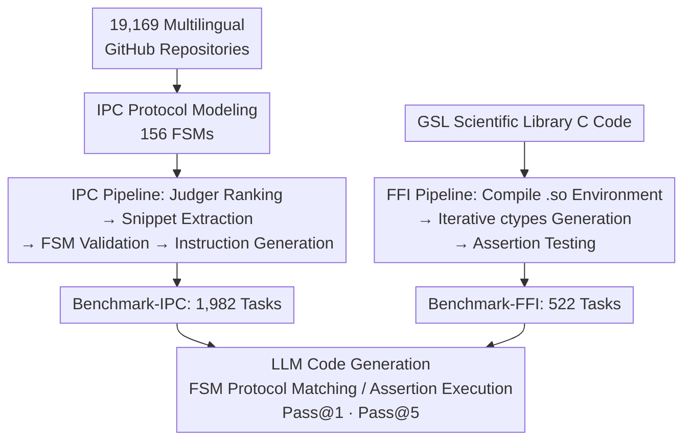

# CrossPL: Systematic Evaluation of Large Language Models for Cross Programming Language Interoperating Code Generation

**Conference**: ICLR 2026  
**OpenReview**: [https://openreview.net/forum?id=p4ERSIzHdL](https://openreview.net/forum?id=p4ERSIzHdL)  
**Code**: https://github.com/newxzh/crosspl (Available)  
**Area**: Code Intelligence / LLM Evaluation / Benchmark  
**Keywords**: Cross-language interoperability, IPC, FFI, Finite State Machine, Code generation evaluation

## TL;DR
CrossPL is the first benchmark to systematically evaluate the "cross-programming-language (CPL) interoperating code" generation capabilities of LLMs. By using 156 finite state machines (FSM) to mine 1,982 IPC tasks from 19,000 multi-language GitHub repositories and constructing 522 Python–C FFI tasks using the GSL library, evaluations of 20 mainstream models reveal a critical weakness: models achieving 90%+ Pass@1 on single-language generation score at most 19.5% Pass@1 on FFI interoperability.

## Background & Motivation
**Background**: Existing benchmarks for evaluating LLM coding capabilities (e.g., HumanEval, MBPP, ClassEval, SWE-bench, and even multilingual ones like HumanEval-X, MultiPL-E, CRUXEVAL-X) focus almost entirely on code generation or translation **within a single language**. LLMs exhibit strong performance on these tasks, with many models exceeding 90% Pass@1.

**Limitations of Prior Work**: Over 80% of real-world software systems utilize more than two programming languages to leverage their respective strengths (e.g., C for performance, Python for glue code and libraries). However, existing multilingual benchmarks only "translate the same problem into N languages and evaluate them in isolation," failing to test the coordination and mutual calling between two languages. Specifically, it remains unknown whether LLMs can correctly write CPL code, such as enabling Python and C++ to communicate via Sockets or allowing Python to call C functions via ctypes.

**Key Challenge**: CPL interoperability code in real-world projects is "sparse and implicit," scattered throughout large repositories with poorly defined boundaries. Furthermore, the two primary mechanisms for interoperability—Inter-Process Communication (IPC, such as Sockets, gRPC, or message queues) and Foreign Function Interface (FFI, such as calling C via ctypes)—are extremely sensitive to protocol sequences, serialization, function signatures, type conversions, and memory layouts. Minor errors can lead to deadlocks, message loss, or undefined behavior. Automatically collecting such code while ensuring automated correctness verification is inherently difficult.

**Goal**: This work aims to (1) automatically **construct** a CPL interoperability benchmark covering both IPC and FFI, and (2) design an **automated scoring** evaluation protocol to quantify the real-world performance of 20 LLMs in cross-language interoperability.

**Key Insight**: The authors observed that IPC interactions naturally follow an "initialization → data transfer → termination" workflow with explicit states and deterministic transitions, which can be formally characterized and validated using **Finite State Machines (FSM)**. For FFI, where reproducing dependency environments is difficult, the authors focused on the high-value Python–C pair and utilized the self-contained, compilable GNU Scientific Library (GSL) as a base to create executable environments.

**Core Idea**: By using "FSM-formalized IPC protocols + GSL controlled compilation environments for FFI + two automated LLM pipelines for task generation and scoring," the authors transformed difficult-to-collect and evaluate CPL code into a benchmark with 2,534 tasks and automated scoring.

## Method

### Overall Architecture
The CrossPL pipeline consists of three modules: (1) **Mining and modeling IPC interoperability patterns from multilingual repositories**, which involves repository selection and abstracting IPC interactions into FSMs; (2) **LLM pipeline for CrossPL-IPC construction and evaluation**, using FSMs to identify, extract, and validate IPC snippets in repositories, generating natural language instructions via LLMs, and finally using FSMs to verify the generated code; (3) **LLM pipeline for CrossPL-FFI construction and evaluation**, using GSL C code as the source to iteratively generate Python–C ctypes calls within a pre-compiled `.so` environment, verified by assertion tests. The result is 2,534 tasks (1,982 IPC tasks across 6 languages and 522 Python–C FFI tasks), evaluated using the Pass@k metric.

### Key Designs

**1. Formalizing IPC Protocols with 156 FSMs: Dual Role as Collector and Scorer**
IPC code in real repositories is sparse and implicit, involving various mechanisms (Pipe, TCP, UDP, HTTP, Websocket, gRPC, message queues). Manual or fuzzy match collection is slow and prone to errors. The authors modeled the interaction process of each IPC technology as an FSM: states correspond to key protocol steps (e.g., for Sockets: `Socket()→Bind()→Listen()→Accept()→Send()/Receive()→Close()`), and transitions correspond to deterministic flows between steps. Compared to the previous PolyFax which defined only 8 coarse-grained FSMs relying on fuzzy matching, this work designed 156 **scenario-level** fine-grained FSMs. These FSMs serve two purposes: during **construction**, they act as static analysis tools to precisely identify and extract "minimal and logically complete" IPC snippets; during **evaluation**, they act as scorers by performing protocol matching on the generated code, capturing subtle violations like missing states or incorrect timing.

**2. Multi-role LLM Pipeline for CrossPL-IPC: Judger → Extractor → Instructor Relay**
Simply having FSMs is insufficient to convert code instances into tasks with natural language instructions. The authors employed DeepSeek-V3 to build a multi-role pipeline: first, the **Judger** confirms whether the code implements IPC and distinguishes between function-level or class-level code; next, the **Function/Class-Extractor** extracts the minimal complete snippet guided by specific descriptions and one-shot examples; the snippet then undergoes **FSM validation**, with up to **five retries at higher temperatures** if it fails; once validated, the **Instructor** generates the natural language task description. Each task is stored as structured JSON with metadata (file path $p$, interaction type $\tau$, technology $\theta$, language $L$, FSM ID $\sigma$, key steps $K$).

**3. CrossPL-FFI via Python–C + GSL Controlled Environment: Enabling Execution**
The FFI language pair space is vast, and real-world scenarios have complex dependencies, making large-scale execution environments difficult to reproduce. The authors made two key decisions: first, focusing **only on Python–C**, the most representative high-value pair where C provides performance/memory control and Python provides ecosystem simplicity; second, using the **GNU Scientific Library (GSL)** as the C source due to its self-contained and stable compilation. The pipeline compiles GSL into a shared object `.so` file, cleans the C source, and uses LLMs to iteratively generate and correct ctypes wrappers and solutions. Correct solutions are identified via execution in the environment; names are extracted for instructions, and generated code is verified with automatically generated assertion tests.

**4. Unified Scoring with Unbiased Pass@k**
Both subsets use the unbiased Pass@k metric from HumanEval to measure functional correctness:
$$\text{pass@}k := \mathbb{E}_{\text{Problems}}\left[1-\frac{\binom{n-c}{k}}{\binom{n}{k}}\right]$$
where $n$ is the total number of samples, $c$ is the number of correct samples, and $k$ is the top-$k$ selection. Evaluations include Pass@1 (greedy decoding) and Pass@5 (temperature 0.2, top-p 0.95). "Correctness" in IPC is defined as protocol matching with the FSM, while in FFI it is defined as passing assertion tests in the controlled environment.

### Loss & Training
This study focuses on benchmarking and evaluation; no model training was performed. DeepSeek-V3 was used as the engine for the construction pipeline. Evaluation covered 20 models, with closed-source models accessed via APIs and small open-source models (e.g., LLaMA3-8b, Gemma-7b) deployed locally on RTX 3090 GPUs using Ollama.

## Key Experimental Results

### Main Results
Covering 20 representative LLMs, the study addressed three Research Questions (RQ): IPC generation (RQ1), FFI generation (RQ2), and model characteristics (RQ3).

| Subset / Perspective | Metric | Best Model | Worst Model | Baseline Comparison |
|------|------|------|------|------|
| CrossPL-FFI (Python–C) | Pass@1 | GPT-4o: 19.54% | Llama3-8b-instruct: 0.77% | Single-language benchmarks >90% |
| CrossPL-FFI (Python–C) | Pass@5 | GPT-4o: 26.46% | Llama3-8b-instruct: 3.95% | — |
| CrossPL-IPC (Language) | Pass@1 | Best on C++ | Weakest on Go | — |
| CrossPL-IPC (Technology) | Pass@1 | Best on High-level (e.g., gRPC) | Weakest on Low-level (e.g., Pipe, HTTP) | — |

**Core Contrast**: Models that achieve 90%+ Pass@1 on single-language generation experience a vertical drop to under 20% on CPL interoperability (especially FFI), highlighting a significantly overlooked blind spot in current LLM capabilities.

### Ablation Study
The authors replaced roles in the pipeline with Qwen3-4B to quantify the contribution of "model scale" to construction quality:

| Replacement Configuration | Change in Valid Samples | Note |
|------|---------|------|
| Replace Extractor (IPC) | 1,982 → 1,723 (−259) | IPC extraction is sensitive to model capability. |
| Replace Instructor (IPC) | 1,982 → 1,890 (−72) | Instruction generation is shallow reasoning; minimal impact. |
| Replace Extractor (FFI) | 522 → 65 (Sharp Drop) | High-quality FFI construction depends heavily on strong models. |

### Key Findings
- **Think mode is only effective for FFI**: The Qwen3 series with think mode enabled showed significant gains in FFI (which requires reasoning on linking, types, and memory) but provided little to no benefit for IPC, where performance relies on structured communication patterns already covered in training data.
- **Model scale role distribution**: IPC Judger/Instructor roles require shallow reasoning and can theoretically be replaced by smaller models; however, smaller models have higher false positive rates, leading to excessive extraction attempts. The FFI pipeline (analyzing C, generating solutions/assertions) strongly benefits from larger models.
- **Data Leakage Control**: IPC samples grouped by year (2024–2025 accounting for 69.48%) showed no systematic improvement on newer samples. For FFI, prompt overlap with the original library was negligible (0.61% function names, 0.99% class names).
- **Failure Types**: Failures for GPT-4o in FFI were categorized into six types, including symbol resolution, runtime errors, and memory crashes, reflecting a fundamental lack of understanding in low-level code and CPL domains.

## Highlights & Insights
- **Dual-use of FSMs**: Using FSMs as both "collectors" and "scorers" solves the difficulty of identifying sparse IPC code and provides protocol-level scoring that captures semantic violations beyond mere execution success.
- **Engineering Solution for Execution**: The authors addressed the reproducibility of FFI environments by combining specific language pairs, self-contained libraries, and pre-compiled environments, a strategy transferable to other complex code benchmarks.
- **Significant Performance Gap**: The contrast between 90%+ single-language scores and <20% cross-language scores clearly demonstrates that current benchmarks overestimate the engineering capabilities of LLMs.
- **Task Generation Paradigm**: The "strong model generation/scoring + failure feedback iteration" pipeline can be reused for other benchmarks requiring executable reference solutions.

## Limitations & Future Work
- **FFI Pair Coverage**: Currently only covers Python–C. Whether conclusions generalize to Java–C or Go–C remains unknown.
- **FSM Dependency**: Evaluation depends on the coverage and correctness of the 156 FSMs; matching might be overly strict for legitimate but non-standard implementations.
- **Domain Bias**: Using GSL as a base may bias FFI tasks toward scientific computing, potentially overlooking systems programming or graphics scenarios.
- **Construction Dependence**: The pipeline quality is tied to DeepSeek-V3, as shown by the sharp drop in quality when using smaller models.
- **Future Directions**: Expanding language pairs and protocols, incorporating more base libraries, and exploring CPL-specific fine-tuning to bridge the identified capability gap.

## Related Work & Insights
- **vs HumanEval / MBPP / ClassEval / SWE-bench**: These benchmarks perform single-language evaluation. This work reveals a blind spot where models excel at isolated functions but fail at collaboration.
- **vs HumanEval-X / MultiPL-E / CRUXEVAL-X / Multi-SWE-bench**: These cover "multilingual" tasks (translating one problem to many languages) but do not test the "cross-language interoperability" where two languages work together in one system.
- **vs PolyFax**: PolyFax uses only 8 coarse-grained FSMs for classification. This work utilizes 156 scenario-level FSMs for both precise extraction and protocol-level scoring.

## Rating
- Novelty: ⭐⭐⭐⭐⭐ First systematic benchmark for CPL interoperability (IPC+FFI).
- Experimental Thoroughness: ⭐⭐⭐⭐⭐ 20 models × 2,534 tasks, includes ablation and leakage analysis.
- Writing Quality: ⭐⭐⭐⭐ Motivation and design are clear; some construction details are in appendices.
- Value: ⭐⭐⭐⭐⭐ Highlights a major blind spot and provides a methodology for future improvements.

<!-- RELATED:START -->

## Related Papers

- [\[ICLR 2026\] Evolving Graph Structured Programs for Circuit Generation with Large Language Models](evolving_graph_structured_programs_for_circuit_generation_with_large_language_mo.md)
- [\[ACL 2026\] Across Programming Language Silos: A Study on Cross-Lingual Retrieval-Augmented Code Generation](../../ACL2026/code_intelligence/across_programming_language_silos_a_study_on_cross-lingual_retrieval-augmented_c.md)
- [\[AAAI 2026\] SPAN: Benchmarking and Improving Cross-Calendar Temporal Reasoning of Large Language Models](../../AAAI2026/code_intelligence/span_benchmarking_and_improving_cross-calendar_temporal_reasoning_of_large_langu.md)
- [\[ICLR 2026\] LearNAT: Learning NL2SQL with AST-guided Task Decomposition for Large Language Models](learnat_learning_nl2sql_with_ast-guided_task_decomposition_for_large_language_mo.md)
- [\[ICLR 2026\] Agnostics: Learning to Synthesize Code in Any Programming Language with a Universal Reinforcement Learning Environment](agnostics_learning_to_synthesize_code_in_any_programming_language_with_a_univers.md)

<!-- RELATED:END -->
