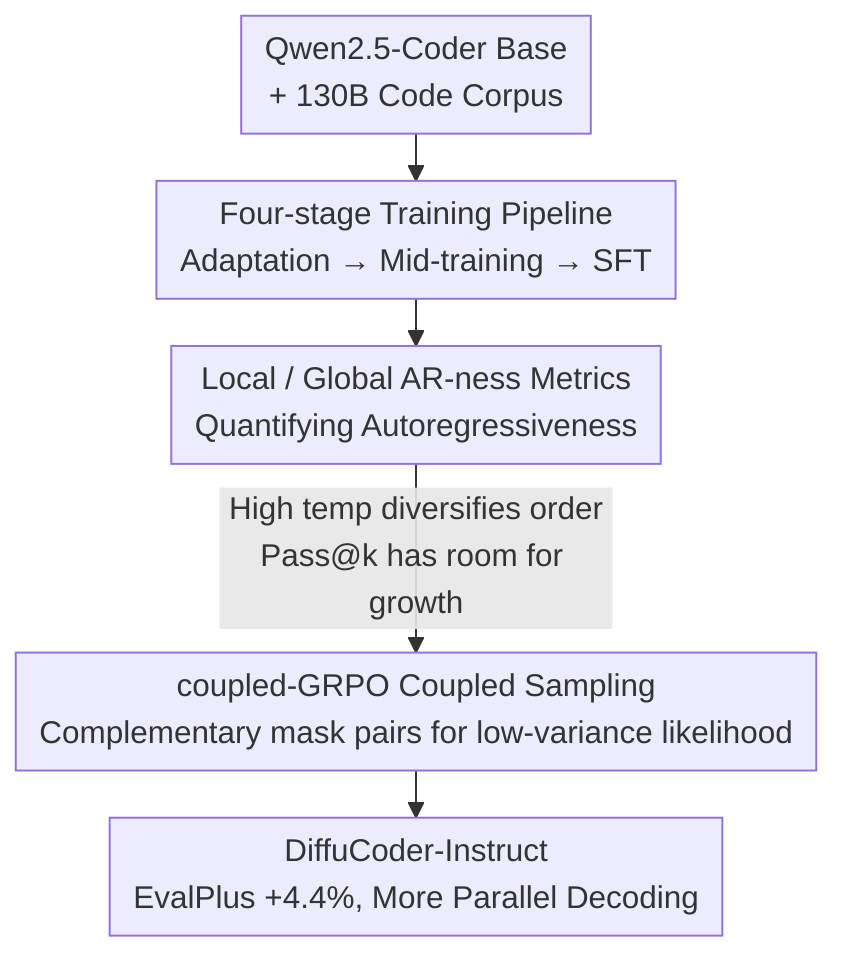

# DiffuCoder: Understanding and Improving Masked Diffusion Models for Code Generation

**Conference**: ICLR 2026  
**OpenReview**: [https://openreview.net/forum?id=58NA3unZj5](https://openreview.net/forum?id=58NA3unZj5)  
**Code**: https://github.com/apple/ml-diffucoder (Available)  
**Area**: Code Generation / Diffusion Language Models / Reinforcement Learning  
**Keywords**: Masked Diffusion Models, dLLM, Code Generation, GRPO, Coupled Sampling

## TL;DR
This paper trains a 7B masked diffusion code model, DiffuCoder, proposes a local/global AR-ness metric system to characterize the "non-autoregressive" decoding behavior of diffusion LLMs (dLLMs), and designs coupled-GRPO (a diffusion-native RL method using complementary mask coupled sampling), achieving a 4.4% improvement on EvalPlus.

## Background & Motivation

**Background**: Current mainstream Large Code Models are almost entirely built on the Autoregressive (AR) paradigm (e.g., Qwen2.5-Coder, OpenCoder), generating tokens sequentially from left to right. Recently, Masked Diffusion Models (MDM) have been extended to diffusion LLMs (dLLM, such as LLaDA, Dream), which denoise the entire sequence in parallel and can plan content globally, reaching performance levels comparable to AR models of the same scale. Intuitively, code generation inherently fits the diffusion paradigm—the act of coding is often a non-sequential process of jumping back and forth to revise.

**Limitations of Prior Work**: How open-source dLLMs perform on code tasks and how their training/inference mechanisms can be explained remain a black box. Existing dLLM post-training methods (LLaDA1.5 uses DPO; d1 and MMaDA use GRPO) either show marginal gains or rely heavily on semi-AR decoding (i.e., block decoding, which segments the sequence into small blocks for sequential generation). Semi-AR decoding re-introduces causal bias into the generation process, deviating from the "global planning" essence of diffusion.

**Key Challenge**: On one hand, there is a desire to utilize the non-autoregressive characteristics of diffusion (parallelism, global planning). On the other hand, the extent to which existing dLLMs are truly "non-autoregressive" has not been quantified. Furthermore, when applying GRPO to diffusion, token likelihood can only be estimated via Monte Carlo sampling—limited sampling lead to high variance and low efficiency. Consequently, d1 employs a single forward pass with a full mask, but such an estimation is biased.

**Goal**: (1) Quantify and understand how the decoding behavior of dLLMs differs from AR models; (2) Design an RL post-training method that does not rely on semi-AR and respects the non-autoregressive nature of diffusion.

**Key Insight**: The authors first construct a strong dLLM testbed (DiffuCoder, trained on 130B code tokens) and then use custom AR-ness metrics to decompose its decoding patterns. They discover that "sampling temperature not only diversifies token selection but also diversifies generation order," providing a rich search space for RL rollouts. Following this observation, they design coupled sampling to reduce the variance of likelihood estimation.

**Core Idea**: Use a pair of complementary masks for coupled sampling to achieve an unbiased, low-variance estimation of token log-likelihood while ensuring full token coverage, transforming GRPO into the diffusion-native coupled-GRPO.

## Method

### Overall Architecture

The work of DiffuCoder consists of three phases: adapting an AR code model into a 7B diffusion code model (via a four-stage pipeline), analyzing its decoding behavior using the newly proposed AR-ness metrics (understanding phase), and designing coupled-GRPO for reinforcement learning post-training based on the analysis. The input is a Qwen2.5-Coder base + large-scale code corpus, and the output is the RL-enhanced DiffuCoder-Instruct with more parallel decoding.

The basic setup of masked diffusion: the forward process gradually corrupts $x_0$ into a noisy sequence with [MASK], while the reverse process learns a denoiser $f_\theta$ to reconstruct the masked tokens. The training objective is the weighted cross-entropy derived from ELBO: $L_t = \frac{1}{t}\mathbb{E}_q[-\sum_n \delta_{x_t^n,m}\,(x_0^n)^\top \log f_\theta(x_t)^n]$, where loss is calculated only at masked positions.

### Key Designs

**1. Four-stage Training Pipeline: Adapting AR Code Base to Diffusion**

To perform diffusion-native RL, a sufficiently strong diffusion base is required. Instead of training from scratch, the authors adapt Qwen2.5-Coder using the adaptation method by Gong et al. to transform the AR model into a masked diffusion model. The pipeline consists of four stages: **Stage 1 Adaptation Pre-training** (RefineCode + Stackv2 code corpus, packed, unconditional); **Stage 2 Mid-training** (annealing stage using OpenCoder data, 4 epochs totaling 65B tokens); **Stage 3 Instruction Tuning** (OpenCoder's 436K SFT samples, padded, conditional, enhancing instruction following); **Stage 4 coupled-GRPO** post-training (see Design 3).

A key engineering insight is that data quality is more important than quantity: training with 700B tokens in Stage 1 actually performed worse on downstream validation than using only 65B. The authors hypothesize that continual pre-training is highly sensitive to data quality, leading them to early-stop Stage 1 and use 65B tokens as the starting point for Stage 2. Ultimately, after 130B code tokens (Stage 1+2), DiffuCoder's base performance is on par with Qwen2.5-Coder and OpenCoder. However, all dLLMs show only marginal improvements after instruction tuning, far less than the gains seen in AR models with the same SFT data. This "instruction tuning utility gap" motivated the transition to RL.

**2. Local/Global AR-ness Metrics: Quantifying Decoding Behavior**

To leverage the benefits of non-autoregressive generation, it is necessary to know how non-autoregressive the dLLM actually is. The authors define two metrics. **Local AR-ness@k (next-token mode)**: Measures the proportion of steps where a newly revealed token and its previous $k$ generated tokens form a strictly continuous increasing sequence—evaluating "whether it is doing next-token prediction." **Global AR-ness@k (earliest-mask mode)**: Measures the average proportion of steps where the revealed token falls within the $k$ leftmost remaining mask positions—evaluating the tendency to fill from left to right. For pure AR decoding, both metrics are equal to 1.

Based on these metrics, several insights emerge: (1) dLLM decoding is indeed less AR—a significant portion of tokens are recovered neither from the leftmost mask nor from the immediate next position, yet both metrics are closer to 1 than 0, indicating that text inherently possesses AR structure captured by the model; (2) **Entropy Sink phenomenon**: At the first forward step, the confidence of each position forms an "L" shape. Positions immediately following the prefix receive stronger positional signals and closer context, resulting in disproportionately high confidence; (3) Code shows lower global AR-ness and higher variance compared to mathematics—the model tends to generate tokens at the end first and leave gaps at the beginning, mimicking how programmers jump around while coding; (4) **Dual role of temperature**: In AR models, temperature only affects token selection; in dLLMs, it affects both token selection and generation order. Increasing temperature from 0.2 to 1.0~1.2 significantly reduces AR-ness and boosts pass@k, revealing latent capabilities that can be "elicited" by RL.

**3. coupled-GRPO: Low-variance, Full-coverage Likelihood Estimation**

By viewing the diffusion process as an MDP (state $s_t=(c,t,x_t)$, action $a_t=x_{t-1}$), GRPO can be applied. The bottleneck is the Monte Carlo estimation of token log-likelihood: $L_t$ only calculates loss on masked positions, which is inefficient and high-variance when sampling is limited. The baseline d1 masks all completion tokens for a single forward pass (equivalent to sampling at $t=T$), but due to the entropy sink, high-entropy tokens cluster on the left, causing RL to over-update early tokens, leading to biased estimation. d1 also randomly masks 15% of condition tokens, which makes completion likelihood estimation unreliable for code tasks requiring token-level precision.

The **coupled-GRPO** approach utilizes **coupled sampling**: taking $\lambda$ pairs of timesteps satisfying $t+\hat{t}=T$, the model samples two **complementary masks** for the same completion. Each mask covers a subset of tokens such that their union covers all tokens exactly once. The log-likelihood is estimated as:
$$\log \pi_\theta(o_i^k \mid c, o_{i,t<T}^k) = \frac{1}{\lambda+1}\Big[\sum_{t+\hat{t}=T}\big(L_t(x_t)+L_{\hat t}(x_{\hat t})\big)+L_T(x_T)\Big]_i^k,\quad \delta_{x_t,m}+\delta_{x_{\hat t},m}=1.$$
This ensures that (1) every token's log-likelihood is calculated at least once, receiving a non-zero learning signal; (2) tokens are evaluated under realistic partially masked contexts rather than always full masks, providing more accurate estimation with $2\lambda$ additional samples. In practice, $\lambda=1$. The authors prove its variance reduction properties through the lens of antithetic variates. Advantages are calculated using group relative advantage $A_i = r(o_i)-\frac{1}{G}\sum_j r(o_j)$; rewards consist of code format rewards and test case pass rates (correctness reward).

### Loss & Training
During the RL phase, 21K hard samples with verifiable test cases are selected from Acecoder-87K. The rollout temperature is set to 1.2 (corresponding to higher pass@10). Training is conducted using the Open-R1 codebase on 8~10 nodes (8×H100 per node). The GRPO objective uses PPO-style clipping and KL penalty. An interesting phenomenon is that RL fine-tuning pushes the optimal inference sampling temperature from 0.2 to 0.3~0.4, indicating that training sharpens the per-token distribution.

## Key Experimental Results

### Main Results

Comparison of 7/8B scale code benchmarks (EvalPlus = mean of HE+ and MBPP+; ± denotes absolute change of Instruct relative to base):

| Model | HumanEval+ | MBPP+ | EvalPlus | BigCodeBench(C) Full |
|------|-----------|-------|----------|----------------------|
| Qwen2.5-Coder (base) | 51.8 | 61.4 | 56.6 | 46.1 |
| DiffuCoder (base) | 60.4 | 60.9 | 60.6 | 40.2 |
| Dream-Instruct | 53.7 | 56.1 | 54.9 | 10.6 |
| DiffuCoder-Instruct | 65.2 | 61.9 | 63.6 | 35.7 |
| **+ coupled-GRPO** | **68.3** (+7.9) | **67.5** (+6.6) | **67.9** (+7.3) | 40.4 |

The DiffuCoder base competes with Qwen2.5-Coder/OpenCoder after 130B tokens. coupled-GRPO increases EvalPlus by 4.4% relative to Instruct using only 21K samples.

### Ablation Study

GRPO post-training variants (HumanEval / MBPP / BigCodeBench, best of temperature set {0.2, 0.3, 0.4}):

| Configuration | HumanEval+ | MBPP+ | Description |
|------|-----------|-------|------|
| DiffuCoder-Instruct | 65.2 | 61.9 | Baseline |
| + coupled-GRPO | 68.3 (+3.1) | 67.5 (+5.6) | Full Method |
| + coupled-GRPO (LOO) | 62.2 (−3.0) | 68.5 (+6.6) | Leave-one-out unbiased advantage |
| w/ full mask completion | 59.1 (−6.1) | 65.1 (+3.2) | Degradation to d1-style full mask |
| w/ decoupled sampling | 62.8 (−2.4) | 66.4 (+4.5) | Equal sample count without complementary constraint |

### Key Findings
- **Coupled sampling is critical**: Full mask (d1-style) and decoupled sampling (same sample count, random mask) are unstable in reward curves. HumanEval+ scores drop by 6~9 points compared to the full method, proving that the "complementary constraint" rather than higher sample count is the source of gain.
- **Rollout temperature sensitivity**: A temperature of 1.2 outperforms 1.0, consistent with pass@10 trends; higher temperatures provide greater rollout diversity, creating space for RL reinforcement.
- **Decreased AR-ness leads to parallel speedup**: After coupled-GRPO, global AR-ness decreases. Performance degradation when halving decoding steps (≈2× speedup) is smaller than before RL, indicating improved parallelism.
- **Optimal temperature sharpening**: Post-RL optimal temperature shifts from 0.2 to 0.3~0.4, consistent with recent AR LLM RL findings, suggesting these methods are transferable to dLLMs.

## Highlights & Insights
- **AR-ness metrics quantify non-AR behavior**: The combination of local/global perspectives and entropy sink analysis provides the first systematic characterization of dLLM decoding order. These metrics are applicable to structural analysis of any masked diffusion model.
- **Temperature as a "double knob" in dLLMs**: It simultaneously controls token selection and generation order. This observation explains why high temperature expands the pass@k search space, serving as a conceptual prerequisite for combining RL with diffusion.
- **Complementary mask = Antithetic variate variance reduction**: Using a pair of complementary masks ($t+\hat{t}=T$) achieves full coverage and variance reduction. This is an elegant application of classical Monte Carlo techniques to dLLM likelihood estimation, transferable to any diffusion post-training requiring ELBO-style token likelihood.
- **Independence from semi-AR**: Unlike d1/MMaDA, coupled-GRPO respects the global parallel nature of diffusion throughout, demonstrating that diffusion-native RL is feasible and effective.

## Limitations & Future Work
- Experiments are concentrated on three Python code benchmarks (HumanEval/MBPP/BigCodeBench) and do not cover multilingual, repository-level, or complex reasoning tasks. The claim that "code is better suited for diffusion" relies on indirect global AR-ness evidence.
- coupled-GRPO was only verified for $\lambda=1$; the variance-cost trade-off for larger $\lambda$ is only discussed in the appendix. Coupled sampling requires two forward passes, adding overhead relative to full-mask baselines.
- The explanation for the entropy sink (stronger positional signals leading to high confidence) is hypothetical and lacks mechanistic proof.
- Gains on harder subsets like BigCodeBench-Hard are occasionally inconsistent, indicating RL instability on high-difficulty tasks.

## Related Work & Insights
- **vs d1 / MMaDA**: These also use GRPO for dLLMs but rely heavily on block/semi-AR decoding and use biased, shifted full-mask forward passes for likelihood estimation. This paper uses complementary mask coupled sampling for unbiased low-variance estimation without semi-AR dependency.
- **vs LLaDA / Dream**: These are also open-source dLLMs, but this work focuses specifically on code and provides quantifiable behavior analysis (AR-ness, entropy sink) along with a native RL framework.
- **vs VRPO / DDPO / DPPO**: DDPO/DPPO treat continuous diffusion as an MDP for policy optimization; VRPO introduces efficient DPO sampling for dLLMs. This work follows the MDP perspective but addresses the variance issue in GRPO likelihood estimation specifically for discrete diffusion.

## Rating
- Novelty: ⭐⭐⭐⭐⭐ AR-ness metrics + complementary mask coupled sampling are original contributions to diffusion code RL.
- Experimental Thoroughness: ⭐⭐⭐⭐ Extensive decoding analysis and ablations, though benchmarks are Python-centric and $\lambda$ validation is limited.
- Writing Quality: ⭐⭐⭐⭐⭐ Clear logical progression from "understanding decoding" to "designing RL" with excellent visual aids.
- Value: ⭐⭐⭐⭐⭐ Open-sourcing 7B Diffusion Code Model + Diffusion-native RL framework provides a foundation for dLLM post-training.

<!-- RELATED:START -->

## Related Papers

- [\[ACL 2026\] CodeRL+: Improving Code Generation via Reinforcement with Execution Semantics Alignment](../../ACL2026/code_intelligence/coderl_improving_code_generation_via_reinforcement_with_execution_semantics_alig.md)
- [\[ICML 2026\] Locally Coherent Parallel Decoding in Diffusion Language Models](../../ICML2026/code_intelligence/locally_coherent_parallel_decoding_in_diffusion_language_models.md)
- [\[ICLR 2026\] Improving Code Localization with Repository Memory](improving_code_localization_with_repository_memory.md)
- [\[AAAI 2026\] Towards Better Code Understanding in Decoder-Only Models with Contrastive Learning](../../AAAI2026/code_intelligence/towards_better_code_understanding_in_decoder-only_large_language_models_via_hie.md)
- [\[AAAI 2026\] DiffBench Meets DiffAgent: End-to-End LLM-Driven Diffusion Acceleration Code Generation](../../AAAI2026/code_intelligence/diffbench_meets_diffagent_end-to-end_llm-driven_diffusion_ac.md)

<!-- RELATED:END -->
