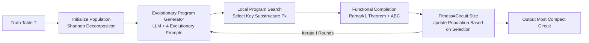

# Evolving Graph Structured Programs for Circuit Generation with Large Language Models

**Conference**: ICLR 2026  
**OpenReview**: [https://openreview.net/forum?id=DUtS9K9HH6](https://openreview.net/forum?id=DUtS9K9HH6)  
**Code**: [MIRALab-USTC/CircuitEvo](https://github.com/MIRALab-USTC/CircuitEvo)  
**Area**: Code Intelligence / LLM Program Synthesis  
**Keywords**: Logic Synthesis, Circuit Generation, LLM-based Algorithm Design, Evolutionary Program Generation, EDA  

## TL;DR
CircuitEvo encodes circuit graphs into "Graph-structured Programs," an LLM-friendly text format, and iteratively generates compact circuits using LLM + evolutionary prompting strategies. It features a theoretically guaranteed "Structure-aware Functional Completion" module to ensure correctness, making it the first LLM-based logic synthesis method capable of continuously compressing circuit size while guaranteeing 100% functional accuracy.

## Background & Motivation
**Background**: Logic Synthesis (LS) is the initial step in the chip design EDA flow. The goal is to transform truth tables (behavioral descriptions) into gate-level circuits, minimizing circuit size (node count) while ensuring total functional correctness. Since initial circuit quality determines subsequent optimization and final chip Power/Performance/Area (PPA), this is an NP-hard combinatorial optimization problem. Traditional industrial and academic tools rely on manual heuristics (SOP, BDD), though learning-based methods have recently emerged.

**Limitations of Prior Work**: Learning-based methods follow two paths: representing circuits as sequences/tree-like Boolean expressions for symbolic regression (Boolformer, DSR, SPL), or representing circuits as And-Inverter Graphs (AIG) for deep learning-based generation (DNAS). However, these non-textual representations are unfriendly to LLMs, and they generally **struggle to balance "compact structure" and "functional correctness"**: they either sacrifice accuracy for smaller size or add redundant structures for correctness. LLM-based ICSR achieved only 83.5% accuracy, failing the 100% correctness constraint required for circuits.

**Key Challenge**: While LLMs possess powerful generation and algorithm design capabilities, their precision in understanding graph functions (Boolean logic) is poor; randomly generated circuits cannot guarantee bit-wise correctness. Conversely, circuit tasks have zero tolerance for errors—a single bit error renders the design useless. The key is "leveraging the LLM's exploration of compression space without being undermined by its logical hallucinations."

**Goal**: Continuously and iteratively compress circuit size while ensuring generated circuits 100% satisfy the truth table.

**Core Idea**: **[Representation] Rewrite circuit graphs into Graph-structured Programs** for LLM readability and writability; **[Generation] Drive LLM with evolutionary prompting** to explore compact solutions; **[Guarantee] Use a theoretically guaranteed functional completion module** to force "approximately correct" LLM-generated circuits into "entirely correct" ones, thereby decoupling LLM creativity from rigid circuit correctness constraints.

## Method

### Overall Architecture
CircuitEvo maintains a population of functionally correct circuit programs. Each iteration involves two steps: first, the Evolutionary Program Generator samples parents from the population and generates candidate programs using four evolutionary strategies; second, a Structure-aware Functional Optimizer completes these candidates into functionally correct, compact circuits, which are then added back to the population based on fitness (size). After $I$ rounds, the most compact program is output.

### Key Designs
**1. Graph-structured Circuit Program Representation: Translating Circuits for LLM Readability** Prior works use expression trees or AIGs, which are difficult for LLMs to interpret. The programs designed for CircuitEvo consist of three sections: IO definitions (declaring input/output variables), structure descriptions (writing out each node and its input dependencies bottom-up, e.g., `node1 = X1 * X2`, explicitly encoding node connectivity), and function definitions (expressing the truth table to be satisfied via Boolean functions of primary output nodes). This format encodes topological hierarchy into text, facilitating better "reading comprehension" and generation by LLMs compared to sequence/tree representations.

**2. Evolutionary Program Generation: Guiding LLMs via Domain Prompting Strategies** Since pure zero-shot LLM generation produces poor circuit quality, the LLM is embedded into an evolutionary framework. In the initialization phase, truth tables are split using Shannon's decomposition theorem based on a variable $X_i$ into two sub-tables: $T(\cdots)=X_i\cdot T_1 + X_i' \cdot T_2$. Sub-programs are synthesized using traditional heuristics and merged to ensure initial correctness and diversity. During generation, prompts consist of three parts: specification (format + compactness goal), few-shot examples (sampled with probability $prob(P_i)=\frac{1}{\text{rank}(P_i)+1+N}$ to balance quality and diversity), and **four evolutionary strategies**—Exploration (E1/E2) for cross-over recombination and Refinement (R1/R2) for modifying Boolean operators and variable configurations. Domain constraints are also injected: identifying that outputs in multi-output circuits often share simple logic $Y_m = f_m(Y_1,\dots,Y_{m-1})$ (e.g., $Y_2 = \neg Y_1$) significantly narrows the search space.

**3. Structure-aware Functional Completion: Correcting "Approximately Correct" to "Perfectly Correct"** This is the core of the 100% accuracy guarantee. Based on Remark 1 (Circuit Function Completion Theorem): for every target Boolean function $F_i$ and LLM-generated function $F_g^i$, there exist auxiliary functions $F_{ga}^i, F_{gb}^i$ such that $F_i = (F_g^i + F_{ga}^i) * F_{gb}^i$, where $+,*$ are logical OR/AND. Auxiliary functions are converted back to truth tables $T_a, T_b$, synthesized into sub-structures $P_a, P_b$ via traditional heuristics (ABC), and fused into the original program after eliminating common subgraphs via structural hashing.

**4. Local Program Search: Pruning Before Completion to Avoid Redundancy** Direct completion might introduce redundant logic. Observing that higher precision and smaller size in the initial program lead to more compact results after completion, $n_p$ candidate sub-programs are generated for a program with $n_p$ nodes (the $i$-th candidate uses the first $i$ nodes). $P_k$ is greedily selected based on precision as the starting point for completion, removing redundant components before functional optimization.

## Key Experimental Results
Evaluations were conducted on 16 circuits across Arithmetic / Random / LogicNets / Espresso benchmarks, with scales up to 16 inputs / 69 outputs (search space $2^{69\times2^{16}}$). The backbone LLMs included Deepseek-V3, Qwen2.5-7B-Instruct, and GPT-3.5-turbo, with ABC used as the backend LS tool.

### Main Results (Accuracy & Size)

| Metric | Boolformer | SPL | DSR | ICSR | DNAS | CircuitEvo |
|---|---|---|---|---|---|---|
| Avg. Acc(%)↑ | 91.1 | 91.5 | 89.5 | 83.5 | 99.9 | **100.0** |
| Avg. Init Node↓ | 660.9 | 703.6 | 634.8 | 736.8 | 532.9 (DNAS) | **470.1** |

- CircuitEvo achieved **100% accuracy** on all circuits (a 16.5% improvement over the LLM baseline ICSR). The size was reduced by **6.74%** on average compared to SOTA, with single-circuit compression (e.g., LogicNets2, Random3) exceeding 20%.
- Post-technology mapping (mcnc.genlib) area and delay outperformed all baselines across four benchmarks, indicating compact designs translate to hardware efficiency.
- After applying optimization operators (resyn2), the final size was **11.09%** smaller than SOTA benchmarks on average, proving it provides superior initial solutions.

### Ablation Study

| Configuration | Arithmetic3 Acc/Node | Espresso4 Acc/Node | LogicNets1 Acc/Node |
|---|---|---|---|
| CircuitEvo (Full) | 100% / **1206** | 100% / **848** | 100% / **139** |
| w/o Evolution | 100% / 1229 | 100% / 940 | 100% / 148 |
| w/o Local | 100% / 1178* | 100% / 911 | 100% / 140 |
| w/o Completion | **67.8%** / 27 | **86.4%** / 9 | **70.1%** / 2 |

### Key Findings
- **Removing Functional Completion (w/o Completion) caused accuracy to crash to 60~86%**, verifying that LLMs alone cannot guarantee circuit correctness; the completion module is the fundamental source of 100% accuracy.
- **Removing Evolution/Local Search/Representation resulted in 100% accuracy but larger sizes**, confirming these modules contribute to compactness, with evolution and local search being the primary drivers of compression.
- Even using the weaker GPT-3.5-turbo yielded results comparable to Deepseek-V3, suggesting the framework itself (rather than a superior LLM) is the performance driver.

## Highlights & Insights
- **Decoupling LLM "Creativity" from Circuit "Zero-Tolerance"**: The generator explores compression while the completer guarantees correctness via theorem. This division of labor is key and avoids the dead-end of forcing LLMs to learn precise Boolean logic.
- **Value in Graph-structured Program Representation**: Encoding graph topology + function via textual programs provides a lightweight, readable interface for LLMs to handle graph tasks, potentially applicable beyond circuits to general graph structures.
- **Functional Completion Theorem is a Hardcore Contribution**: $F_i=(F_g^i+F_{ga}^i)*F_{gb}^i$ provides a computable constructive proof for correcting approximate circuits, elevating engineering tricks to theoretical guarantees.
- It represents a successful application of the "LLM + Evolutionary Program Generation" paradigm (like FunSearch/EoH) in EDA scenarios with hard constraints, demonstrating a viable path for "must be 100% correct" domains.

## Limitations & Future Work
- Evaluated circuit scales are still small (max 16 inputs), whereas real chips contain billions of transistors; scalability to industrial-grade circuits remains uncertain as the search space grows exponentially.
- Heavy reliance on external LS tools like ABC for initialization, sub-structure synthesis, and completion makes it a hybrid of "LLM exploration + traditional heuristic guarantee" rather than purely end-to-end.
- Individual circuits (LogicNets1/3) showed negative gains in size, suggesting evolutionary exploration may not always outperform traditional heuristics for certain structures.
- High generation cost and time overhead due to $4N$ LLM calls per round plus multiple iterations.

## Related Work & Insights
- **Machine Learning for LS**: Early IWLS used symbolic regression (Boolformer, DSR, SPL), while recent shifts targeted AIG + deep learning generation (DNAS). CircuitEvo takes a different path using "Program Representation + LLM Evolution."
- **LLM for Algorithm Design**: FunSearch and EoH optimize programs iteratively via LLMs. This paper treats "circuit = functionally constrained graph algorithm," migrating this paradigm to EDA and filling the "hard correctness guarantee" gap.
- **Insight**: For any task requiring LLM outputs to satisfy strict constraints (correctness/safety/physical feasibility), "LLM free exploration + provable post-processing completion/projection" is a more pragmatic route than training LLMs to learn those constraints directly.

## Rating
- Novelty: ⭐⭐⭐⭐ First application of LLM evolutionary framework to logic synthesis with guaranteed 100% correctness.
- Experimental Thoroughness: ⭐⭐⭐⭐ 16 circuits across 4 benchmarks, 3 LLMs, 7 baselines, pre/post-mapping metrics, and comprehensive ablations.
- Writing Quality: ⭐⭐⭐⭐ Clear progression from motivation to representation and completion; includes complete theorems and pseudocode.
- Value: ⭐⭐⭐⭐ Provides a practical paradigm for high-value EDA tasks. 6.74% size compression is significant for PPA.

<!-- RELATED:START -->

## Related Papers

- [\[ICLR 2026\] CrossPL: Systematic Evaluation of Large Language Models for Cross Programming Language Interoperating Code Generation](crosspl_systematic_evaluation_of_large_language_models_for_cross_programming_lan.md)
- [\[ICLR 2026\] From Large to Small: Transferring CUDA Optimization Expertise via Reasoning Graph](from_large_to_small_transferring_cuda_optimization_expertise_via_reasoning_graph.md)
- [\[ACL 2025\] Tree-of-Evolution: Tree-Structured Instruction Evolution for Code Generation in Large Language Models](../../ACL2025/code_intelligence/tree_of_evolution_code_gen.md)
- [\[ICLR 2026\] LearNAT: Learning NL2SQL with AST-guided Task Decomposition for Large Language Models](learnat_learning_nl2sql_with_ast-guided_task_decomposition_for_large_language_mo.md)
- [\[ICLR 2026\] RPG: A Repository Planning Graph for Unified and Scalable Codebase Generation](rpg_a_repository_planning_graph_for_unified_and_scalable_codebase_generation.md)

<!-- RELATED:END -->
