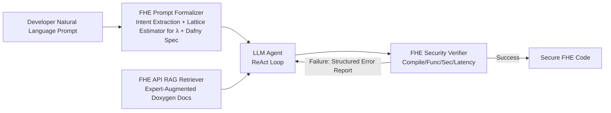

# FHE-Coder: Benchmarking Secure Agentic Code Generation for Fully Homomorphic Encryption

**Conference**: ICLR 2026  
**OpenReview**: [https://openreview.net/forum?id=4F1py5vQXm](https://openreview.net/forum?id=4F1py5vQXm)  
**Code/Homepage**: [https://fhe-coder.github.io](https://fhe-coder.github.io)  
**Area**: AI Agents for Code Generation / Privacy-Preserving Computing / Fully Homomorphic Encryption  
**Keywords**: FHE, TFHE, CKKS, LLM Agent, RAG, Security Verification, Lattice Estimator  

## TL;DR
To address the fatal blind spot where "LLM-generated FHE code is functional but cryptographically insecure," research introduces FHE-Coder, a three-stage agentic framework (Prompt Formalizer + Expert-Augmented RAG + Security Verifier). Accompanied by a new metric $Pass@1(func \ sec)$ and a 10-task benchmark, it enables various LLMs to consistently produce compilable, functionally correct, and verifiably secure homomorphic encryption code for TFHE/CKKS.

## Background & Motivation
**Background**: Fully Homomorphic Encryption (FHE) allows computation directly on ciphertexts and serves as a cornerstone of confidential computing. Schemes like TFHE (Boolean gates + programmable bootstrapping) and CKKS (approximate arithmetic over polynomial rings) have been deployed at scale by companies like Apple, Microsoft, and Zama. However, writing secure FHE programs requires precise coordination between LWE security bounds, noise growth, and parameter compatibility. The barrier to entry is extremely high; even implementing ReLU or convolutions in competitions like FHERMA remains challenging.

**Limitations of Prior Work**: Directly applying general-purpose code generation agents to FHE almost inevitably fails. Models lack an understanding of FHE program structures and cryptographic constraints, leading to frequent API hallucinations or misuse of functions that break homomorphism. Parameter configuration requires reasoning about security levels and noise budgets based on specific schemes—capabilities that standard prompting pipelines lack. Crucially, existing $Pass@k$ metrics only measure functional correctness; code that runs correctly on **plaintext** can pass unit tests while completely betraying privacy goals.

**Key Challenge**: Functional correctness $\neq$ cryptographic security. Existing "prompt-to-code" workflows and $Pass@k$ metrics implicitly assume these are equivalent. Experiments show that baseline agents have a $Pass@1(func \ sec)$ near zero for almost all tasks—meaning the code "looks runnable but is actually plaintext."

**Goal**: Establish a systematic methodology and benchmark to enable LLM agents to reliably generate **compilable, functionally correct, and verifiably secure** FHE code from natural language, elevating security to a first-class evaluation objective.

**Core Idea**: Three tightly coupled components address three failure modes: replacing probabilistic "parameter guessing" with **mathematical solving via Lattice Estimator** (Prompt Formalizer), replacing "keyword-based API retrieval" with **retrieving expert-annotated documentation based on cryptographic intent** (RAG), and replacing "functional-only testing" with **explicit security checks and iterative feedback** (Security Verifier).

## Method

### Overall Architecture
FHE-Coder is a three-stage agentic workflow based on ReAct prompting. The developer's natural language prompt is first refined by the **Prompt Formalizer** into a formal specification with security parameters. During code generation, the agent utilizes the **API RAG Retriever** to access scheme-specific documentation and examples. The generated code is then passed to the **Security Verifier** for a four-level check: compilation, functional, security, and latency. Any failure triggers a structured error report fed back to the agent for iterative correction, for a maximum of 10 rounds until security checks pass.

### Key Designs

**1. FHE Prompt Formalizer: Replacing Parameter Hallucination with Mathematical Solving**  
The most fatal failure of baseline agents is attempting to "guess" cryptographic parameters via probability, often resulting in incompatible parameters or insecure noise budgets. The formalizer converts this into **deterministic solving**: an LLM first extracts high-level intent from the user prompt, then the Lattice Estimator (Albrecht et al.) **precisely solves** for LWE parameters $\lambda$ based on the target security level (e.g., converting a vague "parameter should be 1024" into $n=1024, \lambda=128$). Subsequently, a second LLM generates a formal specification containing Dafny pseudo-code, where `ensure` statements are translated into `assert` checks in the final C++ code to force compliance with valid ciphertext structures and invariants. For composite tasks like Matrix-Vector multiplication or MLPs, **Structured Decomposition** is introduced: an agent generates and verifies secure primitives (e.g., dot product) first, which are then assembled by a "combiner" agent.

**2. Expert-Augmented RAG Retriever: Intent-Based vs. Keyword-Based Retrieval**  
Standard retrieval fails for FHE because LLMs lack the inherent structure to understand strict cryptographic APIs and "ciphertext-only" computation rules. The authors construct a human-in-the-loop knowledge base by converting documentation (docstrings) for schemes like TFHE into Doxygen format, using structured tags like `@objective` to embed machine-readable semantic descriptions. This allows the agent to retrieve compliant code snippets based on "cryptographic intent" (e.g., "how to perform bitwise AND") rather than ambiguous keywords, ensuring selected APIs adhere to noise and parameter rules.

**3. FHE Security Verifier: Elevating Security as an Explicit Gate**  
Traditional $Pass@k$ functional tests only guarantee that code matches operational intent. The verifier adds a **security check** rooted in LWE hardness: it strictly verifies (i) use of only TFHE/CKKS homomorphic APIs to prevent plaintext leakage, (ii) parameter configurations matching Lattice Estimator security values, and (iii) encryption of all inputs before use. Failure in any check labels the code as insecure. When violations are detected, a structured `Formal Error Report` drives an automated feedback loop to force the agent toward a "functionally correct and mathematically secure" solution.

## Key Experimental Results

### Main Experimental Setup
- **Benchmark**: 10 TFHE tasks categorized into Primitives (AND/ReLU/Adder/Multiplier), Linear Algebra (Vector Add/Dot Product/Mat-Vec/Mat-Mat), and Deep Learning (MLP/CNN), plus non-linear architectures like Softmax/Attention/Transformer.
- **Models**: Open-source Qwen3-Coder-480B, DeepSeek-V3.1; closed-source Gemini-2.5-Pro, GPT-5; Temperature 0.5.
- **Metrics**: $Pass@k(func)$, the newly proposed **$Pass@1(func \ sec)$** (both functionally correct **and** cryptographically secure), and Latency relative to expert code.
- **Baselines**: BAS (Single-turn direct generation), COT (Zero-shot Chain-of-Thought + one correct example).

### Main Results (GPT-5, $Pass@1_{func \ sec}$ Comparison)

| Method | Security Pass Rate | Description |
| :--- | :--- | :--- |
| BAS | ≈ 0.0 | Security near zero for almost all tasks; frequently generates plaintext implementations. |
| COT | ≈ 0.0 | Adding examples still fails to satisfy cryptographic protocols. |
| FHE-Coder | Near Perfect | Consistently produces functional and verifiably secure code across the benchmark. |

Conclusions are consistent across four LLMs: baseline security flaws are **model-agnostic**. Only FHE-Coder enables consistent secure output; performance ceilings are determined by the base model's reasoning capability (GPT-5/Gemini outperform DeepSeek/Qwen).

### Ablation Study (GPT-5, Vector Addition, $Pass@1_{func \ sec}$)

| Configuration | Security Pass Rate |
| :--- | :--- |
| BAS (Baseline) | ≈ 0.0 |
| + Prompt Formalizer (PF) | 0.6 |
| + PF + RAG | 0.8 |
| Full FHE-Coder (+ Security Verifier) | 1.0 |

### Key Findings
1. Baseline agents occasionally succeed functionally, but security pass rates are nearly zero. **Functional correctness is a misleading proxy metric for secure code.**
2. The three components are cumulative and indispensable: Formalizer handles parameters, RAG solves API hallucinations, and the Verifier provides the closed-loop fallback.
3. Gains are model-agnostic, though absolute ceilings remain constrained by the base LLM's reasoning power. High-complexity tasks (e.g., Matrix-Vector, CNN) require Structured Decomposition to maintain success rates.

## Highlights & Insights
- **The Metric Problem**: Explicitly identifies that $Pass@k(func)$ is a "false positive" metric in cryptographic programming—runnable plaintext code betrays the mission. Proposing $Pass@1(func \ sec)$ provides a more universal insight for AI safety in specialized domains.
- **Deterministic Tools over Probabilistic Guessing**: Replacing parameter "guessing" with Lattice Estimator math and solidifying specs via Dafny-to-C++ assertions is an excellent paradigm for taming LLM randomness with formal constraints.
- **Cross-Scheme Plug-and-Play**: Decoupling RAG and parameter estimators allows easy migration from TFHE to CKKS by simply replacing the document corpus.

## Limitations & Future Work
- **Base Model Constraints**: For deep circuits like Transformers, $Pass@1(func \ sec)$ drops to ~0.4, as the framework cannot fully overcome the inherent reasoning limits of the underlying model.
- **Static Security Checks**: Security verification relies on API whitelisting and static analysis. It remains unclear if this covers more subtle side-channel or implementation-level vulnerabilities.
- **Expert Annotation Costs**: The RAG knowledge base requires human-in-the-loop Doxygen enhancement, representing a one-time manual cost for migrating to new libraries.

## Related Work & Insights
- **FHE Schemes**: Focuses on TFHE and CKKS, the two most industrially relevant schemes.
- **LLM Code Gen**: While CodeGen/CodeX excel in mainstream languages, niche cryptographic libraries are difficult due to sparse documentation and strict mathematical constraints.
- **Insight**: In any domain where functional testing cannot cover deep correctness (cryptography, formal verification, safety-critical systems), the "deterministic tool solving + explicit security gate + iterative feedback" trio is a superior paradigm compared to simple prompt engineering.

## Rating
- **Novelty**: ⭐⭐⭐⭐ First framework to explicitly bridge the "functional vs. secure" gap in agentic FHE generation.
- **Experimental Thoroughness**: ⭐⭐⭐⭐ Comprehensive evaluation across 4 LLMs and 10+ tasks, including ablation and cross-scheme validation.
- **Writing Quality**: ⭐⭐⭐⭐ Clear mapping between failure modes and components.
- **Value**: ⭐⭐⭐⭐ Provides a reusable methodology for safety-critical code generation and lowering the barrier to entry for FHE.

<!-- RELATED:START -->

## Related Papers

- [\[ICLR 2026\] RESCUE: Retrieval Augmented Secure Code Generation](rescue_retrieval_augmented_secure_code_generation.md)
- [\[ICLR 2026\] VERINA: Benchmarking Verifiable Code Generation](verina_benchmarking_verifiable_code_generation.md)
- [\[ICML 2026\] CentaurEval: Benchmarking Human-in-the-Loop Value in Agentic Coding](../../ICML2026/code_intelligence/centaureval_benchmarking_human-in-the-loop_value_in_agentic_coding.md)
- [\[ICLR 2026\] Critique-Coder: Enhancing Coder Models by Critique Reinforcement Learning](critique-coder_enhancing_coder_models_by_critique_reinforcement_learning.md)
- [\[ACL 2026\] DeepGuard: Secure Code Generation via Multi-Layer Semantic Aggregation](../../ACL2026/code_intelligence/deepguard_secure_code_generation_via_multi-layer_semantic_aggregation.md)

<!-- RELATED:END -->
