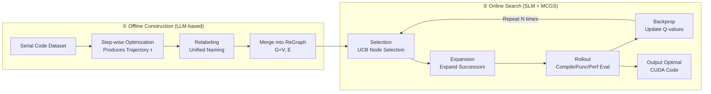

# From Large to Small: Transferring CUDA Optimization Expertise via Reasoning Graph

**Conference**: ICLR 2026  
**OpenReview**: [https://openreview.net/forum?id=vqESUhcSOG](https://openreview.net/forum?id=vqESUhcSOG)  
**Code**: [https://github.com/blacknickwield/ReGraphT](https://github.com/blacknickwield/ReGraphT)  
**Area**: Code Intelligence / CUDA Code Generation / Retrieval-Augmented Reasoning  
**Keywords**: CUDA Optimization, Small Language Models, Reasoning Graph, Monte Carlo Graph Search, Retrieval-Augmented Generation, Privacy-friendly Deployment  

## TL;DR
ReGraphT organizes CUDA optimization trajectories accumulated by large models into a reusable "Reasoning Graph." It then uses Monte Carlo Graph Search (MCGS) to guide small models (SLMs) in selecting optimization techniques step-by-step. This allows 7B-scale models to approach the CUDA code generation performance of a 671B model without training or cloud reliance, achieving an average speedup of 2.33×.

## Background & Motivation
**Background**: Automatically translating or optimizing serial code into high-performance CUDA code using LLMs is a popular research direction. Existing works like HPC-Coder enhance parallel code generation through supervised fine-tuning (SFT), while others like EVOR or Repoformer use Retrieval-Augmented Generation (RAG) to inject external knowledge.

**Limitations of Prior Work**: Locally deploying large models like DeepSeek is computationally expensive, while cloud APIs pose risks of code leakage and privacy concerns. This motivates the shift toward lightweight, locally deployable Small Language Models (SLMs). However, authors observed that while 7B/14B SLMs can match 671B models like DeepSeek-R1 on simple tasks using CoT prompting, they perform significantly fewer reasoning steps and produce lower-quality code on complex tasks.

**Key Challenge**: SLMs offer deployment advantages but lack deep multi-step reasoning capabilities. Existing enhancement routes are insufficient: SFT provides limited gains in multi-step reasoning and poor generalization, while RAG only supplements context without truly improving reasoning logic. CUDA optimization specifically requires the **combinatorial multi-step application** of techniques—such as parallelization, memory coalescing, shared memory, loop unrolling, warp divergence elimination, and fast math—which is highly reasoning-intensive.

**Goal**: Transfer the CUDA optimization reasoning capabilities of large models to small models under "training-free + local deployment + privacy-friendly" constraints.

**Core Idea**: Instead of distilling weights, **distill the "reasoning structure."** Aggregate step-by-step optimization trajectories produced by large models into a unified CUDA Reasoning Graph (nodes = optimization techniques, edges = transitions). Model CUDA optimization as state transitions on this graph and use Monte Carlo Graph Search to guide the SLM in choosing the next optimization step, enabling "graph-following" multi-step reasoning.

## Method

### Overall Architecture
ReGraphT consists of two phases: (1) **Offline Graph Construction**: Use a large model to optimize a serial code dataset step-by-step, collect optimization trajectories, and merge them into a unified directed graph (ReGraph). (2) **Online Search**: Model the SLM's CUDA optimization as state transitions on the ReGraph, using MCGS for repeated rollouts. Each rollout is scored via compilation, functional, and performance verification to find a high-speedup path and produce final code. The entire process requires no parameter updates.

### Key Designs

**1. CUDA Reasoning Graph (ReGraph): Structuring fragmented trajectories into reusable knowledge.** The authors prompt a large model to optimize serial code step-by-step, requiring each step to provide the "optimization method + optimized code + reasoning process," forming a trajectory $\tau$. Formally, ReGraph is a directed graph $G=(V,E)$, where node $v\in V$ represents a CUDA optimization technique (e.g., memory coalescing, shared memory) and edge $u\in E$ represents a valid transition. The graph allows cycles (the same optimization can be applied repeatedly). Starting from an empty graph with an initial state $v_{init}$, each trajectory is merged: if a step matches an existing node and edge, the example is appended; otherwise, new nodes/edges are created. A critical detail is **relabeling**: since LLMs use inconsistent terminology, they are prompted to normalize names against a predefined list to prevent the graph from exploding with synonyms.

**2. Modeling optimization as graph state transitions with MCGS.** With ReGraph, generating code becomes a path selection problem. Since exhaustive enumeration is $O(n^k)$, the authors propose **Monte Carlo Graph Search (MCGS)**. They adapt MCTS to the fixed graph structure: ① **Selection** uses UCB on the expanded subgraph $\text{P-UCB}(s)=Q(s)+\sqrt{\tfrac{2\ln N(s')}{N(s)}}$. ② **Expansion** unfolds all successors of a node upon its first visit. ③ **Handling Cycles**: Standard MCTS works on trees; ReGraph's cycles are addressed by specific rollout strategies.

**3. Rollout with access penalty and graded rewards.** To prevent infinite loops caused by cycles, the rollout phase shifts to a policy with a regularization term $\pi(a|s)=\arg\max_a[Q(s,a)-\lambda N(s,a)]$ or random actions (with probability $\epsilon$). The access count $N(s,a)$ penalizes repeated visits. Each rollout step evaluates the code through **compilation $\rightarrow$ functional verification $\rightarrow$ performance benchmarking**, yielding graded rewards:

$$
\text{reward}=\begin{cases}-1, & 0\le v_{test}<1\\ \text{speedup}-1, & v_{test}=1,\ \text{speedup}<1\\ \text{speedup}, & v_{test}=1,\ \text{speedup}\ge 1\end{cases}
$$

Functional failure results in $-1$; success but slower performance gives a negative signal ($\text{speedup}-1$); success and speedup yield the speedup value itself. This ensures the search prioritizes correctness before maximizing performance.

**4. CUDAEval Benchmark: Difficulty grading by reasoning complexity.** Existing benchmarks either only test correctness or lack difficulty distinction. The authors sampled 10K CUDA files from Stack v2, extracted kernels, and generated corresponding CPU serial code to create 3,126 high-quality `<C++, CUDA>` pairs. They then used DeepSeek-R1 to generate trajectories and **graded difficulty by trajectory length**: Easy (1–2 steps), Medium (3–5 steps), and Hard (longer). This fine-grained grading exposes SLM bottlenecks in multi-step reasoning.

## Key Experimental Results

Environment: A100-80GB, vLLM BF16. Metrics: pass@k (correctness) and speedup@k (performance relative to serial code).

### Main Results (CUDAEval / ParEval, Selected)

| Model | Method | CUDAEval pass@1 | CUDAEval speedup@1 | ParEval pass@1 | ParEval speedup@1 |
|------|------|----------------|--------------------|----------------|-------------------|
| DeepSeek-Coder-V2-Lite | RAG | 68.1 | 7.86 | 48.3 | 5.35 |
| DeepSeek-Coder-V2-Lite | MCTS-RAG | 71.6 | 8.09 | 51.7 | 5.78 |
| DeepSeek-Coder-V2-Lite | **ReGraphT-MCGS** | **75.1** | **14.46** | **55.0** | **10.78** |
| Qwen2.5-Coder-7B | RAG | 66.5 | 7.09 | 45.0 | 5.17 |
| Qwen2.5-Coder-7B | **ReGraphT-MCGS** | **72.2** | **14.31** | 50.0 | **10.02** |
| HPC-Coder-V2 | RAG | 64.8 | 6.44 | 38.3 | 4.51 |
| HPC-Coder-V2 | **ReGraphT-MCGS** | **72.5** | **14.39** | **53.3** | **10.61** |
| DeepSeek-R1 (671B) | CoT | 82.1 | 19.14 | 63.3 | 12.09 |

Across three SLMs, ReGraphT-MCGS achieved an average pass@k of 73.3%, outperforming Standard/CoT/RAG baselines by +11.0%/+9.0%/+6.8% respectively. The speedup@1 was at least ×1.84 better than baselines, pushing SLM speedups from the 6–8× range to the 14× range, significantly narrowing the gap with the 671B model (19×).

### Ablation Study (CUDAEval Difficulty Levels)

| Model | Method | easy pass | medium pass | hard pass | easy spd | medium spd | hard spd |
|------|------|-----------|-------------|-----------|----------|------------|----------|
| DSCoder-V2-Lite | RAG | 91.5 | 73.3 | 47.1 | 10.13 | 6.98 | 4.82 |
| DSCoder-V2-Lite | ReGraphT | 90.6 | 76.2 | 52.0 | 15.86 | 12.38 | 8.84 |
| DSCoder-V2-Lite | **ReGraphT-MCGS** | 90.6 | **79.0** | **54.9** | **17.82** | **13.79** | **9.69** |

- **MCGS vs. Naive ReGraph**: With the same search budget (200), MCGS improved pass@n by 2.2% and speedup@n by 1.33 over naive ReGraphT, demonstrating higher exploration efficiency.
- **Difficulty Dependency**: ReGraph offers little advantage on Easy tasks but its lead grows significantly on Medium/Hard tasks, confirming it effectively addresses the "multi-step reasoning" deficit.

### Key Findings
- SLM reasoning trajectories with CoT do not scale with difficulty (limited reasoning ceiling), whereas ReGraphT shows a 4.8-step average trajectory length difference between Easy and Hard tasks, proving the reasoning graph successfully "plugs in" reasoning depth.
- Performance correlates positively with reasoning chain length across all difficulties, but returns saturate after a certain threshold related to task hardness.

## Highlights & Insights
- **Transferring "Reasoning Structure" over "Weights"**: Aggregating trajectories into a graph avoids sensitivity to data recipes in distillation and generalization issues in fine-tuning.
- **Graphs fit CUDA better than Sequences/Trees**: CUDA optimizations are interdependent and repetitive. A directed graph with cycles captures this structure better than a linear CoT chain or an MCTS tree.
- **Reward tied to verifiable signals**: The graded reward system (compile + function + speedup) encodes the "correctness first, performance second" objective directly into the search.
- **Targeted Benchmarking**: CUDAEval categorizes tasks by reasoning complexity, effectively exposing the specific weaknesses of SLMs.

## Limitations & Future Work
- ReGraph is built offline from LLM trajectories; coverage and quality are bounded by the source model and dataset.
- Each rollout requires real compilation and benchmarking, introducing significant online overhead not fully analyzed in terms of wall-clock latency.
- Scalability to cutting-edge techniques like operator fusion or Tensor Core utilization remains to be verified.

## Related Work & Insights
- **Fine-tuning Route**: HPC-Coder V1/V2 and RLPF use high-quality data and RL for performance, but struggle with reasoning depth and generalization.
- **RAG Route**: EVOR and Repoformer provide contextual knowledge but do not assist with the reasoning logic itself.
- **Search-enhanced Reasoning**: Adapting MCTS (e.g., RethinkMCTS) for a cyclic graph (MCGS) provides a blueprint for other program synthesis tasks with combinatorial or cyclic actions.

## Rating
- Novelty: ⭐⭐⭐⭐ The combination of a reasoning graph and graph search for reasoning transfer is novel for CUDA optimization.
- Experimental Thoroughness: ⭐⭐⭐⭐ Covers various models and benchmarks with solid ablations, though end-to-end latency analysis is limited.
- Writing Quality: ⭐⭐⭐⭐ Logical flow from motivation to method, with clear formulas and diagrams.
- Value: ⭐⭐⭐⭐ Significant practical value for private, high-performance local code generation.

<!-- RELATED:START -->

## Related Papers

- [\[ICLR 2026\] Evolving Graph Structured Programs for Circuit Generation with Large Language Models](evolving_graph_structured_programs_for_circuit_generation_with_large_language_mo.md)
- [\[ICLR 2026\] RPG: A Repository Planning Graph for Unified and Scalable Codebase Generation](rpg_a_repository_planning_graph_for_unified_and_scalable_codebase_generation.md)
- [\[ICLR 2026\] A Problem-Oriented Perspective and Anchor Verification for Code Optimization](a_problem-oriented_perspective_and_anchor_verification_for_code_optimization.md)
- [\[AAAI 2026\] SPAN: Benchmarking and Improving Cross-Calendar Temporal Reasoning of Large Language Models](../../AAAI2026/code_intelligence/span_benchmarking_and_improving_cross-calendar_temporal_reasoning_of_large_langu.md)
- [\[ACL 2025\] GALLa: Graph Aligned Large Language Models for Improved Source Code Understanding](../../ACL2025/code_intelligence/galla_graph_aligned_large_language_models.md)

<!-- RELATED:END -->
