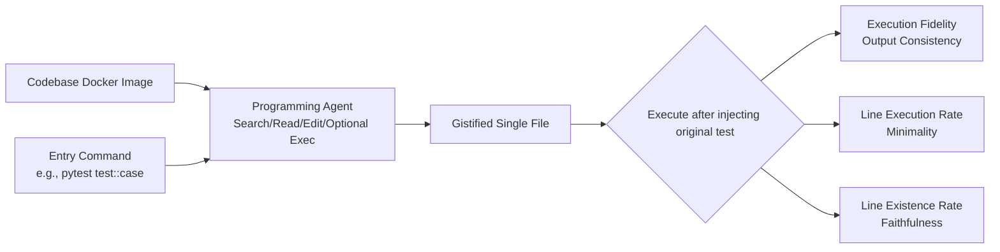

# Gistify: Codebase-Level Understanding via Runtime Execution

**Conference**: ICLR 2026  
**OpenReview**: [https://openreview.net/forum?id=nmdDgo4OXC](https://openreview.net/forum?id=nmdDgo4OXC)  
**Code**: [https://github.com/microsoft/gistify](https://github.com/microsoft/gistify)  
**Area**: Code Intelligence / Evaluation of Programming Agents  
**Keywords**: Codebase-level understanding, Runtime execution, Programming agents, Automated evaluation, Minimal reproducible file  

## TL;DR
The GISTIFY task is proposed—requiring programming agents to compress the functionality of a specific command across an entire codebase into a **single-file, self-contained, minimal, and faithful reproduction of runtime behavior**. This task rigorously evaluates a model's understanding of codebase structure and execution flow, revealing that current SOTA models frequently fail on long execution trajectories.

## Background & Motivation
**Background**: LLMs are increasingly deployed in large-scale real-world codebases for debugging and agentic code generation, requiring models to reason across files and modules over the entire execution flow rather than processing isolated snippets.

**Limitations of Prior Work**: Mainstream repository-level benchmarks (SWE-bench, RepoBench) have been shown not to truly require reasoning over complete execution trajectories—many tasks can be solved via heuristic shortcuts or local patch retrieval. Furthermore, they rely on GitHub issues/PRs for data construction, making them difficult to generalize to arbitrary (especially private) repositories.

**Key Challenge**: While the demand for deploying agents in real-world large codebases is rising, evaluations that are "automatically constructed, widely applicable, and truly test full-repo understanding" are severely lagging.

**Goal**: Design a lightweight, challenging task that can be automatically constructed for **any repository with a test suite** and must be solved by reasoning along the execution path.

**Key Insight**: **[Runtime reproduction equals understanding]**. Mimicking how developers understand unfamiliar repositories—not by reading files in isolation, but by starting from a specific entry point (e.g., a `pytest` command) and following dependencies and control flows. GISTIFY formalizes this practice: given a codebase and an entry command, the agent must generate a minimal self-contained file that runs independently and produces output identical to the original repository.

## Method

### Overall Architecture
GISTIFY is not a model but a **task + evaluation protocol + three-dimensional metrics**. The input is a Docker image containing the target codebase and an entry command (e.g., a specific test). The agent, within a 50-step budget and 128K context constraint, uses tools like search, file reading, and editing to generate a gistified file. During evaluation, the original test function is injected into the file and executed; output consistency is programmatically compared to prevent "cheating by modifying tests."

### Key Designs
**1. Four-Requirement Task Definition: Decomposing "Understanding" into Verifiable Attributes.** A qualified gistified file must simultaneously satisfy four points: **Self-contained** (inline all dependency modules to run independently of the original repo, testing understanding of cross-file relationships); **Execution Fidelity** (runtime output matches the original repo, forcing the model to capture dynamic execution rather than static patterns); **Minimality** (keep only code actually executed and necessary for the task, pruning irrelevant functions/objects); **Faithful Preservation** (all code must come directly from the original repo, forbidding hallucinated inventions). These four points translate abstract "codebase understanding" into hard, programmatically scorable indicators.

**2. Three-Dimensional Metrics Aligned with Requirements.** Execution Fidelity is a binary metric, recorded as 1 only if the file runs and the output/error trajectory matches the original: $\mathbf{1}\big[\mathrm{runs}(c,G)\wedge \mathrm{out}(c,G)=\mathrm{out}(c,C)\big]$. Line Execution Rate measures minimality, i.e., the proportion of executable lines in the file that are actually executed $\frac{1}{|L_{\mathrm{exec}}(G)|}\sum_{\ell}\mathbf{1}[\ell\text{ is executed}]$, where values closer to 100% indicate higher conciseness; it is only calculated for files that pass execution. Line Existence Rate measures faithfulness by grouping code into classes/functions/top-level blocks and matching them (normalizing for indentation, multi-line statements, and imports to avoid mismatching) to count how many lines truly originate from the original repo; 100% indicates zero hallucination.

**3. Evaluation Protocol to Prevent Cheating.** Since generated files might secretly modify tests to trick comparisons, the protocol stipulates: after the model generates the gistified file, **the test part within the file is replaced with the original test code from the source repository before execution**. This ensures evaluation measures "correct reproduction of functionality" rather than the model's tricks in rewriting tests. Consequently, the paper further finds that "faithfully reproducing the test function" itself is a strong leading signal for success.

**4. Difficulty-Controllable GISTIFY-hard Subset.** Task difficulty can be characterized by execution trajectory complexity: trajectory length (number of function calls executed) and the number of unique files touched. Taking the 30 most difficult cases from each axis yields 57 GISTIFY-hard data points, where performance drops from 43% to 21%, providing a scalable path for "automatically designing harder evaluations."

## Key Experimental Results
Settings: 3 agent frameworks (mini-SWE-agent, SWE-agent, Copilot) × 4 models (GPT-5-mini, GPT-5, Claude-3.7-Sonnet, Claude-Sonnet-4), 128K context, 50-step limit; data consisting of 5 SWE-Bench repositories (requests, pylint, flask, scikit-learn, seaborn) + 1 new repository debug-gym, with 25 tests each.

### Main Results
Execution Fidelity (without/with execution tools), Line Existence Rate and Line Execution Rate are averages of both settings:

| Framework | Model | Execution Fidelity(wo/w exec) | Line Existence Rate | Line Execution Rate |
|------|------|------|------|------|
| mini-SWE-agent | GPT-5-mini | 17.1 / 24.0 | 44.9 | 61.2 |
| mini-SWE-agent | GPT-5 | 51.0 / 54.0 | 56.8 | 83.1 |
| mini-SWE-agent | Claude-4 | 54.0 / 55.3 | 67.0 | 75.7 |
| SWE-agent | Claude-4 | 56.7 / 57.3 | 66.3 | 72.9 |
| Copilot | GPT-5 | 58.7 / 60.7 | 66.9 | 81.4 |
| Copilot | Claude-4 | 58.7 / 61.3 | 69.6 | 80.3 |

The best model, Claude-4, achieves only about a 54–61% success rate across all frameworks; GPT-5 produces the most concise output (highest Line Execution Rate).

### Ablation Study
SWE-Agent + Claude-4, 50 tests from pylint, analyzing different strategies/tools:

| Category | Setting | Execution Fidelity | Line Existence Rate | Line Execution Rate | Max Steps Reached% |
|------|------|------|------|------|------|
| — | Base GISTIFY | 42.0 | 65.0 | 58.3 | 14.6 |
| Prompt Strategy | Tracing | 48.0 | 75.4 | 62.8 | 0.0 |
| Prompt Strategy | Reading | 50.0 | 77.6 | 62.6 | 3.9 |
| Global Info Tool | RepoGraph | 52.0 | 76.1 | 60.1 | 6.0 |
| Global Info Tool | Tracing (Gold Trace) | 56.0 | 75.1 | 65.1 | 0.0 |
| Execution Tool | Bash | 52.0 | 73.1 | 64.2 | 16.0 |
| Execution Tool | Edit-and-Execute | 56.0 | 74.3 | 64.2 | 10.0 |

### Key Findings
- **Test function faithfulness is a precursor to success**: Test F1 is strongly correlated with Execution Fidelity (corr=0.76, p=0.01); feeding the correct test body directly into the prompt increases Test F1 from 68.4 to 85.3 and Execution Fidelity from 42% to 60%.
- **Execution tools are not a silver bullet**: Enabling execution tools mostly yields only marginal improvements; frontier models have not yet emerged with the ability to "use debuggers for runtime analysis." Conversely, **having fewer tools (Edit-and-Execute) performed better than opening access to Bash**—open Bash access led to random exploration, longer trajectories, and reached step limits.
- **Gold Tracing tools provide the largest gain** (56%), indicating that global execution trajectory information significantly strengthens runtime reasoning.
- **Error attribution varies by model**: GPT-5 series primarily fail due to "missing test functions" (76–78%), while Claude series fail due to import errors and pytest runtime errors; the strongest model, Claude-4, most frequently misused imports like `import requests` that should have been inlined.
- **Agents > Static**: Even when feeding all relevant gold files at once to a static LLM, its Execution Fidelity remains lower than that of agents—dynamic multi-step file selection is more effective than one-time injection; static models only peak in Line Existence Rate (due to direct copying of input).
- **High-coverage tests are harder**: As trajectories lengthen and more files are touched, the success rate decreases monotonically, with the GISTIFY-hard subset at only 21%.

## Highlights & Insights
- **Using "runtime reproduction" as a verifiable proxy for understanding**: Grounding vague "codebase understanding" into "can you reproduce the runtime behavior of this command" is harder to bypass via shortcuts than QA-style or local patch-style benchmarks.
- **Automated, generalizable, and zero-issue dependence**: Requires only a repository and a test suite to automatically generate problems for any (including private) repo, eliminating dependence on GitHub issues/PRs.
- **Artifacts are useful themselves**: Gistified files compress large system functionalities into compact executable single files, serving downstream debugging, fault localization, and minimal implementation sharing—the product of the evaluation is itself a tool.
- **Strong diagnostic power**: Three-dimensional metrics + error classification + difficulty axes allow for precise identification of "where the model is stuck" rather than just providing a total score.

## Limitations & Future Work
- **Dependence on existing test suites**: Current entry points are mainly pytest tests and do not yet cover arbitrary entries; extending to any entrypoint requires addressing non-deterministic execution issues.
- **Evaluation scale**: The main experiment uses 25 tests per repository across 5–6 repositories, which is limited in coverage (though the appendix provides larger sets to confirm consistency).
- **Comparison limited to stdout/stderr and test pass/fail**: Functionality reproduction involving side effects, randomness, or external IO has not been deeply explored.
- **Lack of training schemes**: The paper focuses on evaluation and analysis; how to use GISTIFY signals to train stronger runtime reasoning models is left for future work.

## Related Work & Insights
- **Codebase-level understanding benchmarks**: QA categories (CodeQA series), cross-file code synthesis (RepoBench, CrossCodeEval), natural language to repo mapping, etc. GISTIFY differs by forcing reasoning along the complete execution trajectory.
- **Runtime execution reasoning**: Work like CRUXEval that predicts execution trajectories/intermediate states; GISTIFY goes a step further by requiring models to not only track execution but also compress and reorganize code into a coherent file.
- **Global context tools**: Work like RepoGraph that builds codebase graphs for retrieval; Ours confirms that this and gold tracing can significantly assist.
- **Insights**: For programming agents, "whether runtime behavior can be reproduced" might be a more fundamental measure of understanding than "whether a patch can be correctly modified"; meanwhile, "more tools are not necessarily better" serves as a reminder to keep tool exposure restrained in agent design.

## Rating
- **Novelty**: ⭐⭐⭐⭐⭐ — Using "compressing functionality into a minimal reproducible single file" as a codebase understanding metric is a completely new and elegant setup that avoids shortcut vulnerabilities of existing benchmarks.
- **Experimental Thoroughness**: ⭐⭐⭐⭐ — A matrix of 3 frameworks × 4 models × 6 repositories + detailed error attribution + strategy/tool ablation + difficulty axis analysis provides relatively comprehensive coverage; the small scale and entry points limited to tests are minor drawbacks.
- **Writing Quality**: ⭐⭐⭐⭐ — Task motivation, four requirements, three metrics, and anti-cheating protocols are presented progressively; formulas and tables are clear, and conclusions are actionable.
- **Value**: ⭐⭐⭐⭐⭐ — Provides a hard benchmark that can be automatically constructed for any repository, and the artifacts themselves can be used for downstream debugging/sharing, providing dual value to both evaluation and engineering.

<!-- RELATED:START -->

## Related Papers

- [\[ACL 2026\] Can LLMs Compress (and Decompress)? Evaluating Code Understanding and Execution via Invertibility](../../ACL2026/code_intelligence/can_llms_compress_and_decompress_evaluating_code_understanding_and_execution_via.md)
- [\[ICLR 2026\] WebGen-Agent: Enhancing Interactive Website Generation with Multi-Level Feedback and Step-Level Reinforcement Learning](webgen-agent_enhancing_interactive_website_generation_with_multi-level_feedback_.md)
- [\[ICLR 2026\] SWE-RM: Execution-Free Feedback for Software Engineering Agents](swe-rm_execution-free_feedback_for_software_engineering_agents.md)
- [\[ICLR 2026\] Process-Level Trajectory Evaluation for Environment Configuration in Software Engineering Agents](process-level_trajectory_evaluation_for_environment_configuration_in_software_en.md)
- [\[ICML 2026\] Bridging Functional Correctness and Runtime Efficiency Gaps in LLM-Based Code Translation](../../ICML2026/code_intelligence/bridging_functional_correctness_and_runtime_efficiency_gaps_in_llm-based_code_tr.md)

<!-- RELATED:END -->
