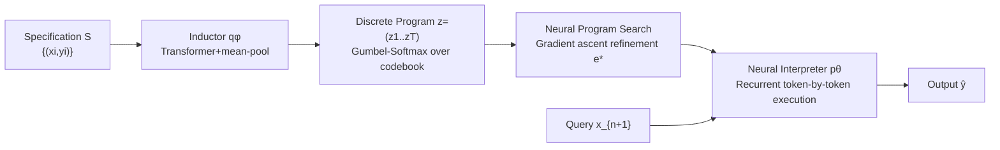

# Gradient-Based Program Synthesis with Neurally Interpreted Languages

**Conference**: ICLR 2026  
**OpenReview**: [https://openreview.net/forum?id=NAORIWBaoO](https://openreview.net/forum?id=NAORIWBaoO)  
**Code**: TBD  
**Area**: neuro-symbolic / program synthesis / compositional generalization  
**Keywords**: program induction, neural interpreter, discrete latent space, Gumbel-Softmax, test-time gradient search, compositional generalization  

## TL;DR
NLI allows an encoder-decoder architecture to end-to-end **invent its own discrete, symbol-like programming language**, accompanied by a differentiable recurrent neural executor that interprets programs token-by-token. This enables both compositional generalization akin to symbolic methods and gradient descent search in the program space, refining initial program guesses from the inductor at test time until the data is explained.

## Background & Motivation
**Background**: Program induction has long been trapped in the trade-off between symbolic and neural approaches. Symbolic methods (DSL, inductive synthesis) naturally possess compositional generalization and data efficiency, learning patterns from few examples. Neural networks are data-driven and scalable, but knowledge is entangled within weights, making out-of-distribution reuse difficult.

**Limitations of Prior Work**: Symbolic routes rely on hand-designed Domain-Specific Languages (DSLs), which are costly to construct, non-transferable across domains, and suffer from combinatorial explosion in search spaces. Neural routes are monolithic and perform poorly in compositional generalization and out-of-distribution (OOD) scenarios, failing even when generalization only requires recombining learned concepts. Existing Latent Program Networks (LPN) achieve fast test-time adaptation and robustness to overfitting in continuous latent spaces, but **compositional generalization is limited** because they represent the entire program with a fixed-dimension continuous embedding, locking the number of computation steps.

**Key Challenge**: How can a model retain the composable, reusable structure of discrete symbolic languages while enjoying the convenience of end-to-end differentiability and gradient-based search in neural networks—essentially combining the mutually exclusive advantages of "compositionality" and "gradient search" into a single model.

**Goal**: Rather than hand-writing DSLs or learning external search guide functions, the model should **directly learn its own domain-specific neural language and matching interpreter from input-output examples end-to-end**, embedding the search guidance within the language itself.

**Core Idea**: **[Discrete Latent + Differentiable Execution]** Programs are represented as variable-length sequences of discrete tokens (rather than a single continuous vector). Gumbel-Softmax makes discrete sampling differentiable, and a recurrent neural executor interprets the program token-by-token. This allows the expression of programs of arbitrary length (where steps grow with token length, solving problems more complex than those in training) while enabling gradient ascent search on the continuous relaxation of tokens at test time.

## Method

### Overall Architecture
NLI (Neural Language Interpreter) is a Latent Adaptation Network: the encoder $q_\phi$ acts as the **program inductor**, mapping a specification (a set of input-output pairs) to a sequence of discrete token programs $z=(z_1,\dots,z_T)$; the decoder $p_\theta$ acts as the **neural interpreter**, executing the program token-by-token on query inputs to produce outputs. Both components are fully differentiable and trained end-to-end. At test time, the inductor provides an initial program guess, which is then refined via gradient search in the continuous relaxation space of tokens until the program best explains the specification.

### Key Designs

**1. Discrete Token Program Inductor: Turning specifications into a sequence of recomposable "instructions."** The inductor first uses a Transformer $h_\phi$ to process each example pair $(x_i,y_i)$ independently to obtain $T$ token embeddings, then performs mean pooling across all pairs for each token position $\bar e_t=\frac{1}{|S|}\sum_i e_t^{(i)}$. This step is permutation-invariant to example order (inspired by Neural Processes) and allows the model to adapt to different specification sizes at test time. Subsequently, each $\bar e_t$ is projected onto codebook logits via a shared feed-forward network $f_\phi$, and a differentiable discrete approximation is obtained using Gumbel-Softmax relaxation $z_t=\mathrm{Softmax}((l_t+g_t)/\tau_e)$. A specialized **skip token** in the codebook allows the interpreter to perform a no-op, enabling the representation of programs shorter than the fixed sequence length $T$. During training, the temperature $\tau_e$ is annealed toward zero to approximate true discrete sampling and force the model to use sparse codebook activations.

**2. Recurrent Neural Interpreter: Achieving variable-length and compositional generalization through token-by-token execution.** Standard decoders tend to overfit to the program lengths and structures seen during training. NLI's interpreter $p_\theta$ uses **recursion**: it embeds the query $x$ as the initial hidden state $s_0$ and initializes the output distribution as the one-hot of $x$, then consumes program tokens position-by-position over $T$ steps, repeatedly updating intermediate states with a shared execution network $d$. At step $t$, the execution network produces logits $n_t$ from the previous state $s_{t-1}$ and the embedded latent token $E_v^\top z_t$. Candidate distributions $\tilde\pi_t$ are obtained via Gumbel-Softmax and updated using a **skip gate**: $\pi_t=z_{t,\text{skip}}\cdot\pi_{t-1}+(1-z_{t,\text{skip}})\cdot\tilde\pi_t$. The probability mass of the skip token determines whether this step is "skipped" or actually executed. Since the executor processes only one token at a time, NLI's program steps are not fixed, allowing learned tokens to be recombined in different ways and lengths, naturally supporting variable-length programs and new combinations.

**3. Encoder Regularization for Reuse: Forcing a compact library of primitives.** The reconstruction loss $L_{\text{recon}}=-\log p_\theta(y\mid x,q_\phi(S))$ uses a leave-one-out approach (inducing on $m-1$ pairs and calculating prediction error on the held-out pair) to ensure the latent program generalizes for execution rather than just memorizing pairs. On top of this, an encoder regularization $L_{\text{reg}}$ is added, which is a differentiable approximation of the "number of unique tokens used within a batch": for each token $k$, $1-\exp(\sum\log(1-q^{(k,j)}_\phi))$ approximates the probability it is used at least once in the batch. Summing over all $k$ gives the expected number of unique tokens. Penalizing the use of too many distinct vocabulary items forces the model to recombine a small set of discovered primitives into new programs rather than inventing a new token for every new task—this is the source of compositionality.

**4. Test-Time Neural Program Search: Gradient-based local search in token relaxation space.** The fast initial guess provided by the encoder may not be optimal (especially for OOD programs). Thus, NLI performs gradient ascent in the **continuous relaxation space** of tokens (rather than the discrete program space) to find the continuous embedding $e^*$ that maximizes specification likelihood: $e^*=\arg\max_e \mathbb{E}_{g,h}[\sum_{(x_j,y_j)}\log p_\theta(y_j\mid x_j, z(e,\tau_e,g),\tau_d,h)]$. Since execution is fully differentiable, this is equivalent to local search in symbolic space but with gradient signals. Two temperatures $\tau_e,\tau_d$ are annealed together during search: starting high to smooth the objective and encourage broad exploration, then lowering to force sharp, discrete programs. Finally, the soft representation is used for decoding to avoid optimization-execution inconsistency from hard sampling. To avoid local minima, $s$ Gaussian starting points ($\mu=e_t,\sigma=\sigma_s$) are sampled near the inductor's initial guess, and $L$ steps of gradient ascent are run in parallel—allowing for both exploration and high parallelizability across multiple GPUs. Because the search space is restricted to the recombination of a set of discrete embeddings, it is less prone to overfitting non-generalizing programs than continuous latent search.

## Key Experimental Results

### Main Results (Self-constructed compositional generalization suite, ID/OOD final accuracy)

| Method | Shift-L ID | Shift-L OOD | Shift-P ID | Shift-P OOD | Comp-I ID | Comp-I OOD |
|---|---|---|---|---|---|---|
| In-Context | 1.00 | 0.00 | 1.00 | 0.00 | 1.00 | 0.13 |
| TTT | 1.00 | 0.00 | 1.00 | 0.00 | 0.95 | 0.14 |
| LPN | 1.00 | 0.00 | 1.00 | 0.00 | 1.00 | 0.18 |
| LPN Gradient Search | 1.00 | 0.03 | 1.00 | 0.00 | 1.00 | 0.29 |
| D-LPN | 1.00 | 0.02 | 1.00 | 0.00 | 0.99 | 0.15 |
| D-LPN Gradient Search | 1.00 | 0.01 | 1.00 | 0.00 | 0.99 | 0.20 |
| NLI | 1.00 | 0.00 | 1.00 | 0.00 | 1.00 | 0.17 |
| NLI Prior Search | 1.00 | 0.10 | 1.00 | 0.00 | 1.00 | 0.23 |
| **NLI Gradient Search** | 1.00 | **0.99** | 1.00 | **1.00** | 1.00 | **0.91** |

Three splits were tested: Shift-L (Length extrapolation: train shift 1–5, test 6–10), Shift-P (Primitive extraction: train large shift, test small shift), and Comp-I (Composition isolation: train single primitives, test $f(g(x))$ combinations). All models are near-perfect on ID. On OOD, all baselines and non-search variants of NLI fail almost completely, while **NLI + Gradient Search** achieves 99% on length extrapolation, 100% on primitive extraction, and 91% on new combinations. Learned codebooks show systematic reuse: token 231 is consistently used for single-step left shift, while token 476 is used for two-step shift. An 8-step shift (OOD) is constructed from these blocks (four 231 + two 476), proving that generalization comes from recombination rather than memorization.

### Ablation Study (OOD accuracy after removing individual components, base=97%)

| Removed Component | OOD Accuracy |
|---|---|
| no discrete program | 1% |
| no recurrent execution | 2% |
| no discrete layer | 5% |
| no interpreter gumbel | 5% |
| no skip token | 24% |
| no encoder loss | 66% |
| no inductor gumbel | 76% |
| **Base** | **97%** |

Removing recurrent execution, or the discreteness of the inductor or interpreter, causes OOD performance to collapse to 1–5%—these three are the lifelines of compositional generalization. Removing the skip token reduces it to 24% (the model can self-learn skip, but a dedicated token is faster and more stable). The interpreter-level Gumbel is the largest performance driver (dropping to 5% without it); removing the inductor-level Gumbel drops it from 97% to 76%. Encoder regularization is primarily useful for combinations like Shift-P that require disentangling primitives to form shorter programs, while it has no impact on pure length extrapolation.

### Key Findings
- **Correlation with Test-Time Computation**: Expanding both the number of gradient steps (1→400) and parallel starting points (1→4096) on Comp-I leads to a monotonic increase in accuracy—gradient search directly converts test-time compute into generalization.
- **Benchmarking against Neuro-Symbolic Methods on DeepCoder**: Training on 11.6 million induction tasks, NLI/LPN uses only input-output pairs without any ground-truth program supervision, yet competes with ExeDec (which uses program labels) and significantly outperforms Latent Programmer and Transformer-based program synthesis.
- **NLI and LPN are Complementary**: NLI is better at length generalization and new concept combinations (thanks to variable-length programs), while LPN is better at switching concept orders and extending new operations—the latent structures learned by each carry different inductive biases.
- **Gumbel-Softmax is not Mandatory but Stable**: In principle, any smooth relaxation for discrete sampling (e.g., VQ-VAE + straight-through estimator) could be substituted. The authors chose Gumbel-Softmax primarily for training stability to avoid codebook collapse and biased gradients in VQ; the trade-off is the need for careful temperature annealing, as rapid annealing significantly degrades performance.

## Highlights & Insights
- **Treating "Language" Itself as a Learnable Object**: No longer attaching an external search guide function, the model is allowed to embed guidance within its self-learned discrete language. Search thus becomes a local gradient search over a set of recomposable primitives—this fundamentally challenges the premise that "DSLs must be hand-designed."
- **Unification of Discrete and Differentiable**: Gumbel-Softmax reconciles the demand for "discrete symbolic compositionality" with the need for "end-to-end gradient search" within a single loss. Furthermore, the differentiable executor used in training is the same mechanism used for test-time search, avoiding training-inference inconsistency.
- **Variable-Length Execution is the Physical Basis for Compositional Generalization**: Liberating program steps from "fixed" to "growing with token length" gives the model the capacity to express programs longer and more complex than those in training. This is the root cause of its 99% length extrapolation versus the 0–3% achieved by LPN's monolithic embeddings.
- **Interpretable Byproducts**: The learned codebook is human-readable (e.g., 231=single shift, 476=double shift), providing direct evidence for the claim that "generalization comes from recombination rather than memorization."

## Limitations & Future Work
- **High Test-Time Cost**: Gradient search plus multi-start parallelism is scalable but involves significantly higher inference costs compared to single-forward baselines. For fairness, the authors performed equivalent-compute baseline tests, but these caused baseline ID performance to degrade.
- **Synthetic/Restricted Benchmarks**: The self-constructed suite tasks are sequences of fixed length 20, and DeepCoder is limited to DSL-based list operations, which is distant from real-world program synthesis involving control flow, recursion, and side effects.
- **Restricted Data Scale**: The original DeepCoder combinatorial training set was not public; the authors generated 11.6 million tasks (fewer than the original 60 million), as the cost of the sampling function limited the scale.
- **Gumbel-Softmax Temperature Sensitivity**: Annealing schedules require careful tuning; too fast a decrease significantly degrades performance, making stability dependent on empirical scheduling.
- **Future Work**: Extending this "self-learned language + differentiable execution + gradient search" framework to languages with richer control structures, larger-scale real code, and exploring how to fuse the complementary inductive biases of NLI and LPN are natural next steps.

## Related Work & Insights
- **Symbolic Program Synthesis**: Classical inductive synthesis and DSL methods (Summers, Gulwani, etc.) provide compositional generalization and data efficiency but are limited by hand-designed DSLs and combinatorial search—NLI aims to remove the "hand-designed DSL" requirement.
- **Latent Adaptation Networks / LPN** (Macfarlane & Bonnet, 2025): NLI belongs to the same LAN family but replaces LPN's monolithic continuous latent embedding with a variable-length discrete token sequence, specifically addressing LPN's weaknesses in compositional generalization.
- **Discrete Representation Learning**: Gumbel-Softmax (Jang/Maddison 2017) and VQ-VAE (van den Oord 2017) are two pathways for differentiable discrete sampling; this paper chooses the former for stability.
- **Neural Executors / World Models**: The design of the interpreter interpreting programs token-by-token draws inspiration from neural execution concepts in conditional world models (Ha & Schmidhuber 2018).
- **Neuro-Symbolic Baselines**: ExeDec, Transformer Program Synthesis, and Latent Programmer are strong baselines on DeepCoder. While they use ground-truth program supervision, NLI's ability to compete without program supervision highlights the potential of the pure PBE (Programming by Example) route.

## Rating
- **Novelty**: ⭐⭐⭐⭐⭐ Unifying "model-learned discrete language + differentiable neural interpreter + test-time gradient program search" into an end-to-end architecture fundamentally reconstructs the symbolic-neural trade-off with a novel and self-consistent approach.
- **Experimental Thoroughness**: ⭐⭐⭐⭐ Three types of compositional generalization on a self-built suite + DeepCoder benchmarking against neuro-symbolic methods + detailed component-wise ablation + dual-axis test-time compute scaling form a complete evidence chain; points deducted for benchmarks being somewhat synthetic and data scale being limited by availability.
- **Writing Quality**: ⭐⭐⭐⭐ Motivation, method, and experiments are logically clear. Algorithms and formulas are well-detailed. The codebook visualization makes the "recombination rather than memorization" argument very persuasive, though some symbolic details are slightly dense.
- **Value**: ⭐⭐⭐⭐ Provides a feasible and scalable new path for "composable program induction without DSLs or program supervision," offering insights for neuro-symbolic AI, compositional generalization, and test-time adaptation.

<!-- RELATED:START -->

## Related Papers

- [\[ICLR 2026\] RefineStat: Efficient Exploration for Probabilistic Program Synthesis](refinestat_efficient_exploration_for_probabilistic_program_synthesis.md)
- [\[ICLR 2026\] LLM-Guided Evolutionary Program Synthesis for Quasi-Monte Carlo Design](llm-guided_evolutionary_program_synthesis_for_quasi-monte_carlo_design.md)
- [\[ICLR 2026\] Multi-LCB: Extending LiveCodeBench to Multiple Programming Languages](multi-lcb_extending_livecodebench_to_multiple_programming_languages.md)
- [\[NeurIPS 2025\] Program Synthesis via Test-Time Transduction](../../NeurIPS2025/code_intelligence/program_synthesis_via_test-time_transduction.md)
- [\[ACL 2025\] Program Synthesis Benchmark for Visual Programming in XLogoOnline Environment](../../ACL2025/code_intelligence/program_synthesis_benchmark_for_visual_programming_in_xlogoonline_environment.md)

<!-- RELATED:END -->
