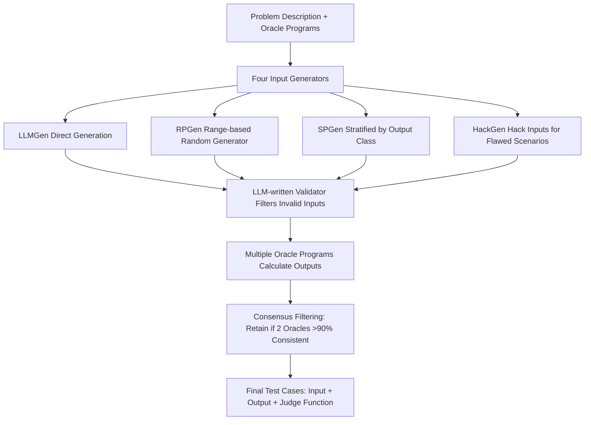

# HARDTESTGEN: A High-Quality RL Verifier Generation Pipeline for LLM Algorithmic Coding

**Conference**: ICLR 2026  
**OpenReview**: [https://openreview.net/forum?id=v3SzGCfAXN](https://openreview.net/forum?id=v3SzGCfAXN)  
**Code**: [https://leililab.github.io/HardTests/](https://leililab.github.io/HardTests/)  
**Area**: code_intelligence  
**Keywords**: test case synthesis, code verifier, RLVR, competitive programming, post-training  

## TL;DR
Addressing algorithmic coding, the HARDTESTGEN pipeline is proposed—synthesizing "generator programs" via LLMs instead of direct test generation. Combined with multi-oracle consensus filtering, it creates HARDTESTS (26.6k problems), a high-quality dataset with 11% higher precision, proving that verifier quality directly determines the effectiveness of rejection sampling and RL post-training.

## Background & Motivation

**Background**: Utilizing outcome verifiers for RLVR post-training is the mainstream approach to enhancing LLM reasoning and programming capabilities (e.g., DeepSeek-R1, o3). In the code domain, a verifier typically consists of test cases: a candidate program receives a reward of 1 if it passes all tests, and 0 otherwise.

**Limitations of Prior Work**: Test case quality is generally poor, a problem that is significantly underestimated. The paper presents alarming figures—60% of programs in APPS that pass tests are actually incorrect; in CodeContests, 46% of programs passing tests are semantically correct but too inefficient to pass human evaluation. The root cause is that existing methods (CodeT, TACO) have LLMs **directly generate test inputs**, yet LLMs struggle to produce large-scale, valid, and boundary-hitting inputs in one go; meanwhile, high-quality human-written tests are private and inaccessible.

**Key Challenge**: "Well-disguised incorrect solutions" in algorithmic problems can only be detected by meticulously constructed edge cases. For instance, calculating the path sum from nodes to the root on a tree: a naive $\Theta(nd)$ algorithm runs quickly on random trees where $E[d]=\Theta(\log n)$, but if the test case is a chain (depth $d=n$), complexity degrades to $\Theta(n^2)$ and times out. Random testing fails to generate such "large and specific" inputs.

**Goal**: Automatically synthesize tests that are valid, comprehensive (covering corner cases and high-latency cases), and possess correct outputs to serve as reliable reward signals for code post-training.

**Core Idea**: Two insights support the method—**Insight 1**: Test validity is better guaranteed by "LLM-written generator programs" than by "LLM direct output"; **Insight 2**: Different generators hold different assumptions and generate tests from different distributions, requiring a diversity of generators. Based on this, a unified pipeline synthesizes four types of test inputs and calculates outputs using multi-oracle consensus.

## Method

### Overall Architecture

HARDTESTGEN splits "test generation" into input synthesis and output calculation. On the input side, four complementary generators create inputs from different distributions, followed by an LLM-written validator function to filter invalid inputs. On the output side, multiple human oracle programs are collected to run expected outputs, with consensus filtering to retain reliable cases. This assumes problems have oracle solutions (approx. 68% of online contest problems meet this); GPT-4o is used to generate all programs/functions at an average API cost of $0.23 per problem.

### Key Designs

**1. Four Input Generators: Creating inputs from generator programs rather than the LLM itself.** This is the core of the method, mapped to "Insight 1 + Insight 2". **LLMGen** has the LLM directly write $n_L=10$ small-scale inputs for quick functional verification, representing existing methods (denoted as HT–L in ablations). **RPGen** (range-based) has the LLM write a parameterless Python function `gen_range_based_input` that returns random inputs based on data types, ranges, and constraints (e.g., "x-y coordinates forming a convex polygon"), executed $n_R=20$ times—decoupling "constraint understanding" from "large-scale data generation." **SPGen** (stratified) targets categorical outputs (e.g., Yes/No): the LLM identifies $m_S$ output categories and writes a generator for each, running $n_S=10$ times each to prevent category imbalance. **HackGen** is highly targeted: the LLM describes flawed solutions using brute-force or classic algorithms (e.g., DFS), identifies scenarios where they fail or TLE, and writes a generator `gen_hacking_input_<scenario>` for each, yielding $n_H=10$ hack inputs per scenario—an "explicit hack case construction" capability missing in previous methods.

**2. Validating input legality via synthesized programs rather than direct LLM judgment.** Instead of the LLM directly judging if an input is valid, it writes a `validate_input(input_str: str) -> bool` function to explicitly check types, ranges, and logical constraints. Further, placing the validator and an oracle solution in the generator prompts increases the probability of synthesizing valid inputs and generators—essentially proceduralizing "judgment" to bypass LLM unreliability.

**3. Multi-oracle consensus filtering for expected outputs.** To ensure correct outputs, up to $n_{oracle}=8$ human oracle programs are collected per problem. If two oracles are **semantically equivalent** (not necessarily word-for-word identical) on over 90% of inputs, the consistency is trusted. While string comparison is the default, 25.4% of problems (e.g., outputs as sets or multiple valid sequences) require an LLM-generated `output judging function` to return a boolean, which is also used in subsequent training and evaluation.

**4. Test quality measurement from a binary classification perspective.** Passing all tests is positive; otherwise, negative. Combined with ground truth from online judges, precision and recall are defined:
$$\text{Precision}=\frac{TP}{TP+FP},\quad \text{Recall}=\frac{TP}{TP+FN}$$
High precision means "harder tests" (fewer incorrect programs pass), while high recall means "more correct tests" (fewer correct programs are killed). False positives directly correspond to incorrect rewards in RL.

## Key Experimental Results

### Main Results: Test Quality (1253 Merged AtCoder+Codeforces Problems vs. TACO / CodeContests)

Candidate programs come from three LLMs and human submissions. Values are average precision/recall (%):

| Candidate Source | Method | Avg Precision | Avg Recall |
|---|---|---|---|
| Qwen2.5-Coder-7B | TACO | 61.00 | 78.97 |
|  | CodeContests | 51.64 | 85.98 |
|  | **HARDTESTS** | **79.21** | 91.69 |
| Qwen2.5-Coder-14B | TACO | 70.15 | 78.89 |
|  | **HARDTESTS** | **81.54** | 95.35 |
| GPT-4o | TACO | 87.75 | 75.44 |
|  | **HARDTESTS** | **93.22** | 96.47 |
| Human Submissions | TACO | 81.47 | 80.77 |
|  | **HARDTESTS** | 79.08 | 93.03 |

Precision and recall improved by an average of +11.22 and +11.03 points, respectively. The advantage scales with difficulty—on difficulty 4+, TACO's precision for 7B models is only 17.83, while HARDTESTS reaches 55.88. The precision advantage is more pronounced for "less intelligent" candidates (Human -> 7B), as lower-level programs often produce correct but inefficient solutions (30% of LLM errors are TLE vs. 14.9% for humans).

### Ablation Study: All Four Test Types are Essential

| Configuration | 7B Avg Prec | 7B Avg Recall |
|---|---|---|
| HT–L (LLMGen only, ≈ existing methods) | 42.42 | 92.28 |
| HT–L+R/S (Adding RPGen or SPGen) | 64.67 | 92.01 |
| HARDTESTS (All, including HackGen) | **79.21** | 91.69 |

Adding RPGen/SPGen/HackGen improves precision by 0.2%–40%, with recall drops staying under 1%, proving all types are indispensable. HackGen is a critical source of precision.

### Key Findings
- Verifier quality significantly impacts RL and rejection sampling: using TACO tests as rewards actually **damages** the model (pass@1 drops from 38.48 to 36.95), whereas HARDTESTS yields improvements (39.42 / 64.76).
- On RL reward curves, HARDTESTS consistently outperforms TACO—better tests provide more reliable rewards for the same problems.
- In rejection sampling, fine-tuning on incorrect trajectories causes the largest performance drop, proving that trajectory selection is highly dependent on a good verifier.

## Highlights & Insights
- The shift to **"having LLMs write generators rather than tests"** is fundamental: delegating large-scale data generation to deterministic programs while letting LLMs handle constraint understanding and failure-scenario ideation.
- HackGen explicitizes "adversarial test generation"—thinking of flawed solutions then breaking them—directly addressing TLE/corner cases, which is a true increment over CodeT/TACO.
- The paper systematically quantifies the "test quality $\rightarrow$ post-training benefit" causal chain, elevating an engineering detail to a research problem and providing counter-intuitive evidence that "bad verifiers actively harm models."
- Cost is controllable ($0.23/problem) and reproducible with open-source LLMs.

## Limitations & Future Work
- **Strong Oracle Dependency**: The pipeline relies on existing human-written correct solutions; 32% of problems without oracles were filtered.
- **Consensus Vulnerabilities**: 90% consistency among oracles is used; if multiple oracles share a subtle bug, incorrect consensus outputs may occur.
- **Stateless Restriction**: Currently handles only stateless algorithmic problems (standard I/O). Stateful real-world coding requires complex state monad transitions, yet to be verified.
- **Evaluation Scale**: RL/rejection sampling downstream tasks were verified only on Qwen3-4B + LiveCodeBench-105; larger models and sets remain for future work.

## Related Work & Insights
- Follows CodeT and TACO but reverses the approach: substituting direct LLM test generation with generator programs, positioned as a systemic solution to the "code verifiability crisis" (Open-R1).
- Concurrent with works like rStar-Coder and Klear-CodeTest; this paper distinguishes itself through detailed test quality analysis and causal post-training experiments.
- Provides immediate infrastructure for RLVR researchers: HARDTESTS (26.6k problems) can be used as a high-reliability RL playground.

## Rating
- **Novelty**: ⭐⭐⭐⭐ Shift to generator programs + explicit HackGen provides clear incremental value.
- **Experimental Thoroughness**: ⭐⭐⭐⭐ Solid precision/recall evaluation across 4 candidate sources; downstream RL/rejection sampling completes the causal chain.
- **Writing Quality**: ⭐⭐⭐⭐ Pain points are well-illustrated with specific examples; methodology is hierarchical and clear.
- **Value**: ⭐⭐⭐⭐⭐ Open-source dataset + pipeline addresses a major bottleneck in code RLVR.

<!-- RELATED:START -->

## Related Papers

- [\[ICLR 2026\] TikZilla: Scaling Text-to-TikZ with High-Quality Data and Reinforcement Learning](tikzilla_scaling_text-to-tikz_with_high-quality_data_and_reinforcement_learning.md)
- [\[ICLR 2026\] KV Cache Transform Coding for Compact Storage in LLM Inference](kv_cache_transform_coding_for_compact_storage_in_llm_inference.md)
- [\[ACL 2026\] QAQ: Bidirectional Semantic Coherence for Selecting High-Quality Synthetic Code Instructions](../../ACL2026/code_intelligence/qaq_bidirectional_semantic_coherence_for_selecting_high-quality_synthetic_code_i.md)
- [\[ACL 2026\] CuBridge: An LLM-Based Framework for Understanding and Reconstructing High-Performance Attention Kernels](../../ACL2026/code_intelligence/cubridge_an_llm-based_framework_for_understanding_and_reconstructing_high-perfor.md)
- [\[ICLR 2026\] VisCoder2: Building Multi-Language Visualization Coding Agents](viscoder2_building_multi-language_visualization_coding_agents.md)

<!-- RELATED:END -->
