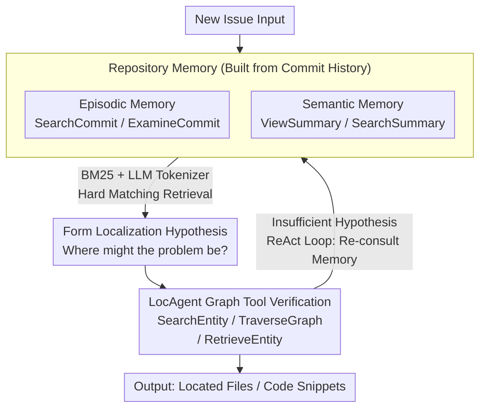

# Improving Code Localization with Repository Memory

**Conference**: ICLR 2026  
**arXiv**: [2510.01003](https://arxiv.org/abs/2510.01003)  
**Code**: None  
**Area**: Software Engineering / LLM Agent  
**Keywords**: Code Localization, Repository Memory, Commit History, Language Agents, SWE-bench

## TL;DR

Enhances the code localization capabilities of language agents by utilizing the repository's commit history to construct episodic memory (past commits) and semantic memory (summaries of active code functions), achieving significant improvements on SWE-bench.

## Background & Motivation

Code localization is the critical first step in repository-level software engineering tasks (such as bug fixing), which involves finding the files and code snippets that need modification. Existing methods, including retrieval-based (CodeRankEmbed), procedural (Agentless), and agentic (LocAgent) approaches, share a common limitation: they treat each problem as an entirely new puzzle to be solved from scratch, failing to utilize prior knowledge of the repository.

In contrast, human developers accumulate long-term repository memory over time—including understanding core module functions and correlations between various bug patterns and repair locations. This accumulated experience allows developers to become experts in a codebase. The paper illustrates this through a failure case of LocAgent in the Django repository: without repository knowledge, the agent requires a complex chain of reasoning to trace data flows and function calls, often resulting in premature termination or reasoning errors. Experienced developers, however, can leverage memories of past commits to quickly locate relevant modules.

The core insight of this paper is that commit history is a rich but underutilized resource that can naturally build repository memory for agents.

## Method

### Overall Architecture

RepoMem packages commit history into two types of memory tools integrated into the existing ReAct loop of LocAgent. This provides the agent with a layer of "repository experience" to consult before performing low-level code graph traversals. Episodic memory records specific problems solved in the past (which commits modified what), while semantic memory records architectural-level common knowledge (which files are most active and their responsibilities). The agent first uses these two types of memory to quickly form hypotheses about "where the problem might be," then invokes LocAgent's code graph tools to verify them along dependency relationships, transforming "reasoning from scratch" into "recall and verify." Memory retrieval is performed using BM25 with an LLM tokenizer for rigid keyword matching rather than semantic embeddings.

### Key Designs

**1. Episodic Memory: Commits as Searchable Problem Exemplars**

What an agent lacks most when facing a new issue is a specific precedent: "Where was this type of bug fixed before?" Episodic memory crawls and pre-processes nearly 7,000 commits prior to the problem's creation into a structured corpus. Each record includes code patches, commit messages, timestamps, and associated issue links. To prevent data leakage, issues and associated commits with textual overlap with testing instances are excluded during construction. The agent accesses this via two tools: `SearchCommit(query, top_k)` uses BM25 to retrieve matching historical commits, returning the commit SHA, message, and a list of modified files; `ExamineCommit(id)` retrieves the full context by commit ID, including diff patches and related issue content. This provides the agent with a developer-like realization of "I've seen something similar before," directly guiding attention to modules that have frequently encountered problems.

**2. Semantic Memory: Mapping Large Codebases with Functional Summaries of Development Hotspots**

Past problems alone are insufficient; agents also need to know the structure of the repository to avoid getting lost in thousands of files. Semantic memory selects the top 200 most frequently modified files—these "development hotspots" are often core modules. An LLM then generates and caches a high-level functional summary for each of these files. The agent can use `ViewSummary(file_name)` to directly examine a specific file's summary or `SearchSummary(query, top_k)` to perform keyword searches across all summaries for relevant (file, summary) pairs. This layer provides architectural context, anchoring the agent's attention to the most active and likely problematic code regions.

**3. Synergy with LocAgent: High-level Memory for Hypotheses, Low-level Graph Analysis for Verification**

LocAgent's original tools—`SearchEntity`, `TraverseGraph`, and `RetrieveEntity`—are skilled at precise structural analysis but lack priors. RepoMem does not replace them but adds the four memory tools to the same action space, creating a division of labor: the agent uses memory tools to quickly form a hypothesis about the problem's location and then uses LocAgent tools for detailed verification along the dependency graph. With memory introduced, the agent's reliance on `TraverseGraph` and `RetrieveEntity` decreases significantly, as exploration shifts from blind data-flow tracing to hypothesis-driven targeted verification.

**4. Deciding on Hard Matching over Semantic Matching for Retrieval**

The effectiveness of memory depends on whether the retriever can distinguish between code entities that "look similar but function differently." The paper compares three schemes: BM25 with an LLM tokenizer, BM25 with whitespace tokenization, and dense retrieval (GritLM-7B). Results show that BM25 + LLM tokenizer performs best, while dense retrieval performs worst—on the Django subset, the former achieved an Acc@5 of 79.7 compared to 65.8 for dense retrieval. This is due to the "rigidity" of code vocabulary: `MigrationWriter` and `OperationWriter` are semantically close but functionally distinct, requiring exact keyword matching that semantic embeddings tend to conflate. The value of the LLM tokenizer lies in its ability to correctly segment identifiers like `MigrationWriter` into matchable tokens for BM25.

## Key Experimental Results

### Main Results

All experiments utilized GPT-4o (2024-05-13) as the backbone LLM.

| Method | SWE-bench-verified Acc@1 | Acc@3 | Acc@5 | SWE-bench-live Acc@1 | Acc@3 | Acc@5 |
|------|----------|-------|-------|----------|-------|-------|
| CodeRankEmbed | 29.6 | 45.1 | 54.3 | 26.2 | 44.6 | 52.3 |
| Agentless | 53.3 | 67.8 | 71.4 | 40.0 | 60.0 | 62.3 |
| LocAgent | 64.8 | 70.4 | 71.6 | 59.2 | 60.8 | 63.1 |
| RepoMem (episodic-only) | 67.8 | 72.4 | 74.3 | 60.0 | 61.5 | 64.6 |
| RepoMem (semantic-only) | 65.0 | 71.0 | 72.8 | 56.9 | 61.5 | 63.9 |
| **RepoMem (full)** | **68.6** | **74.5** | **76.5** | **60.8** | **63.9** | **66.2** |

Acc@5 improved by 4.9% on SWE-bench-verified and by 3.1% on SWE-bench-live.

### Ablation Study

| Configuration | Key Metrics | Description |
|------|---------|------|
| Episodic Memory Only | Acc@5=74.3 | Referencing historical commits brings significant Gain |
| Semantic Memory Only | Acc@5=72.8 | Helps focus on active code regions |
| Combined | Acc@5=76.5 | Complementary information yields optimal results |
| BM25 (LLM Tokenizer) | django Acc@5=79.7 | Superior to 65.8 for dense retrieval |

### Key Findings

- **Per-repo analysis**: Repositories with richer commit history benefit more (e.g., SymPy saw a 16.7% Gain), while repositories with sparse history may experience decreased performance (the "others" group decreased by 13.1%).
- **Agent behavior shift**: After introducing memory, agents significantly reduced reliance on `TraverseGraph` and `RetrieveEntity`, shifting toward more targeted, hypothesis-driven exploration strategies.
- **Cost efficiency analysis**: Average costs increased, but showed high variance at the per-example level—some problems became significantly cheaper due to direct memory hits, while others increased in cost when memory was unhelpful. Extra costs were mainly concentrated on difficult problems where LocAgent itself failed, suggesting the agent strategically invests more resources in hard cases.

## Highlights & Insights

1. **Natural Advantage of Repository Memory**: Commit history is a natural record of a repository's evolution, allowing high-quality memory construction without additional annotation—an elegant and practical design.
2. **Cognitive Science Analogy**: Episodic memory corresponds to a developer's "recall of past experiences," while semantic memory corresponds to "understanding module functions," reflecting the actual working patterns of human developers.
3. **Sparse Retrieval > Dense Retrieval**: In the code domain, precise keyword matching outperforms semantic matching, a finding that has significant implications for RAG applications in code tasks.
4. **Modular Design**: Memory tools can be easily integrated into any ReAct-based agent framework.

## Limitations & Future Work

1. **Poor performance on repositories with sparse history**: When commit history is limited, memory retrieval may return irrelevant information, interfering with reasoning.
2. **Lack of adaptive memory usage strategy**: Agents currently cannot determine when to use memory versus when to reason from scratch; future work could train agents to make dynamic decisions based on problem novelty.
3. **Validation limited to file-level localization**: Performance at the function or line level has not been demonstrated.
4. **Limited to bug-fixing scenarios**: Applicability to other repository-level tasks (e.g., feature development, refactoring) remains unexplored.

## Related Work & Insights

- **LocAgent** (Chen et al., 2025): The base framework for this paper, representing code structure and dependencies via heterogeneous graphs.
- **Agentless** (Xia et al., 2025): A representative procedural method that performs localization using LLMs and repository structure directly.
- **SWE-Exp** (Chen et al., 2025): Distills procedural knowledge from an agent's past success/failure trajectories, orthogonal to this work (which obtains memory from commit history).
- **Agent Workflow Memory** (Wang et al., 2025): Broader research on memory-augmented agents; this paper focuses on code-specific scenarios.

## Rating

- **Novelty**: ⭐⭐⭐⭐ — Using commit history as a memory source is a natural yet novel idea.
- **Experimental Thoroughness**: ⭐⭐⭐⭐ — Covers two benchmarks, multi-angle analysis, per-repo analysis, and cost analysis.
- **Writing Quality**: ⭐⭐⭐⭐⭐ — Clear motivation, vivid case studies, and deep analysis.
- **Value**: ⭐⭐⭐⭐ — Practical improvement for code agents using a simple, effective, and generalizable method.

<!-- RELATED:START -->

## Related Papers

- [\[ACL 2026\] Learning Adaptive Parallel Execution for Efficient Code Localization](../../ACL2026/code_intelligence/learning_adaptive_parallel_execution_for_efficient_code_localization.md)
- [\[ICLR 2026\] ReasoningBank: Scaling Agent Self-Evolving with Reasoning Memory](reasoningbank_scaling_agent_self-evolving_with_reasoning_memory.md)
- [\[ACL 2026\] SWE-QA: Can Language Models Answer Repository-level Code Questions?](../../ACL2026/code_intelligence/swe-qa_can_language_models_answer_repository-level_code_questions.md)
- [\[ACL 2026\] CodeRL+: Improving Code Generation via Reinforcement with Execution Semantics Alignment](../../ACL2026/code_intelligence/coderl_improving_code_generation_via_reinforcement_with_execution_semantics_alig.md)
- [\[ACL 2026\] RepoShapley: Shapley-Enhanced Context Filtering for Repository-Level Code Completion](../../ACL2026/code_intelligence/reposhapley_shapley-enhanced_context_filtering_for_repository-level_code_complet.md)

<!-- RELATED:END -->
