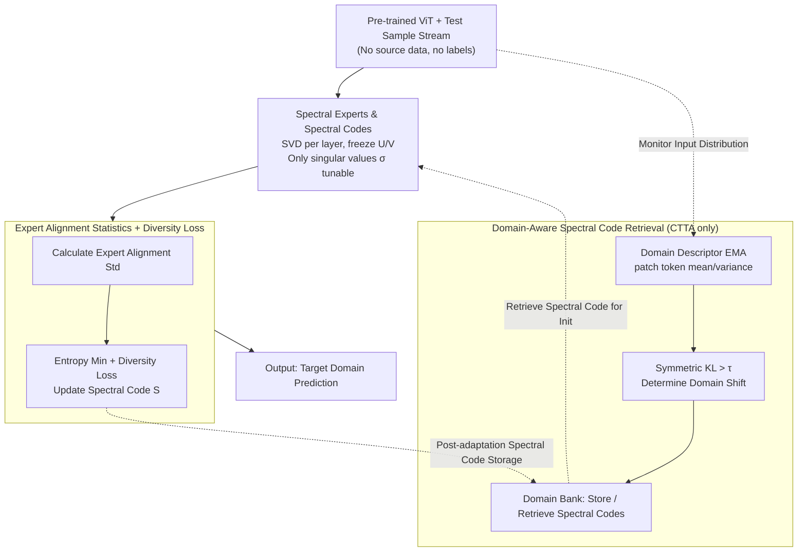

# IMSE: Intrinsic Mixture of Spectral Experts Fine-tuning for Test-Time Adaptation

**Conference**: ICLR 2026  
**arXiv**: [2603.07926](https://arxiv.org/abs/2603.07926)  
**Code**: [github](https://github.com/baek85/IMSE)  
**Area**: Code Intelligence  
**Keywords**: test-time adaptation, singular value decomposition, mixture of experts, continual adaptation, distribution shift

## TL;DR

Ours proposes IMSE, which reinterprets pre-trained ViT linear layers as "spectral experts" via SVD. By fine-tuning only the singular values, it achieves extreme parameter efficiency for Test-Time Adaptation. Combining a diversity maximization loss and a domain-aware spectral code retrieval mechanism, it reaches SOTA performance across TTA, CTTA, and progressive CTTA scenarios.

## Background & Motivation

Test-Time Adaptation (TTA) aims to adapt source-domain pre-trained models online to unknown target domains without accessing source data. Existing methods face three key challenges:

**Background**: Underutilization of pre-trained features. Large pre-trained models possess rich representation capabilities. However, how to fully exploit these representations with minimal parameter updates remains insufficiently explored. Existing methods either tune only BN parameters (limited adaptation capacity) or introduce extra modules (increasing inference overhead).

**Limitations of Prior Work**: Feature collapse caused by entropy minimization. In label-free TTA scenarios, entropy minimization often drives the model to exploit domain-specific features rather than class-discriminative ones, which can exacerbate performance degradation.

**Key Challenge**: Forgetting domain knowledge in continual TTA. In CTTA settings, the model must not only maintain pre-trained knowledge but also preserve and reuse previously encountered domain knowledge. Existing methods lack efficient mechanisms for preservation and reuse.

## Method

### Overall Architecture

IMSE addresses TTA by online adapting a pre-trained ViT to unknown target domains without source data or labels while minimizing parameter changes. The core perspective is reinterpreting every linear layer of a pre-trained ViT as a mixture of **intrinsic spectral experts**. By performing SVD on weights, each rank-1 component is treated as an expert; during adaptation, **only the singular values are fine-tuned** while singular vectors remain frozen. Around this core, the paper introduces two components: a **diversity maximization loss** to counteract the feature collapse caused by entropy minimization, and a **domain-aware spectral code retrieval** mechanism for CTTA to store and reuse adapted singular values (spectral codes). Single-domain TTA uses the first two components, while CTTA further incorporates the retrieval mechanism. The data flow is as follows:

### Key Designs

**1. Spectral Experts and Spectral Codes: Splitting each linear layer into orthogonal rank-1 experts, tuning only singular values**

A major pain point in TTA is that the representation power of pre-trained weights is not fully utilized. IMSE reinterprets the linear transformation of the $l$-th layer via SVD: $\mathbf{W}^{(l)} = \mathbf{U}^{(l)}\mathbf{\Sigma}\mathbf{V}^{(l)\top} = \sum_{i=1}^{r^{(l)}} \sigma_i^{(l)} \mathbf{u}_i^{(l)} \mathbf{v}_i^{(l)\top}$. Each rank-1 component $\mathbf{u}_i \mathbf{v}_i^\top$ is treated as an independent **spectral expert**. Since singular vectors are inherently orthogonal, outputs from different experts for the same input are mutually orthogonal ($(\mathbf{u}_i\mathbf{v}_i^\top \mathbf{x})^\top(\mathbf{u}_j\mathbf{v}_j^\top \mathbf{x}) = 0,\ i\neq j$). When adapting, only singular values $\sigma_i$ are tuned while orthogonal bases $\mathbf{U}$ and $\mathbf{V}$ are frozen. This preserves the pre-trained feature extractor's subspace while reweighting expert contributions. The set of all singular values is defined as the **spectral code** $\bm{S} = \{\bm{\sigma}^{(l)}\}_{l=1}^{L}$.

**2. Expert-Input Alignment Statistics and Diversity Maximization Loss: Quantifying feature collapse via standard deviation**

In TTA, entropy minimization often collapses the model toward domain-specific features. IMSE quantifies this by defining the normalized alignment of the $i$-th expert for the $n$-th input as $a_{n,i}^{(l)} = \mathbf{v}_i^{(l)\top}\mathbf{x}_n^{(l)} / \lVert \mathbf{x}_n^{(l)} \rVert_2$. Calculating the standard deviation $\mathrm{Std}_i^{(l)}$ over a batch of tokens reveals collapse: a low standard deviation indicates the expert responds similarly to all tokens, signaling it is capturing domain-specific patterns rather than class-discriminative ones. The diversity maximization loss is defined as:

$$\mathcal{L}_{\text{dm}} = -\sum_{l\in\Lambda_{\text{dm}}}\frac{1}{r^{(l)}}\sum_{i=1}^{r^{(l)}}\mathrm{Std}_i^{(l)}$$

By maximizing this, the model is forced to maintain diverse responses across experts.

**3. Domain-Aware Spectral Code Retrieval: Preserving and reusing adapted domain knowledge in CTTA**

Ours maintains a **domain bank** and stores pairs of $[\phi^k, \bm{S}^k]$ (domain descriptor, spectral code). Descriptors $\phi = \{\text{mean}, \text{variance}\}$ are calculated from patch token channel statistics via EMA. During inference, symmetric KL divergence $D(\phi_1,\phi_2)$ monitors descriptor drift. If $D$ exceeds a threshold $\tau$, a domain shift is detected. The current spectral code is stored, and the most similar code from the bank is retrieved to initialize adaptation for the new domain: $k^* = \arg\min_k D(\phi_t', \phi_k)$.

### Loss & Training

The total loss combines entropy minimization and diversity maximization: $\mathcal{L}_{\text{IMSE}} = \mathcal{L}_{\text{entmin}} + \lambda_{\text{dm}}\cdot\mathcal{L}_{\text{dm}}$. $\mathcal{L}_{\text{entmin}}$ follows SAR with sample filtering. Sharpness-Aware Minimization (SAM) is used for stability, and diversity constraints are restricted to layers near the classification head.

## Key Experimental Results

### Main Results

**ImageNet-C (50k) Single-domain TTA** (ViT-Base, severity 5):

| Pre-training Strategy | Method | Avg. Accuracy (%) |
|:---:|:---:|:---:|
| Supervised | DPAL | 67.0 |
| Supervised | **Ours** | **69.0** |
| MAE | DPAL | 65.9 |
| MAE | **Ours** | **68.3** |
| CLIP | DPAL | 62.3 |
| CLIP | **Ours** | **65.5** |

Ours outperforms the previous SOTA (DPAL) across three strategies, with a Gain of 2.4-3.2pp on MAE/CLIP.

**ImageNet-R / ImageNet-A**:

| Method | ImageNet-R | ImageNet-A |
|:---:|:---:|:---:|
| DPAL | 64.8 | 49.9 |
| **Ours** | **69.8** | **54.8** |

Performance Gain of 5.0pp and 4.9pp respectively.

### Ablation Study

**CTTA Setting** (ImageNet-C, 15 domains): IMSE-Retrieval achieves a 3.4pp Gain over ViDA while using **1/385** of the trainable parameters. Progressive CTTA (135 domains) shows a 2.4pp Gain.

## Key Findings

1. **Extreme Parameter Efficiency**: Tuning only singular values reaches SOTA across various pre-training strategies.
2. **Diversity Loss Effectiveness**: $\mathcal{L}_{\text{dm}}$ effectively resists collapse and balances expert utilization.
3. **Practical Domain Bank**: Spectral codes are compact, making storage and retrieval costs minimal.
4. **Generalization**: Effective for Supervised, MAE, and CLIP pre-training.

## Highlights & Insights

- 🔍 **Novel Spectral Expert Perspective**: Reinterpreting SVD rank-1 components as "experts" utilizes intrinsic structure without architectural changes.
- 💡 **Quantifying Feature Collapse**: Provides a metric for feature collapse based on spectral expert alignment statistics.
- 🔄 **Compact Retrieval**: Spectral codes are naturally suited for low-cost storage and retrieval.
- ⚡ **Minimal Parameters**: Requires 385x fewer trainable parameters than ViDA.

## Limitations & Future Work

1. **One-time SVD Overhead**: The initial SVD decomposition involves a certain computational cost.
2. **Descriptor Robustness**: Descriptors might be less robust under extreme drift or small batch sizes.
3. **Task Specificity**: Extension beyond classification (e.g., detection/segmentation) requires further design.
4. **Backbone Compatibility**: Primarily validated on ViT; CNN adaptation remains to be explored.

## Related Work & Insights

| Method | Strategy | Comparison with IMSE |
|:---:|:---:|:---:|
| TENT | BN affine + EntMin | Tuning only BN offers limited capacity |
| SAR | Sharpness-aware + Filter | Ours adds spectral experts and diversity loss |
| DPAL | Domain Prompts + Adapter | Introduces extra modules; Ours uses no extra structure |
| ViDA | Visual Domain Adapter | Ours has 385x fewer parameters |
| SVFT/SVDiff | Singular Value Tuning | Focused on LLM/Diffusion; Ours is first for TTA |

Core Insight: Weights of pre-trained models contain functional "intrinsic experts" that can be revealed and utilized through SVD.

## Rating

| Dimension | Score |
|:---:|:---:|
| Novelty | ⭐⭐⭐⭐ |
| Technical Depth | ⭐⭐⭐⭐ |
| Experimental Thoroughness | ⭐⭐⭐⭐⭐ |
| Writing Quality | ⭐⭐⭐⭐ |
| Value | ⭐⭐⭐⭐ |
| Overall Verdict | ⭐⭐⭐⭐ |

> A solid TTA contribution. The spectral expert perspective is novel and insightful. The experiments cover TTA, CTTA, and Progressive CTTA across various pre-training strategies with impressive parameter efficiency. The primary limitation is the task scope being restricted to classification.

<!-- RELATED:START -->

## Related Papers

- [\[NeurIPS 2025\] Program Synthesis via Test-Time Transduction](../../NeurIPS2025/code_intelligence/program_synthesis_via_test-time_transduction.md)
- [\[ACL 2026\] PaT: Planning-after-Trial for Efficient Test-Time Code Generation](../../ACL2026/code_intelligence/pat_planning-after-trial_for_efficient_test-time_code_generation.md)
- [\[AAAI 2026\] Unintended Misalignment from Agentic Fine-Tuning: Risks and Mitigation](../../AAAI2026/code_intelligence/unintended_misalignment_from_agentic_fine-tuning_risks_and_m.md)
- [\[ICML 2026\] Probability-Entropy Calibration: An Elastic Indicator for Adaptive Fine-tuning](../../ICML2026/code_intelligence/probability-entropy_calibration_an_elastic_indicator_for_adaptive_fine-tuning.md)
- [\[ACL 2025\] GiFT: Gibbs Fine-Tuning for Code Generation](../../ACL2025/code_intelligence/gift_gibbs_fine_tuning_code_gen.md)

<!-- RELATED:END -->
