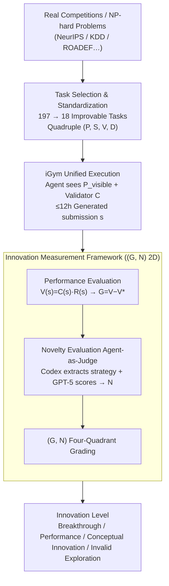

# InnoGym: Benchmarking the Innovation Potential of AI Agents

**Conference**: ICLR 2026  
**arXiv**: [2512.01822](https://arxiv.org/abs/2512.01822)  
**Code**: [https://github.com/zjunlp/igym](https://github.com/zjunlp/igym)  
**Area**: Code Intelligence  
**Keywords**: AI agent benchmark, innovation evaluation, performance gain, novelty, improvable tasks

## TL;DR
Proposes InnoGym, the first benchmark and framework to systematically evaluate the innovation capability of AI agents. It introduces two complementary metrics, Performance Gain and Novelty, and discovers through 18 improvable tasks that while current agents possess some innovativeness, they lack the robustness to transform innovation into reliable performance improvements.

## Background & Motivation

**Background**: Existing LLM and Agent benchmarks (e.g., SWE-Bench, MLE-Bench, HumanEval) primarily focus on "correctness"—success is defined by passing test cases or matching reference answers. These benchmarks have driven rapid progress in code generation, mathematical reasoning, and scientific discovery. MLAgentBench, DSBench, and MLGym also evaluate ML engineering capabilities in Kaggle competition scenarios, but the evaluation criterion remains the performance score on leaderboards.

**Limitations of Prior Work**: However, this "correctness-first" evaluation paradigm completely ignores differences in methodology. Two agents might use entirely different methods to achieve the same correct answer, but existing benchmarks cannot distinguish this methodological difference. Furthermore, in real scientific and engineering problems, there is often no single "correct" answer; the key lies in whether a superior or more novel solution can be proposed.

**Key Challenge**: Intelligence and innovation are reflected not only in results but also in methods. Existing evaluation frameworks equate "problem-solving ability" with the "ability to obtain a correct answer," failing to measure an agent's creativity and methodological innovation—the latter being the core capability for AI-driven scientific discovery.

**Goal**: (1) How to formally define and quantify "innovation"? (2) How to construct a benchmark that simultaneously evaluates performance gain and methodological novelty? (3) How do current mainstream Agent frameworks perform on real innovation tasks? (4) What is the relationship between performance and novelty?

**Key Insight**: Inspired by management theorist Peter Drucker's assertion that "innovation is the change that creates a new dimension of performance," each task is formalized as a quadruple $(P, S, V, D)$. Based on this, two orthogonal metrics, Performance Gain and Novelty, are defined to construct a two-dimensional innovation evaluation space. Tasks are categorized into three types (solved, improvable, and exploratory), with a focus on 'improvable tasks' that have a clear ceiling for optimization.

**Core Idea**: Decomposing innovation into two dimensions—"doing better" (Performance Gain) and "doing differently" (Novelty)—and evaluating the innovation potential of agents on real engineering/scientific problems.

## Method

### Overall Architecture
InnoGym seeks to answer a question avoided by existing benchmarks: how to measure an agent's "innovation" when a problem lacks a unique correct answer. It splits this into two complementary components—iBench for task generation (innovation evaluation benchmark) and iGym for execution (unified execution environment). The pipeline works as follows: first, 18 improvable tasks are filtered from real competitions and classic challenges. Each task is formalized as a quadruple $\mathcal{T} = (P, S, V, D)$, where $P$ is the problem instance, $S$ the solution space, $V$ the performance metric, and $D$ a distance function for solution differences. Agents solve tasks in iGym with only semi-blind information $P_{\text{visible}}$ (task descriptions, examples, dev data, environment) and a validator $C$, while the evaluator $R$, known solution set $S_{\text{known}}$, and leaderboard ground truths are hidden. After submission, solutions are scored along the performance and novelty axes, ultimately placing the solution into an innovation level within the $(G, N)$ two-dimensional space.

Tasks originate from top academic and industrial competitions between 2018–2024 (NeurIPS Competitions, KDD Cup, ROADEF, GMCM, MLArchSys) and classic NP-hard problems, spanning multiple domains including machine learning, operations research, system design, and mathematics to avoid disciplinary bias.

### Key Designs

**1. Task Selection & Standardization Pipeline: Converging 197 candidates into 18 clean, comparable tasks**

The value of improvable tasks lies in having "clear room for improvement"—they are neither solved problems with no room for change nor exploratory problems without human baselines. iBench uses a two-stage funnel: first, collecting 197 candidates from public competitions and checking resource availability and computational feasibility (datasets, evaluators, leaderboards, reference solutions); second, verifying evaluator quality and balancing domain distribution to leave 18 tasks. Each remaining task undergoes standardization: re-writing specifications, packaging environments, building validators, collecting solution sets, normalizing evaluators, and partitioning data. Evaluator normalization is strictly controlled, requiring a Pearson correlation $\geq 0.9$ and Kendall $\tau \geq 0.8$ between normalized and original scores to allow horizontal comparison across different tasks.

**2. Unified Execution Environment iGym: Ensuring performance gaps stem from design, not infrastructure**

If different agents run on separate SDKs, performance differences are muddied by engineering implementation noise. iGym is a unified execution SDK designed to address the shortcomings of existing SDKs (OpenHands, AutoGen, LangGraph) in long-running tasks: an Async Tool Dispatcher for concurrent tool calls; robust recovery mechanisms for resuming after 12-hour runs; and a unified abstraction layer for different workflow/agent modes. Agents in iGym see only $P_{\text{visible}}$ and validator $C$, ensuring results are cleanly attributed to the agent's design.

**3. Innovation Measurement Framework: Quantifying "innovation" with two orthogonal axes**

Existing benchmarks only recognize result correctness, conflating "parameter tuning to SOTA" with "achieving similar results via a new method." Inspired by Drucker, InnoGym separates innovation into: Performance Gain $G(s) = V(s) - V^*_{\text{known}}$, relative to the known optimum; and Novelty $N(s) = C(s) \cdot \min_{h \in S_{\text{known}}} D(s, h)$, the minimum distance to known solutions ($C(s)$ zeros out novelty for infeasible solutions). Performance itself is $V(s) = C(s) \cdot R(s)$, where validator $C$ detects feasibility. Combined, these define four quadrants: Breakthrough Innovation (high $G$, high $N$), Performance Innovation (high $G$, low $N$), Conceptual Innovation ($G \approx 0$, high $N$), and Invalid Exploration (low $G$, low $N$). The paper further uses a complex plane with $G$ as the magnitude and $N$ as bit angle to distinguish solutions with different directions but similar novelty.

**4. Novelty Evaluation (Agent-as-Judge): Using semantic understanding rather than code similarity to judge "methodological difference"**

The distance $D$ in $N(s)$ is difficult to calculate—methodological differences are rarely captured by code diffs or string similarity. Thus, a model-based judgment is used: first, Codex extracts the core strategy of each solution into a structured representation, stripping away implementation details; then, GPT-5 scores the agent's solution against each reference solution across multiple dimensions, taking the minimum normalized distance. This Agent-as-Judge approach scales across task types but depends on GPT-5's capabilities; different evaluation models or versions might yield inconsistent novelty rankings.

### Mechanism
Using the OAG task as an example: Each "task-agent-model" configuration runs for up to 12 hours, repeated 3 times for the best valid submission, with DeepSeek-v3.1 as the backbone. The MLAB agent solves the task in iGym and submits solution $s$. Validator $C(s)$ confirms feasibility ($C=1$), and evaluator $R(s)$ calculates performance $V(s) = 54.86$. Since the OAG leaderboard top score is $V^*_{\text{known}} = 83.45$, Performance Gain $G = 54.86 - 83.45 = -28.59$ (significantly lower than the human optimum); the normalized Ratio $= G / V^* = -0.34$. Codex then extracts the core strategy, and GPT-5 compares it to references, yielding Novelty $N = 70.83/100$. Finally, the solution is placed at $(G, N) = (-28.59, 70.83)$: high novelty but negative gain, illustrating a typical quadrant where an agent devises a different method but fails to translate it into performance gains.

## Key Experimental Results

### Main Results

| Task | Leaderboard Top Score | MLAB Gain/Ratio/Novelty | CodeAct Gain/Ratio/Novelty | AIDE Gain/Ratio/Novelty |
|------|------------|------------------------|---------------------------|------------------------|
| BEETL(MI) | 76.33 | -35.66/-0.47/66.67 | No valid submission | No valid submission |
| BEETL(Sleep) | 69.23 | -14.64/-0.21/62.50 | No valid submission | -53.62/-0.77/54.17 |
| Belka | 30.62 | -19.02/-0.62/45.83 | -28.14/-0.92/45.83 | -30.01/-0.98/20.83 |
| CirclePacking | 2.635 | -0.43/-0.16/50.00 | -0.008/-0.003/25.00 | -0.25/-0.09/33.33 |
| OAG | 83.45 | -28.59/-0.34/70.83 | -30.38/-0.36/62.50 | -29.87/-0.36/70.83 |
| **Average** | **57.94** | **-24.32/-0.45/56.55** | **-41.58/-0.69/54.86** | **-42.68/-0.64/46.67** |

### Ablation Study (CirclePacking task)

| Dimension | Key Result | Explanation |
|---------|---------|------|
| Base Model Comparison | Gemini-2.5-Pro: 2.49, GPT-5: 2.44, DeepSeek-v3.1: 2.40 | AlphaEvolve reached 2.65; Agents amplify base model capabilities |
| Time Budget Impact | G increases monotonically with time, N gradually decreases | Diminishing returns: as solutions improve, methodologies tend to converge |
| Sampling Temperature | Low temp: high G, low N; High temp: high N, low G | 0.5-0.75 is the optimal balance interval |
| Prior Knowledge | Starting from Gemini-2.5-Pro solution, AIDE continues to improve | Validates that G and N can jointly characterize innovation trajectories |

### Key Findings
- No agent surpassed the human SOTA on any task; Performance Gain remains negative, with average Ratios between -0.45 and -0.69.
- MLAB leads in both performance and novelty (avg Gain -24.32, Novelty 56.55), but all agents failed to generate valid submissions for complex tasks like CDML and PTTALC.
- Robustness is the bottleneck rather than creativity: agents generate novel methods but cannot translate them into reliable performance gains (e.g., high novelty accompanied by extremely low performance in RCIC and TrojanDetection).
- CodeAct approaches SOTA on the mathematical optimization task CirclePacking (Ratio=-0.003), but generalizes poorly on others.
- Base model capability significantly affects agent performance: Gemini-2.5-Pro reaches 2.49, GPT-5 reaches 2.44, while DeepSeek-v3.1 only reaches 2.40 (AlphaEvolve’s 2.65 remains the champion).
- Temporal analysis reveals diminishing returns: Performance Gain increases monotonically over time but with slowing growth, while Novelty decreases as methodology converges.

## Highlights & Insights
- Formalizing "innovation" as a $(G, N)$ two-dimensional space is an elegant design, providing a clear taxonomy of breakthrough/performance/conceptual innovation. The complex plane representation further enhances visualization by distinguishing solutions with the same novelty but different methodological directions.
- The systematic filtering of 197 tasks down to 18 is rigorous; evaluator normalization (Pearson/Kendall tests) ensures fair cross-task comparison. The two-stage funnel serves as a reference template for future benchmark construction.
- The discovery that "agents are amplifiers of base models rather than substitutes" has significant implications for agent system design—prioritizing stronger base models over complex agent architectures.
- The task classification system (Solved/Improvable/Exploratory) is theoretically grounded; focusing on improvable tasks while excluding solved or exploratory ones is a persuasive decision.
- The temperature ablation on CirclePacking reveals the classic exploration-exploitation trade-off; the sweet spot (0.5-0.75) provides a reference for real-world agent deployment.

## Limitations & Future Work
- Main experiments only cover 10 out of 18 tasks, and each configuration was run only 3 times, limiting statistical significance.
- Novelty measurement relies on Agent-as-Judge (GPT-5), potentially introducing LLM bias; different models may produce inconsistent novelty rankings.
- Lack of in-depth failure analysis (e.g., identifying specific coding/reasoning bottlenecks)—all agents failed on CDML and PTTALC for unknown reasons.
- Tasks are entirely from existing competitions and classic problems, lacking original problem design and risking data leakage (LLM training data may contain competition solutions).
- The 12-hour limit may be insufficient for complex engineering tasks compared to the weeks spent by human participants.
- Only 3 agent frameworks were examined, excluding other representative solutions like SWE-agent or Devin.

## Related Work & Insights
- **vs MLE-Bench**: MLE-Bench only evaluates Kaggle rankings (Performance); InnoGym adds the Novelty dimension to distinguish "tuning to SOTA" from "novel paths to SOTA."
- **vs InnovatorBench**: InnovatorBench evaluates the reproduction of paper innovations but not methodological novelty; InnoGym evaluates both and focuses on open, improvable problems.
- **vs AlphaEvolve**: AlphaEvolve is a specific innovation agent (achieving 2.65 on CirclePacking); InnoGym is an evaluation framework. They are complementary.
- **vs MLRCBench/MLGym**: These target ML engineering but measure only performance. InnoGym task sources are more diverse (including optimization, math, etc.).

## Rating
- Novelty: ⭐⭐⭐⭐⭐ First benchmark for systematically evaluating agent innovation capabilities; the $(G, N)$ framework has theoretical depth.
- Experimental Thoroughness: ⭐⭐⭐ 10 tasks, 3 agents, 3 models, but low run counts (3x) and failed submissions on complex tasks limit stability.
- Writing Quality: ⭐⭐⭐⭐ Formal definitions are clear; charts are intuitive and creative, though partitioning iGym details to the appendix slightly affects main text flow.
- Value: ⭐⭐⭐⭐ Fills a gap in agent innovation evaluation; however, current low agent performance limits the benchmark's discriminative power.

<!-- END -->

<!-- RELATED:START -->

## Related Papers

- [\[ICLR 2026\] DevOps-Gym: Benchmarking AI Agents in Software DevOps Cycle](devops-gym_benchmarking_ai_agents_in_software_devops_cycle.md)
- [\[ICLR 2026\] VERINA: Benchmarking Verifiable Code Generation](verina_benchmarking_verifiable_code_generation.md)
- [\[ICLR 2026\] The Matthew Effect of AI Programming Assistants: A Hidden Bias in Software Evolution](the_matthew_effect_of_ai_programming_assistants_a_hidden_bias_in_software_evolut.md)
- [\[ACL 2026\] RExBench: Can coding agents autonomously implement AI research extensions?](../../ACL2026/code_intelligence/rexbench_can_coding_agents_autonomously_implement_ai_research_extensions.md)
- [\[ICLR 2026\] VisCoder2: Building Multi-Language Visualization Coding Agents](viscoder2_building_multi-language_visualization_coding_agents.md)

<!-- RELATED:END -->
