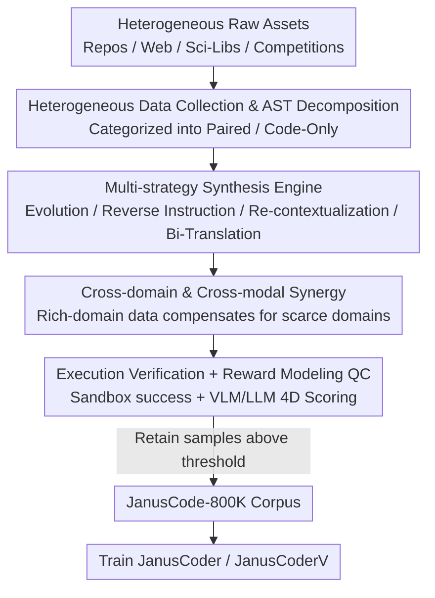

# JanusCoder: Towards a Foundational Visual-Programmatic Interface for Code Intelligence

**Conference**: ICLR 2026  
**OpenReview**: [https://openreview.net/forum?id=N4BB09TXad](https://openreview.net/forum?id=N4BB09TXad)  
**Code**: Yes (The paper claims open-source Code / Checkpoints / JanusCode-800K, see OpenReview project page)  
**Area**: Code Intelligence / Multimodal / Data Synthesis  
**Keywords**: Visual-Programmatic Interface, Multimodal Code, Data Synthesis, Reward Modeling, Unified Model

## TL;DR
Addressing the bottleneck of scarce "code + vision" multimodal corpora, this work introduces a data synthesis toolbox to construct JanusCode-800K, the largest multimodal code corpus to date. Unified models JanusCoder / JanusCoderV are trained to simultaneously cover text-side and vision-side tasks such as chart generation, web UI, animation, and scientific demonstrations, approaching or even surpassing GPT-4o at scales of 7B–14B.

## Background & Motivation

**Background**: Code intelligence is expanding from pure text source code to "visual outputs produced by programs"—Matplotlib charts, interactive Web UIs, 3Blue1Brown-style mathematical animations, and scientific visualizations. An ideal interface should allow models to convert freely between "code logic" and "visual representation": generating code from images, modifying visualizations based on instructions, or creating interactive front-ends from scratch.

**Limitations of Prior Work**: Current research follows two paths, both with flaws. At the modeling level, mainstream approaches either stop at "program-aided understanding/reasoning" or train specialized models for isolated tasks (e.g., one for chart-to-code, another for WebUI-to-code), which neither generalizes across scenarios nor scales effectively. At the data level, the bottleneck is more fundamental: high-quality, diverse multimodal code data is extremely scarce. Existing corpora are heterogeneous, data abundance varies wildly across programming languages, natural language instruction styles are monolithic, and the visual forms produced by code are vastly different.

**Key Challenge**: Training a general visual-programmatic model requires a corpus covering the full spectrum from "charts → interactive webpages → long animations." Constructing such a corpus necessitates not only large-scale collection and processing but also a matching verification environment (computing/rendering engines) and rigorous quality control to ensure "visual products truly match instructions." The immense engineering effort required has prevented its realization.

**Goal**: (1) Create a toolbox for automatic synthesis of cross-domain, cross-language multimodal code data; (2) Use it to build the largest multimodal code corpus to date; (3) Train a unified interface model capable of generating code from text instructions, visual inputs, or combinations of both.

**Key Insight**: The authors observe a "reciprocal synergy" between different modalities and domains. Scientific computing logic from R/Matlab can migrate to synthesize Manim/Mathematica tasks, and visual outputs from Python visualizations can serve as training samples for chart-to-code. Explicitly leveraging this synergy allows rich-domain data to compensate for gaps in scarce domains (e.g., animations, scientific demonstrations).

**Core Idea**: Utilize a data toolbox featuring "multi-strategy synthesis + cross-domain synergy + visual reward quality control" to mass-produce high-quality multimodal code corpora. A unified model then addresses all visual-programmatic tasks, replacing the old paradigm of "one specialized model per task."

## Method

### Overall Architecture

The core of JanusCoder is not a new network architecture but a **data production pipeline**. Input consists of heterogeneous raw assets from public repositories, web corpora, scientific knowledge bases, and competition problems. The output is JanusCode-800K, a corpus of 800,000 "instruction-code(-image)" samples verified by execution and visual scoring, used to fine-tune unified models. The pipeline consists of three stages: **Heterogeneous data collection and AST decomposition** (including decomposition of long Manim scripts), followed by a **multi-strategy synthesis engine** to evolve seed data into diverse instruction-code pairs while explicitly **leveraging cross-domain and cross-modal synergy** to fill scarce domains. All newly generated code enters a sandbox for **execution verification**, and successful cases are filtered via **reward modeling** based on four-dimensional scoring. The final corpus trains two models: JanusCoder (text-centric data only, based on Qwen3-8B/14B) and JanusCoderV (full corpus, based on Qwen2.5-VL-7B / InternVL3.5-8B).

### Key Designs

**1. Heterogeneous Data Collection & AST Decomposition: Organizing Messy Assets into Learnable Units**

The pipeline first gathers raw materials from highly heterogeneous sources (StackV2, WebCode2M, Wolfram Demonstrations, competition problems, etc.) and classifies them into two categories: Paired data $(I, C)$ (expanded to triplets $(I, C, V)$ when visual output is available) and Code-Only data $C$. The challenge lies in Code-Only data containing long, complex files—such as a Manim script for a 5-minute math animation—which contain multiple independent concepts but are monolithic and hard to learn directly. The authors employ AST (Abstract Syntax Tree) decomposition: parsing the source code into a syntax tree and traversing it to identify and extract "semantically self-consistent and independently executable" logical units. This step breaks "monolithic code" into smaller learnable samples, providing the foundation for all subsequent synthesis strategies.

**2. Multi-strategy Synthesis Engine: Four Complementary Strategies for Corpus Expansion**

Since seed data is insufficient in quantity and diversity, four synthesis strategies are designed to run in parallel. **Guided Evolution** starts from seed triplets and uses a high-level concept $K$ (e.g., chart type, web meta-task "add a widget") to guide the generation of complex new instructions $I' = f_{evolve}(I, C, K)$. Models then generate code $C'$, verified in execution environment $E$, with feedback driving subsequent iterations—making it more suitable for visual coding tasks than pure heuristic evolution. **Re-contextualization** does not create new code but exhumes implicit logic or edge cases from existing code $C$ to rewrite more precise instructions $I' = f_{recontext}(I, C)$, improving "instruction-code alignment" at low cost. **Reverse Instruction** targets Code-Only data: sampling a segment $C_{sample}$ from a reference file to infer a reasonable natural language instruction $I'' = f_{reverse}(C_{sample})$, then regenerating code, thus converting scientific code (R/Matlab) into instruction-following samples. **Bidirectional Translation** translates conceptual intent between semantically similar domains (e.g., Manim ↔ Mathematica): first translating source domain instructions into target domain instructions $I_B = f_{translate}(I_A)$, then using source code $C_A$ as a structural template to generate target code $C_B$. This process is fully bidirectional, bypassing the difficulty of "writing complex code from scratch." These strategies collectively address "insufficient complexity / poor alignment / narrow coverage / scarce specialized domains."

**3. Cross-domain & Cross-modal Synergy: Filling Scarsity with Abundance**

This is the most central insight: authors do not view data sources in isolation but explicitly transfer knowledge across heterogeneous domains and modalities. Two types of synergy are introduced: **Cross-domain**, where scientific computing logic in R/Matlab can generalize to synthesize scarce tasks for Manim or Mathematica via reverse instruction and bidirectional translation; and **Cross-modal**, where image output from a Python visualization task serves directly as visual input for chart-to-code tasks. This synergy directly alleviates data starvation in specialized domains like animation and scientific demonstration, significantly enhancing corpus coverage and model robustness.

**4. Execution Verification + Reward Modeling Quality Control: Executability Does Not Equal Alignment**

Synthesized code must pass through a sandbox: each new code $C'$ is run via an execution function $V' = \text{Exec}(C', E)$ to produce visual output or pass test cases. However, "executability is an insufficient proxy for quality"—a program may render successfully while visually deviating significantly from the instruction. Thus, a reward modeling layer is added: using a VLM as the core engine, instruction $I$, code $C$, and visual output $V$ are organized into a structured prompt. The model is guided to understand the task and then score it (1–5 scale) across four dimensions: **task relevance, task completion, code quality, and visual clarity**. The final score $S = R(I, C, V)$ is the average of these four, and only samples exceeding a threshold are retained.

### Loss & Training
Training involves supervised fine-tuning on JanusCode-800K. JanusCoder uses text-centric data only, based on Qwen3-8B/14B. JanusCoderV uses the full corpus (including vision-side triplets), based on Qwen2.5-VL-7B-Instruct and InternVL3.5-8B. During synthesis, instructions and code are generated by gpt-oss-120b. During quality control, Qwen2.5-VL-72B-Instruct (vision) and Qwen3-235B-A22B (text) serve as reward models. The corpus is balanced at approximately 50.9% text-centric and 49.1% vision-side data.

## Key Experimental Results

The authors also introduce **DTVBench** (Dynamic Theorem Visualization Benchmark, including Manim and Wolfram Mathematica engines with 102 hand-curated tasks). The total score is defined as $\text{score} = s_{exec} \cdot (s_{sim} + s_{align} + s_{faith})$, where only executable code is further scored on similarity, alignment, and faithfulness. Evaluation spans 7 benchmarks.

### Main Results

Single-modality task results (Text-to-Code):

| Benchmark | Metric | JanusCoder-14B | GPT-4o | Qwen3-14B Base |
| :--- | :--- | :--- | :--- | :--- |
| PandasPlotBench | Code Error Rate↓(%) | **9.7** | 9.7 | 12.6 |
| ArtifactsBench | Visual / Task | 67 / **86** | 72 / 85 | 65 / 78 |
| DTVBench-Manim | Score | 8.41 | 10.60 | 6.63 |

Both 8B and 14B models achieve error rates <10%. On ArtifactsBench, JanusCoder significantly outperforms GPT-4o (86 vs 85, with the 8B model already reaching 80).

Multimodal task results (Selected ChartMimic / WebCode2M / InteractScience):

| Model | ChartMimic Direct (Low/High) | WebCode2M Visual | InteractScience Func.(%) |
| :--- | :--- | :--- | :--- |
| Qwen2.5-VL-7B Base | 58.69 / 40.73 | 73.42 | 8.40 |
| JanusCoderV-7B | **72.77 / 65.73** | 75.78 | **17.73** |
| JanusCoderV-8B | 74.20 / 65.79 | 66.34 | 17.60 |
| GPT-4o | 67.42 / 57.16 | 82.67 | 27.20 |

JanusCoderV significantly exceeds GPT-4o and specialized chart MLLMs on chart-to-code. On InteractScience, its functional score doubles that of the base model (17.73 vs 8.40).

### Ablation Study

| Configuration | ChartMimic | InteractScience | WebCode2M | Description |
| :--- | :--- | :--- | :--- | :--- |
| JanusCoderV (Full) | 68.74 | 17.73 | 75.78 | Complete model |
| w/o Chart2Code | 56.50↓↓ | 16.27↓ | 71.92↓↓ | Removing chart data leads to severe drops |
| w/o Text-centric | 60.73↓ | 12.93↓↓ | 71.82↓↓ | Multimodal tasks drop without text data |
| w/o Rewarding | 58.26↓↓ | 17.20↓ | 73.78↓ | Quality drops without reward filtering |

### Key Findings
- **Cross-modal synergy enables effective transfer**: Removing text-centric data causes pure multimodal tasks (InteractScience 17.73→12.93) to drop significantly, proving that non-target or cross-modal data provides transferable coding capabilities.
- **Reward modeling is essential**: At the same training scale, removing reward-based filtering leads to universal drops, verifying that "execution success $\neq$ high data quality."
- **General benefit across base models**: Replacing the base with Qwen2.5-Coder-7B or InternVL3.5-4B yields stable gains, indicating that JanusCode-800K's value lies in its data design.
- **Unified training enhances rather than degrades**: JanusCoder exceeds specialized models and GPT-4o on BigCodeBench and LiveCodeBench, showing that unified training does not sacrifice general code ability.

## Highlights & Insights
- **Cross-modal/domain synergy as a first-class citizen**: Rather than treating synergy as secondary data augmentation, the entire pipeline is organized around "rich domains aiding scarce ones."
- **Four strategies targeting specific data "ailments"**: Evolution for complexity, re-contextualization for alignment, reverse instruction for coverage, and bidirectional translation for specialized scarcity.
- **Dual-layer quality control (Execution + Visual Scoring)**: Highlights the often-ignored pitfall that rendered programs may not match visual requirements—a concept transferable to any data cleaning task involving code-to-visual/UI.
- **AST Decomposition for long scripts**: Decomposing monolithic scripts into self-consistent units is key for long-range code (e.g., animations) to enter training pipelines.

## Limitations & Future Work
- The Faithfulness dimension in DTVBench is an "optional subjective score"; dynamic/interactive content is difficult for LLM judges to evaluate objectively, making results susceptible to human subjectivity.
- Synthesis and quality control rely heavily on large models (gpt-oss-120b for generation, Qwen for rewards), meaning data quality is inherently capped by these external models.
- On the most challenging tasks, such as DTVBench-Manim and InteractScience, the model still lags behind GPT-4o. The unified model has not yet surpassed commercial models in every dimension.

## Related Work & Insights
- **vs Specialized Single-task Models**: Unlike models built for isolated targets that fail to generalize, JanusCoder's unified interface uses cross-task synergy to surpass specialized MLLMs.
- **vs Text-driven Visualization Generation**: Whereas most work accepts only text, JanusCoder incorporates visual inputs (e.g., chart mimicry, webpage modification from screenshots).
- **vs Visual-grounded Code Understanding**: Most existing work focuses on single domains or modalities; this work represents a leap in coverage across charts, Web UI, animation, and symbolic computing.

## Rating
- Novelty: ⭐⭐⭐⭐ The unified visual-programmatic interface and explicit cross-domain synergy are innovative, though based on SFT and synthesis.
- Experimental Thoroughness: ⭐⭐⭐⭐ Extensive evaluation across 7 benchmarks and multiple base models; though still behind GPT-4o on specialized tasks.
- Writing Quality: ⭐⭐⭐⭐ Clear logic from motivation to pipeline and ablation.
- Value: ⭐⭐⭐⭐⭐ Releasing the largest multimodal code corpus, toolbox, and models provides high value for community infrastructure.

<!-- RELATED:START -->

## Related Papers

- [\[ACL 2026\] OmniDiagram: Advancing Unified Diagram Code Generation via Visual Interrogation Reward](../../ACL2026/code_intelligence/omnidiagram_advancing_unified_diagram_code_generation_via_visual_interrogation_r.md)
- [\[ACL 2025\] Program Synthesis Benchmark for Visual Programming in XLogoOnline Environment](../../ACL2025/code_intelligence/program_synthesis_benchmark_for_visual_programming_in_xlogoonline_environment.md)
- [\[AAAI 2026\] TAPA: Training-Free Adaptation of Programmatic Agents via LLM-Guided Program Synthesis in Dynamic Environments](../../AAAI2026/code_intelligence/tapas_are_free_training-free_adaptation_of_programmatic_agen.md)
- [\[ICLR 2026\] VERINA: Benchmarking Verifiable Code Generation](verina_benchmarking_verifiable_code_generation.md)
- [\[ICLR 2026\] Code Aesthetics with Agentic Reward Feedback](code_aesthetics_with_agentic_reward_feedback.md)

<!-- RELATED:END -->
