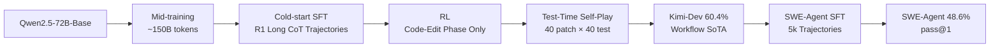

# Kimi-Dev: Agentless Training as Skill Prior for SWE-agents

**Conference**: ICLR 2026  
**OpenReview**: [https://openreview.net/forum?id=tYppHuGhxJ](https://openreview.net/forum?id=tYppHuGhxJ)  
**Code**: [https://github.com/MoonshotAI/Kimi-Dev](https://github.com/MoonshotAI/Kimi-Dev) (Model [Kimi-Dev-72B](https://huggingface.co/moonshotai/Kimi-Dev-72B))  
**Area**: Code Intelligence / SWE Agents  
**Keywords**: SWE-bench, Agentless, SWE-Agent, Skill Prior, Reinforcement Learning, Test-time Self-play  

## TL;DR
This paper proposes treating Agentless (workflow-style) training as a "skill prior" for SWE-Agents (multi-turn interactive). By utilizing a recipe of mid-training + cold-start + RL + test-time self-play, the open-source model Kimi-Dev achieves 60.4% on SWE-bench Verified (a SoTA for workflow solutions). It is further upgraded into an agent with 48.6% pass@1, comparable to Claude 3.5 Sonnet, using a lightweight SFT of 5k trajectories.

## Background & Motivation
- **Background**: SWE-bench has become the benchmark for measuring the ability of LLMs to fix real-world GitHub bugs. Solutions generally fall into two categories: multi-turn interactive **SWE-Agents** (flexible plan/act/reflect, high upper bound) and fixed-pipeline **Agentless** approaches (decomposing tasks into verifiable single-turn sub-problems: localization $\rightarrow$ repair $\rightarrow$ testing).
- **Limitations of Prior Work**: These two paradigms are widely viewed as mutually exclusive. Agents are end-to-end but suffer from sparse rewards, difficult long-range credit assignment, and training instability, often being highly sensitive to initialization (starting from general pre-trained models often leads to tool misuse or infinite loops). Agentless approaches face restricted search spaces and poor flexibility, where errors hidden in long single-turn reasoning are difficult to monitor.
- **Key Challenge**: Should one prioritize flexibility and performance ceilings, or modularity and training stability? The community perceives this as a binary trade-off.
- **Goal**: To break this dichotomy and prove that Agentless training should not be treated as a "final deliverable," but rather repositioned as a means to induce atomic skills.
- **Core Idea**: **[Skill Prior Perspective]** Agentless training induces atomic skill priors such as **localization, code editing, and self-reflection/verification**. These priors can be transferred from non-agent workflows to agent frameworks, making subsequent SWE-Agent training more stable and data-efficient. The two paradigms are complementary stages for building transferable programming agents rather than competing ones.

## Method

### Overall Architecture
Kimi-Dev training follows two major stages: first, an **Agentless training recipe** transforms a 72B base model into a strong workflow model (dual roles: BugFixer + TestWriter, via mid-training $\rightarrow$ cold-start $\rightarrow$ RL $\rightarrow$ test-time self-play) reaching 60.4% on SWE-bench Verified. Then, this model serves as a "prior" for lightweight SFT using 5k public SWE-Agent trajectories to transfer skills to a multi-turn agent framework, achieving 48.6% pass@1.

### Key Designs

**1. BugFixer and TestWriter Dual Role Framework: Decomposing issue resolution into two verifiable skills.** The authors abstract GitHub issue solving into two collaborative roles: **BugFixer** outputs patches to fix bugs, and **TestWriter** outputs unit tests that reproduce the bug (a high-quality test must fail before the fix and pass after). Both roles rely on two core skills: **file localization** (identifying specific files related to the bug/test) and **code editing** (implementing necessary modifications). This decomposition transforms vague "issue solving" into atomic, verifiable skills with clear optimization targets for each training stage.

**2. Mid-training and Cold-start: Injecting knowledge and igniting long reasoning.** Starting from Qwen2.5-72B-Base, mid-training is conducted with ~150B tokens. Data consists of three parts: ~50B tokens of Agentless format data from natural diff patches, ~20B from curated PR commit bundles, and ~20B synthetic data with reasoning and agent interaction patterns (up-sampled 4x during training). Strict decontamination is applied to exclude repositories in the SWE-bench Verified test set. Subsequently, cold-start SFT is performed using long CoT trajectories generated by DeepSeek-R1 acting as BugFixer/TestWriter on SWE-Gym and SWE-bench-extra to activate capabilities in problem analysis, method drafting, self-refinement, and alternative exploration. Experiments show that mid-training token volume (50B $\rightarrow$ 100B $\rightarrow$ 150B) correlates monotonically with performance.

**3. Outcome-Oriented RL for Code-Edit Only: Three key designs to stabilize training.** Since localization is sufficiently strong after mid-training, RL focuses solely on the code-editing phase, using multiple localization rollouts from the initial model to diversify prompts. The algorithm follows a REINFORCE-style policy gradient (similar to Kimi k1.5), using average rewards from multiple rollouts as a baseline to normalize returns. It emphasizes: (i) **Pure Outcome Reward**—using only environmental execution results as 0/1 rewards, without formatting or process signals. BugFixer patches receive positive reward only if they pass all ground-truth unit tests; TestWriter must satisfy "Fail without fix AND Pass with fix." (ii) **Adaptive Prompt Selection**—discarding prompts with pass@16=0 (initial 1200 problems) to expand the effective batch, followed by curriculum learning where 500 previously excluded problems are reintroduced every 100 steps if they show improvement under RL. (iii) **Positive Example Reinforcement**—incorporating successful samples from recent RL iterations into the current batch to reinforce success patterns and accelerate convergence. Training is executed on a Kubernetes-based sandbox infrastructure supporting 10k+ concurrent instances.

**4. Test-Time Self-Play: Pairing BugFixer and TestWriter via execution feedback.** During testing, 40 candidate patches (one greedy, 39 at temperature 1.0) and 40 tests are generated independently for each instance. Invalid tests that do not trigger failures in the original repository are filtered. Let the valid test set be $T$ and the patch set be $B$. For each pair $(b_i, t_j)$, two runs are performed on the test files modified by $t_j$ (first without $b_i$, then with $b_i$). The counts for fail-to-pass $FP(i,j)$, pass-to-pass $PP(i,j)$, initial failures $F(j)$, and initial passes $P(j)$ are collected. Each $b_i$ is scored as:
$$S_i = \frac{\sum_j FP(i,j)}{\sum_j F(j)} + \frac{\sum_j PP(i,j)}{\sum_j P(j)}$$
The first term characterizes $b_i$'s performance on reproduction tests (fixing what should be fixed), and the second term characterizes performance on regression tests (not breaking what should work). The highest-scoring $b_i$ is chosen. This mechanism allows mutual verification between BugFixer and TestWriter; even a 3×3 pairing exceeds majority voting of 40 BugFixer patches.

## Key Experimental Results

### Main Results: SWE-bench Verified under Agentless Framework
Standard 40-patch / 40-test setting:

| Model | Parameters | Resolve Rate (%) |
|------|--------|------------------|
| Llama3-SWE-RL | 70B | 41.0 |
| OpenAI-o1 | - | 48.9 |
| DeepSeek-R1-0120 | 671B | 49.2 |
| Claude 3.5 Sonnet (241022) | - | 50.8 |
| DeepSeek-R1-0528 | 671B | 57.6 |
| SWE-SWISS | 32B | 58.2 |
| **Kimi-Dev (Ours)** | **72B** | **60.4** |

Kimi-Dev (72B) achieves the open-source workflow SoTA with significantly fewer parameters than R1 (671B).

### SWE-bench Verified under Agent Framework (End-to-End, Single Attempt)

| Model | Framework | Parameters | Pass Rate (%) |
|------|------|--------|---------------|
| Claude 3.5 Sonnet (241022) | SWE-Agent | - | 49.0 |
| SWE-agent-LM | SWE-Agent | 32B | 40.2 |
| DeepSWE | OpenHands | 32B | 42.2 |
| **Kimi-Dev (SFTed)** | **SWE-Agent** | **72B** | **48.6** |

With only 5k public trajectory SFT and no additional real-environment trajectories or multi-turn RL, the model matches Claude 3.5 Sonnet (49%). Its pass@10 of 74.0% exceeds the Agentless pass@30 of 73.8%, confirming the higher potential ceiling of agent frameworks.

### Key Findings
- **Skill Priors Do Transfer**: Using Base / MT / SFT / RL models as priors for SWE-Agent SFT, the RL prior was optimal across nearly all data volumes. The RL prior reached the peak pass@1 of the Base prior with only $2^{23}$ tokens vs $1.5\times2^{28}$ tokens, reflecting a **data efficiency gain of approximately two orders of magnitude**.
- **Long CoT $\rightarrow$ Long Multi-turn Interaction**: The RL prior continues to make progress beyond 70 turns after fine-tuning, whereas SFT/MT/Base priors see diminishing returns after ~70/60/50 turns. Reflection skills also strengthen through training stages (resolutions at the Stage-3 cutoff increased from 484 in Base to 605 in RL; reflection gains increased from +94 to +113).
- **Test-Time Self-Play Scalability**: Increasing patch-test pairs from 1×1 to 40×40 improved performance from 48.0% to 60.4%, consistently outperforming BugFixer majority voting. However, it remains below pass@N with ground-truth tests, indicating room for improvement in TestWriter.
- **Effective Across Scales**: The RL scaling curve also holds for Qwen2.5-14B, validating the recipe's generality across model sizes.

## Highlights & Insights
- **Paradigm Restructuring**: The primary contribution is not a specific trick but the redefinition of Agentless and SWE-Agent from a "mutually exclusive trade-off" to "complementary stages." Agentless training serves as a scaffold for inducing skill priors rather than an end goal.
- **Evidence of Data Efficiency**: The quantifiably higher data efficiency of the RL prior (2 orders of magnitude over Base) provides evidence that a "good prior = fast adaptation," echoing intuitions from few-shot adaptation in meta-learning.
- **Engineering Discipline of Pure Outcome Rewards**: The adherence to 0/1 rewards from execution results, without mixing formatting or process signals, combined with adaptive curriculum and positive reinforcement, demonstrates robust engineering for verifiable reward RL.
- **Fully Open-Source**: Open-sourcing 72B weights, code, and recipe details provides high value for community replication and subsequent research.

## Limitations & Future Work
- **TestWriter as a Bottleneck**: Self-play performance remains lower than ground-truth pass@N, and occasional false positives occur due to insufficient reproduction coverage. Case studies and improvements are left for future work.
- **Reliance on Strong Teachers and Heavy Infrastructure**: Cold-start trajectories were generated by DeepSeek-R1, and labeling utilized Kimi-K2. The requirement for a sandbox supporting 10k+ concurrency creates a high barrier to replication.
- **SFT-Only Agent Side**: 48.6% was achieved via lightweight SFT without multi-turn agent RL or test-time scaling on the agent side, meaning the true ceiling of the agent framework has not been fully explored.
- **Limited Generalization Validation**: While generalization to SWE-bench-live and Multilingual was mentioned, the main text focuses on SWE-bench Verified. Systematic evaluation across languages/scenarios remains insufficient.

## Related Work & Insights
- **Agentless Lineage** (Agentless, SWE-RL, SWE-SWISS): This work inherits the localization $\rightarrow$ repair $\rightarrow$ testing workflow but replaces text-similarity rewards with execution-based rewards and introduces a two-stage TestWriter to better capture repository context.
- **SWE-Agent / OpenHands**: Provides the target framework for transfer. This paper proves that Agentless priors significantly reduce the data and stability costs of training these agents.
- **RL Algorithms** (Kimi k1.5, GRPO, REINFORCE): Utilizes a simplified policy gradient with multi-rollout normalization.
- **Mechanism**: Using "structured sub-tasks that are easy to train to induce skills, then transferring to hard-to-train end-to-end frameworks" as a general recipe could be extended to other long-horizon agent tasks (e.g., GUI agents, research agents) where end-to-end credit assignment is difficult.

## Rating
- **Novelty**: ⭐⭐⭐⭐ Rather than stacking tricks, this work restructures the relationship between Agentless and Agent paradigms; the "skill prior" framework is a strong conceptual contribution.
- **Experimental Thoroughness**: ⭐⭐⭐⭐ Comprehensive main experiments across both frameworks + four-prior comparison + ablations on turns/reflection/efficiency + cross-scale validation. Deducted points for insufficient cross-lingual generalization data.
- **Writing Quality**: ⭐⭐⭐⭐ Clear narrative motivation, well-supported equations and charts, and clear descriptions of each stage.
- **Value**: ⭐⭐⭐⭐⭐ Open-sourcing 72B SoTA model + transferable training methodology provides direct utility to both industry and academia.

<!-- RELATED:START -->

## Related Papers

- [\[ICLR 2026\] Ambig-SWE: Interactive Agents to Overcome Underspecificity in Software Engineering](ambig-swe_interactive_agents_to_overcome_underspecificity_in_software_engineerin.md)
- [\[ICML 2025\] Training Software Engineering Agents and Verifiers with SWE-Gym](../../ICML2025/code_intelligence/training_software_engineering_agents_and_verifiers_with_swe-gym.md)
- [\[ICLR 2026\] SWE-RM: Execution-Free Feedback for Software Engineering Agents](swe-rm_execution-free_feedback_for_software_engineering_agents.md)
- [\[ICML 2026\] HE-SNR: Uncovering Latent Logic via Entropy for Guiding Mid-Training on SWE-bench](../../ICML2026/code_intelligence/he-snr_uncovering_latent_logic_via_entropy_for_guiding_mid-training_on_swe-bench.md)
- [\[ACL 2025\] UTBoost: Rigorous Evaluation of Coding Agents on SWE-Bench](../../ACL2025/code_intelligence/utboost_rigorous_evaluation_of_coding_agents_on_swe-bench.md)

<!-- RELATED:END -->
