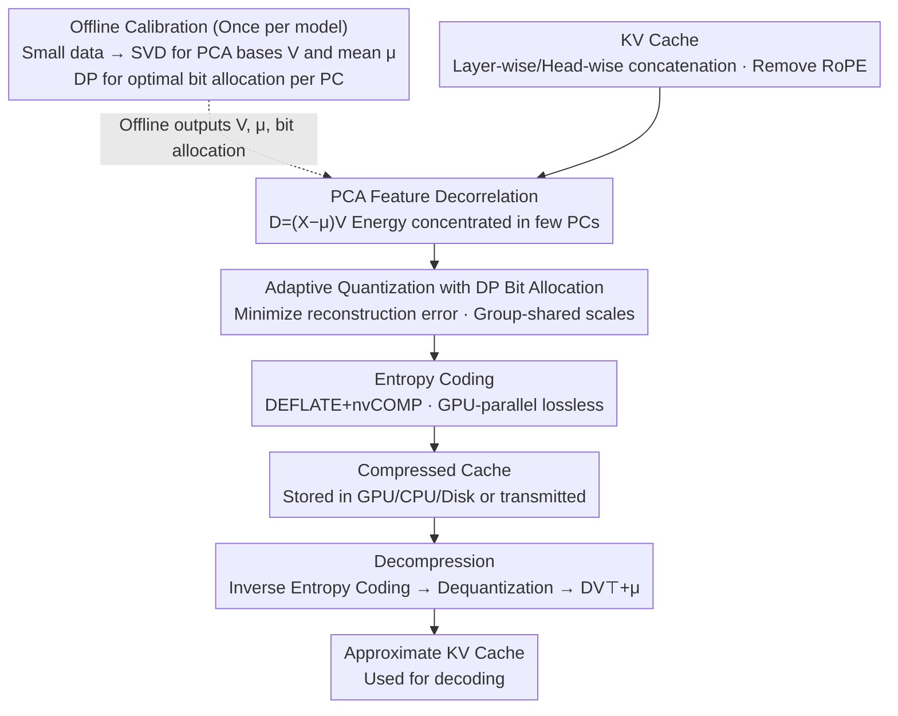

# KV Cache Transform Coding for Compact Storage in LLM Inference

**Conference**: ICLR 2026  
**arXiv**: [2511.01815](https://arxiv.org/abs/2511.01815)  
**Code**: None  
**Area**: Code Intelligence  
**Keywords**: KV Cache Compression, Transform Coding, PCA, Adaptive Quantization, Entropy Coding

## TL;DR

Ours proposes KVTC, a KV cache compression method inspired by classical media compression techniques (PCA feature decorrelation + adaptive quantization + entropy coding). It achieves up to 20× compression (40×+ in specific scenarios) on models like Llama 3, Mistral NeMo, and R1-Qwen 2.5, outforming baseline methods such as token eviction, quantization, and SVD.

## Background & Motivation

A core bottleneck in large-scale LLM inference services is **memory management of the KV cache**.

The KV cache is a critical component of Transformer inference, storing Key and Value vectors of previous tokens to avoid redundant computation. In practice, KV cache management faces multiple challenges:

**Large Memory Footprint**: In long-context scenarios (e.g., 128K tokens), the KV cache can consume tens of gigabytes of GPU memory, becoming the primary memory bottleneck for inference.

**Cache Reuse Needs**: In dialogue scenarios and iterative code editing, shared-prefix prompts are common; caches can be reused across rounds to avoid recomputation.

**Stale Cache Handling**: Inactive caches still consume valuable GPU memory, requiring either forced release followed by recomputation or offloading to CPU/disk.

**Offloading Efficiency**: Data transfer bandwidth between CPU and GPU is limited, and uncompressed caches incur high transmission overhead.

Existing KV cache optimization methods have their respective limitations:
- **Token Eviction** (e.g., H2O, StreamingLLM): Discards unimportant tokens, but information loss is irreversible.
- **Quantization** (e.g., KVQuant): Reduces numerical precision, but compression ratios are limited (typically 2-4×).
- **SVD Methods**: Low-rank approximation of KV matrices, but performance is unstable on long sequences.

The Key Insight is that **significant statistical redundancy exists in the KV cache**, which can be efficiently compressed by leveraging mature transform coding techniques from classical signal/media compression. This is analogous to JPEG image compression—performing transformation (DCT), followed by quantization and coding.

## Method

### Overall Architecture

KVTC addresses the problem where idle but reusable KV caches occupy GPU memory in long-context or multi-turn dialogue scenarios, forcing the system to recompute or offload data. Ours adapts the mature **transform coding** pipeline (decorrelation $\rightarrow$ quantization $\rightarrow$ entropy coding) to the KV cache.

The pipeline operates in three modes: **Offline Calibration** runs once per model—performing SVD (PCA) on KV caches collected from representative data to calculate projection bases $V$ and means $\mu$, and then using dynamic programming to determine bit allocation for each principal component. **Compression** occurs during inference gaps (e.g., after decoding or between prefill and decode), involving PCA decorrelation, quantized based on calibrated bit allocation, and entropy coding for storage. **Decompression** reverses these steps to reconstruct an approximate KV cache. This process does not modify model weights and only inserts compression/decompression into the cache read/write paths.

### Key Designs

**1. PCA Feature Decorrelation: Using offline-calibrated bases to compress redundancy into few principal components**

Feature dimensions in the KV cache are highly correlated; direct quantization wastes bits on redundant dimensions. KVTC performs SVD on centralized calibration data $C-\mu = U\Sigma V^\top$ (equivalent to PCA), using the orthogonal basis $V$ to map the cache to a decorrelated domain $D=(X-\mu)V$, with decompression as $X \approx DV^\top+\mu$. Energy concentrates in the few components with the largest variance, isomorphic to JPEG using DCT to shift image energy to low-frequency coefficients. Unlike prior low-rank methods that **calculate SVD for each prompt**, KVTC **calculates $V$ once** on a calibration set and reuses it. Three observations justify this: SVD must be computed on representative samples; excluding recent tokens and attention sinks improves compressibility; and Rotary Positional Embeddings (RoPE) must be removed before compression to avoid disrupting the low-rank structure of keys. Specifically, caches from $l$ layers and $h$ heads are concatenated along the hidden dimension (with separate bases for keys and values) rather than processed head-by-head.

**2. Adaptive Quantization with DP Optimal Bit Allocation: Rate-distortion optimization in the decorrelated domain**

Energy distribution after PCA is highly non-uniform; uniform quantization wastes bits on low-variance components and loses information on high-variance ones. KVTC assigns bit widths $q_i$ to each PC coordinate to minimize reconstruction error $\lVert DV^\top - D_{q_1,\dots,q_k}V^\top\rVert_F^2$ under a total bit budget. Since right-multiplying by an orthogonal matrix preserves the Frobenius norm, this error equals $\lVert D - D_{q_1,\dots,q_k}\rVert_F^2$, allowing **optimal allocation to be solved directly in the decorrelated domain**. A dynamic programming algorithm maintains tables for "minimum reconstruction error using $i$ PCs with $b$ bit budget." Inspired by Microscaling, adjacent PCs are grouped to share 16-bit shifts and scales, with DP optimizing group widths and sizes $\{1, 16, 64, 256, 1024\}$. Learned bit widths decrease monotonically, and **many trailing PCs are assigned 0 bits**, allowing these dimensions to be truncated to speed up inference.

**3. Entropy Coding: Squeezing residual statistical redundancy from quantized coefficients**

The distribution of quantized symbols is non-uniform (especially for trailing components with low/zero bits), allowing for further lossless compression. KVTC packs quantized values into byte arrays and applies DEFLATE entropy coding via nvCOMP for GPU-parallel execution. This lossless layer is content-dependent and critical for pushing the overall compression ratio beyond pure quantization to 20×.

## Key Experimental Results

### Main Results

Evaluations were conducted on Llama 3, Mistral NeMo, and R1-Qwen 2.5.

| Benchmark | Task Type | KVTC Compression Ratio | Performance Retention |
|---------|---------|------------|---------|
| AIME25 | Math Reasoning | 20× | Maintained |
| GSM8K | Math Reasoning | 20× | Maintained |
| MATH-500 | Math Reasoning | 20× | Maintained |
| LiveCodeBench | Code Generation | 20× | Maintained |
| MMLU | Knowledge QA | 20× | Maintained |
| LongBench | Long Context Under. | 20× | Maintained |
| Qasper | Document QA | 20× | Maintained |
| RULER | Long Context Eval. | 20× | Maintained |
| Specific Scenes | — | 40×+ | Scenario-dependent |

### Comparison with Baselines

| Method | Compression Ratio | Performance Retention | Mechanism |
|------|--------|---------|------|
| Token Eviction (H2O, etc.) | Medium | Irreversible info loss | Discards tokens |
| Quantization (KVQuant, etc.) | 2-4× | Good | Reduces precision |
| SVD Methods | Medium | Unstable | Low-rank approx. |
| **KVTC (Ours)** | **20× (up to 40×+)** | **Maintained** | **Transform Coding** |

### Key Findings

- **Significant Compression Advantage**: The 20× ratio significantly exceeds quantization (2-4×) and SVD methods.
- **Quality Preservation**: KVTC maintains original model performance across inference accuracy and long-context benchmarks even at high compression ratios.
- **Generality**: Consistently outperforms baselines across three architectures and eight benchmarks.
- **Practical Value**: A 20× ratio means a 20GB KV cache can be compressed to 1GB, drastically reducing inference costs.

## Highlights & Insights

- **Cross-Domain Knowledge Transfer**: Successfully migrating classical signal processing/media compression (transform coding) to LLM inference demonstrates the vitality of classical theories in new scenarios.
- **Breakthrough 20× Compression**: Compared to prior 2-4× quantization methods, KVTC improves the compression ratio by an order of magnitude.
- **Training-Free**: A pure inference-time method that is plug-and-play without affecting model parameters or training workflows.
- **Methodological Transparency**: Each component (PCA, Quantization, Entropy Coding) is supported by clear signal processing theory, offering high interpretability.
- **Practical Scenarios**: Particularly suitable for cache-reuse scenarios like dialogue and code editing, directly lowering LLM serving costs.

## Limitations & Future Work

- **Compression/Decompression Overhead**: The encoding/decoding process introduces additional computation, requiring a trade-off between compression ratio and latency.
- **Calibration Data Sensitivity**: The quality of PCA bases depends on the representativeness of calibration data; different task domains may require different calibration.
- **Lossy Compression**: While performance is well-maintained, quality degradation at extreme ratios (40×+) requires attention.
- **Dynamic Scenarios**: For scenarios with frequent KV cache updates (e.g., streaming), the frequency and overhead of compression need optimization.
- **Compatibility**: Compatibility with other inference optimizations like Flash Attention or PagedAttention was not explicitly discussed.
- **Hardware Adaptation**: GPU efficiency for operations like entropy coding may vary compared to CPU, requiring hardware-specific tuning.

## Related Work & Insights

- **H2O** (Zhang et al.): Heavy Hitter Oracle, evicts unimportant tokens based on attention scores.
- **StreamingLLM** (Xiao et al.): Retains attention sink tokens and uses a sliding window eviction strategy.
- **KVQuant** (Hooper et al.): Quantization specifically designed for KV caches.
- **JPEG/MPEG**: The classical transform coding paradigm (DCT + Quantization + Entropy Coding) served as the inspiration for KVTC.
- **PagedAttention** (Kwon et al., vLLM): Paged management of KV cache, which is complementary to KVTC compression.

**Insight**: Classical signal processing theories still hold significant potential for LLM inference optimization. The success of KVTC suggests that redundancy in the KV cache is far greater than previously imagined—20× compression with almost no performance loss implies that Transformer attention mechanisms might be highly inefficient in information utilization, opening doors for more aggressive learned transform methods.

## Rating

- Novelty: ⭐⭐⭐⭐ — Transform coding is not new, but its adaptation to KV cache and the resulting 20× ratio are significant contributions.
- Experimental Thoroughness: ⭐⭐⭐⭐⭐ — Extensive evaluation across 3 models and 8 benchmarks with comprehensive baseline comparisons.
- Writing Quality: ⭐⭐⭐⭐ — Clear descriptions of the method and its connection to classical compression theory.
- Value: ⭐⭐⭐⭐⭐ — Directly addresses a core bottleneck in LLM inference with high practical utility.

<!-- RELATED:START -->

## Related Papers

- [\[ICLR 2026\] HARDTESTGEN: A High-Quality RL Verifier Generation Pipeline for LLM Algorithmic Coding](hardtestgen_a_high-quality_rl_verifier_generation_pipeline_for_llm_algorithmic_c.md)
- [\[ACL 2026\] River-LLM: Large Language Model Seamless Exit Based on KV Share](../../ACL2026/code_intelligence/river-llm_large_language_model_seamless_exit_based_on_kv_share.md)
- [\[ICLR 2026\] VisCoder2: Building Multi-Language Visualization Coding Agents](viscoder2_building_multi-language_visualization_coding_agents.md)
- [\[ICLR 2026\] LLM-Guided Evolutionary Program Synthesis for Quasi-Monte Carlo Design](llm-guided_evolutionary_program_synthesis_for_quasi-monte_carlo_design.md)
- [\[ICLR 2026\] EDIT-Bench: Evaluating LLM Abilities to Perform Real-World Instructed Code Edits](edit-bench_evaluating_llm_abilities_to_perform_real-world_instructed_code_edits.md)

<!-- RELATED:END -->
