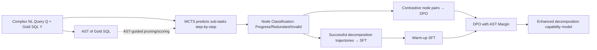

# LearNAT: Learning NL2SQL with AST-guided Task Decomposition for Large Language Models

**Conference**: ICLR 2026  
**OpenReview**: [https://openreview.net/forum?id=q6kXd8Gpfj](https://openreview.net/forum?id=q6kXd8Gpfj)  
**Code**: [https://github.com/MrBlankness/LearNAT](https://github.com/MrBlankness/LearNAT)  
**Area**: Code Intelligence / NL2SQL / LLM Post-training  
**Keywords**: NL2SQL, Task Decomposition, Abstract Syntax Tree (AST), Monte Carlo Tree Search (MCTS), Direct Preference Optimization (DPO)  

## TL;DR
LearNAT utilizes AST-guided MCTS search to automatically synthesize "verifiable" NL2SQL task decomposition data, followed by fine-grained multi-step preference optimization using margin-aware DPO, enabling a 7B small model to achieve performance comparable to GPT-4 in NL2SQL.

## Background & Motivation
**Background**: Translating natural language queries into executable SQL (NL2SQL) allows non-experts to interact directly with databases. Current SOTA methods (e.g., C3-SQL, DIN-SQL, SuperSQL) rely heavily on large private models like GPT-4, combined with complex prompt engineering and test-time scaling.

**Limitations of Prior Work**: Reliance on private LLMs presents two main issues: first, they are closed, non-reproducible, and raise data privacy concerns; second, test-time scaling makes inference costs extremely high (in Alpha-SQL style search, tokens per query can surge from 1.8K to 204.5K). Thus, this paper shifts towards a more pragmatic direction: enhancing the "model-level" performance of **small-scale open-source LLMs** in resource-constrained scenarios.

**Key Challenge**: Exploratory experiments reveal that complex NL2SQL queries can be decomposed into "high-level task decomposition + low-level NL2SQL translation." While LLMs perform well in **translation** due to extensive pre-training, they struggle with **decomposition**. When manual sub-tasks are provided, performance improves by 30.4%, but self-decomposition only yields a 3.4% gain. Worse, models introduce hallucinations when translating sub-SQLs back into natural language sub-tasks. Using Sentence-Transformer or GLM-4 to judge sub-task correctness yields only 46.8% / 36.0% accuracy, proving unreliable (e.g., GLM-4 may incorrectly validate a sub-task querying "User ID" when the gold standard is "Username").

**Goal**: To construct a **verifiable** task decomposition framework and utilize reinforcement learning to embed decomposition capabilities into small models.

**Key Insight**: **Replace unreliable LLM self-evaluation with programmatic ASTs (Abstract Syntax Trees)**. ASTs are used to guide search, prune branches, and score nodes for synthesizing high-quality decomposition data, and AST similarity-calculated margins are used for fine-grained preference learning.

## Method

### Overall Architecture
LearNAT consists of a two-stage offline process: first, the **Decomposition Synthesis Procedure** executes AST-guided MCTS to extract "successful decomposition trajectories" (for SFT) and "contrastive node pairs" (for preference learning) from the training set; second, **Margin-Aware Reinforcement Learning** performs warm-up SFT followed by DPO with AST margins on the target small model. GLM-4-Plus is used for data synthesis by default, while Qwen2.5-Coder is fine-tuned.

### Key Designs

**1. AST-guided MCTS Search: Constraining the "infinite text action space" into a verifiable search via syntax trees.** Decomposition is modeled as a Monte Carlo tree: the root node is the original query $Q$, each path from root to leaf represents a decomposition sequence, and each state $s_i=\{q_i, y_i, AT(y_i), AT^{sum}(y_i), R(s_i)\}$ records the sub-task $q_i$, corresponding sub-SQL $y_i$, its AST, and the cumulative merged AST $AT^{sum}(y_i)=(\bigcup_j N(AT(y_j)), \bigcup_j E(AT(y_j)))$. Crucially: traditional MCTS action sets are finite, but LLM text generation is infinite—one sub-SQL can be phrased in countless ways, leading to an explosion of the search space. LearNAT uses the AST of the Gold SQL as a "map" to constrain this space.

**2. Subtree-relationship-based Node Classification and Pruning: Cutting off meaningless search branches early.** Each node is classified into three categories based on the relationship between its AST and the Gold SQL AST: **Progress node** ($AT(y_i)$ is a subtree of $AT(Y)$ but not yet covered by parent nodes), **Redundant node** (is a subtree of $AT(Y)$ but already covered), and **Invalid node** (not a subtree of $AT(Y)$, i.e., incorrect decomposition). The subtree relationship is strictly defined by set inclusion: $isSubtree(AT_1,AT_2)=1$ if and only if $N_1\subseteq N_2 \wedge E_1\subseteq E_2$. Since valid sub-task sequences only correspond to Progress actions, expansion terminates at Redundant/Invalid nodes, reducing token costs from 330K to 130K (a 56.38% decrease) compared to naive MCTS.

**3. Rule-based Reward Estimation via AST Similarity: Eliminating unreliable LLM self-evaluations.** Unlike other LLM-MCTS methods that rely on the model for node rewards (GPT-4 achieves only 46.35% accuracy on BIRD), LearNAT uses pure rules. Rewards $R(s_i)=sim(AT^{sum}(y_i), AT(Y))$ are calculated only for Progress nodes, where similarity is a weighted sum of node-level ($sim_{node}$) and structural-level ($sim_{struct}$) components: $R(s_i)=\alpha\cdot sim_{node}+(1-\alpha)\cdot sim_{struct}$. This makes rewards interpretable and verifiable. Combined with a "self-improvement demonstration pool" (using top-3 successful samples as few-shot), the decomposition success rate increases from 59.07% (CoT) to 80.00%.

**4. DPO with AST Margin: Teaching the model "how much better" one step is over another.** Warm-up SFT is performed on successful trajectories by minimizing standard log-likelihood $L_{SFT}=-\mathbb{E}_{(x,t)}[\sum_i \log p_\theta(t_i|t_{1:i-1},x)]$ to learn the decomposition format. To address the "pessimism" of SFT (where positive feedback may also raise the probability of incorrect logic), DPO is used to suppress incorrect sub-tasks. Traditional DPO treats all step pairs equally, which is too coarse for multi-step reasoning. LearNAT injects the AST reward difference as a margin into the loss: $margin=R(s_i^w)-R(s_i^l)$, leading to $L_{MDPO}=-\mathbb{E}[\log\sigma(\hat{r}_\theta(x,y^w)-\hat{r}_\theta(x,y^l)-\triangle r)]$. This offset allows the model to learn the "magnitude" of preference rather than just the "direction," without requiring an extra reward model.

## Key Experimental Results

### Main Results
Execution Accuracy (EX) on BIRD-dev (In-domain) and Spider-dev (Out-of-domain):

| Method | Category | Backbone | BIRD Total | Spider Total |
|------|------|------|-----------|-------------|
| SuperSQL (VLDB'24) | System | GPT-4 | 58.5 | 87.0 |
| MAC-SQL (COLING'25) | System | GPT-4 | 59.4 | 86.7 |
| CodeS (SIGMOD'24) | Model | CodeS-7B | 57.0 | 85.4 |
| CodeS | Model | CodeS-15B | 58.5 | 84.9 |
| **LearNAT** | Model | Qwen2.5-Coder-7B | **58.1** | **86.4** |
| **LearNAT** | Model | Qwen2.5-Coder-14B | 61.2 | 86.9 |
| **LearNAT** | Model | Qwen2.5-Coder-32B | **65.0** | **88.4** |

LearNAT (7B) outperforms all model-level baselines in a single forward pass and exceeds most system-level methods. The 32B version reaches 88.4% on Spider, 1.4% higher than SuperSQL.

### Ablation Study
Backbone: Qwen2.5-Coder-7B:

| Ablation | BIRD Total | Spider Total |
|------|-----------|-------------|
| LearNAT (Full) | 58.1 | 86.4 |
| w/o LearNAT (Entirety) | 47.5 (↓10.6) | 77.0 (↓9.4) |
| → DPO only | 52.8 (↓5.3) | 79.0 (↓7.4) |
| → CoT Decomposition only | 49.3 (↓8.7) | 79.4 (↓7.0) |
| w/o AST Guide | 53.1 (↓5.0) | 79.9 (↓6.5) |
| w/o SFT | 54.5 (↓3.6) | 81.0 (↓5.3) |
| w/o MDPO | 53.7 (↓4.4) | 80.9 (↓5.4) |
| MDPO → Standard DPO | 56.6 (↓1.4) | 85.1 (↓1.3) |

Removing any component leads to a performance drop; the AST guide and MDPO margin design are both validated as effective.

### Key Findings
- **Synthesis Procedure**: Success rate reached 80.00%, which is 20.93% higher than CoT and 8.45% higher than naive MCTS, while reducing token costs by 56.38%.
- **Self-improvement**: The first round improved performance by 1.99%, but gains in rounds 2 and 3 (+0.4%/+0.27%) showed diminishing returns.
- **Cross-protocol Comparison**: Under various protocols (SynCoT, SQL-o1, Alpha-SQL, OmniSQL), LearNAT consistently performed better (e.g., reaching 68.4% on BIRD under the Alpha-SQL protocol).
- **Data Efficiency**: Synthesizing 7.2K verifiable samples from BIRD-train outperformed OmniSQL's 2.5 million synthetic samples—quality over quantity.

## Highlights & Insights
- **Programmatic Ground Truth vs. Model Self-Evaluation**: The core insight is that NL2SQL provides parseable Gold SQL structures. ASTs allow assessment of correctness and magnitude through computable rules, bypassing the unreliability of LLM self-evaluations and semantic similarity metrics.
- **Search-derived Rewards for Preference Optimization**: The AST margins calculated during synthesis serve a dual purpose: pruning branches and acting as the DPO offset. This eliminates the need for an expensive reward model and keeps the pipeline clean.
- **Model-level vs. System-level Cost Balance**: A 7B model achieving parity with system-level methods (which rely on multiple candidates, refinement, and consistency checks) provides a compelling performance-cost trade-off.

## Limitations & Future Work
- **Reliance on Gold SQL**: The verifiable decomposition framework requires standard SQL in the training set. AST guidance is inherently supervised, which limits migration to open-source scenarios without Gold SQL.
- **Error Analysis**: Among 50 failure cases, schema linking (25), floating-point calculations, unknown rules, and incorrect answers remain dominant, indicating that AST verification cannot resolve semantic alignment errors.
- **Diminishing Returns of Self-improvement**: Gains after one round are small; the upper limit of decomposition capability may be capped by the synthesis model (GLM-4-Plus) itself.
- **Heuristic Parameters**: Weights $\alpha$ for AST margins and similarity definitions are somewhat heuristic and require more validation for robustness across different SQL dialects or complex nested queries.

## Related Work & Insights
- **NL2SQL Roadmap**: System-level (DIN-SQL, SuperSQL, MAC-SQL) depends on GPT-4 and complex pipelines; Model-level (CodeS, SENSE, OmniSQL) focuses on fine-tuning. LearNAT follows the latter but utilizes "verifiable decomposition."
- **LLM + Task Decomposition/Reasoning**: Complementary to test-time search (CoT, SQL-o1, Alpha-SQL). LearNAT shifts search costs to the training phase, allowing single forward-pass inference.
- **Preference Optimization**: Introducing step-level margins to DPO can be generalized to other multi-step reasoning tasks with programmatic ground truths (e.g., code generation, theorem proving, agent planning).

## Rating
- **Novelty**: ⭐⭐⭐⭐ — Ingenious combination of AST for verifiable search and reusing rewards as DPO margins.
- **Experimental Thoroughness**: ⭐⭐⭐⭐ — Comprehensive across two datasets, three model scales, and multiple protocols.
- **Writing Quality**: ⭐⭐⭐⭐ — Clear motivation chain from exploratory observations to methodology.
- **Value**: ⭐⭐⭐⭐ — Significant practical value for deploying reproducible NL2SQL on 7B models with zero extra inference overhead.

<!-- RELATED:START -->

## Related Papers

- [\[ACL 2025\] Personality-Guided Code Generation Using Large Language Models](../../ACL2025/code_intelligence/personality_guided_code_gen.md)
- [\[ICLR 2026\] Evolving Graph Structured Programs for Circuit Generation with Large Language Models](evolving_graph_structured_programs_for_circuit_generation_with_large_language_mo.md)
- [\[ICLR 2026\] CrossPL: Systematic Evaluation of Large Language Models for Cross Programming Language Interoperating Code Generation](crosspl_systematic_evaluation_of_large_language_models_for_cross_programming_lan.md)
- [\[ICLR 2026\] Local Success Does Not Compose: Benchmarking Large Language Models for Compositional Formal Verification](local_success_does_not_compose_benchmarking_large_language_models_for_compositio.md)
- [\[ICLR 2026\] Training Large Language Models To Reason In Parallel With Global Forking Tokens](training_large_language_models_to_reason_in_parallel_with_global_forking_tokens.md)

<!-- RELATED:END -->
