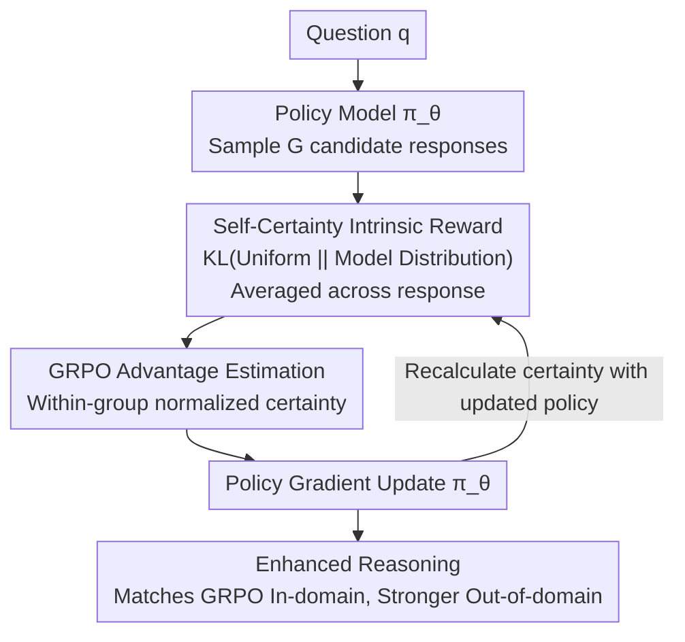

# Learning to Reason without External Rewards

**Conference**: ICLR 2026  
**arXiv**: [2505.19590](https://arxiv.org/abs/2505.19590)  
**Code**: [https://github.com/sunblaze-ucb/Intuitor](https://github.com/sunblaze-ucb/Intuitor)  
**Area**: Code Intelligence  
**Keywords**: RLIF, Self-Certainty, Intrinsic Rewards, GRPO, Unsupervised Reinforcement Learning

## TL;DR
Proposes Intuitor, an RLIF method that replaces external verifiable rewards with the model's own self-certainty (KL divergence between the output distribution and a uniform distribution). It matches GRPO performance in mathematical reasoning while demonstrating better generalization in out-of-distribution tasks such as code generation.

## Background & Motivation

**Background**: RLVR (Reinforcement Learning with Verifiable Rewards) has become the mainstream method for enhancing LLM reasoning capabilities. For instance, DeepSeek-R1 utilizes GRPO combined with exact answer matching as a reward signal.

**Limitations of Prior Work**: (a) RLHF requires extensive manual annotation, which is costly and biased; (b) RLVR depends on domain-specific verifiers and ground truth—mathematics requires expert labeling, while code necessitates test suites and execution environments, limiting applicability in open-ended scenarios; (c) outcome-based verifiable rewards are difficult to transfer across different domains.

**Key Challenge**: Enhancing reasoning capabilities requires RL training, yet the cost of acquiring high-quality reward signals significantly limits the scope of RL applications.

**Goal**: Can LLMs improve their reasoning capabilities by relying solely on internal intrinsic signals without external verifiers or ground truth?

**Key Insight**: LLMs exhibit lower certainty on difficult questions and higher certainty when providing correct answers—this intrinsic signal can serve as a training reward.

**Core Idea**: Replace external rewards in GRPO with the model's own self-certainty (average KL(Uniform || p_model)) to achieve fully unsupervised enhancement of reasoning capabilities.

## Method

### Overall Architecture
The implementation of Intuitor is highly concise: in the standard GRPO training pipeline, external rewards (such as answer matching) are entirely replaced by the model's own self-certainty scores. In a training iteration, given an input question $q$, the policy model samples $G$ candidate responses. For each response, the self-certainty is calculated based on the **currently training** policy (a critical factor for stability, see Key Design 3). Within-group normalization is then applied to obtain advantage estimates, followed by policy gradient updates. The updated policy is subsequently reused to recalculate the certainty for the next set of responses, creating a closed loop where rewards evolve alongside the policy. The entire process requires no ground truth, test cases, or any external verification.

### Key Designs

**1. Self-Certainty as Intrinsic Reward: Replacing "Correctness" with "Confidence"**

RLVR is constrained by external verifiers. To bypass this, Intuitor asks the model itself: how certain are you about this answer? This certainty is quantified as self-certainty: for each token in a response, calculate the KL divergence between the uniform distribution $U$ and the model's predicted distribution, then average this over the entire response:

$$\text{Self-certainty}(o|q) = \frac{1}{|o|}\sum_{i=1}^{|o|} \text{KL}\big(U \,\|\, p_{\pi_\theta}(\cdot|q, o_{<i})\big)$$

A sharper model distribution (diverging more from uniform) results in a larger KL, indicating higher "certainty" about the next token. Crucially, since the second parameter is the model distribution, this is a mode-seeking measure rather than a mass-covering measure like entropy—it rewards distribution concentration and does not systematically favor longer texts like perplexity or entropy. Kang et al. (2025) previously demonstrated that self-certainty effectively distinguishes high-quality from low-quality responses; Intuitor adopts this evaluation signal directly as a training reward.

**2. GRPO-based Advantage Estimation: Converting Certainty into Update Directions**

With self-certainty providing a continuous reward, the GRPO framework handles the remaining logic. For a single question $q$, $G$ responses are sampled, each with a calculated certainty $u_i = \text{Self-certainty}(o_i|q)$. Within-group normalization yields the advantage:

$$\hat{A}_{i,t} = \frac{u_i - \text{mean}(\{u_1,\dots,u_G\})}{\text{std}(\{u_1,\dots,u_G\})}$$

Consequently, as long as a response is more "certain" than others in its group, it receives a positive advantage and its probability is increased by the policy gradient. While GRPO's group-relative normalization was designed for discrete correctness rewards, it works effectively for continuous certainty, mapping absolute certainty values to relative rankings and avoiding issues where certainty scales differ across questions.

**3. Online Self-Certainty: Evolving Rewards with Policy to Prevent Reward Hacking**

A critical and somewhat counter-intuitive point: self-certainty must be calculated using the current policy model being trained, rather than a fixed base model. If a fixed model serves as the reward source (offline), it acts as a static reward model that the policy can exploit—experiments observed the model learning to append solved sub-problems to the end of answers to inflate scores. This "reward hacking" leads to training collapse after approximately 100 steps. By switching to online calculation, the reward signal evolves with the policy, preventing the model from over-optimizing against a static target and maintaining stability. This serves as a clean controlled experiment on the fragility of static reward models in RLHF: co-evolving the evaluator and the evaluated closes this cheating path.

### Loss & Training
Standard GRPO objective function, with the reward source modified:
$$\mathcal{J}(\theta) = \mathbb{E}\left[\frac{1}{G}\sum_{i=1}^{G}\frac{1}{|o_i|}\sum_{t=1}^{|o_i|}\left(\min[c_{i,t}\hat{A}_{i,t}, \text{clip}_\epsilon(c_{i,t})\hat{A}_{i,t}] - \beta D_{\text{KL}}(\pi_\theta \| \pi_{\text{ref}})\right)\right]$$
Training data: 7,500 questions from the MATH dataset, sampling 7 responses per question, with $\beta=0.005$.

## Key Experimental Results

### Main Results

**Qwen2.5-3B (MATH Training)**:

| Method | GSM8K | MATH500 | LiveCodeBench | CRUXEval-O | AlpacaEval |
|------|-------|---------|---------------|------------|------------|
| Base | 0.673 | 0.544 | 0.093 | 0.236 | 3.72 |
| GRPO | 0.826 | 0.636 | 0.085 | 0.341 | 6.91 |
| **Ours (Intuitor)** | 0.792 | 0.612 | **0.153** | **0.416** | **7.10** |

Performance in-domain (Math) is slightly lower than GRPO, but significantly superior to GRPO in out-of-domain tasks (Code/Instruction Following).

### Ablation Study

| Configuration | GSM8K | MATH | Description |
|------|-------|------|------|
| Ours (Online) | 0.792 | 0.612 | Stable training |
| Offline self-certainty | Collapse | Collapse | Reward hacking after ~100 steps |
| Entropy minimization | Collapse | Collapse | Catastrophic collapse |
| Random rewards | Collapse | Collapse | Catastrophic collapse |

### Key Findings
- **Early Learning Advantage**: Intuitor outperforms GRPO on GSM8K/MATH within only 10 training steps, as continuous process-aware rewards provide richer learning signals than binary outcome rewards.
- **Emergent Reasoning**: A 1.5B base model that originally produced gibberish (scoring ~0 on all benchmarks) learned structured reasoning and code generation (9.9% on LiveCodeBench) after Intuitor training.
- **Cross-Domain Generalization**: Training on MATH led to a 65% improvement on LiveCodeBench (where GRPO showed no gain) and a 76% improvement on CRUXEval (compared to 44% for GRPO), suggesting that self-certainty rewards encourage general reasoning rather than domain-specific pattern matching.
- **Spontaneous R1-style Reasoning**: Models spontaneously generated natural language chains of thought before outputting code, even though the prompt did not request it.

## Highlights & Insights
- **Minimalist yet Effective Design**: Simply replacing the reward function in GRPO enables unsupervised reasoning training, reflecting the profound insight that a "good intrinsic signal" may be more important than "expert external labels."
- **Contrastive Experiments on Online vs. Offline Rewards**: Clearly demonstrates the mechanism of reward hacking and how to defend against it. The fragility of static reward models is a classic RLHF issue, which Intuitor addresses elegantly via co-evolving rewards.
- **Self-certainty vs. Entropy**: The mode-seeking nature of KL(U||p) ensures it does not bias toward long texts, a design choice worthy of reuse in other scenarios involving intrinsic rewards.

## Limitations & Future Work
- In-domain math performance is slightly lower than GRPO (-3~4%), indicating that self-certainty is not a perfect proxy for correctness.
- Validated only on models $\leq 14$B; the vision of "superhuman reasoning" via RLIF remains a distant goal.
- Self-certainty may bias toward knowledge already known to the model, potentially limiting the learning of entirely new knowledge.
- Future work could explore hybrid reward schemes (e.g., using RLVR when ground truth is available and RLIF when it is not).

## Related Work & Insights
- **vs. GRPO/DeepSeek-R1**: Intuitor replaces ground truth with self-certainty, offering broader applicability but slightly lower in-domain performance.
- **vs. TTRL**: TTRL uses plurality voting to approximate ground truth, which remains outcome-oriented; Intuitor is process-aware.
- **vs. Entropy Minimization (EM-RL)**: EM-RL directly minimizes token-level entropy, which often leads to training collapse; self-certainty's mode-seeking property is more stable.

## Rating
- Novelty: ⭐⭐⭐⭐⭐ The proposal of the RLIF paradigm is forward-looking, and the idea of using self-certainty as an unsupervised training signal is compelling.
- Experimental Thoroughness: ⭐⭐⭐⭐ Comprehensive across multiple models, tasks, and ablations, though model scales remain small.
- Writing Quality: ⭐⭐⭐⭐⭐ Clear argumentation, rigorous experimental design, and excellent visualization.
- Value: ⭐⭐⭐⭐⭐ Opens a new direction for unsupervised/weakly supervised LLM training with high heuristic value.

<!-- RELATED:START -->

## Related Papers

- [\[ACL 2026\] ReCode: Reinforcing Code Generation with Reasoning-Process Rewards](../../ACL2026/code_intelligence/recode_reinforcing_code_generation_with_reasoning-process_rewards.md)
- [\[ICLR 2026\] Training Large Language Models To Reason In Parallel With Global Forking Tokens](training_large_language_models_to_reason_in_parallel_with_global_forking_tokens.md)
- [\[ICLR 2026\] Agnostics: Learning to Synthesize Code in Any Programming Language with a Universal Reinforcement Learning Environment](agnostics_learning_to_synthesize_code_in_any_programming_language_with_a_univers.md)
- [\[ICLR 2026\] ATGen: Adversarial Reinforcement Learning for Test Case Generation](atgen_adversarial_reinforcement_learning_for_test_case_generation.md)
- [\[ICLR 2026\] Critique-Coder: Enhancing Coder Models by Critique Reinforcement Learning](critique-coder_enhancing_coder_models_by_critique_reinforcement_learning.md)

<!-- RELATED:END -->
