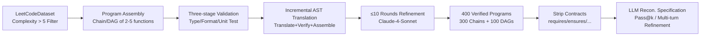

# Local Success Does Not Compose: Benchmarking Large Language Models for Compositional Formal Verification

**Conference**: ICLR 2026  
**OpenReview**: [https://openreview.net/forum?id=y4kAMUBqLq](https://openreview.net/forum?id=y4kAMUBqLq)  
**Code**: TBD  
**Area**: Code Intelligence / Formal Verification / LLM Evaluation  
**Keywords**: Formal Verification, Dafny, Compositional Reasoning, Specification Generation, Benchmark, Pass@k  

## TL;DR
This paper introduces **DAFNYCOMP**, the first benchmark for compositional formal specification generation across multi-function programs. It reveals that while leading LLMs achieve over 58% pass rates on single-function Dafny verification, their end-to-end success rates drop nearly to zero (strongest model Pass@8 is only 2%) when 2–5 functions are composed into a call chain, proving that "local success does not compose."

## Background & Motivation
**Background**: LLMs have significantly transformed code generation, making the correctness of automatically synthesized code a critical issue. Formal verification (e.g., Dafny) provides mathematical guarantees through contracts like preconditions, postconditions, and loop invariants. However, the "specification bottleneck"—the requirement for expertise to write annotations where the volume of specification often matches the implementation—has long hindered its adoption. Recent works utilize LLMs to automate specification completion and have achieved moderate success on single-function tasks.

**Limitations of Prior Work**: Existing benchmarks (e.g., DAFNYBENCH, MBPP-DFY) almost exclusively evaluate annotation completion for **isolated single functions**. They fail to examine **compositional reasoning across components**, which is essential for real-world software systems where correctness emerges from complex interactions between multiple modules.

**Key Challenge**: Single-function tasks allow models to succeed through purely local reasoning, masking their inability to propagate contracts across function boundaries. when a function has missing or weakened postconditions that fail to satisfy the preconditions of downstream callees, errors cascade along the call chain, leading to the failure of the end-to-end proof.

**Goal**: To construct a diagnostic benchmark that **mandates compositional reasoning**, quantifying the gap between "locally correct" and "compositionally verifiable," while systematically characterizing failure mechanisms.

**Core Idea**: **"Synthesize verifiable multi-function Dafny programs + Strip contracts for reconstruction"**. Multiple independent functions are assembled into an acyclic call graph. Mechanical verification ensures the existence of a ground truth. Models are then tasked with regenerating cross-function contracts to expose systematic failures in compositional verification.

## Method

### Overall Architecture
DAFNYCOMP employs a two-stage synthesis pipeline to produce 400 mechanically verified multi-function programs. First, **program assembly** is performed at the Python level (composing independent functions based on data flow and verifying functional correctness). This is followed by **formal translation** (incremental AST-guided translation into verifiable Dafny). The evaluation uses a "specification reconstruction" task—stripping only the contract clauses for the model to restore—and measures 11 leading models via Pass@k and verifier-in-the-loop multi-turn self-refinement protocols.

### Key Designs

**1. Program Assembly: Filtering via complexity and mandating composition via data flow.** Candidates (1,847 functions) are filtered from LEETCODEDATASET based on McCabe cyclomatic complexity $>5$ (top 30%) and lines of code $\geq 10$. This ensures the control flow is complex enough (loops with termination, nested conditions, recursion) to stress specification generation. **Chain composition** is primarily used—where the output of a previous function feeds the input of the next—creating explicit data dependencies. Branching structures are extended using 10 non-chain DAG topology templates. Post-assembly, a minimal set of dependencies with shared imports is identified to resolve library attribution for Dafny. Results undergo three-stage validation: (i) Type checking via constraint propagation along the chain; (ii) Deterministic formatting using Black/isort; (iii) functional correctness verification via unit tests constructed from the **intersection** of input/output constraints. 1,200 valid Python programs are ultimately obtained.

**2. Formal Translation: Complementary Incremental AST Translation and Whole-program Assembly.** Direct end-to-end Python-to-Dafny translation yields less than a 5% success rate because Dafny requires explicit specifications and invariants. The authors utilize **incremental translation**: decomposing each Python AST into function/structure-level fragments, translating and verifying them individually to localize errors, then regrouping them. A key insight is the complementarity of "whole-program assembly" and "incremental translation"—initial assembly in Python utilizes mature toolchains for reliability and provides a global logic blueprint. Each candidate undergoes $\leq 10$ rounds of refinement based on verifier feedback (adding invariants, refining postconditions). The pipeline uses CLAUDE-4-SONNET, yielding 564 verified programs (47% success rate). Claude models are excluded from downstream evaluation to prevent data leakage.

**3. Specification Reconstruction Task: Stripping contracts to isolate compositional reasoning.** Unlike DAFNYBENCH which removes all annotations, this task **strips only the contract clauses** (`requires`, `ensures`, `reads`, `modifies`, `decreases`) preceding logic blocks. By retaining the implementation, the model must regenerate contracts that capture emergent correctness across boundaries. The final benchmark contains 300 chains and 100 DAGs, with an average of 3.2 functions and 8.4 data dependencies per program, requiring a median of 7 loop invariants and 4 assertions—approximately $3.5\times$ the annotation density of DAFNYBENCH.

**4. Dual Test-time Scaling Evaluation.** The evaluation reports two scaling protocols: **Independent sampling Pass@k** ($k \in \{1, 2, 4, 8\}$) to measure the probability of solving a problem within independent trials; and **verifier-in-the-loop multi-turn self-refinement**, where failed outputs are fed back with verifier errors for revision over $T=3$ rounds. These protocols quantify marginal gains from increased sampling versus feedback-driven iteration.

## Key Experimental Results

### Main Results: Pass@k on Chain Split (300 tasks) via Independent Sampling

| Model | Syntax@8 (%) | Verified@1 | Verified@8 |
|---|---|---|---|
| GPT-4O | 99.67 | 0.33 | 0.33 |
| O4-MINI | 99.00 | 0.00 | 0.67 |
| GEMINI-2.5-PRO | 96.00 | 0.00 | **2.00** (Best) |
| DEEPSEEK-R1 | 99.00 | 0.33 | 0.33 |
| QWEN3-CODER-480B | 99.00 | 0.00 | 1.00 |
| QWQ-32B | 91.00 | 0.00 | 0.00 |

Mean Pass@8: Syntax $94.36\%$ vs. Verified $0.55\%$ — **The Syntax–Verified gap is $93.82\%$**.

### Ablation Study: Multi-turn Self-refinement (Selected Models)

| Model | Setting | Verified@T1 | Verified@T3 |
|---|---|---|---|
| DEEPSEEK-R1 | Chain | 0.33 | **9.67** |
| O4-MINI | Chain | 0.00 | 9.67 |
| QWEN3-CODER-480B | Chain | 0.33 | 3.00 |
| DEEPSEEK-V3.1 | DAG | 1.00 | 7.00 |
| GPT-4.1 | DAG | 1.00 | 4.00 |

Comparison: Leading models achieve Syntax $>99\%$ and Verified $>58\%$ on single-function benchmarks; on DAFNYCOMP, Verified rates collapse to low single digits.

### Failure Mode Distribution (Manual Analysis of 900 cases)

| Failure Mode | Ratio | Mechanism |
|---|---|---|
| Specification Fragility | 39.2% | Contract propagation failure (domino effect) |
| Impl–Proof Misalignment | 21.7% | Independent generation of implementation and spec |
| Reasoning Instability | 14.1% | Broken induction chains |
| Others (Syntax/Timeout) | 25.0% | Miscellaneous |

### Key Findings
- **Universal Collapse**: The gap between high syntax correctness (94%+) and near-zero verification (0.55%) spans all model families (dense/MoE, general/code-specialized), indicating it is not a formatting issue.
- **Disproportionate Degradation**: The drop from 58% (single-function) to 0.55% (compositional) stems from cascading contract failures across boundaries rather than simple additive difficulty.
- **Rapid Saturation of Sampling**: Average gain from $k=4 \to k=8$ is only $+0.27\%$, with 7 out of 11 models showing zero gain. Multi-turn refinement reaches 9.67% but remains far from saturation.
- **No Advantage for Reasoning Models**: QWQ-32B remains at 0% verification while DEEPSEEK-R1 stays $<1\%$, suggesting current RL/reasoning-trace training is insufficient for compositional verification.

## Highlights & Insights
- **Quantification of "Local Success Does Not Compose"**: This engineering intuition is transformed into a traceable diagnostic metric (Syntax–Verified gap) with an extreme value ($93.82\%$).
- **Robust Synthesis Pipeline**: Complexity filtering, three-stage validation, and incremental AST translation ensure the benchmark is novel, provides mechanically verified ground truth, and avoids leakage.
- **Characterization of Failure Mechanisms**: Identifying Specification Fragility, Impl–Proof Misalignment, and Reasoning Instability provides direct guidance for enhancing contract propagation and consistency in future training.
- **Honest Null Results**: Explicitly noting that reasoning-specialized models also fail avoids overstating the efficacy of specific architectures.

## Limitations & Future Work
- **Constrained Composition Patterns**: Current focus is on acyclic chains and DAGs. Complex patterns like cyclic graphs, mutual recursion, and dense shared-state dependencies remain out of scope and require new synthesis methods.
- **Limited Specification Types**: Only functional correctness (pre/post-conditions, invariants) is tested; liveness, resource bounds, and security policies are not covered.
- **Single-Model Synthesis Bias**: The reliance on Claude-4-Sonnet for the pipeline might introduce latent biases in the problem distribution despite excluding Claude from evaluation.
- **Absence of Solutions**: As a diagnostic benchmark, it identifies problems without providing training or inference-level solutions.

## Related Work & Insights
- **Formal Verification Benchmarks**: DAFNYCOMP fills the gap between single-function benchmarks (DAFNYBENCH) and interactive theorem-proving tasks (miniCodeProps) by focusing on compositional specification.
- **Dynamic Benchmark Generation**: It addresses contamination in static benchmarks by using controlled composition and contamination analysis to maintain complexity.
- **Compositional Reasoning in LLMs**: Corroborates work by Dziri et al. on Transformer compositionality limitations, while imposing the stricter "invariant preservation" requirements of formal verification.
- **Insight**: This "Assemble-Verify-Strip-Reconstruct" paradigm is extensible to smart contract verification and distributed protocols where compositional correctness is vital.

## Rating
- **Novelty**: ⭐⭐⭐⭐⭐ First compositional formal verification benchmark; effectively quantifies a structural weakness in LLMs.
- **Experimental Thoroughness**: ⭐⭐⭐⭐ Comprehensive evaluation across 11 models and multiple protocols; manual analysis adds significant value.
- **Writing Quality**: ⭐⭐⭐⭐ Clear logic from motivation to mechanism; provides actionable takeaways.
- **Value**: ⭐⭐⭐⭐⭐ Establishes a high-bar diagnostic tool for verifiable code generation, highlighting structural shortfalls for the community.

<!-- RELATED:START -->

## Related Papers

- [\[ICLR 2026\] SpotIt: Evaluating Text-to-SQL Evaluation with Formal Verification](spotit_evaluating_text-to-sql_evaluation_with_formal_verification.md)
- [\[ICLR 2026\] Evolving Graph Structured Programs for Circuit Generation with Large Language Models](evolving_graph_structured_programs_for_circuit_generation_with_large_language_mo.md)
- [\[ICLR 2026\] CrossPL: Systematic Evaluation of Large Language Models for Cross Programming Language Interoperating Code Generation](crosspl_systematic_evaluation_of_large_language_models_for_cross_programming_lan.md)
- [\[AAAI 2026\] SPAN: Benchmarking and Improving Cross-Calendar Temporal Reasoning of Large Language Models](../../AAAI2026/code_intelligence/span_benchmarking_and_improving_cross-calendar_temporal_reasoning_of_large_langu.md)
- [\[ICLR 2026\] LearNAT: Learning NL2SQL with AST-guided Task Decomposition for Large Language Models](learnat_learning_nl2sql_with_ast-guided_task_decomposition_for_large_language_mo.md)

<!-- RELATED:END -->
