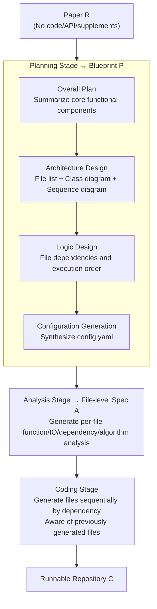

# Paper2Code: Automating Code Generation from Scientific Papers in Machine Learning

**Conference**: ICLR 2026  
**arXiv**: [2504.17192](https://arxiv.org/abs/2504.17192)  
**Code**: [github.com/going-doer/Paper2Code](https://github.com/going-doer/Paper2Code)  
**Area**: Code Intelligence  
**Keywords**: Paper-to-code, multi-agent framework, repository-level code generation, scientific reproducibility, LLM

## TL;DR

PaperCoder is proposed—a multi-agent LLM framework that automatically transforms machine learning papers into runnable code repositories via a three-stage pipeline of Planning, Analysis, and Coding. 88% of the generated repositories were rated as best by the original authors, significantly outperforming baselines on the PaperBench benchmark.

## Background & Motivation

1. Reproducibility is core to scientific progress, yet code availability for top-tier conference papers is only approximately 19.5% (2024). Researchers must often reverse-engineer methods and results from papers, which is extremely time-consuming.
2. LLMs have demonstrated superior capabilities in scientific document understanding and high-quality code generation, but existing automation for scientific workflows (e.g., ideation, experimental improvement) typically relies on pre-existing code implementations.
3. Repository-level code generation is much more complex than single-file generation, requiring coordination of architectural design, module structure, and cross-file dependencies.
4. Scientific papers are written to communicate ideas to humans, containing high-level motivations and narratives; from a software engineering perspective, they are noisy, loose, and ambiguous.
5. Existing multi-agent code generation frameworks (e.g., ChatDev, MetaGPT) adopt bottom-up strategies, expanding from short requirement descriptions, which are unsuitable for processing long scientific documents.
6. **Core Problem**: Is it possible to generate faithful code implementations solely from a paper (without code, APIs, or supplementary materials)?

## Method

### Overall Architecture

The purpose of a paper is to explain ideas to humans, which results in a structure that is loose, vague, and lacks executable structure. Bottom-up multi-agent frameworks like ChatDev and MetaGPT easily lose context when facing a complete paper. PaperCoder reverses this by simulating the actual workflow of a human developer: reading the full text to plan, performing file-by-file analysis, and finally writing the code. The system is split into three serial stages where the output of the previous stage serves as input for the next, progressively converging the unstructured paper $R$ into a runnable repository $C$:

$$\text{Planning: } P = M_{\text{plan}}(R), \quad \text{Analysis: } A = M_{\text{analysis}}(R, P), \quad \text{Coding: } C = M_{\text{code}}(R, P, A)$$

### Key Designs

**1. Planning: Decomposing the full paper into an executable blueprint**

Simply asking an LLM to generate a whole repository from a paper skips the crucial "think before acting" step used by human developers. The Planning stage uses four sequential sub-components to converge vague paper content into implementation-level abstractions. First, the **Overall Plan** extracts high-level summaries of core functions like model components, training objectives, data processing, and evaluation protocols. Next, **Architecture Design** defines the repository-level structure, producing a file list, class diagrams for static structure, and sequence diagrams for dynamic interactions. Then, **Logic Design** specifies dependencies and execution order between files—a step that ensures the coder generates module A before module B if B depends on A. Finally, **Configuration Generation** synthesizes a `config.yaml` to centralize hyperparameters and runtime options.

**2. Analysis: Thinking through each file's responsibilities before coding**

While Planning provides a file list, the actual implementation of each file remains blank. The Analysis stage generates a file-level analysis $a_i$ for every identified file $f_i$, covering functional goals, input/output behaviors, intra- and inter-file dependencies, and algorithm specifications mapped from the paper body. This creates a detailed requirement specification for each file, gathering scattered details from across the paper onto the relevant modules.

**3. Coding: Sequential generation with repository state awareness**

With the blueprint and individual file analyses, the system proceeds to coding. It strictly follows the execution order from the Logic Design. The generation of the $i$-th file is not isolated; it simultaneously receives the original paper $R$, the overall plan $P$, its specific file info $f_i$ and analysis $a_i$, as well as all previously generated files $\{c_1, ..., c_{i-1}\}$:

$$c_i = \text{LLM}(\mathcal{T}_{\text{code}}(R, P, f_i, a_i, \{c_1, ..., c_{i-1}\}))$$

This ensures that every new file is aware of existing dependencies and the current state of the repository, allowing cross-file calls to align and preventing the interface mismatch common in bottom-up methods.

### Loss & Training

- Non-training framework; a multi-agent system based on prompt engineering.
- Defaults to o3-mini-high as the backbone LLM.
- Supports Self-Refine validation-refinement steps to further improve output quality across stages.
- Evaluation: reference-based (when author code is available) + reference-free (no code available) + human evaluation (scoring by the first author).

## Key Experimental Results

### Main Results

**Paper2CodeBench (90 papers, ICLR/ICML/NeurIPS 2024)**:

| Method | Ref-Based (ICLR) | Ref-Based (ICML) | Ref-Based (NeurIPS) | Ref-Free (ICLR) | Ref-Free (ICML) | Ref-Free (NeurIPS) |
|------|---------|---------|---------|---------|---------|---------|
| ChatDev | 2.70 | 2.97 | 2.96 | 4.00 | 4.12 | 4.01 |
| MetaGPT | 2.48 | 2.75 | 2.95 | 3.52 | 3.63 | 3.59 |
| Paper (one-shot) | 3.08 | 3.28 | 3.22 | 4.15 | 4.30 | 4.08 |
| **PaperCoder** | **3.68** | **3.72** | **3.83** | **4.73** | **4.73** | **4.77** |
| Oracle (Author Code) | N/A | N/A | N/A | 4.84 | 4.80 | 4.83 |

**PaperBench Code-Dev (20 ICML 2024 papers)**:

| Method | Replication Score (o3-mini) | Replication Score (Claude 3.5) |
|------|---------|---------|
| BasicAgent | 5.1% | 35.4% |
| IterativeAgent | 16.4% | 27.5% |
| **PaperCoder** | **45.14%** | **51.14%** |

### Ablation Study

| Component Accumulation | Ref-Based | Ref-Free |
|----------|-----------|----------|
| Paper only | 3.28 | 4.30 |
| + Overall Plan | 3.40 | 4.34 |
| + Arch. Design | 3.13 (↓) | 4.07 (↓) |
| + Logic Design | 3.60 | 4.50 |
| + Config File | 3.66 | 4.45 |
| + Analysis (Full) | **3.72** | **4.73** |

### Key Findings

1. **PaperCoder approaches author level**: Ref-Free scores (~4.74) show no statistically significant difference from Oracle (~4.82).
2. **Advantages of top-down strategy**: Systematically analyzing the full text before generation is superior to the bottom-up expansion of ChatDev/MetaGPT.
3. **Logic Design is a critical turning point**: Adding Architecture Design alone decreases scores (leading to chaos without execution order), but performance recovers significantly after including Logic Design.
4. **Human evaluation consistency**: 88% of PaperCoder's generated repositories were rated as best by the first authors, with 92% stating it was "certainly helpful."
5. **Executability**: On average, only 0.81% of code lines required modification to execute successfully.

## Highlights & Insights

1. Defines and systematizes the new task of "Paper-to-Code" and builds a complete evaluation system (Paper2CodeBench).
2. The three-stage pipeline is elegantly designed—simulating the human developer Plan → Analyze → Code workflow, with each stage executed by specialized agents.
3. Comprehensive evaluation framework: A trinity of reference-based, reference-free, and first-author human evaluation, verifying a high correlation (r=0.79) between model-based and human judgment.
4. Self-Refine experiments indicate that refining early planning outputs cascades into improved downstream coding quality (Config File refinement showed the largest gain at +1.00).

## Limitations & Future Work

1. Strong dependency on backbone LLM capabilities—performance of open-source models (DS-Coder, Qwen-Coder) is significantly lower than o3-mini-high, limiting utility due to API costs.
2. Data processing has the lowest coverage—papers often lack sufficient detail regarding data formats and preprocessing steps, serving as a primary source of errors.
3. Evaluation is restricted to ML papers; generalization to other scientific domains (physics, biology) is unknown.
4. Evaluation metrics rely heavily on LLM judgment; while highly correlated with human scores, they are not a perfect replacement.

## Related Work & Insights

- **ChatDev / MetaGPT**: Multi-agent code development frameworks using bottom-up strategies, unsuitable for handling long-form paper inputs.
- **PaperBench (Starace et al.)**: Concurrent work providing a benchmark with human-annotated rubrics (20 ICML papers), focusing more on evaluation than methodology.
- **Self-Refine (Madaan et al.)**: A verify-refine paradigm integrated into PaperCoder's planning and analysis stages.
- Insight: Automating paper-to-code transformation can significantly accelerate scientific reproducibility, but it requires a top-down methodology that "understands the whole before coding."

## Rating

- ⭐ Novelty: 4/5 — New task definition (Paper2Code) + structured three-stage framework + complete evaluation system.
- ⭐ Experimental Thoroughness: 4.5/5 — 90 papers for automated evaluation + 21 for human evaluation + PaperBench external validation + extensive ablations.
- ⭐ Writing Quality: 4.5/5 — Clear structure, accurate formalization, and high-quality figures.
- ⭐ Value: 4.5/5 — Directly addresses reproducibility pain points in the ML community; code is open-sourced with potential for broad impact.

<!-- RELATED:START -->

## Related Papers

- [\[ICLR 2026\] ShieldedCode: Learning Robust Representations for Virtual Machine Protected Code](shieldedcode_learning_robust_representations_for_virtual_machine_protected_code.md)
- [\[ACL 2026\] SciCoQA: Quality Assurance for Scientific Paper–Code Alignment](../../ACL2026/code_intelligence/scicoqa_quality_assurance_for_scientific_paper--code_alignment.md)
- [\[ICLR 2026\] Agnostics: Learning to Synthesize Code in Any Programming Language with a Universal Reinforcement Learning Environment](agnostics_learning_to_synthesize_code_in_any_programming_language_with_a_univers.md)
- [\[ICLR 2026\] The Natural Geometry of Code: Hyperbolic Representation Learning for Program Reasoning](the_natural_geometry_of_code_hyperbolic_representation_learning_for_program_reas.md)
- [\[ICLR 2026\] ATGen: Adversarial Reinforcement Learning for Test Case Generation](atgen_adversarial_reinforcement_learning_for_test_case_generation.md)

<!-- RELATED:END -->
