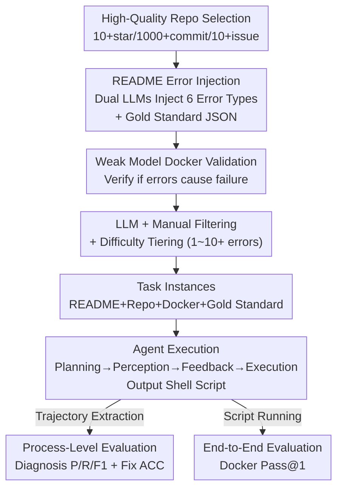

# Process-Level Trajectory Evaluation for Environment Configuration in Software Engineering Agents

**Conference**: ICLR 2026  
**OpenReview**: [https://openreview.net/forum?id=Q8qgloDKUO](https://openreview.net/forum?id=Q8qgloDKUO)  
**Code**: https://github.com/TencentYoutuResearch/EnConda-Bench  
**Area**: Code Intelligence / SWE Agent / Evaluation Benchmark  
**Keywords**: Environment Configuration, Process-level Evaluation, Software Engineering Agents, README Error Injection, Automated Data Construction

## TL;DR
Addressing the most fundamental yet failure-prone stage of "environment setup" for SWE agents, this paper proposes EnConda-Bench. By injecting six types of real-world errors into originally correct README files to automatically generate tasks, it decomposes the traditional black-box evaluation—which only checks "final build/test success"—into a process-level diagnosis of **Planning, Perception, Feedback, and Execution**. The study reveals that the inability to translate correct error detection into valid fixes is the current performance bottleneck.

## Background & Motivation
**Background**: Software engineering agents, such as OpenHands and SWE-Agent, have demonstrated proficiency in fixing bugs and submitting PRs on benchmarks like SWE-bench. However, before modifying code, the repository's operating environment must be properly configured—installing dependencies, matching versions, and running tests. This remains the most basic yet error-prone first step, proving arduous for both human engineers and LLMs.

**Limitations of Prior Work**: Existing environment configuration benchmarks (such as INSTALLAMATIC, ExecutionAgent, EnvBench, and SetupBench) primarily focus on an **end-to-end binary result**: whether the build and test ultimately passed. This coarse-grained evaluation has two major flaws. First, it cannot pinpoint **where the agent fails or which specific capability it lacks**—be it poor planning, failure to locate errors, or inability to fix identified errors. A "Pass/Fail" binary provides no such insight. Second, high-quality, reproducible repositories are scarce, and manual error annotation is expensive, resulting in small benchmark scales (dozens to hundreds of instances) that struggle to support large-scale training and evaluation.

**Key Challenge**: Environment configuration is a **multi-stage, long-trajectory** process, yet evaluation signals are often compressed into a single boolean value at the end of the trajectory, burying intermediate capability dimensions. Directly extracting "planning segments" or "feedback segments" from long trajectories for evaluation is highly model-dependent and difficult to partition stably.

**Goal**: (1) Decompose end-to-end evaluation into process-level evaluation along the configuration trajectory to examine planning, perception, feedback, and execution capabilities; (2) Design an automated task construction pipeline to produce high-quality task instances at scale with low cost.

**Key Insight**: The authors observe that human engineers configure environments by **following the README first and then locating/fixing errors as they occur**. Inspired by this, rather than partitioning hard-to-decompose trajectories, they **actively create controllable errors**. By taking a correct README and injecting erroneous commands or misleading steps, they force the agent to locate and fix them during execution. Since each error type, location, and correct fix is known as a gold standard, process-level evaluation naturally obtains clear anchors.

**Core Idea**: Replace "extracting capability segments from long trajectories" with "injecting known errors into correct READMEs," turning unobservable process capabilities into quantifiable, diagnostic tasks.

## Method

### Overall Architecture
EnConda-Bench consists of two primary components: an **automated data construction pipeline** (task generation) and a **dual-track evaluation suite** (evaluation). For task generation, high-quality repositories are filtered from GitHub. Two strong LLMs rewrite READMEs to inject two errors and annotate gold-standard JSON metadata. A **weak model** validates these in Docker to ensure the errors truly cause configuration failure. After LLM and manual filtering, valid instances are layered into difficulty levels (1 to 10+ errors). For evaluation, agents are given a contaminated README, repository info, and a Docker base image. They produce a shell configuration script. The system then calculates two types of scores: **Process-level** (error diagnosis P/R/F1 + fix accuracy via LLM judge) and **End-to-End** (Pass@1 via Docker execution).

### Key Designs

**1. Process-Level Trajectory Evaluation: Decomposing Setup into Four Capability Diagnoses**

To address the lack of insight in end-to-end binary results, this work maps the agent's configuration trajectory to four capabilities: **Planning** (decomposing tasks into reasonable step sequences), **Perception** (accurately locating error causes like version mismatch or missing dependencies), **Feedback** (analyzing errors and forming fix strategies), and **Execution** (translating fixes into operational commands). Evaluation extracts error type classification, error description, and fix commands from the trajectory, alongside the final shell script. This allows the benchmark to identify which specific capability is weak and which error types are harder to detect, revealing a global bottleneck where agents "locate errors but cannot convert feedback into effective fixes."

**2. README Error Injection Paradigm: Reverse Task Generation using Correct READMEs as Ground Truth**

Instead of attempting to split trajectories, the authors treat every executable README as a ground truth and **inject errors** into it. They define six standardized error types: Dependency Installation (E1), Command Usage/Syntax (E2), Path or Missing File (E4), Logic Ordering (E6), Version Compatibility (E7), and Miscellaneous (E8). Injection follows a **minimal editing** constraint to maintain README integrity. Consequently, every sample naturally includes an "error label + description + correct fix" triplet, providing precise anchors for process-level evaluation. This approach enabled the scaling of the benchmark to 1,772 error-injected READMEs from 323 repositories.

**3. Automated Data Construction Pipeline: Strong Model Generation, Weak Model Guarding**

To ensure synthetic errors are realistic and impactful, a four-step pipeline was designed. Repositories were selected based on hard metrics (≥10 stars, >1000 commits, >10 closed issues). Errors were injected by Claude-4-Sonnet and Gemini-2.5-Pro. Crucially, **validation utilized a weak model (GPT-4.1-mini)** in Docker. An injection is considered "valid" only if the faulty README fails and the suggested fix resolves it. Weak models are used because stronger models tend to "covertly auto-fix" errors during script generation, failing to validate the actual faulty README. Finally, GPT-4.1-mini and manual review (achieving 98.5% consistency) filtered the set to 4,201 READMEs and 9,471 errors.

**4. Dual-Track Evaluation Suite: Process-Level Diagnosis + Docker End-to-End Executability**

The evaluation suite runs two parallel tracks. **Process-Level**: Since one README may contain multiple errors, predicted error types and descriptions are compared against the gold standard for Precision/Recall/F1. GPT-4.1-mini acts as a judge to evaluate the consistency and accuracy of descriptions and fixes (Description ACC, Fix ACC). **End-to-End**: Scripts are executed in Docker containers with pinned commits. Pass@1 is awarded only if the environment builds successfully, tests execute correctly, and the process exits normally.

### Example: Processing an Ajenti Instance
In an instance from the `ajenti` repository, a command usage error is injected: the README is changed to `pip install -r requirements.txt --update-all`, where `--update-all` is an invalid flag. The gold standard JSON labels this as "Command Usage or Syntax Error" and provides the correct fix. During execution, the agent must: (1) Perceive the syntax error and describe it; (2) Feedback a correct fix command; (3) Execute by producing a complete bash script. Evaluation measures diagnostic accuracy against the gold standard while simultaneously verifying the script's success in Docker.

## Key Experimental Results

### Main Results
Evaluation was conducted across four base LLMs (GPT-4.1, Claude-4-sonnet, Gemini2.5-Pro, DeepSeek-V3) and three framework types (Zero-Shot, General Agents like OpenHands/SWE-Agent, and specialized Configuration Agents like INSTALLAMATIC/Repo2Run).

| Framework | LLM | Type F1 | Desc ACC | Fix ACC | Pass@1 |
|-----------|-----|---------|----------|---------|--------|
| Zero-Shot | GPT-4.1 | 48.8 | 39.6 | 18.2 | 1.5 |
| Zero-Shot | Claude-4 | 50.8 | 45.1 | 28.5 | 3.1 |
| Code Agent (OpenHands) | DeepSeek-V3 | 58.7 | 51.9 | 33.8 | 9.1 |
| Code Agent (SWE-Agent) | GPT-5-Codex | 66.4 | 58.7 | 41.2 | 11.5 |
| Env Agent (Repo2Run) | Claude-4 | 60.6 | 52.2 | 47.3 | 22.9 |

Key Trends: Zero-Shot LLMs exhibit **high recall but low precision** (e.g., GPT-4.1 Rec. 90.6 vs Pre. 33.4), meaning they report errors indiscriminately. Code agents significantly improve perception and feedback, but their execution remains weak. Environment-specific agents yield the highest Pass@1 (22.9%). A consistent phenomenon is the degradation across the chain: **Description ACC > Fix ACC > Pass@1**, indicating that the jump from "correct feedback" to "robust execution" is the primary bottleneck.

### Ablation Study

| Metric | EnConda-Bench | Existing Benchmarks |
|--------|---------------|---------------------|
| Instance Count | 4,201 | 40~994 |
| Eval Granularity | Process + End-to-End | End-to-End only |
| Difficulty (1-5) | 3.95 | 3.78~4.08 |
| Realism (Blind Test) | 54.7% judged "Real" | 58.0% (Real errors) |

Results show that generated errors are statistically indistinguishable from real-world ones. Difficulty scores for the synthetic tasks (3.95) align closely with those of real repository benchmarks.

### Key Findings
- **"Find but not Fix"** is a global bottleneck: Accuracy drops sharply from description to fix and then to final execution.
- **Conservative Error Prediction**: Models tend to over-report errors or dump them into the "Miscellaneous (E8)" category, leading to low F1 in E8 and suppressed recall for specific types.
- **Systemic Difficulty Variance**: Syntax errors (E2) are easily detected, whereas path errors (E4) require system-level repository understanding and environment interaction, proving much harder.
- **Token Count vs. Performance**: Increasing output tokens generally improves description accuracy but does not translate linearly to Pass@1 success.

## Highlights & Insights
- **Ingenuity of Reverse Task Construction**: Treating the correct README as ground truth solves both the evaluation anchor problem and data scarcity simultaneously.
- **Weak Model as a Validator**: The counter-intuitive choice to use GPT-4.1-mini ensures that injected errors remain effective, as stronger models might fix them implicitly.
- **Explicit Capability Dimensions**: Decomposing performance into Planning/Perception/Feedback/Execution metrics provides quantifiable guidance for future agent training.

## Limitations & Future Work
- While synthetic errors passed blind tests, they may still deviate from long-tail real-world failures such as rare platform heterogeneity.
- The evaluation depends on GPT-4.1-mini as a judge, which introduces inherent LLM bias.
- Currently, this is a **benchmark**; the work lacks a closed-loop experiment demonstrating that training agents on these trajectories leads to improved execution.
- Difficulty is tiered by error count, which may not always correspond to true cognitive complexity.

## Related Work & Insights
- **Comparison to prior benchmarks (EnvBench, etc.)**: EnConda-Bench scales the number of instances significantly and introduces process-level granularity, identifying *where* agents fail.
- **Comparison to Repo2Run**: While Repo2Run focuses on the agentic architecture for configuration, EnConda-Bench provides the diagnostic framework to analyze such agents' internal weaknesses.
- **Inspiration**: The methodology of decomposing black-box metrics into trajectory-level capability dimensions can be extended to other long-process tasks like scientific research or GUI agents.

## Rating
- Novelty: ⭐⭐⭐⭐⭐ Reverse injection generation + process-level diagnostic metrics.
- Experimental Thoroughness: ⭐⭐⭐⭐ Broad coverage of models and frameworks; however, lacks a closed-loop training improvement result.
- Writing Quality: ⭐⭐⭐⭐ Clear motivation and well-defined pipeline.
- Value: ⭐⭐⭐⭐⭐ Provides a scalable and diagnostic benchmark for a critical bottleneck in SWE agents.

<!-- RELATED:START -->

## Related Papers

- [\[ICLR 2026\] SWE-RM: Execution-Free Feedback for Software Engineering Agents](swe-rm_execution-free_feedback_for_software_engineering_agents.md)
- [\[ICLR 2026\] Ambig-SWE: Interactive Agents to Overcome Underspecificity in Software Engineering](ambig-swe_interactive_agents_to_overcome_underspecificity_in_software_engineerin.md)
- [\[ICML 2026\] MEnvAgent: Scalable Polyglot Environment Construction for Verifiable Software Engineering](../../ICML2026/code_intelligence/menvagent_scalable_polyglot_environment_construction_for_verifiable_software_eng.md)
- [\[ICLR 2026\] BOAD: Discovering Hierarchical Software Engineering Agents via Bandit Optimization](boad_discovering_hierarchical_software_engineering_agents_via_bandit_optimizatio.md)
- [\[ACL 2026\] EET: Experience-Driven Early Termination for Cost-Efficient Software Engineering Agents](../../ACL2026/code_intelligence/eet_experience-driven_early_termination_for_cost-efficient_software_engineering_.md)

<!-- RELATED:END -->
