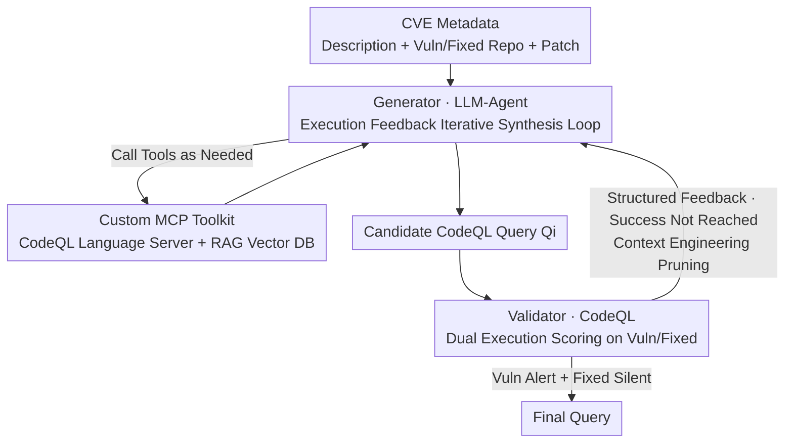

# QLCoder: A Query Synthesizer For Static Analysis of Security Vulnerabilities

**Conference**: ICLR 2026  
**OpenReview**: [https://openreview.net/forum?id=J91IKwJrqv](https://openreview.net/forum?id=J91IKwJrqv)  
**Code**: https://github.com/neuralprogram/qlcoder  
**Area**: Code Intelligence / Agent / Program Static Analysis  
**Keywords**: CodeQL, Vulnerability Detection, Query Synthesis, Agentic, MCP, Execution Feedback

## TL;DR
QLCoder embeds an LLM-Agent into an iterative loop of "candidate query generation $\to$ CodeQL execution scoring $\to$ feedback-based patching." It constrains reasoning using a custom MCP toolkit (CodeQL Language Server for syntax consistency + RAG vector database for semantic grounding) to automatically synthesize CodeQL queries from CVE metadata that "alert on vulnerable versions and stay silent on fixed versions." It achieved a 53.4% success rate and an F1 score of 0.70 across 176 real-world Java CVEs, significantly outperforming vanilla Claude Code (10%) and existing IRIS/CodeQL query suites (F1 0.048 / 0.073).

## Background & Motivation

**Background**: Static analysis (CodeQL, Semgrep, Infer) is a mainstream industrial method for detecting security vulnerabilities. These tools provide domain-specific query languages to describe "vulnerable code patterns" as queries, which are then executed on code structure representations such as Abstract Syntax Trees (AST) to identify potential vulnerabilities. CodeQL’s query language is particularly expressive, capable of characterizing complex inter-procedural vulnerability patterns.

**Limitations of Prior Work**: Existing off-the-shelf query suites suffer from poor coverage and precision. Extending them is difficult even for experts, as it requires simultaneous knowledge of a niche query language's syntax, program analysis concepts, and security expertise. Incorrect queries result in either high false positives or missed bugs. Meanwhile, CVE databases contain rich information—natural language descriptions, vulnerable/fixed repository snapshots, and patches—yet these resources remain largely underutilized for automatic static analysis query construction.

**Key Challenge**: Automatically synthesizing queries from CVEs involves several tightly coupled difficulties. First, CodeQL syntax is low-resource, powerful, and continuously evolving; minor errors in predicate names, qualifiers, or AST navigation produce queries that are "syntactically valid but semantically useless." Second, sources, sinks, and sanitizers are often scattered across different files and connected via non-trivial inter-procedural flows (e.g., lambdas, factory patterns), leaving gaps that CodeQL’s default data flow analysis cannot bridge without manual taint steps. Third, the success criteria are stringent: a query must not only compile but also find a data flow path through the patch region in the vulnerable version while remaining silent in the fixed version.

**Goal**: Given a vulnerable version $P_{vuln}$, a fixed version $P_{fixed}$, and a CVE text description, automatically synthesize a CodeQL query $Q$ that satisfies well-formedness, vulnerability detection, and patch discrimination requirements.

**Key Insight**: Naively asking an LLM to generate a query in one shot results in malformed syntax, hallucinations of deprecated constructs, or missed subtle patterns. The observation is that the "correctness" of a query has an executable objective oracle (running it on two versions). Therefore, the LLM should be placed in a synthesis loop with execution feedback, utilizing structured tools to constrain its syntactic and semantic reasoning rather than relying on a single lucky guess.

**Core Idea**: Use a three-component strategy—an "execution feedback iterative loop + custom MCP toolkit (LSP for syntax, RAG for semantics) + context engineering"—to transform a general-purpose coding Agent (Claude Code) into a specialized vulnerability query synthesizer.

## Method

### Overall Architecture
QLCoder operates in a "repository-aware" iterative refinement loop. The input is CVE metadata (description, vulnerable/fixed repositories, and the patch extracted from the commit); the output is a CodeQL path query. In each round: the **Generator** (LLM-Agent) proposes a candidate query, the **Validator** (based on CodeQL) executes it on both the vulnerable and fixed versions to score it, and the Generator then performs targeted repairs based on the feedback. The loop terminates when the Validator determines success (alert on $P_{vuln}$, silent on $P_{fixed}$); otherwise, it fails after reaching the iteration limit $N=10$. Internally, the Generator maintains a sub-dialogue loop of up to $M=50$ rounds, where each round involves either internal reasoning or a tool call via JSON—exposed through custom MCP servers (a RAG vector library for semantic retrieval and a CodeQL language server for syntactic guidance).

### Key Designs

**1. Execution Feedback-Driven Iterative Synthesis: Converging via Objective Oracles**

To address the issue where one-shot LLM generations are often malformed or semantically drifted, QLCoder formalizes synthesis as an iterative process with termination criteria. The problem is framed as taint analysis: evaluating query $Q$ on code graph $G$ yields a set of data flow paths $\Pi = [\![Q]\!](G)$, where each path $\pi=\langle v_1,\dots,v_k\rangle$ connects a source to a sink. Three success criteria are defined: well-formedness (syntactically valid and executable), vulnerability detection ($\exists \pi \in [\![Q]\!](G_{vuln})$ such that $\pi \cap \Delta V \neq \emptyset$, where $\Delta V$ is the node set modified by the patch), and patch discrimination ($\forall \pi \in [\![Q]\!](G_{fixed}),\ \pi \cap \Delta V = \emptyset$). The Validator automatically extracts versions from the patch commit, executes the candidate query, and returns a structured report: compilation results, match counts on both versions, recall/coverage statistics, specific counter-example traces with hit locations, and prioritized suggestions (e.g., "add qualifiers," "synthesize sanitizer," "extend taint step") generated via templates. This "execution $\to$ scoring $\to$ counter-example $\to$ suggestion" loop translates abstract correctness into concrete repair instructions, which is key to raising the success rate from the 10% of vanilla Claude Code to 53.4%.

**2. Custom MCP Toolkit: LSP for Syntax, RAG for Semantics**

To handle "fragile CodeQL syntax" and "scattered cross-file key nodes," QLCoder utilizes two MCP servers to provide information via "demand-driven retrieval" rather than bloating the prompt. For the **CodeQL Language Server**, the authors implemented a client and MCP wrapper that forwards calls like `complete(file, loc, char)`, `diagnostics(file)`, and `definition(file, loc, char)` to the underlying CodeQL process. Completions help the Agent fill templates and discover correct API/AST names, while diagnostics expose compilation or linter errors (like unknown predicates) to guide repairs, ensuring compatibility with the specific CodeQL version. For the **RAG Vector Database**, ChromaDB stores a large corpus: vulnerability notes, CWE definitions, API documentation, curated sample queries, and AST fragments extracted from the target repository's patch file (filtered to Java after removing irrelevant files). While the corpus contains tens of thousands of entries, the Agent only issues compact queries to retrieve a few ranked snippets. Sample queries inspire structure, AST fragments provide precise navigation, and vulnerability writeups help distinguish buggy from patched behavior.

**3. Context Engineering: Precision Feeding to Avoid Decay**

To avoid LLM confusion and ballooning costs from excessive information, the authors treated "what to show the Agent and when" as a design problem. Through ablation, they refined the information flow. The first round provides a query skeleton as reference; subsequent rounds only include a summary of the goal, the previous candidate $Q_{i-1}$, and validator feedback. Key pruning decisions based on "tried but failed" experiences include: preventing the Agent from using unconstrained "compile-and-run" (which is expensive) by only exposing lightweight diagnostics during dialogue and deferring full execution to the end of a round; removing web search to prevent context pollution; keeping the toolkit lean to avoid Agent indecision; and only retaining local dialogue history within a single round rather than carrying it across rounds to prevent context rot.

## Key Experimental Results

### Main Results
The evaluation used CWE-Bench-Java: 176 CVEs, 111 Java projects, 42 CWE categories, project sizes 0.01–1.5 MLOC, including 65 CVEs from 2025 (post-training cutoff). The base framework uses Claude Code with Claude 3.5 Sonnet.

| Method | Recall (%) | Avg Precision | Avg F1 |
|------|-----------|---------------|--------|
| CodeQL (Stock Suite) | 20.0 | 0.055 | 0.073 |
| IRIS (LLM-Aided) | 35.4 | 0.031 | 0.048 |
| **QLCoder** | **80.0** | **0.672** | **0.700** |

QLCoder achieved an overall success rate of 53.4% (compilation success 100%). Stock CodeQL queries are too broad, and IRIS only generates source/sink predicates without sanitizers or taint steps, leading to low precision. By CWE, Deserialization (CWE-502) performed best (66.7% success), while Path Traversal (CWE-022) reached 64.6%. The success rate remained high for post-2025 CVEs (46.2% vs 57.7% pre-2025), indicating performance is not due to data leakage.

### Ablation Study (20 CVEs)

| Variant | Success Rate | Recall | Avg Precision | Avg F1 |
|------|--------|--------|---------------|--------|
| QLCoder (Full) | 55% | 80% | 0.67 | 0.69 |
| w/o LSP | 25% (−30%) | 55% | 0.32 | 0.36 |
| w/o Doc/Ref (RAG) | 20% (−35%) | 55% | 0.32 | 0.36 |
| w/o AST Cache | 25% (−30%) | 80% (±0%) | 0.41 | 0.47 |
| Claude Code (Vanilla) | 10% (−45%) | 55% | 0.33 | 0.36 |

### Key Findings
- **LSP and RAG are critical**: Removing them causes success rates to drop naturally. Interestingly, removing the AST cache does not change recall (still 80%) but hurts success and precision, suggesting syntax guidance is more vital than local AST snippets.
- **Vanilla Agents struggle with discrimination**: Without tools, Claude Code maintains 55% recall but fails to synthesize queries that are silent on fixed versions (only 10% success).
- **Transferability**: The MCP configuration works with other Agents. On 2025 CVEs, Codex+GPT-4o (indicated as GPT-5 medium in source) improved compilation from 0% to 55% and success from 0% to 20% using QLCoder.
- **Cost and Early Stopping**: Average synthesis takes 3712 seconds and costs ~$2.90. Successful queries are typically synthesized within 3000 seconds.
- **Zero-day bug discovery**: Queries synthesized by QLCoder identified two previously unknown bugs in different repositories during variant analysis.

## Highlights & Insights
- **Verifiable Tasks through Execution Feedback**: Since vulnerability queries have objective criteria, using them as loop termination is more reliable than one-shot generation.
- **MCP as "Constraint Interface"**: LSP serves not only to empower the Agent but to confine its reasoning within a valid syntactic space. RAG ensures "demand-driven" reading rather than overwhelming the prompt.
- **Value in Negative Experiences**: The systematic documentation of failed attempts (web search, unconstrained compilation) provides a clear roadmap for Agent system design.
- **Portability**: Adapting to other CodeQL versions or languages involves swapping RAG documents and LSP wrappers, a strategy applicable to other engines like Semgrep.

## Limitations & Future Work
- **High Cost**: Average of ~$2.9 per query makes large-scale batch synthesis expensive.
- **Success Ceiling**: A 53.4% success rate means nearly half of the CVEs remain unsolved, particularly for infrequent CWE types (38.8%).
- **Metadata Dependency**: Requires clean patch commits and dual snapshots, making it inapplicable to vulnerabilities with only text descriptions.
- **False Positive Tolerance**: Criteria focus on $\Delta V$ penetration but may allow other false positive paths in both versions; precision is not explicitly part of the synthesis constraint.

## Related Work & Insights
- **vs. IRIS**: While both use LLMs for CodeQL, IRIS lacks sanitizer/taint-step synthesis and an execution feedback loop, resulting in significantly lower F1 (0.048 vs 0.70).
- **vs. Stock CodeQL**: Official queries target broad coverage but lack precision for specific CVEs. QLCoder creates "one query per CVE," sacrificing generality for high precision.
- **vs. Vanilla Agents**: Standard coding Agents fail primarily at patch discrimination; QLCoder proves that the framework and constraints are more important than the underlying model's base capabilities.

<!-- RELATED:START -->

## Related Papers

- [\[ACL 2026\] Static Program Slicing Using Language Models With Dataflow-Aware Pretraining and Constrained Decoding](../../ACL2026/code_intelligence/static_program_slicing_using_language_models_with_dataflow-aware_pretraining_and.md)
- [\[ACL 2026\] LogicEval: A Systematic Framework for Evaluating Automated Repair Techniques for Logical Vulnerabilities in Real-World Software](../../ACL2026/code_intelligence/logiceval_a_systematic_framework_for_evaluating_automated_repair_techniques_for_.md)
- [\[AAAI 2026\] Why Do Open-Source LLMs Struggle with Data Analysis? A Systematic Empirical Study](../../AAAI2026/code_intelligence/why_do_open-source_llms_struggle_with_data_analysis_a_systematic_empirical_study.md)
- [\[NeurIPS 2025\] Preserving LLM Capabilities through Calibration Data Curation: From Analysis to Optimization](../../NeurIPS2025/code_intelligence/preserving_llm_capabilities_through_calibration_data_curation_from_analysis_to_o.md)
- [\[ICLR 2026\] VisCoder2: Building Multi-Language Visualization Coding Agents](viscoder2_building_multi-language_visualization_coding_agents.md)

<!-- RELATED:END -->
