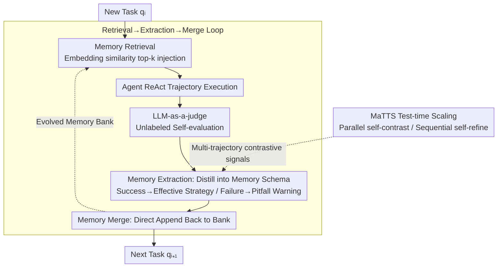

# ReasoningBank: Scaling Agent Self-Evolving with Reasoning Memory

**Conference**: ICLR 2026  
**arXiv**: [2509.25140](https://arxiv.org/abs/2509.25140)  
**Code**: [google-research/reasoning-bank](https://github.com/google-research/reasoning-bank)  
**Area**: Code Intelligence  
**Keywords**: Agent Memory, Reasoning Strategy, Test-time Scaling, Self-evolution, Experiential Learning

## TL;DR
The paper proposes ReasoningBank, a memory framework that distills generalizable reasoning strategies from success and failure experiences judged by the agent itself. It also introduces memory-aware test-time scaling (MaTTS) to establish a synergy between memory and test-time expansion, consistently outperforming baselines on WebArena, Mind2Web, and SWE-Bench (up to 34.2% relative gain) while reducing interaction steps by 16%.

## Background & Motivation
As LLM Agents increasingly occupy long-running real-world roles, they naturally encounter a continuous stream of tasks. However, a critical limitation is their inability to learn from accumulated interaction history—every time they face a new task, they start from zero, forced to discard valuable insights and repeat past mistakes.

Existing agent memory methods suffer from two major flaws:

**Storing only raw trajectories or successful routines**: Synapse stores raw trajectories as contextual memory, and AWM extracts workflows from trajectories, but both fail to distill higher-level, transferable reasoning patterns.

**Ignoring the value of failure**: Overemphasizing successful experiences prevents the agent from learning lessons from its own failures.

**Core Idea**: Distill both success and failure experiences into generalizable reasoning strategies (rather than specific operation steps) and store them in a structured memory bank; combine this with test-time scaling to generate rich contrastive signals that further improve memory quality.

## Method

### Overall Architecture
ReasoningBank addresses the problem of LLM Agents starting each new task from scratch and losing past experiences and lessons. It is a **training-free closed-loop memory system**: when an agent receives a new task, it first retrieves the most relevant experiences from the memory bank via embedding and injects them into the system prompt to guide decision-making. After running a trajectory in ReAct style, an LLM-as-a-judge evaluates whether the trajectory was a success or failure without ground-truth labels. The system then distills reusable reasoning patterns into structured memory and appends them back to the bank. This loop self-evolves as the task flow accumulates. On top of this loop, ReasoningBank adds memory-aware test-time scaling (MaTTS): utilizing contrastive signals from generating multiple trajectories for the same task to cultivate more reliable memory, turning memory quality itself into a new scaling dimension.

### Key Designs

**1. Memory Schema: Distilling trajectories into transferable reasoning strategies rather than raw operations**

The nature of the "memory" in the loop determines whether it can be reused across tasks. Previous methods either stored raw trajectories (Synapse) or specific workflows (AWM), which were too closely tied to a single execution and failed when the scenario changed. ReasoningBank designs each memory entry with a Title / Description / Content structure: the Title identifies the core strategy or reasoning pattern, the Description provides a summary, and the Content carries distilled reasoning steps, decision logic, and operational insights. This structure is intentionally positioned between two extremes—more abstract than raw trajectories (extracting common principles across tasks) but more specific than pure slogans (retaining reusable reasoning steps), making it both human-readable and directly injectable into prompts.

**2. Retrieval→Extraction→Merge: Turning both success and failure into usable experience**

This is the backbone of the system. In the **Retrieval** phase, an embedding-based similarity search retrieves the top-$k$ related memories (default $k=1$) to guide the current decision. In the **Extraction** phase, an LLM-as-a-judge determines success or failure without ground truth labels after the task concludes. Different strategies follow: successful trajectories settle as "verified effective strategies," while failed trajectories contribute "counterfactual signals and pitfall warnings." Multiple memory items are extracted from each trajectory. The **Merge** phase intentionally uses simple addition without deduplication or clustering to decouple "content gain" from "engineering tricks," proving that improvements stem from experience quality rather than fancy engineering. The "explicit use of failure" contributes an additional 3.2 percentage points in gain (46.5→49.7 SR).

**3. MaTTS: Creating positive feedback between test-time scaling and memory**

Common practices simply concatenate test-time scaling with memory—running multiple trajectories independently and extracting memory from each—wasting the correlation between trajectories. MaTTS actively utilizes the inherent contrastive signals from redundant explorations to curate better memory via two complementary modes: **parallel scaling** generates multiple trajectories for the same query to compare outcomes via self-contrast, identifying consistent reasoning patterns and filtering spurious solutions; **sequential scaling** performs iterative self-refinement within a single trajectory, capturing intermediate attempts, corrections, and epiphanies as memory signals. The shared logic is that good memory guides scaling toward promising paths, and the rich contrasts from scaling forge stronger memory, elevating "memory quality" to a new scaling dimension.

## Key Experimental Results

### Main Results — WebArena

| Method | Shopping SR | Admin SR | Gitlab SR | Reddit SR | Overall SR | Steps |
|------|-----------|---------|----------|----------|------------|-------|
| No Memory (Gemini-2.5-flash) | 39.0 | 44.5 | 33.9 | 55.7 | 40.5 | 9.7 |
| Synapse | 40.6 | 45.1 | 35.6 | 59.4 | 42.1 | 9.2 |
| AWM | 44.4 | 46.7 | 37.2 | 62.3 | 44.1 | 9.0 |
| **Ours** | **49.7** | **51.1** | **40.6** | **67.0** | **48.8** | **8.3** |
| No Memory (Gemini-2.5-pro) | 45.5 | 51.1 | 35.0 | 71.7 | 46.7 | 8.8 |
| **Ours** (pro) | **51.9** | **56.6** | **44.4** | **80.2** | **53.9** | **7.4** |

### SWE-Bench-Verified

| Method | Resolve Rate | Steps |
|------|-------------|-------|
| No Memory (Gemini-2.5-flash) | 34.2 | 30.3 |
| **Ours** | **38.8** | **27.5** |
| No Memory (Gemini-2.5-pro) | 54.0 | 21.1 |
| **Ours** (pro) | **57.4** | **19.8** |

### MaTTS Ablation Experiment (WebArena-Shopping, $k$=scaling factor)

| Configuration | $k=1$ | $k=3$ | $k=5$ |
|------|-----|-----|-----|
| MaTTS w/o memory (parallel) | 39.0 | 40.6 | 42.2 |
| MaTTS w/o aggregation (vanilla TTS) | 49.7 | 52.4 | 52.4 |
| **MaTTS (parallel)** | **49.7** | 53.5 | **55.1** |
| **MaTTS (sequential)** | 49.7 | **54.5** | 54.5 |

### Ablation Study

| Configuration | Metric | Description |
|------|---------|------|
| Success only | **Ours**: 46.5 SR | Success experience alone outperforms baselines |
| Success + Failure | **Ours**: 49.7 SR | Failure experience contributes additional 3.2% gain |
| Synapse + Failure | 41.7 SR | Synapse cannot effectively utilize failure signals |
| AWM + Failure | 42.2 SR (Decrease) | AWM performance drops when handling failure |
| Retrieval count $k=1/2/3/4$ | 49.7/46.0/45.5/44.4 | $k=1$ is optimal; excessive memory introduces noise |

### Key Findings
- ReasoningBank consistently outperforms baselines across **all datasets and all backbones**.
- Significant efficiency gain: successful cases reduce steps by 2.1 on average (26.9% relative reduction), indicating memory helps agents find correct paths faster.
- Superior cross-domain generalization (Multi subset, Mind2Web cross-domain).
- MaTTS synergy: only ReasoningBank benefits from scaling continuously (Pass@1 from 49.7 to 50.8), while weak memory tends to degrade under scaling.

## Highlights & Insights
- **First full exploitation of failure experience**: Unlike prior methods using only success trajectories, ReasoningBank proves that counterfactual signals in failure are a more powerful source of generalization.
- **Emergent Behaviors**: Memory entries evolve naturally from low-level execution strategies to adaptive checks and composite reasoning, resembling emergent learning dynamics in RL.
- **Memory-driven expansion as a new scaling dimension**: While traditional scaling only increases computation, MaTTS links memory quality and scaling, opening a new path for agent capability enhancement.
- **Design Simplicity**: The system requires no training, relying solely on in-context learning, embedding retrieval, and LLM judging, making it easy to deploy.

## Limitations & Future Work
- Dependency on LLM-as-a-judge for correctness signals; judge errors could lead to memory pollution.
- Simplistic memory merge strategy (direct append); the memory pool might swell and reduce retrieval efficiency in large-scale deployments.
- Retrieval relies only on embedding similarity, lacking a reasoning-aware retrieval mechanism.
- No exploration of memory forgetting or update strategies (outdated memory might interfere).
- Only verified in web browsing and SWE; other agent scenarios (e.g., embodied environments) remain to be explored.

## Related Work & Insights
- **vs Synapse**: Stores raw trajectories as exemplars; memory granularity is too coarse and lacks transferability.
- **vs AWM (Agent Workflow Memory)**: Extracts workflows from success trajectories, but (1) only uses success and (2) shows poor cross-domain transfer (degrading to 3.4 SR on Multi subset).
- **vs ExpeL**: Also uses success/failure, but memory is stored as tips, which is less effective than the structured reasoning strategies in ReasoningBank.
- **Insight**: An agent's memory system should be like a human's—not just remembering "how I succeeded," but "why I failed" and the "abstract decision principles."

## Rating
- Novelty: ⭐⭐⭐⭐
- Experimental Thoroughness: ⭐⭐⭐⭐⭐
- Writing Quality: ⭐⭐⭐⭐⭐
- Value: ⭐⭐⭐⭐⭐

<!-- RELATED:START -->

## Related Papers

- [\[ICLR 2026\] Improving Code Localization with Repository Memory](improving_code_localization_with_repository_memory.md)
- [\[NeurIPS 2025\] A Self-Improving Coding Agent](../../NeurIPS2025/code_intelligence/a_selfimproving_coding_agent.md)
- [\[ACL 2026\] MARS2: Scaling Multi-Agent Tree Search via Reinforcement Learning for Code Generation](../../ACL2026/code_intelligence/mars2_scaling_multi-agent_tree_search_via_reinforcement_learning_for_code_genera.md)
- [\[ICLR 2026\] Evolving Graph Structured Programs for Circuit Generation with Large Language Models](evolving_graph_structured_programs_for_circuit_generation_with_large_language_mo.md)
- [\[ICLR 2026\] Code2Bench: Scaling Source and Rigor for Dynamic Benchmark Construction](code2bench_scaling_source_and_rigor_for_dynamic_benchmark_construction.md)

<!-- RELATED:END -->
