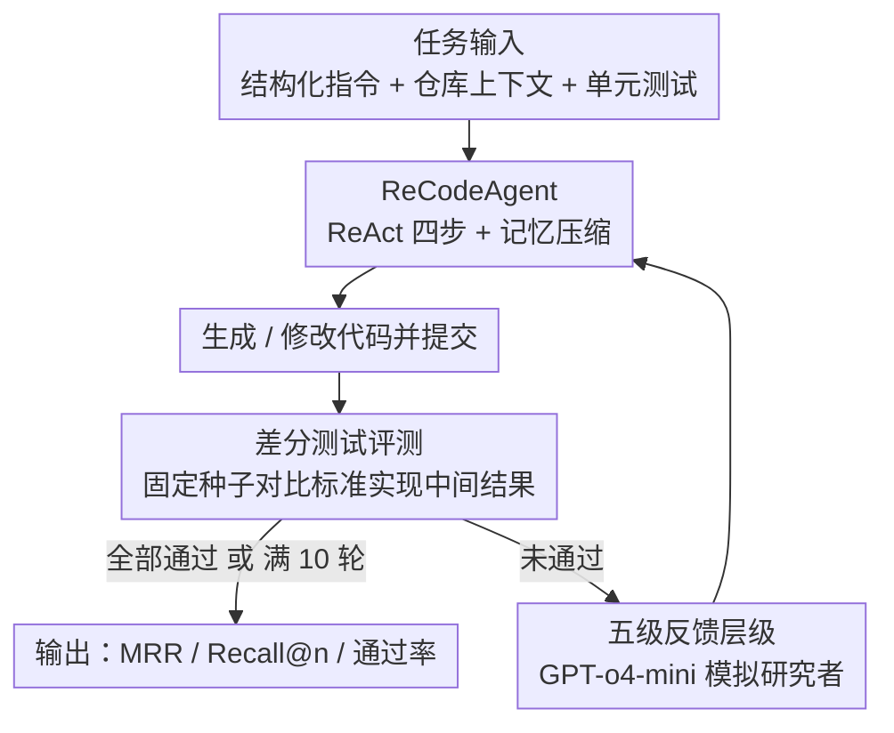

# RECODE-H: A Benchmark for Research Code Development with Interactive Human Feedback

**Conference**: ICLR 2026  
**OpenReview**: [https://openreview.net/forum?id=IKnuyyPHCV](https://openreview.net/forum?id=IKnuyyPHCV)  
**Code**: The paper promises open-sourcing (the benchmark and code are noted to be publicized, though no fixed address is provided yet)  
**Area**: Code Intelligence / Benchmark  
**Keywords**: Research code generation, interactive human feedback, multi-turn code refinement, differential testing, LLM Agent  

## TL;DR
RECODE-H transforms "research code generation" from a one-shot task into multi-turn human-computer collaboration: it features 102 repository-level tasks from real top-tier conference papers and official repositories, equipped with unit tests and a five-level feedback hierarchy. Using ReCodeAgent (multi-turn ReAct + memory compression) as a strong baseline, the study systematically quantifies how "finer feedback leads to more accurate LLM corrections"—the Recall of GPT-5 increases from 29.4% without feedback to 71.6% with the strongest feedback.

## Background & Motivation
**Background**: While utilizing LLMs to support the implementation of scientific research (from idea to execution) is becoming popular, "translating paper methods into executable code" remains the most difficult stage. Existing research code benchmarks (MLE-bench, PaperBench, SciReplicate-Bench, ResearchCodeBench, etc.) are almost exclusively **one-shot evaluations**, where the model is given a description and expected to produce the correct code in a single attempt.

**Limitations of Prior Work**: This setting is disconnected from real-world scientific research. On one hand, it is difficult for researchers to specify all requirements at once; papers often use high-level narratives, formulas, and domain conventions to describe methods, leaving many implementation details implicit. On the other hand, LLMs rarely get it right on the first try. Real research implementation is an **iterative process**: running tests → seeing errors → human providing feedback → modifying → re-running. Existing benchmarks only assess "end-to-end correctness" and completely fail to evaluate the model's ability to "iteratively refine code through multi-turn feedback."

**Key Challenge**: The difficulty of research code generation lies not in syntax, but in **aligning fragmented and under-specified paper descriptions with specific implementations**. This process requires human feedback for gradual disambiguation—yet current evaluations remove this most critical loop.

**Goal**: To build a benchmark capable of evaluating research code generation under **feedback-driven multi-turn interaction**, ensuring tasks are authentic (from real papers and repositories), difficulty is controllable, and evaluation is reproducible and extensible.

**Key Insight**: The authors observe that the "information gain" of feedback is primarily determined by the expertise and depth of analysis provided by the source. Consequently, they **structure feedback itself into controllable hierarchies**. This can simulate different collaboration intensities—ranging from simply stating a failure to providing standard answer code—and serve as a clean difficulty toggle for fine-grained evaluation.

**Core Idea**: By using a five-level feedback hierarchy + repository-level real tasks + differential unit testing, research code generation is reshaped into "quantifiable multi-turn human-computer collaboration," with ReCodeAgent designed to incorporate feedback into iterative generation.

## Method

### Overall Architecture
RECODE-H consists of two parts: a **benchmark** (102 repository-level tasks + five-level feedback hierarchy + differential test evaluation) and a **strong baseline agent** (ReCodeAgent). During runtime, it operates as a closed loop: an agent is given a task (structured instructions + repository context + unit tests), the agent uses a ReAct cycle to generate or modify code and submits it, and the system runs differential unit tests to obtain execution logs. If not all tests pass, a simulated researcher produces feedback according to the specified hierarchy. The agent then proceeds to the next turn until all tests pass or a 10-turn limit is reached. The task set was constructed by 26 PhD-level annotators through a four-step human-AI collaborative pipeline: "paper/code selection → adding explanatory comments → writing generation instructions → developing unit tests."

### Key Designs

**1. Benchmark Construction Pipeline: Expert Annotation + Differential Testing to Ensure "Reproducible Correctness"**

The most difficult part of research code tasks is that the mapping between "paper description ↔ code implementation" is often scattered across multiple functions/classes and is not explicit. The authors address this via a four-step human-AI pipeline: (1) Strictly screening papers published after 2023 in CVPR/ICML/NeurIPS/ICLR with official executable repositories where papers and code structures correspond clearly; annotators verify that target components can be executed within <24GB VRAM. (2) Using Gemini-2.5-Pro to generate explanatory comments (clarifying paper-code correspondence, differences between paper and implementation, and details in code not in the paper) followed by manual verification. (3) Writing generation instructions specifically defining target function names, functionalities, and descriptions of input/output names/types/semantics. (4) Developing unit tests. These tasks are not isolated function completions but involve implementing several functions or even entire classes corresponding to the paper methods, constituting **repository-level generation**.

The core mechanism for assessing correctness is **differential testing**: many research codes involve dynamic/stateful processes such as training updates, optimization routines, and data preprocessing, making it difficult to rely on end-to-end outputs alone. Therefore, each unit test runs both the standard implementation and the model implementation under a **fixed random seed**, comparing middle or final outputs within numerical tolerances to verify algorithmic correctness step-by-step. Annotators also enforced a unit test coverage of ≥80% for the standard implementation to ensure logical branches, rather than just surface syntax, are tested.

**2. Five-Level Feedback Hierarchy: Turning "Information Volume of Human Feedback" into a Controllable Difficulty Toggle**

This is the core design differentiating RECODE-H from all one-shot benchmarks. The feedback given to the agent after code execution is divided into five levels according to increasing guidance intensity: Level 0 only informs that "execution failed, logs are available"; Level 1 adds a high-level error description; Level 2 adds a diagnostic explanation of "why it failed"; Level 3 provides further natural language correction guidance (specifying which algorithmic modifications/design choices are needed to align with the standard implementation, but without offering executable code); Level 4 is the most detailed, directly providing standard answer code snippets, effectively reducing the task to "whether the correct solution can be correctly integrated into the existing repository," representing an upper bound for instruction following and repository integration. The feedback is generated online by GPT-o4-mini simulating an expert—it bases this on execution results, error logs, and references standard code and annotations to verify functional alignment with the paper, thereby standardizing feedback and ensuring it is reproducible and extensible across runs while maintaining iterative realism. Metrics utilized include MRR ($\frac{1}{k}$ based on the first correct turn $k$), Recall@n (proportion of tasks solved within $n$ turns), average test pass rate, and CodeBLEU / CodeBERTScore to measure similarity to the reference implementation.

**3. ReCodeAgent: Incorporating Feedback into ReAct Iteration with Memory Compression Controls**

A benchmark is insufficient without proving that "feedback is exploitable," so the authors provide ReCodeAgent as a strong baseline. It follows the ReAct framework, with each turn divided into four steps: Observation (collecting current repository state, execution logs of the previous submission, researcher feedback) → Reflection (analyzing failures and gaps against task specifications, converting feedback into actionable insights, and checking repository constraints) → Planning (providing concise structured plans: objectives, target files/intervals, expected effects) → Action (executing an operation from a predefined action space: READ_FILE / WRITE_FILE / SEARCH / SUBMIT). To clarify: "multi-turn" here refers to **human-computer interaction** turns. Existing benchmarks only allow one human prompt followed by fully autonomous agent behavior, whereas RECODE-H allows the agent to collaborate over multiple turns with a (simulated) researcher, while the internal ReAct reasoning-action cycle remains constant. To manage context length over multiple turns, the agent maintains memory following the Reflexion style and sets a threshold: when historical memory exceeds the threshold (set to 5 in experiments), previous observations and actions are compressed into concise summaries that retain "unresolved failures, design decisions, and generation context," maintaining consistency while avoiding context explosion.

### A Complete Example
Consider a repository-level task requiring the implementation of a paper's `forward` process: in Turn 1, the agent only receives the task prompt (no feedback, equivalent to a one-shot baseline). The generated code has tensor shape mismatches, differential testing fails, and the execution log reports a shape mismatch. At Level 1, the researcher feedback only says "forward output dimensions do not match," and the agent's reflection likely leads to surface-level patching. At Level 3, the feedback points out that "one should first perform a certain normalization step according to the paper formula before projection." The probability of the agent incorporating this algorithmic guidance into its plan and correcting it increases significantly. At Level 4, standard code snippets are provided directly, and the task reduces to "correct integration." Experiments show this progression allows strong models like GPT-5 to reach high pass rates within 3–4 turns, whereas they plateau slowly under Level 0.

## Key Experimental Results

Seven mainstream LLMs (GPT-5 / GPT-5-mini / GPT-5-nano, Gemini-2.5-pro / flash, Claude-Sonnet-4, DeepSeek-V3.1) were evaluated with temperature 0, top-p 1, a maximum of 10 turns of feedback interaction per task, a maximum of 3 actions per turn before auto-submission, and a memory threshold of 5.

### Main Results
Recall@n (10 turns, %) under different feedback levels shows that finer feedback leads to higher accuracy, with strong models benefiting the most:

| Model | Level 0 | Level 2 | Level 4 | L0→L4 Gain |
|------|---------|---------|---------|-----------|
| GPT-5 | 29.4 | 55.9 | 71.6 | +42.2 |
| DeepSeek-V3.1 | 10.8 | 43.1 | 70.6 | +59.8 |
| GPT-5-mini | 19.6 | 47.1 | 66.7 | +47.1 |
| Gemini-2.5-pro | 12.7 | 37.3 | 58.8 | +46.1 |
| Claude-Sonnet-4 | 14.7 | 33.3 | 48.0 | +33.3 |

Note: The gain is **non-linear**, with the largest jumps often occurring between Level 0→1 (where Recall and pass rates nearly double for most models), while Level 2→3→4 shows diminishing marginal returns, although providing explicit code at the highest level still yields considerable improvements for strong models.

### Error Analysis (Table 3, Error Type Percentage %)
GPT-5 was used to classify error causes, with manual verification of 100 cases showing 98% consistency. Four error categories: Type 1 Syntax/Runtime, Type 2 Paper and Instruction Misunderstanding, Type 3 Missing Knowledge and Context, Type 4 Repository Integration Error.

| Model | Type 1 | Type 2 | Type 3 | Type 4 |
|------|-------|-------|-------|-------|
| GPT-5 | 11.4 | 34.0 | 50.3 | 4.4 |
| Claude-Sonnet-4 | 26.5 | 32.3 | 33.8 | 7.5 |
| DeepSeek-chat | 20.6 | 31.6 | 40.3 | 7.5 |

Failures are primarily **dominated by high-level semantic issues (Type 2 + Type 3)**; syntax/runtime errors are fewer, and repository integration errors are the rarest. This indicates that modern LLMs have largely mastered basic coding, but the bottleneck lies in "faithfully aligning with paper descriptions" and "filling in implicit domain knowledge."

### Key Findings
- **Feedback adoption rate is decisive**: Almost every successfully fixed error resulted from the model explicitly adopting the feedback; cases where a fix was made without adoption were extremely rare. GPT-5's adoption rate rose from 80.2% at Level 1 to 90.1% at Level 4, with DeepSeek-V3.1 and GPT-5-mini showing similar trends. Conversely, Claude-Sonnet-4's **adoption rate decreased** as feedback became finer, and Gemini-2.5-pro fluctuated around 70%, explaining their limited benefits.
- **Simpler and more specific feedback is easier to adopt**: Feedback adoption rates for syntax/repository integration were highest (DeepSeek-chat adopted nearly 80% for syntax feedback), whereas adoption for implementation alignment (Type 2) was generally lower (GPT-5-nano was only 56.1%), confirming that models struggle most with logical errors requiring deep understanding of methodological intent.
- **Feedback accelerates convergence**: Rich feedback not only raises the final performance but also allows GPT-5 and DeepSeek-V3.1 to climb rapidly within the first 3–4 turns. Weaker models (Claude, Gemini-flash) plateaued earlier and were less sensitive to feedback richness.
- **Model family differences outweigh parameter scale alone**: The GPT family improved steadily as feedback became finer. DeepSeek-V3.1 showed the largest relative gain from L0→L4, demonstrating exceptional multi-turn adaptability. Even large Claude models only showed moderate gains, suggesting that architecture and training methods determine the ability to "ingest iterative feedback" more than size does.

## Highlights & Insights
- **Structuring "feedback information gain" into five discrete controllable levels** is the most ingenious design of this work: it closely approximates the varying intensities of real collaboration while turning "difficulty" into a reproducible experimental variable, allowing for clear "feedback-accuracy" curves that are impossible to measure in one-shot benchmarks.
- **Differential testing + fixed seeds** elegantly solves the evaluation challenge of dynamic/stateful research code, where end-to-end outputs are insufficient. Step-by-step comparison of intermediate results is both rigorous and scalable, a method worth migrating to any code benchmark where algorithmic correctness is difficult to judge.
- **Error distribution yields a counter-intuitive conclusion**: The bottleneck for contemporary LLMs in writing research code is no longer syntax, but "understanding paper intent" and "supplementing domain common sense." This shifts the research focus from "coding ability" to "paper reading ability," providing a strong signal for future agent design.
- **Adoption rate analysis** anchors "why models benefit differently" to a quantifiable mechanism: the gap lies not in the ability to modify, but in the willingness or ability to adopt feedback, particularly for alignment-type feedback requiring deep comprehension.

## Limitations & Future Work
- Feedback is simulated by GPT-o4-mini as an "expert researcher." While reproducible and scalable, there may be systematic differences in style and diagnostic depth compared to real human researchers, potentially overestimating or underestimating the effects of certain feedback levels.
- Tasks are limited to papers published after 2023 at four top conferences with repositories executable within <24GB VRAM, resulting in insufficient coverage of research code with high hardware requirements or greater engineering complexity. The scale of 102 tasks also limits the statistical strength of conclusions in sub-domains.
- Error classification and adoption rate judgments both utilize GPT-5 as a judge. Despite 98% manual consistency, it remains an LLM-as-a-judge approach, which might introduce bias in boundary cases.
- Correctness is standardized against "alignment with the reference implementation" (differential comparison). Solutions that are "alternative but equally correct" might be misjudged as incorrect—an inherent trade-off in repository-level scenarios with a single ground truth.
- Future work: Simulated researchers could be replaced with real humans for small-scale calibration, task domains and scales could be expanded, and agents could be explored to proactively request the most useful levels of feedback rather than passively receiving fixed levels.

## Related Work & Insights
- **vs SciReplicate-Bench / ResearchCodeBench / PaperBench**: These also target research code but are non-interactive one-shot evaluations (end-to-end replication or single-response generation). The qualitative shift in RECODE-H lies in introducing the **multi-turn, feedback-driven** evaluation paradigm, being the first to systematically test the ability to "iteratively refine code using structured feedback hierarchies."
- **vs InterCode / MINT / ConvCodeWorld (interactive code generation)**: While these feature multi-turn feedback (execution feedback/lazy user feedback/verbal feedback), they are limited to function-level generation in the software engineering domain. RECODE-H moves interaction to **repository-level** research code tasks, where the nature and complexity of feedback (aligning with paper methods) are significantly different.
- **vs SWE-bench and other repository-level benchmarks**: These are repository-level but target bug fixing/issue implementation and are mostly one-shot. This work focuses on "faithfully implementing paper methods" and explicitly models multi-turn human-computer collaboration.
- **Key Insight**: ReCodeAgent reuses the ReAct + Reflexion-style memory compression, proving that existing agent frameworks can achieve substantial gains simply by incorporating feedback into the reflection-planning loop. This serves as a direct starting point for "adaptive feedback-driven research agents."

## Rating
- Novelty: ⭐⭐⭐⭐⭐ First to turn research code generation into a multi-turn feedback-driven evaluation and structure feedback information into five controllable levels.
- Experimental Thoroughness: ⭐⭐⭐⭐ 7 mainstream LLMs × 5 feedback levels × multiple metrics, plus error and adoption analysis, is quite solid; task scale of 102 is slightly small.
- Writing Quality: ⭐⭐⭐⭐ Clear motivation, well-explained levels and differential testing, high information density in tables.
- Value: ⭐⭐⭐⭐⭐ Shifts research focus from "writing code" to "reading papers + using feedback," establishing a reproducible baseline and evaluation foundation for feedback-driven research agents.

<!-- RELATED:START -->

## Related Papers

- [\[ICLR 2026\] WebGen-Agent: Enhancing Interactive Website Generation with Multi-Level Feedback and Step-Level Reinforcement Learning](webgen-agent_enhancing_interactive_website_generation_with_multi-level_feedback_.md)
- [\[ICLR 2026\] Code Aesthetics with Agentic Reward Feedback](code_aesthetics_with_agentic_reward_feedback.md)
- [\[ICLR 2026\] Ambig-SWE: Interactive Agents to Overcome Underspecificity in Software Engineering](ambig-swe_interactive_agents_to_overcome_underspecificity_in_software_engineerin.md)
- [\[ICLR 2026\] From Assistant to Independent Developer — Are GPTs Ready for Software Development?](from_assistant_to_independent_developer_are_gpts_ready_for_software_development.md)
- [\[ICLR 2026\] SWE-RM: Execution-Free Feedback for Software Engineering Agents](swe-rm_execution-free_feedback_for_software_engineering_agents.md)

<!-- RELATED:END -->
