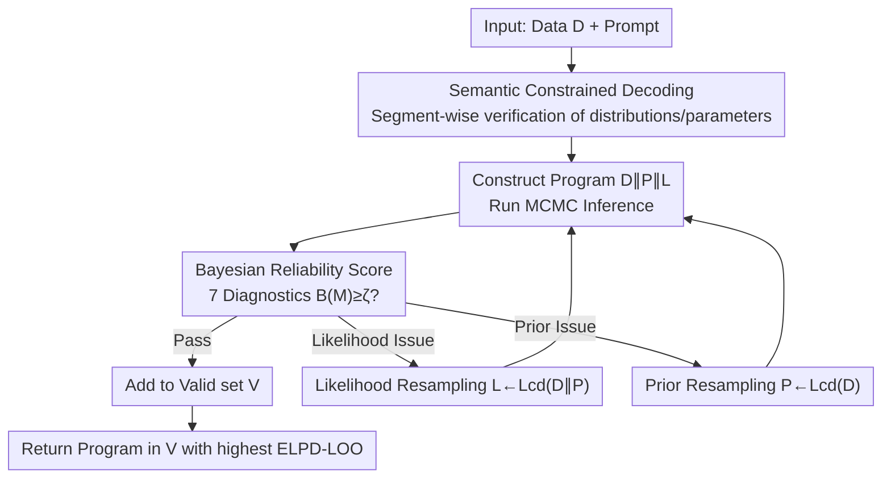

# RefineStat: Efficient Exploration for Probabilistic Program Synthesis

**Conference**: ICLR 2026  
**OpenReview**: [https://openreview.net/forum?id=SAl337ZX5d](https://openreview.net/forum?id=SAl337ZX5d)  
**Code**: https://github.com/structuredllm/RefineStat  
**Area**: Code Intelligence / Program Synthesis  
**Keywords**: Probabilistic Program Synthesis, Constrained Decoding, Bayesian Workflow, Small Language Models, Diagnostic-Driven Refinement

## TL;DR
RefineStat enables Small Language Models (SLMs) of 7~8B to reliably synthesize probabilistic programs (PyMC/NumPyro). During the generation phase, it utilizes semantic constrained decoding to prune illegal distributions/parameters segment-by-segment. In the refinement phase, it backtracks and resamples priors or likelihoods based on Bayesian diagnostic metrics. This allows a single open-source SLM to produce programs whose statistical reliability matches or even exceeds that of closed-source Large Language Models (LLMs) such as GPT-4 or OpenAI o3.

## Background & Motivation
**Background**: Scientific modeling often requires representing systems as statistical models. Probabilistic Programming Languages (PPLs, e.g., PyMC, NumPyro) are tools for describing such joint distributions $p(x,z\mid\eta)$ and performing automated posterior inference. Previous "automated model discovery" either relied on expert-written DSLs with custom search algorithms or used LLMs to "write out" modeling knowledge, the latter being expected to save significant manual effort.

**Limitations of Prior Work**: Directly generating probabilistic programs using LLMs produces many semantic errors—the programs might execute but violate the underlying statistical logic. A typical example provided in the paper is placing variance where the standard deviation should be in PyMC: `pm.Normal(..., sigma=sigma**2)` instead of `pm.Normal(..., sigma=sigma)`. This encodes an incorrect model, inflates uncertainty, or even triggers a `SamplingError`. Alternatively, using a non-existent parameter name like `sd` instead of `sigma` throws a `TypeError` during graph construction. While larger models perform better, their APIs are expensive; SLMs are cheaper but are precisely the most prone to these semantic bugs.

**Key Challenge**: The search space for probabilistic programs is vast and governed by strict domain constraints. SLMs can neither consistently satisfy grammatical/semantic constraints nor judge whether "the statistical model is actually credible." Syntactic correctness does not imply statistical correctness, and a runnable model does not imply credible convergence—pure generative sampling has a negligible hit rate in this space.

**Goal**: To enable non-fine-tuned open-source SLMs to produce **reliable** probabilistic programs according to standard Bayesian workflows. This means satisfying a set of diagnostic checks, including sufficient effective sample size, low MCMC divergence counts, and good out-of-sample fit.

**Key Insight**: The authors draw inspiration from the domain expertise and debugging strategies of probabilistic programmers. Human experts rarely get it right on the first try; instead, they "ensure syntax and semantics are valid first, then check diagnostic metrics, and go back to rewrite priors or likelihoods where things are wrong." Automating this human workflow constrains the search to the "legal and credible" subspace.

**Core Idea**: A two-stage process of "semantic constrained decoding + diagnostic-aware refinement" transforms the model's blind sampling into a guided search involving "segment-wise pruning for validation + backtracking resampling based on Bayesian diagnostics."

## Method

### Overall Architecture
RefineStat receives data $D$ and a text prompt as input. The goal is to synthesize a probabilistic program $M=D\Vert P\Vert L$ (sequential concatenation of data, prior, and likelihood blocks) that is both semantically correct and high-performing under a Bayesian workflow. The pipeline consists of two main components: **The first** uses semantic constrained decoding during generation to enforce syntactic and semantic validity (mapping validation rules to nodes of partial parse trees and backtracking to resample problematic segments). **The second** uses a suite of Bayesian diagnostic metrics to score the program after execution. If it fails to meet standards, the likelihood or prior is selectively resampled until $\beta$ valid programs are obtained or the budget $R_{max}$ is exhausted. Finally, the program with the highest ELPD-LOO is returned.

The overall approach can be viewed as a closed loop of "Generation $\rightarrow$ Check $\rightarrow$ (If unqualified) Backtrack/Rewrite $\rightarrow$ Re-check." Validity constraints ensure candidates are not "garbage" initially, while diagnostic scores provide selection pressure to push the search toward statistically credible models.

### Key Designs

**1. Semantic Constrained Decoding: Embedding "Legal Probabilistic Program" Rules into Sampling**

The immediate pain point is that SLMs frequently generate semantic bugs such as "non-existent distribution names / misspelled parameter names / parameter values out of bounds / usage of undefined variables." Based on Context-Free Grammar (CFG) $G=(N,T,P,S_0)$, RefineStat applies a conjunction of validation predicates $\Phi(n,\pi)=\phi_1\wedge\phi_2\wedge\cdots\wedge\phi_m$ to each program segment $n\in F(\kappa)$ (corresponding to a syntax statement) of a partial parse tree $\kappa$. Six predicates are specifically defined: $\phi_1$ parsability (grammar compliance), $\phi_2$ distribution validity (the distribution $f$ exists in the PPL library $M$), $\phi_3$ parameter validity ($P(f)\subseteq P_{acc}(f)$, e.g., correcting `sd` to `sigma`), $\phi_4$ dependency validity (stochastic variables must be declared before reference), $\phi_5$ support validity (parameter values must stay within distribution support, e.g., variance $>0$, probability $\in[0,1]$), and $\phi_6$ type validity (scale parameters are numerical, counts are integers).

Generation utilizes local rejection sampling for each statement $s\sim S_N$: segments are sampled repeatedly until $\Phi(s^*,\Pi)=1$ is met. It maintains a global symbol table $\Pi:A\to M$ to map aliases to modules. Crucially, it **only backtracks and resamples the specific tokens violating constraints** rather than regenerating the entire block, minimizing token overhead. This is especially effective for languages like PyMC that are sensitive to variable scope and dependencies. This step combines syntactic constraints (inspired by Syncode) with semantic validation to prune massive illegal branches from the search space at the source.

**2. Bayesian Workflow Reliability Scoring: A Computable Metric for "Statistical Credibility"**

Semantic validity alone is insufficient—a runnable program might fail to reach posterior convergence. The challenge is the lack of an automated benchmark to compare the "statistical reliability" of candidate models. The authors package seven standard diagnostics from statistical literature into seven indicator functions $s_j(M)\in\{0,1\}$, which are summed to produce a reliability score $B(M)=\sum_{j=1}^{7}s_j(M)$. These include split-$\hat{R}\le\alpha_R$ (chain convergence), $\text{BFMI}>\gamma$, bulk/tail effective sample size $\text{ESS}\ge\beta$, zero divergent transitions, a high enough proportion of PSIS-LOO Pareto $\hat{k}_i\le L_{cd}$, and finite computability of $\widehat{elpd}$. A model is considered "reliable" if $B(M)\ge\zeta$ (with $\zeta=5$, allowing for minor marginal diagnostic failures) and enters the valid model space $M_{valid}=\{M:B(M)\ge\zeta\}$. The final objective is to select the model with the best out-of-sample prediction in the valid space: $M^*=\arg\max_{M\in M_{valid}}\widehat{elpd}(M)$.

Here, ELPD-LOO (Expected Log Pointwise Predictive Density under Leave-One-Out cross-validation) measures out-of-sample predictive accuracy. Since exact LOO is too expensive (requiring $n$ refits), the authors approximate it using PSIS-LOO (Pareto Smoothed Importance Sampling) with a single fit of the full data and use $\hat{k}_i$ to judge the credibility of the approximation (if ~20% of $\hat{k}_i>0.7$, it is unreliable). The brilliance of this scoring lies in encoding the discipline of "convergence before prediction" into the selection criteria—it only trusts $\widehat{elpd}$ for models passing convergence thresholds, avoiding "false winners" with high ELPD but non-converged $\hat{R}=4.13$.

**3. Diagnostic-aware Backtrack Resampling: Rewriting Blocks Based on Specific Failures**

When a program is semantically valid but fails reliability checks, blind regeneration of the whole sequence is wasteful and fails to isolate errors. RefineStat leverages the constrained decoding operator $L_{CD}:C\to B$ (which returns a new block $B$ satisfying $\Phi(C\Vert B)=1$ for any context $C$) to split refinement into two **targeted** resamplings: likelihood resampling $L\leftarrow L_{cd}(D\Vert P)$ (rewriting the likelihood given data and prior context, targeting convergence/sampler health) and prior resampling $P\leftarrow L_{cd}(D)$ (rewriting the prior given data context, targeting prior specification errors). Algorithm 1 details the full loop: check semantic correctness using $\Phi$, calculate diagnostics $d_1,\dots,d_L$, and add to valid set $V$ if at least $K$ thresholds are met. Otherwise, it prioritizes likelihood resampling within a budget $\alpha$, then switches to prior resampling until $|V|$ reaches $\beta$ or total retries exceed $R_{max}$. Finally, it returns the program in $V$ with the largest $\widehat{elpd}$.

The key is "prescribing the right medicine": prior issues and sampler issues require modifications to different blocks. Selecting whether to rewrite the prior or likelihood based on diagnostic signals saves more tokens and converges to a reliable model faster than global regeneration. New blocks produced via resampling are still guaranteed to be semantically valid by $L_{CD}$. This mechanism allows a single un-tuned SLM to approach the statistical reliability of much larger models through iterative refinement.

### Loss & Training
RefineStat **does not train or fine-tune any models**. It is an inference-time framework applied to fixed open-source SLMs. Key hyperparameters include: reliability threshold $\zeta=5$, minimum required successful diagnostics $K$, likelihood resampling budget $\alpha$, target number of valid programs $\beta$, total retry limit $R_{max}$, and specific diagnostic thresholds $\{\tau_j\}$. The inference backend uses PyMC (NUTS/HMC sampling).

## Key Experimental Results

### Main Results
Evaluation was conducted on five representative datasets from Stan's PosteriorDB (Eight Schools, Dugongs, Surgical, Peregrine, GP), using four open-source LLMs with sizes $\le 8B$: Llama3-8B, CodeGemma-7B, Qwen2.5-Coder-7B, and DeepSeek-R1-Distill-Qwen-7B (DQ-7B).

**Comparison of Run rate (proportion of programs successfully sampling post-posterior) vs Temperature**:

| Temperature | Standard (No constraint) | Syncode (Syntax only) | RefineStat |
|------|------|------|------|
| 0.2 | 0.10 | 0.21 | 0.45 |
| 0.3 | 0.11 | 0.21 | 0.50 |
| 0.4 | 0.11 | 0.21 | 0.50 |

RefineStat is approximately 40 percentage points higher than the unconstrained baseline and 30 percentage points higher than the syntax-only Syncode, indicating that semantic constraints + refinement simultaneously suppress both structural and statistical error sources.

**Comparison with closed-source LLMs / Expert programs (ELPD-LOO, higher is better)**:

| Dataset | Expert | RefineStat (DQ-7B, mean±std) | BoxLM (w/ GPT-4) | OpenAI-o3 |
|--------|--------|------------------------------|------------------|-----------|
| Eight schools | -30.70 | -30.68 ± 0.11 | -30.42 | -30.74 ± 0.07 |
| Dugongs | 22.43 | 8.35 ± 0.06 | 23.40 | 22.83 ± 8.12 |
| Peregrine | -112.60 | -114.29 ± 2.76 | -173.11 | -133.29 ± 10.33 |
| Surgical | -39.73 | -46.51 ± 3.49 | -38.03 | -38.73 ± 0.51 |
| GP | -26.53 | -23.39 ± 1.14 | – | -34.95 ± 13.28 |

A single 7B SLM approaches expert-written programs and GPT-4 level methods on most datasets. While BoxLM requires two GPT-4 instances for iterative proposal and refinement, RefineStat achieves comparable results with just one SLM.

### Ablation Study
The paper performs a step-by-step comparison of constraints (Standard $\rightarrow$ Syncode $\rightarrow$ RefineStat), effectively ablating the two main components:

| Configuration | Run rate (T=0.3) | Description |
|------|------|------|
| Standard (No constraints) | 0.11 | No syntax or semantic constraints; lowest hit rate. |
| Syncode (Syntax constraints) | 0.21 | Hit rate doubles with syntax constraints but is still limited by semantic bugs. |
| RefineStat (Semantic + Diagnostic) | 0.50 | Adds semantic validation and backtracking resampling, more than doubling it again. |

### Key Findings
- The semantic constraint layer provides a massive contribution: Jumping from Syncode’s 0.21 to 0.50 demonstrates that syntax is not enough; semantic/statistical validity is the hit-rate bottleneck.
- Diagnostic scores detect "false winners": With Meta-Llama on the GP dataset, the Standard ELPD appeared higher, but split-$\hat{R}=4.13\gg1$ and the reliability score was only 3, indicating severe lack of convergence. RefineStat’s ELPD is slightly lower but maintains $\hat{R}\approx1$ with a higher reliability score, providing a trustworthy posterior.
- Gains are most significant for the weakest models: DQ-7B **failed all programs** under Standard conditions across five datasets but **succeeded on all** after applying RefineStat. On the Surgical dataset, the Meta-Llama baseline had >1000 divergences, which RefineStat reduced to 0.
- RefineStat's diagnostic indicators ($\hat{R}$ and divergence counts) show significantly smaller variance, indicating stronger stability and robustness.
- Cost: RefineStat consumes roughly 2x the tokens of the baseline (for a fair comparison, the baseline was allowed to run 5 times / 2.5x tokens to pick the best, yet still underperformed).

## Highlights & Insights
- **Turning human debugging workflows into search algorithms**: The experience of probabilistic programmers—"ensure legality, check diagnostics, fix what's broken"—is formalized into constraint predicates + reliability scores + targeted resampling. It is an excellent example of "Domain Expertise $\rightarrow$ Algorithm."
- **Token-level backtracking resampling**: Only resampling the tokens involved in the violation rather than regenerating entire blocks is a practical token-saving trick for constrained decoding that can be transferred to any code generation task with semantic constraints.
- **Diagnostic scores as selection pressure**: Quantifying "statistical credibility" into $B(M)$ with a threshold $\zeta$ helps the search naturally avoid the trap of "executable but non-convergent" models. This logic can be extended to other generation tasks where "execution $\neq$ correctness" (e.g., SQL, numerical simulation).
- **SLMs challenging LLMs**: The study proves that in structured, verifiable domains, meticulously designed constraints + feedback loops can compensate for model scale, which is significant for cost-sensitive scientific research applications.

## Limitations & Future Work
- **Additional token / compute overhead**: Constrained decoding + multi-round diagnostic resampling results in token consumption roughly twice that of the baseline, and each diagnostic requires an MCMC run, leading to non-trivial latency.
- **Dependency on PPL diagnostic computability**: Reliability scoring relies on $\hat{R}$, ESS, and PSIS-LOO. While these are readily available in PyMC/NumPyro, the framework's benefits may diminish in domains or languages lacking such comprehensive diagnostic tools.
- **Limited evaluation scale**: The study is restricted to five PosteriorDB datasets and four models $\le 8B$, mostly small-to-mid-sized classical statistical models. Reliability on more complex hierarchical models or high-dimensional latent variables remains unverified.
- **Manual threshold settings**: Hyperparameters like $\zeta=5$, $K$, $\alpha$, and $\beta$ are set empirically. Adaptive parameter tuning across different datasets is a potential area for improvement.

## Related Work & Insights
- **vs. Syncode (Syntax-only)**: Syncode uses grammar guidance to ensure syntactic validity but cannot handle semantic bugs like non-existent distributions. RefineStat adds 6 semantic validation predicates + diagnostic refinement, improving the Run rate from 0.21 to 0.50.
- **vs. BoxLM (Dual GPT-4 iteration)**: BoxLM uses two GPT-4 instances for proposal and refinement, depending on closed-source models and high costs. RefineStat achieves comparable ELPD using a single un-tuned open-source SLM through constrained decoding and a Bayesian diagnostic closed-loop, offering better cost and reproducibility.
- **vs. Direct LLM Queries (Standard)**: Unconstrained generation has a hit rate of only ~0.10 and easily produces non-convergent posteriors. RefineStat replaces blind sampling with "legal pruning + diagnostic-driven backtracking," reversing total failure into complete success even for the weakest models.

## Rating
- Novelty: ⭐⭐⭐⭐ Demonstrates for the first time that open-source SLMs can synthesize reliable probabilistic programs in a Bayesian workflow context; the combination of semantic constraints and diagnostic refinement is highly original.
- Experimental Thoroughness: ⭐⭐⭐⭐ 5 datasets × 4 models, including temperature sweeps, comparisons with GPT-4/o3/Experts, and token overhead analysis; the scale is small-to-medium, but the argumentation chain is complete.
- Writing Quality: ⭐⭐⭐⭐ Formal definitions are clear (predicates, reliability scores, and Algorithm 1 flow well); the motivation using specific bugs is well-executed.
- Value: ⭐⭐⭐⭐ Enables low-cost SLMs to replace expensive LLMs for probabilistic program synthesis, bearing practical significance for automated statistical modeling and scientific research.

<!-- RELATED:START -->

## Related Papers

- [\[ICLR 2026\] Gradient-Based Program Synthesis with Neurally Interpreted Languages](gradient-based_program_synthesis_with_neurally_interpreted_languages.md)
- [\[ICLR 2026\] LLM-Guided Evolutionary Program Synthesis for Quasi-Monte Carlo Design](llm-guided_evolutionary_program_synthesis_for_quasi-monte_carlo_design.md)
- [\[NeurIPS 2025\] Program Synthesis via Test-Time Transduction](../../NeurIPS2025/code_intelligence/program_synthesis_via_test-time_transduction.md)
- [\[ACL 2025\] Program Synthesis Benchmark for Visual Programming in XLogoOnline Environment](../../ACL2025/code_intelligence/program_synthesis_benchmark_for_visual_programming_in_xlogoonline_environment.md)
- [\[NeurIPS 2025\] Once Upon an Input: Reasoning via Per-Instance Program Synthesis](../../NeurIPS2025/code_intelligence/once_upon_an_input_reasoning_via_per-instance_program_synthesis.md)

<!-- RELATED:END -->
