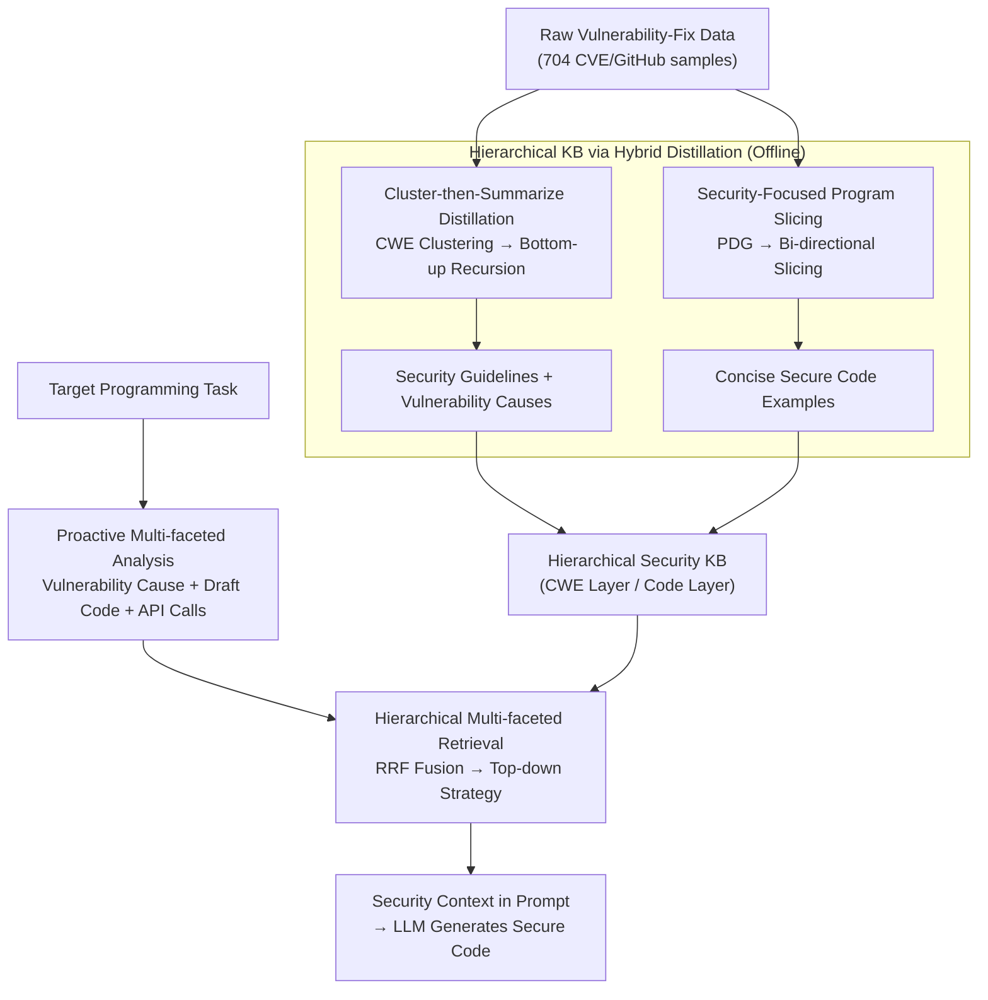

# RESCUE: Retrieval Augmented Secure Code Generation

**Conference**: ICLR 2026  
**OpenReview**: [https://openreview.net/forum?id=gbxhesw4UH](https://openreview.net/forum?id=gbxhesw4UH)  
**Code**: https://github.com/steven1518/RESCUE  
**Area**: Code Intelligence / Secure Code Generation / Retrieval-Augmented Generation  
**Keywords**: Secure code generation, RAG, Program slicing, Multi-faceted retrieval, CWE

## TL;DR
RESCUE proposes a novel RAG framework for "secure code generation": it offline distills messy vulnerability-fix data into a hierarchical security knowledge base using "clustering-summarization + program slicing," and online analyzes tasks from three security perspectives (vulnerability causes, API patterns, code) via "hierarchical multi-faceted retrieval." Across four benchmarks and six LLMs, it improves the SecurePass@1 metric (balancing security and functionality) by an average of 4.8 points, setting a new SOTA.

## Background & Motivation
**Background**: While LLMs are proficient in coding, they frequently generate code with vulnerabilities. Existing approaches to secure code generation follow three main paths: ① Fine-tuning models with security objectives (e.g., SafeCoder, SVEN), which incurs high data cleaning and training costs; ② Constrained decoding (e.g., CoSec), which requires training a small security model or using manual rules as an oracle to intercept unsafe tokens; ③ Iterative repair based on feedback from static analysis tools like Bandit, SpotBugs, or CodeQL (e.g., Codexity, INDICT), but these tools rely on predefined static rules, struggle with new vulnerability knowledge, and pose risks of data leakage since they are often used for evaluation.

**Limitations of Prior Work**: RAG appears to be the most flexible and training-free approach by retrieving security documents and code examples. However, simply applying generic RAG to the security domain faces two major hurdles. First, security documents contain significant information irrelevant to the target task—code examples demonstrating secure practices often carry entirely different task logic (e.g., database connections, web scraping), which can mislead LLMs. Second, existing retrievers treat security information as plain text and measure "security relevance" via text similarity, failing to capture the **implicit security semantics** embedded in task descriptions.

**Key Challenge**: The "raw form" of security knowledge (vulnerability-fix instances) is both verbose and instance-specific, acting as noise to the model, while the semantics determining security are hidden in the details of task descriptions, invisible to standard text similarity metrics.

**Goal**: The paper addresses two sub-problems: (1) How to distill raw security data into "generalized, concise knowledge with irrelevant logic stripped"; (2) How to explicitly understand tasks from a security perspective during retrieval to fetch the correct security knowledge.

**Key Insight**: Drawing inspiration from how security experts reason about vulnerabilities using "taxonomies," the authors construct security knowledge into a **hierarchical structure**. The high level contains generalizable security guidelines, while the low level contains concise secure code examples, using CWE as the classification backbone. Simultaneously, it advocates for "proactive analysis" of multiple security facets of a task rather than passive text matching.

**Core Idea**: Replace "raw documents + text similarity retrieval" with "hybrid distillation for a hierarchical security knowledge base + hierarchical multi-faceted retrieval" to ensure security knowledge is clean and accurately accessible.

## Method

### Overall Architecture
RESCUE consists of an offline phase and an online phase. **Offline Phase**: Distills raw security data (704 vulnerability-fix pairs from CVE/GitHub via the SafeCoder dataset) into a hierarchical security knowledge base. The high level consists of security guidelines and vulnerability causes under CWE categories, while the low level consists of sliced secure code examples. **Online Phase**: For a given programming task, it first performs "proactive multi-faceted analysis" to generate a set of queries with security semantics, then conducts top-down hierarchical retrieval to fuse multi-faceted results into a precise security context for the LLM.

### Key Designs

**1. Hierarchical Knowledge Base via Hybrid Distillation: Turning Noisy Raw Data into Usable Knowledge**

Raw vulnerability-fix instances are often long and task-specific, making them poor general guides. Conversely, official CWE descriptions are concise but too abstract for actionable repair strategies. RESCUE applies different methods for different layers: The high level uses an **LLM-assisted cluster-then-summarize** pipeline. Data is first clustered by CWE type, followed by **bottom-up recursive summarization** (summarizing small batches and then summarizing those summaries until convergence). Each CWE yields two summaries: a **security guideline** defining actionable instructions (e.g., "Use `yaml.safe_load()` instead of `yaml.load()`") and a **vulnerability cause** characterizing failure modes, the latter of which serves as a key facet for retrieval. This is a one-time preprocessing step completed offline using GPT-4o.

**2. Security-Focused Static Program Slicing: Stripping Irrelevant Logic from Example Code**

Secure code examples often contain logic irrelevant to the task, which distracts the LLM and retrieval process. RESCUE constructs a **Program Dependence Graph (PDG)** to represent data and control dependencies. Statements targeted by patches are treated as "Points of Interest" (POI)—deleted statements indicate vulnerabilities, and added statements indicate security fixes. **Bi-directional slicing** is performed: backward slicing tracks statements influencing the POI, while forward slicing captures statements influenced by them. By comparing sliced subgraphs of vulnerable and secure versions, RESCUE produces "context-complete and parallel" concise code variants.

**3. Proactive Multi-faceted Analysis: Extracting Implicit Security Semantics**

Traditional retrieval relies on functional descriptions, lacking explicit security semantics. RESCUE proactively analyzes tasks from three facets: (1) **Vulnerability Cause Analysis ($V_{cause}$)**—instructing the LLM to analyze potential attacks and security requirements; (2) **Draft Code Generation ($C_{draft}$)**—generating an initial code version using a zero-shot prompt; (3) **API Call Extraction**—using a visitor pattern on the draft code's AST to extract all API calls. These facets materialize the "implicit security profile" of the task for subsequent retrieval.

**4. Hierarchical Multi-faceted Retrieval: Top-down from CWE to Code with Improved RRF**

Retrieval is aligned with the KB hierarchy in two steps. **Step 1: CWE-level Retrieval** uses two facets to locate top-k CWE types: a dense retriever (bge-base-en-v1.5) calculates $\text{score}_{VCA}$ between task causes and CWE indices, while BM25 calculates $\text{score}_{API}$ between draft code APIs and CWE API sets. These are fused using an **improved RRF with threshold and rank filtering**:

$$\mathrm{RRF}(d) = \sum_{i=1}^{f} V_i(d) \cdot \frac{1}{r_i(d) + \alpha}, \quad V_i(d) = \mathbb{I}(s_i(d) > \tau_i) \cdot \mathbb{I}(r_i(d) \le 10)$$

Where $s_i(d)$ and $r_i(d)$ are the score and rank of entry $d$ for facet $i$, $\tau_i$ is the confidence threshold, and $\alpha$ is a smoothing parameter. This filtering ensures security guidance is only provided when truly necessary. **Step 2: Code-level Retrieval** performs fine-grained search within the selected CWEs by adding a third facet, **code similarity $\text{score}_C$**. The resulting security guidelines and sliced examples are then prepended to the task prompt.

### Loss & Training
RESCUE is **training-free**, serving as a plug-and-play RAG pipeline. Key hyperparameters: 2-hop slicing; generation temperature 0.2; top-k=4; thresholds for API, vulnerability cause, and code set to 4.0, 0.75, and 0.65; RRF $\alpha$=60. Offline distillation uses GPT-4o, online retrieval uses bge-base-en-v1.5 (dense) + BM25 (sparse), and API extraction utilizes tree-sitter.

## Key Experimental Results

### Main Results
Evaluation was conducted on four benchmarks (CodeGuard+, HumanEval+, BigCodeBench, LiveCodeBench) across six LLMs. The core metric is **SecurePass@1 (SP@1)**, which jointly evaluates functional correctness and security:

$$\mathrm{SecurePass@}k := \mathbb{E}_{\text{Problems}}\left[1 - \frac{\binom{n-s_p}{k}}{\binom{n}{k}}\right]$$

Where $n$ is total samples and $s_p$ is samples passing both unit tests and CodeQL security checks. SP@1 results on CodeGuard+ (abbreviated):

| Model | LLM alone | Next Best Baseline | RESCUE |
|------|-----------|--------------|--------|
| DeepSeek-Coder-V2-Lite | 59.7 | 60.3 (SafeCoder) | **65.6** |
| Qwen2.5-Coder-7B | 51.2 | 56.5 (SafeCoder) | **64.8** |
| Qwen2.5-Coder-32B | 59.3 | 58.1 (SecCoder) | **65.1** |
| Llama3.1-8B | 53.7 | 53.9 (CoSec) | **56.2** |
| GPT-4o-mini | 58.2 | 57.8 (SecCoder) | **63.0** |
| DeepSeek-V3-0324 | 64.6 | 64.7 (SecCoder) | **69.7** |

RESCUE achieved the highest SP@1 across all models, with an average absolute gain of 4.8 points over the next best baseline while maintaining 98.7% of the original functional correctness. Notably, while INDICT often shows high SecureRate (SR), its SP@1 is low (e.g., 48.5 on Qwen-7B), indicating it sacrifices functionality for security. Modern RAG approaches like SecCoder showed little improvement in SP@1/SR, highlighting the necessity of specialized security knowledge management.

### Ablation Study (CodeGuard+, KB Construction)

| Configuration | SP@1 (DSC-V2-Lite) | SP@1 (Qwen-7B) | SP@1 (Llama-8B) | Description |
|------|------|------|------|------|
| RESCUE | 65.6 | 64.8 | 56.2 | Full Model |
| w/o construction | 55.6 | 53.9 | 45.3 | Raw data without KB; significant drop |
| w/o guideline | 63.3 | 63.9 | 51.4 | Removing guidelines; -4.8 on Llama |
| w/o slicing | 61.0 | 62.6 | 52.7 | No slicing; token count rises (e.g., 503→661) |
| w/o psretrieval | 63.1 | 64.8 | 54.0 | Raw code used only during retrieval |
| w/o psgeneration | 64.8 | 66.1 | 53.5 | Raw code used only during generation |

### Key Findings
- **Knowledge Base construction is essential**: The "w/o construction" variant using raw data led to massive SP@1 drops across all models, confirming that irrelevant logic interferes with both retrieval and generation.
- **Security guidelines are high-impact**: Removing guidelines dropped Llama3.1-8B's SP@1 by 4.8 points.
- **Program slicing improves safety and efficiency**: Slicing reduced input tokens (e.g., from 661 down to 503) while simultaneously improving security performance in both retrieval and generation phases.

## Highlights & Insights
- **Aligning KB and Retrieval Structures**: Matching a hierarchical CWE-to-Code KB with a top-down retrieval process provides a natural "coarse-to-fine" paradigm that could be transferred to other RAG domains.
- **"Denoising" RAG with Program Slicing**: Using static analysis (PDG slicing) to purify retrieved documents is a generally applicable strategy for code-related RAG tasks to improve quality and reduce costs.
- **Improved Metrics**: By highlighting that "doing nothing" is technically secure, the use of SecurePass@k prevents methods from "gaming" the SecureRate at the expense of functionality.
- **Proactive Analysis**: Rather than relying purely on text similarity, RESCUE forces the LLM to materialize hidden security semantics (vulnerability causes, API usage) to guide retrieval.

## Limitations & Future Work
- **Dependency on strong models for offline distillation**: The quality of the KB is tied to the capabilities of GPT-4o used for summarization.
- **Knowledge scope limited to historical data**: The KB utilizes 704 instances; generalization to novel vulnerabilities not present in CWE or historical data remains to be validated.
- **Evaluation reliance on static tools**: Since SP@1 is determined by CodeQL, any false positives or negatives from the tool will propagate to the results.
- **Inference Overhead**: Generating draft code and performing AST parsing and multi-faceted fusion adds latency compared to single-pass retrieval.

## Related Work & Insights
- **vs. SecCoder (RAG)**: SecCoder performs in-context learning with the most similar raw examples using standard text similarity; RESCUE's distilled KB and multi-faceted retrieval lead to superior SP@1.
- **vs. SafeCoder (Fine-tuning)**: SafeCoder requires training and is limited to open-source models; RESCUE is plug-and-play and outperforms it on most models.
- **vs. CoSec (Constrained Decoding)**: CoSec requires training a companion small model restricted to the same tokenizer; RESCUE is model-agnostic.
- **vs. INDICT / Codexity (Iterative Feedback)**: These rely on tool feedback which risks data leakage and functionality degradation; RESCUE uses knowledge retrieval to guide correct generation from the start.

## Rating
- Novelty: ⭐⭐⭐⭐ The combination of "distillation+slicing for hierarchical KB" and "multi-faceted retrieval" is quite novel for secure RAG.
- Experimental Thoroughness: ⭐⭐⭐⭐⭐ Six models, four benchmarks, five baselines, and detailed ablation studies with the new SP@1 metric.
- Writing Quality: ⭐⭐⭐⭐ Clear structure with a strong alignment between motivation and design.
- Value: ⭐⭐⭐⭐ A training-free, plug-and-play solution with an average +4.8 SP@1 gain is highly practical.

<!-- RELATED:START -->

## Related Papers

- [\[ACL 2026\] Across Programming Language Silos: A Study on Cross-Lingual Retrieval-Augmented Code Generation](../../ACL2026/code_intelligence/across_programming_language_silos_a_study_on_cross-lingual_retrieval-augmented_c.md)
- [\[ICLR 2026\] FHE-Coder: Benchmarking Secure Agentic Code Generation for Fully Homomorphic Encryption](fhe-coder_benchmarking_secure_agentic_code_generation_for_fully_homomorphic_encr.md)
- [\[ACL 2026\] DeepGuard: Secure Code Generation via Multi-Layer Semantic Aggregation](../../ACL2026/code_intelligence/deepguard_secure_code_generation_via_multi-layer_semantic_aggregation.md)
- [\[ICLR 2026\] VERINA: Benchmarking Verifiable Code Generation](verina_benchmarking_verifiable_code_generation.md)
- [\[ICLR 2026\] Paper2Code: Automating Code Generation from Scientific Papers in Machine Learning](paper2code_automating_code_generation_from_scientific_papers_in_machine_learning.md)

<!-- RELATED:END -->
