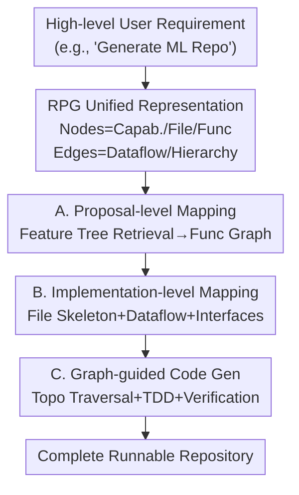

# RPG: A Repository Planning Graph for Unified and Scalable Codebase Generation

**Conference**: ICLR 2026  
**OpenReview**: [https://openreview.net/forum?id=VAQq3Y8tIF](https://openreview.net/forum?id=VAQq3Y8tIF)  
**Code**: https://github.com/microsoft/RPG-ZeroRepo  
**Area**: Code Intelligence / Repository-level Code Generation / LLM Agent  
**Keywords**: Repository-level code generation, planning graph, structured planning, ZeroRepo, test-driven development

## TL;DR
This paper proposes the Repository Planning Graph (RPG), which encodes both "what features to build (proposal)" and "how to implement them (implementation)" into an explicit graph (nodes represent capabilities/files/functions, edges represent data flow and hierarchy). Based on this, the ZeroRepo framework is built, utilizing a three-stage process: "proposal-level mapping → implementation-level mapping → graph-guided code generation" to generate entire codebases from scratch. On the self-constructed RepoCraft benchmark, it achieves 81.5% coverage, a 69.7% pass rate, and an average of 36K lines of code, exceeding the strongest baseline (Claude Code) by 3.9× in scale.

## Background & Motivation

**Background**: LLMs have become proficient in function-level and file-level code generation, reliably writing single functions or files from natural language descriptions. Scaling this capability from "function/file" to "generating an entire large-scale repository from scratch" is a critical step for automated software engineering but remains an open challenge. Generating a repository from scratch essentially requires two-level planning: proposal-level (deciding which features and modules to build) and implementation-level (deciding how to execute file structures, interfaces, dependencies, and data flow).

**Limitations of Prior Work**: Existing paradigms fall into three categories: decentralized multi-agent systems (e.g., MetaGPT, ChatDev, which assign roles like manager/architect/engineer to negotiate), fixed workflows (e.g., Paper2Code, which builds a skeleton before filling details), and iterative terminal agents (e.g., Claude Code, Gemini CLI, which write intermediate plans as markdown and modify them step-by-step). Despite their differences, all three share a common dependency: **using natural language as the intermediate medium for planning**.

**Key Challenge**: While natural language is flexible and readable, it is inefficient for large-scale repository planning. It is inherently ambiguous, mixing "intent" with "constraints"; it lacks explicit hierarchy, making dependency tracking extremely difficult; and static plans tend to degrade or drift over long horizons, failing to adapt. In zero-repo generation, this leads to two specific issues: unstable proposal-level planning (features are missing, overlapping, or uneven in scope) and fragmented implementation-level planning (plans drift between iterations, causing inconsistencies in dependencies, data flow, and module boundaries).

**Goal**: To replace the natural language intermediate layer with a structured, persistent, and evolvable representation that maintains long-term consistency between proposal and implementation levels.

**Key Insight**: Since the fundamental problem with natural language is the lack of explicit structure and dependency tracking, the planning should be represented directly as a **graph**—where nodes carry hierarchical capabilities aligned with files/classes/functions, and edges carry semantic relationships and data flow. Graphs inherently support hierarchies and topological ordering, binding "global semantics" with "local implementation."

**Core Idea**: Use a unified Repository Planning Graph instead of free-form natural language as an interpretable, topologically traversable "repository blueprint," and implement a graph-driven framework (ZeroRepo) to incrementally build the graph and generate code accordingly.

## Method

### Overall Architecture

The system aims to address the problem of generating a complete, runnable, and large-scale codebase from a high-level user requirement (e.g., "Please generate a machine learning repository"). The core vehicle is the **RPG**: a graph that encodes features and implementation. Nodes have dual semantics: at the functional level, they represent gradually refined capabilities (high-level module → mid-level component → leaf = specific algorithm); at the structural level, they corresponds isomorphically to the repository organization (root node ≈ directory, intermediate node ≈ file, leaf ≈ function/class). Edges encode inter-module data flow (solid black edges, e.g., Data Loading output feeding into ML Algorithms) and intra-module file ordering (dashed gray edges), providing a topological order that aligns functional decomposition with code organization.

Built around the RPG, ZeroRepo generates the repository in three stages: (A) **Proposal-level mapping**, transforming user requirements into a functional graph via "global feature tree retrieval + restructuring"; (B) **Implementation-level mapping**, adding file skeletons, data flows, and interfaces/base classes to complete the RPG; (C) **Graph-guided code generation**, traversing the RPG topologically to perform test-driven implementation for each leaf, supported by graph-guided localization/editing and hierarchical test verification.

### Key Designs

**1. Repository Planning Graph: Replacing Natural Language Blueprints with a Dual-Semantic Graph**

To address the ambiguity and lack of hierarchy in natural language, RPG encodes repository planning into an explicit, machine-interpretable graph. The core design is the **dual semantics of nodes**: a single node represents both a capability (functional layer, refined top-down) and a code structural unit (structural layer, where roots are directories, internal nodes are files, and leaves are functions/classes). This ensuring functional decomposition and code structure are naturally isomorphic, preventing "plan-code mismatch."

Edges supplement this with cross-layer dependencies: inter-module edges encode typed data flow, while intra-module edges encode file-level ordering. These edges impose a topological sort that keeps "global semantics" and "local implementation" aligned—code generation follows this order to ensure dependencies are generated before their dependents. Unlike natural language plans that drift, the RPG serves as a **persistent and evolvable** substrate.

**2. Proposal-level Mapping: Stabilizing "What to Build" via Exploration-Exploitation Retrieval**

To avoid the instability of LLMs when enumerating capabilities in a vacuum, this stage introduces the EpiCoder Feature Tree (an ontology containing 1.5 million software capabilities) as a knowledge base. Each node is embedded in vector space, with hierarchical paths stored as metadata. Since the scale is too large to exhaust, ZeroRepo uses an **exploration-exploitation** strategy to incrementally expand a "repository-aligned subtree": exploitation ensures precision by retrieving top-k feature paths aligned with user goals, while exploration ensures diversity by expanding into unvisited ontology areas.

The resulting subtree is then subject to **target-aligned restructuring**: the LLM reorganizes features into modules based on high-cohesion, low-coupling principles (e.g., moving `silhouette_score` from a clustering algorithm node to an evaluation module). The restructured graph establishes clear functional boundaries, encoding the proposal-level plan directly into the representation.

**3. Implementation-level Mapping: Completing the RPG for Execution**

This stage bridges the abstract functional graph to a concrete implementation. First, **file structure encoding** attaches directory namespaces to root nodes and assigns intermediate nodes to specific files (e.g., grouping preprocessing tools into `preprocess.py`), ensuring semantic cohesion and reducing cross-file coupling.

Second, **data flow and function encoding** finalizes the RPG. Data flow edges are added to connect subgraph roots globally and order files locally. Then, **global interface abstraction** extracts recurring input-output patterns into common data structures or base classes (e.g., a `BaseEstimator` for all algorithms) to act as consistency anchors. Finally, **adaptive interface design** clusters leaf features into executable interfaces based on semantic relevance—independent features become functions, while dependent ones are merged into classes with methods.

**4. Graph-guided Code Generation: Translating RPG via Topo-sort + TDD**

ZeroRepo traverses the complete RPG in **topological order**. For each leaf node, it applies test-driven development (TDD): deriving tests from specifications, implementing the function/class, and iterating upon failure. Only verified code is committed, ensuring stability during incremental expansion.

A **graph-guided localization-editing** workflow is designed for debugging: the target is first localized within the RPG (using fuzzy matching, repository code views, and dependency tracking along edges), followed by editing. **Hierarchical test verification** aligns with the graph: individual units are checked via docstring unit tests, while subgraphs undergo integration tests to verify data flows. A lightweight majority-voting diagnostic distinguishes "actual implementation errors" from "environment/test issues." This graph-guided approach reduces localization steps by 30–50% compared to graph-less methods.

### A Complete Example

For "Generate a machine learning repository": (A) The system retrieves features like data loading, lasso, and visualization from the 1.5M feature tree, restructuring them into a functional graph. (B) Roots are assigned directories (e.g., `src/algos`), internal nodes are assigned files (`linear.py`), and data flow edges are added (loading → algos → eval). Global classes like `BaseEstimator` are defined. (C) Following the topological order, `BaseEstimator` is generated first, followed by `DataLoader` and `LassoRegression(BaseEstimator)`. Each leaf undergoes TDD before being committed, resulting in a modular, integrated repository.

## Key Experimental Results

### Main Results

Evaluated on the RepoCraft benchmark (1,052 tasks based on 6 real Python projects like scikit-learn and pandas), the main results are:

| Method | Model | Cov.% ↑ | Pass/Vote % ↑ | LOC ↑ | Tokens ↑ |
|------|------|------|------|------|------|
| Paper2Code | Qwen3-Coder | 30.2 | 4.9 / 15.9 | 1,365 | 14,555 |
| Gemini CLI | gemini 2.5 pro | 42.0 | 14.5 / 37.9 | 1,485 | 14,922 |
| Claude Code CLI | claude 4 sonnet | 54.2 | 33.9 / 52.5 | 10,587 | 105,236 |
| **ZeroRepo** | **o3-mini** | **81.5** | **69.7 / 75.0** | 23,977 | 260,761 |
| **ZeroRepo** | **Qwen3-Coder** | 75.1 | 57.3 / 68.0 | **36,941** | **445,512** |
| Gold Projects | Human | – | 81.0 / 92.0 | 97,820 | 951,614 |

ZeroRepo (o3-mini) achieves 81.5% coverage, 27.3% higher than Claude Code, and a 69.7% pass rate. The Qwen3-Coder version generates 36K LOC, which is 3.9× that of Claude Code and approximately 68× that of other baselines.

### Ablation Study

Ablation of graph-guided localization (MLKit-Py, o3-mini, values = avg. steps ± std dev):

| Configuration | IntTest | IncDev | Debug |
|------|------|------|------|
| ZeroRepo (Full) | 6.2 ± 2.1 | 6.8 ± 1.8 | 5.8 ± 2.8 |
| w/o Graph | 13.3 ± 11.1 | 10.8 ± 2.6 | 8.5 ± 2.9 |

Removing RPG guidance leads to a significant increase in localization steps. Graph-guided localization reduces effort by 30–50% and exhibits lower variance.

### Key Findings

- **Near-linear Scaling**: ZeroRepo's leaf features and LOC grow near-linearly, exceeding 30K LOC within 30 iterations. Natural language baselines generally stagnate around 3-4K LOC as they accumulate inconsistencies.
- **Continuous Coverage Increase**: Coverage on MLKit-Py rises from 70.2% (Iter 5) to 95.7% (Iter 30) while maintaining ~8% novelty (new features beyond the reference).
- **Reliable Automated Evaluation**: The pipeline achieves 81.0% pass rate on Gold Projects, and the o3-mini evaluator shows Pearson correlations of 0.89/0.96 with human judgment for coverage and novelty.

## Highlights & Insights

- **Graph as a Planning Medium is a Paradigm Shift**: Replacing "writing plans" with "building a topologically traversable graph" resolves ambiguity, dependency tracking, and long-range drift in one stroke.
- **Dual Semantic Design**: Mapping a single node to both a capability and a structural unit ensures functional plans and actual code never decouple. This is applicable to any "specification-to-artifact" generation task.
- **Exploration-Exploitation on Ontologies**: Using a 1.5M feature tree as a structured prior provides a stable foundation for feature selection that far exceeds the consistency of zero-shot LLM enumeration.
- **Graph as a Runtime Navigator**: RPG is not just a planning output; it serves as a global structure for the agent to navigate and debug, significantly reducing the "search space" for localization.

## Limitations & Future Work

- **External Knowledge Dependency**: The proposal stage relies heavily on the EpiCoder Feature Tree. Performance might degrade in niche domains not covered by the ontology.
- **Benchmark Bias**: RepoCraft focuses on Python data science and web frameworks; generalization to frontend, system-level, or highly concurrent non-Python codebases remains to be verified.
- **Cost**: The iterative nature of feature selection, debugging (up to 8 times per function), and majority voting likely involves high token and time costs, which were not fully detailed.
- **Quality vs. Scale**: While LOC and coverage are high, the 69.7% pass rate is still below the human 81%, suggesting gaps in production-grade maintainability.

## Related Work & Insights

- **vs. Multi-agent (MetaGPT / ChatDev)**: Instead of natural language negotiation between roles, ZeroRepo uses a shared structured graph to maintain persistent planning information, avoiding semantic loss during handoffs.
- **vs. Workflow Systems (Paper2Code)**: While workflows use static markdown skeletons, RPG provides a graph with explicit data flows and interface constraints, enabling better dependency tracking.
- **vs. Terminal Agents (Claude Code / Gemini CLI)**: These agents rely on externalizing plans into markdown, leading to flattened growth (LOC plateauing). RPG enables near-linear expansion of both features and code.

## Rating
- Novelty: ⭐⭐⭐⭐⭐ A paradigm shift in repository-level generation.
- Experimental Thoroughness: ⭐⭐⭐⭐⭐ Extensive benchmarks, multi-backbone testing, and consistency validation.
- Writing Quality: ⭐⭐⭐⭐ Clear structure and excellent visualizations.
- Value: ⭐⭐⭐⭐⭐ High research and practical value for automated software engineering.

<!-- RELATED:START -->

## Related Papers

- [\[ICML 2026\] UniRTL: Unified Code and Graph for Robust RTL Representation Learning](../../ICML2026/code_intelligence/unirtl_unifying_code_and_graph_for_robust_rtl_representation_learning.md)
- [\[ICLR 2026\] Gistify: Codebase-Level Understanding via Runtime Execution](gistify_codebase-level_understanding_via_runtime_execution.md)
- [\[ICLR 2026\] Evolving Graph Structured Programs for Circuit Generation with Large Language Models](evolving_graph_structured_programs_for_circuit_generation_with_large_language_mo.md)
- [\[ICLR 2026\] Improving Code Localization with Repository Memory](improving_code_localization_with_repository_memory.md)
- [\[ICLR 2026\] From Large to Small: Transferring CUDA Optimization Expertise via Reasoning Graph](from_large_to_small_transferring_cuda_optimization_expertise_via_reasoning_graph.md)

<!-- RELATED:END -->
