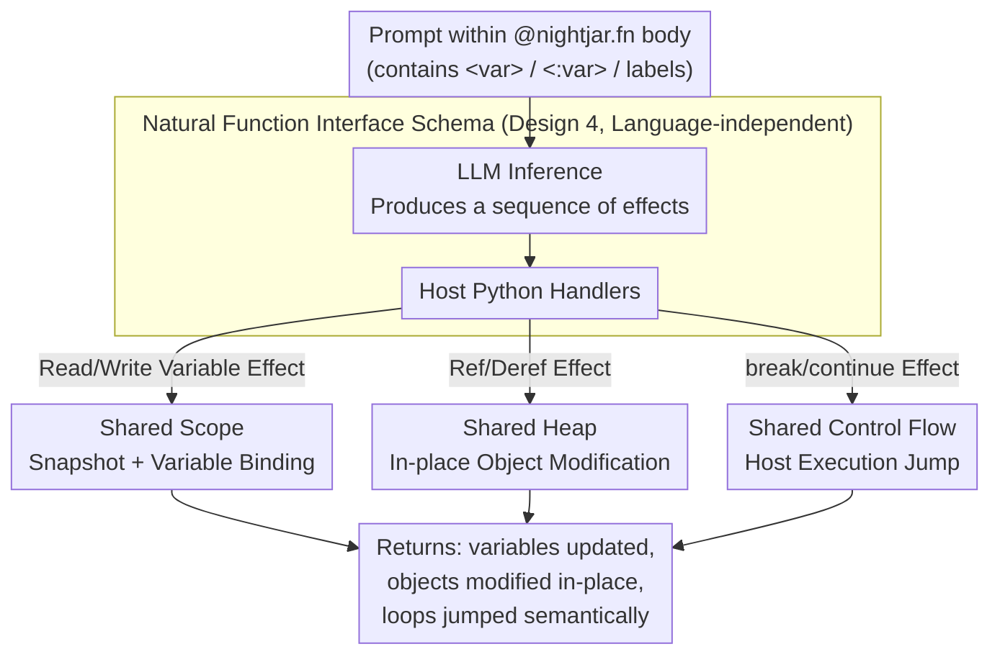

# Sharing State Between Prompts and Programs

**Conference**: ICLR 2026  
**arXiv**: [2512.14805](https://arxiv.org/abs/2512.14805)  
**Code**: [https://github.com/psg-mit/nightjarpy](https://github.com/psg-mit/nightjarpy)  
**Area**: Programming Languages / LLM Programming  
**Keywords**: Shared program state, Natural language programming, prompt-program interoperability, Nightjar, Programming abstractions  

## TL;DR
The authors propose the abstraction of shared program state, allowing prompts to directly read/write program variables, manipulate heap objects, and control program flow. This is implemented as the Nightjar system (Python + prompt mixed programming), which reduces code volume by 39.6% while maintaining or improving accuracy (+4-19%).

## Background & Motivation

**Background**: LLMs have catalyzed natural language programming—using prompts to instruct models to execute tasks. Existing systems (LangChain, DSPy, SGLang, etc.) support interoperability between prompts and programs but adopt an isolated program state design: prompts execute in an independent environment, requiring developers to manually serialize/deserialize data to pass program state.

**Limitations of Prior Work**: The isolated state design results in significant boilerplate code—developers must define schema classes, serialization functions, and deserialization functions to transfer data between prompts and programs. This increases development complexity and is prone to introducing errors.

**Key Challenge**: Prompts fundamentally need access to the program context to make reasonable decisions (reading variable values, modifying object states, controlling branches/loops), yet existing systems strictly isolate prompt execution from program state, forcing developers to write bridge code manually.

**Goal**: (a) Define a programming abstraction for shared program state; (b) Design a formal schema for a natural function interface; (c) Implement the Nightjar system to verify its feasibility and benefits.

**Key Insight**: Borrowing from the effects & handlers paradigm in programming languages, the operations of a prompt on program state are formalized as effects, which are implemented by handlers in the host language.

**Core Idea**: Allow prompts to behave like functions that directly access program variable scopes, the heap, and control flow, eliminating the development burden of manual state transfer.

## Method

### Overall Architecture
This paper aims to resolve the "isolation wall" between prompts and programs in existing natural language programming systems. In such systems, prompts execute in independent environments, forcing developers to write extensive schemas and serialization/deserialization code to pass data in and out. Nightjar treats prompts as first-class code within a Python program: developers use the `@nightjar.fn` decorator on a function and write prompts directly using triple-quoted strings in the function body. The prompt can use `<variable>` to read local variables in the current scope, use `<:variable>` to bind LLM output back to variables, manipulate Python heap objects in-place, and even trigger `break`/`continue` control flows. The entire pipeline is formalized as effects & handlers: every category of operation the prompt intends is an "effect," which is actualized by a "handler" implemented in the host Python environment. Consequently, the prompt and the program share the same state. The following diagram illustrates the main pipeline from "Prompt issuing effects" to "Handlers actualizing to shared states," unified under a single interface specification.

### Key Designs

**1. Shared Scopes: Allowing prompts to read/write variables directly, eliminating parameter boilerplate**

The most direct burden of isolated state design is the need to manually feed variables into the prompt and extract results. Nightjar allows `<graph>` in a prompt to directly reference the `graph` variable in the current scope, while `<:response>` in the LLM output binds the value back to the `response` variable. Mechanistically, the system snapshots the scope before prompt execution and updates variables using write effects generated by the LLM post-execution. This eliminates the need for developers to define schema classes or write serialization functions for "inputs/outputs," making the prompt a true part of the program rather than an external black box requiring a bridge.

**2. Shared Heap: Allowing prompts to modify complex objects in-place instead of returning new copies**

Reading and writing variables is insufficient—many tasks require modifying mutable objects like graphs or lists. The difficulty lies in the fact that LLMs cannot and should not directly touch the Python heap. Nightjar introduces reference/dereference effects: the system maintains an object reference table, and the LLM merely issues instructions like "perform an operation on some reference." The handler then translates these into attribute modifications, method calls, or in-place updates on the actual Python objects. This allows a prompt to modify a graph or append to a list in-place, rather than serializing the entire structure and returning a new version—saving tokens and avoiding information loss during the movement of large objects.

**3. Shared Control State: Letting prompts semantically decide loop termination or jumps**

Some branching decisions are essentially semantic (e.g., "should this dialogue round end?"), which are difficult to write cleanly with traditional conditional code. Nightjar allows prompts to reference control flow structures via labels: when the LLM outputs a `break` effect, the corresponding handler executes that `break` in the host Python program, and similarly for `continue`. This enables the prompt to decide whether to terminate a loop or skip an iteration based on dialogue semantics, consolidating what would have been multiple `if` statements into the prompt's natural language intent.

**4. Natural Function Interface Schema: Unifying the three shared types into a language-independent specification**

While the first three points are specific capabilities, the fourth abstracts them into a formal interface, ensuring "shared program state" is not limited to Python. It is built on the effects & handlers paradigm: the "effects" side defines what operations a prompt can initiate (reading/writing variables, referencing/dereferencing objects, breaking loops, etc.), and the "handlers" side defines how these are implemented in the host language. Read, write, heap, and control flow operations are all unified into the same "effect-handler" pairing. Because the interface only specifies operational semantics and is not bound to a specific language, any programming system can theoretically implement its own shared state following this schema.

### A Complete Example: Prompt Modifying a Graph
Consider a function receiving a graph variable `graph`, with a prompt: `"Find isolated nodes in <graph> and connect them to the center node, use <:response> to provide a description of the changes."` During execution, `<graph>` triggers a read effect, and the handler retrieves the actual `graph` object reference from the scope snapshot. After the LLM decides which edges to add, it issues several heap operation effects, which the handler uses to call edge-addition methods in-place on the Python `graph` via the reference table. Finally, the LLM generates a write effect to bind the description text to `<:response>`. Upon function return, the `graph` has been modified in-place and `response` is available in the scope. The developer writes no schema, serialization, or parameter-bridging code.

### Loss & Training
Nightjar does not involve model training; its contribution is at the programming system level. The core technical challenge is reliably mapping the LLM's natural language output to the correct program operations—specifically the step where handlers actualize effects in the host language.

## Key Experimental Results

### Main Results (Nightjar vs. Manual Implementation)

| Task | Nightjar Accuracy | Manual Acc. | Code Reduction | Runtime Overhead |
|------|---------------|-------------|----------|-----------|
| Graph Ops | +4-19% | Baseline | ~40% | 0.4-4.3x |
| Data Processing | Equal or Higher | Baseline | ~40% | Moderate |
| Control Flow | Higher | Baseline | Significant | Slightly Higher |

### Ablation Study

| Configuration | Effect | Description |
|------|------|------|
| Full Shared State | Optimal | Scope + Heap + Control Flow |
| Shared Scope Only | Usable but limited | Cannot modify mutable objects |
| Isolated State (Baseline) | High boilerplate | Traditional approach |

### Key Findings
- Average code reduction of **39.6%**, primarily from eliminating schema definitions and serialization/deserialization code.
- Accuracy gain of **+4-19%**: Shared state avoids information loss and formatting errors introduced by manual serialization.
- Runtime overhead of 0.4-4.3x: Mainly due to additional communication for reference resolution and effect processing.

## Highlights & Insights
- **The contribution to programming abstractions** is more significant than the specific system: shared program state is a new paradigm not limited to Python. The natural function interface schema is language-independent.
- **The application of Effects & Handlers in LLM programming** is ingenious: abstracting prompt operations on program state as effects implemented by host handlers is an elegant combination of PL theory and practical LLM systems.
- It reveals a trend: computation is increasingly being planned and executed dynamically and adaptively, with LLMs making "runtime programming" a reality.

## Limitations & Future Work
- Runtime overhead (0.4-4.3x) may be unacceptable in latency-sensitive scenarios.
- LLM operations on complex program objects may fail (hallucinating write values).
- Currently only implemented in Python; portability to other languages needs verification.
- Security concerns: Allowing prompts to directly manipulate program state may cause unintended side effects.

## Related Work & Insights
- **vs. LangChain/DSPy**: These systems use isolated state and require manual schema/serialization. Nightjar eliminates this burden.
- **vs. AskIt/ANPL**: These systems use LLMs to generate functions to replace prompts, partially sharing state but lacking support for write variables and control flows.
- **vs. tool use**: Tool use requires developers to define custom functions; Nightjar's shared state requires no additional function definitions from the developer.

## Rating
- Novelty: ⭐⭐⭐⭐ Shared program state is a new programming abstraction; innovative use of effects & handlers.
- Experimental Thoroughness: ⭐⭐⭐ Limited number of tasks; lacks large-scale application verification.
- Writing Quality: ⭐⭐⭐⭐ Good integration of PL formal specifications with practical systems.
- Value: ⭐⭐⭐⭐ Highly insightful for the design of LLM programming systems.

<!-- RELATED:START -->

## Related Papers

- [\[ICLR 2026\] Evolving Graph Structured Programs for Circuit Generation with Large Language Models](evolving_graph_structured_programs_for_circuit_generation_with_large_language_mo.md)
- [\[ICLR 2026\] Behavioral Embeddings of Programs: A Quasi-Dynamic Approach for Optimization Prediction](behavioral_embeddings_of_programs_a_quasi-dynamic_approach_for_optimization_pred.md)
- [\[NeurIPS 2025\] Learning From Design Procedure To Generate CAD Programs for Data Augmentation](../../NeurIPS2025/code_intelligence/learning_from_design_procedure_to_generate_cad_programs_for_data_augmentation.md)
- [\[ICLR 2026\] From Assistant to Independent Developer — Are GPTs Ready for Software Development?](from_assistant_to_independent_developer_are_gpts_ready_for_software_development.md)
- [\[ICLR 2026\] ShieldedCode: Learning Robust Representations for Virtual Machine Protected Code](shieldedcode_learning_robust_representations_for_virtual_machine_protected_code.md)

<!-- RELATED:END -->
