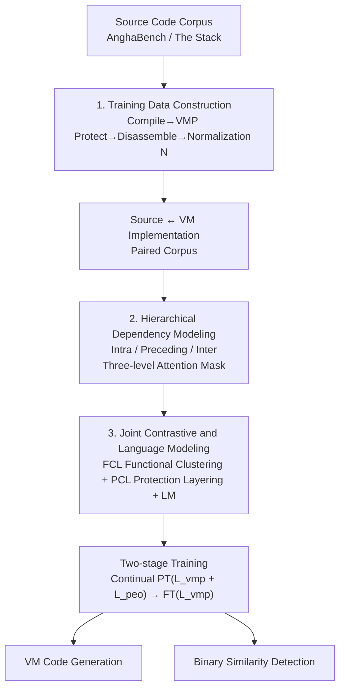

# ShieldedCode: Learning Robust Representations for Virtual Machine Protected Code

**Conference**: ICLR 2026  
**arXiv**: [2601.20679](https://arxiv.org/abs/2601.20679)  
**Code**: None  
**Area**: Code Intelligence  
**Keywords**: Virtual Machine Protection, Code Representation Learning, Contrastive Learning, Polymorphic Generation, Software Security

## TL;DR

ShieldedCode is proposed as the first protection-aware code representation learning framework. By utilizing hierarchical dependency modeling (intra-instruction, preceding, and inter-instruction layers) and joint functional-aware plus protection-aware contrastive learning, it enables LLMs to generate, compare, and reason about virtual machine protected code. It outperforms existing methods in VM code generation (Pass@1 26.95% vs. GPT-4o 22.58%) and binary similarity detection.

## Background & Motivation

1. LLMs have made significant progress in code generation, but their potential in software protection remains untapped.
2. Reverse engineering continuously threatens software security, while traditional Virtual Machine Protection (VMP) relies on rigid rule transformations, making it costly to design and vulnerable to automated analysis.
3. Traditional VMP systems produce highly regular virtual machine structures and instruction patterns, which become targets for rule-based and semantic attacks.
4. Advances in machine learning for binary similarity detection and neural decompilation have accelerated the automation of semantic recovery.
5. Existing models designed for compiler-level assembly (e.g., Nova, LLMCompiler) handle O0-O3 optimized code with stable structures, whereas VMP bytecode undergoes polymorphic expansion, virtual register renaming, and interpreter-driven semantic transformations, creating a massive domain gap.
6. **Key Insight**: Protection mechanisms must evolve from fixed transformation rules into mechanisms embedding semantic diversity and dynamic behavior to resist human and AI-assisted analysis.

## Method

### Overall Architecture

This paper addresses the challenge of making LLMs truly "understand" and generate Virtual Machine Protection (VMP) code. Such code differs drastically from the O0-O3 compiled code models are familiar with due to polymorphic expansion, virtual register renaming, and interpreter-driven semantic transformations. The ShieldedCode pipeline first constructs a large-scale paired corpus of "Source Code ↔ VM Implementation" through "Compilation → VMP Protection → Disassembly → Normalization." Using CodeLlama 34B as the backbone, the framework integrates **Hierarchical Dependency Modeling** (three-level attention masks) into the inductive bias to capture the structured dependencies of VM code. Simultaneously, a **Joint Contrastive and Language Modeling** objective ensures that embeddings are clustered by functionality and layered by protection strength. Finally, a two-stage pipeline consisting of "Continual Pre-training (incorporating a Protection Effect Optimization/PEO task) → Fine-tuning" is employed to train the model, supporting both VM code generation and binary similarity detection tasks.

### Key Designs

**1. Training Data Construction: Pairing Source Code with Normalized VM Bytecode**

VMP bytecode involves polymorphic expansion and register renaming that deviates from standard assembly. To allow LLMs to learn these patterns, the authors started with source code from AnghaBench and The Stack, processed them through compilation (O0-O3) → commercial VMP protection → disassembly, resulting in "Source ↔ VM Implementation" pairs. Since raw disassembly contains noise, a normalization operator $\mathcal{N}$ is applied: removing debug symbols, inserting spaces for stable tokenization, replacing virtual addresses with symbols, and normalizing labels to `[VINST-1]`, `[VINST-2]`, etc. This maps VM code from different sources into a unified representation.

**2. Hierarchical Dependency Modeling: Aligning Structured Dependencies via Three-level Masking**

Standard Transformer causal masks only see "all preceding tokens," failing to capture the hierarchical structure of VM bytecode, where instructions are semantic units with register reuse and polymorphic control flows. The authors apply a three-level hierarchical mask to the context of token $x_t^k$: **Intra-instruction** marks tokens of each virtual instruction with `[VINST]_t` as a coherent unit; **Preceding instruction** conditions on the prior instruction's `[VINST]_{t-1}` to capture local execution patterns like register reuse; **Inter-instruction** connects all earlier markers $\{[\text{VINST}]_1, ..., [\text{VINST}]_{t-1}\}$ to inject long-range context for polymorphic transformations. The visible set for a token is defined as:

$$\mathcal{M}(x_t^k) = \underbrace{\{x_t^1,...,x_t^m, [\text{VINST}]_t\}}_{\text{intra}} \cup \underbrace{\{[\text{VINST}]_{t-1}\}}_{\text{preceding}} \cup \underbrace{\{[\text{VINST}]_1,...,[\text{VINST}]_{t-1}\}}_{\text{inter}}$$

This encodes the structured dependencies of VMP code directly as an inductive bias, proving more robust than flat masks.

**3. Joint Contrastive and Language Modeling: Functional Clustering and Protection Layering**

For binary similarity detection, embeddings of different protected variants of the same function must be recognizable as the same functionality while maintaining separation based on protection strength. Functional Contrastive Learning (FCL) pulls embeddings of the same function under different representations (Source + L0-L3) closer using adaptive weights $w_{s,t} = \exp(-|s-t|/\tau_{\text{fcl}})$. Protection Contrastive Learning (PCL) uses a soft-margin constraint to force embeddings of different protection levels apart proportionally to their intensity: $d(e_f^s, e_f^t) \geq \beta(t-s) - m$. These objectives, combined with the LM loss, form the total objective:

$$L_{\text{vmp}} = L_{\text{lm}} + \lambda(L_{\text{fcl}} + L_{\text{pcl}})$$

### Loss & Training

- **Two-stage Training**:
  1. Continual Pre-training: Alternating optimization of $L_{\text{vmp}}$ and $L_{\text{peo}}$ using AnghaBench + The Stack + VirtuCorp 3M.
  2. Fine-tuning: Optimizing only $L_{\text{vmp}}$ using 2.5M source-VMP pairs (850M tokens).
- Polymorphic generation is applied to half of the attention heads to balance effectiveness and knowledge retention.
- **Protection Effect Optimization (PEO)**: Uses a hard negative mining strategy with $\kappa_i = 1 + \lambda_h \cdot \text{rank}_i$.

## Key Experimental Results

### Main Results

**VM Code Generation (HumanEval_compile)**:

| Model | Pass@1 (L0) | Pass@1 (L1) | Pass@1 (L2) | Pass@1 (L3) |
|------|------------|------------|------------|------------|
| CodeLlama | 7.84 | 3.26 | 5.19 | 2.79 |
| DeepSeekCoder-7B | 10.28 | 6.89 | 7.94 | 6.17 |
| GPT-4o | 22.58 | 17.43 | 15.26 | 11.89 |
| **ShieldedCode** | **26.95** | **18.47** | **19.23** | **14.71** |

**Binary Similarity Detection (BinaryCorp-VA)**:

| Model | Recall@1 O0+L1 | Recall@1 O0+L3 | MRR O0+L1 |
|------|-----------|-----------|-----------|
| jTrans (Linear Probe) | 0.333 | 0.404 | 0.245 |
| Trex | 0.118 | 0.148 | 0.073 |
| **ShieldedCode** | **0.488** | **0.272** | **0.575** |

### Ablation Study

| Configuration | Pass@1 Avg. | Pass@10 Avg. |
|------|-----------|------------|
| ShieldedCode^{-CL-PG} (LM Only) | 15.78 | 27.41 |
| ShieldedCode^{-PG} (w/ Contrastive) | 21.86 | 35.25 |
| **ShieldedCode** (Full) | **25.17** | **38.30** |

**Granite 128K Long Input Ablation**:

| Configuration | Pass@1 Avg. | Pass@10 Avg. |
|------|-----------|------------|
| Granite 3B 128K | 4.62 | 6.44 |
| + Standard Fine-Tuning | 12.84 | 19.41 |
| + ShieldedCode Approaches | **17.91** | **25.25** |

### Key Findings

1. **Outperforming GPT-4o in VM Generation**: Attained a 4.37 percentage point Pass@1 Gain at L0 (26.95% vs. 22.58%), with even more significant improvements at L2.
2. **Impact of Hierarchical Dependency Modeling**: This component contributed an average Pass@1 Gain of 3.31 percentage points.
3. **Resistance to Reverse Engineering**: Manual analysis success rate was only 17% (vs. 67% for VMProtect), with an average time of 14.7 hours (vs. 3.4 hours); pattern matching attacks had 0% success.
4. **Synergy with Long-context Techniques**: Applying ShieldedCode methods to Granite 128K yielded an additional 5.07% Pass@1 Gain.

## Highlights & Insights

1. Effectively formalizes software protection as a representation learning problem, opening a new direction for learning-based software defense.
2. The three-layer hierarchical attention mask is a clever design that introduces inductive biases aligned with the structured dependencies of VMP code, unlike standard flat causal masks.
3. Demonstrated mathematical compatibility between FCL and PCL—FCL's exponential decay weights and PCL's linear scaling constraints work together to achieve a stable equilibrium between functional clustering and protection layering.
4. Robust user study design for reverse engineering involving 12 graduate students and 3 professional reverse engineers provided credible security evaluations.

## Limitations & Future Work

1. Based on CodeLlama 34B, the model scale leads to high inference costs for practical deployment.
2. Training data is limited to C language and x86-64 architecture; generalization to other languages and ISAs (ARM, RISC-V) has not been verified.
3. Only one commercial VMP tool was used; variations in protection styles across different VMP systems might affect generalization.
4. The candidate pool size for the PEO task (K=50~500) is relatively limited and requires evaluation in larger-scale retrieval scenarios.

## Related Work & Insights

- **jTrans**: Transformer-based binary code similarity detection using linear probe fine-tuning, but lacks VMP-specific design.
- **Nova**: Hierarchical modeling for compiler-level assembly; however, it handles stable O0-O3 structures whereas VMP bytecode is significantly more complex.
- **LLMCompiler**: Meta's pre-trained model for LLVM IR/Assembly (401B tokens), but not designed for VMP code.
- **CodeArt**: Regularized attention for assembly representation, yet lacks protection-aware objectives.
- **Insight**: LLMs are not just code generators but catalysts for rethinking program representation and protection. The hierarchical attention mask approach can be extended to other structured code formats like compiler IR or WebAssembly.

## Rating

- ⭐ Novelty: 4.5/5 — First protection-aware code representation framework with original hierarchical masking and FCL/PCL optimization.
- ⭐ Experimental Thoroughness: 4/5 — Covers generation, detection, and PEO tasks plus a user study, though some baselines are estimated.
- ⭐ Writing Quality: 3.5/5 — Technically solid but long; some minor inconsistencies in mathematical notation.
- ⭐ Value: 4/5 — Establishes a new direction for learning-based software protection with significant implications for the security community.

<!-- RELATED:START -->

## Related Papers

- [\[ICLR 2026\] Paper2Code: Automating Code Generation from Scientific Papers in Machine Learning](paper2code_automating_code_generation_from_scientific_papers_in_machine_learning.md)
- [\[ICML 2025\] Robust Learning of Diverse Code Edits (NextCoder)](../../ICML2025/code_intelligence/robust_learning_of_diverse_code_edits.md)
- [\[ICLR 2026\] Agnostics: Learning to Synthesize Code in Any Programming Language with a Universal Reinforcement Learning Environment](agnostics_learning_to_synthesize_code_in_any_programming_language_with_a_univers.md)
- [\[ICLR 2026\] The Natural Geometry of Code: Hyperbolic Representation Learning for Program Reasoning](the_natural_geometry_of_code_hyperbolic_representation_learning_for_program_reas.md)
- [\[ICLR 2026\] Learning to Reason without External Rewards](learning_to_reason_without_external_rewards.md)

<!-- RELATED:END -->
