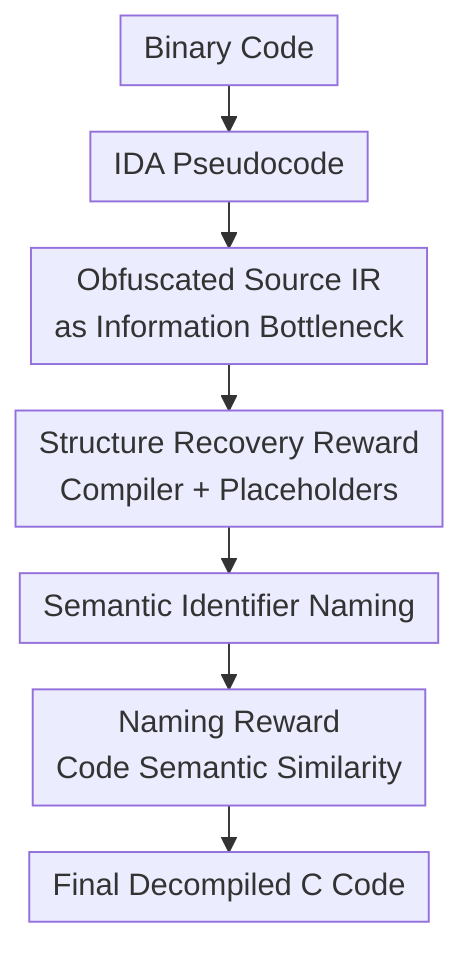

# SK2Decompile: LLM-based Two-Phase Binary Decompilation from Skeleton to Skin

**Conference**: ICLR2026  
**OpenReview**: [https://openreview.net/forum?id=jSQPqdoidy](https://openreview.net/forum?id=jSQPqdoidy)  
**Paper**: [OpenReview](https://openreview.net/forum?id=jSQPqdoidy)  
**Code**: https://github.com/albertan017/LLM4Decompile  
**Area**: Code Intelligence / Binary Decompilation  
**Keywords**: Binary Decompilation, Code LLMs, Structure Recovery, Identifier Naming, Reinforcement Learning  

## TL;DR
SK2Decompile decomposes binary decompilation into a two-phase LLM pipeline: "first recovering a compilable program skeleton, then restoring semantic identifiers." It utilizes reinforcement learning with compiler feedback and semantic similarity rewards, respectively, to simultaneously enhance the executability and readability of decompiled code.

## Background & Motivation
**Background**: Binary decompilation aims to restore compiled executables to high-level language code similar to the original source, commonly used for malware analysis, vulnerability discovery, and legacy source code recovery. Traditional tools like IDA and Ghidra excel at preserving low-level control and data flows, thus their output assists static analysis. Recent LLM-based decompilers attempt to rewrite these low-level pseudocodes into more human-like C code to improve readability.

**Limitations of Prior Work**: The primary difficulty lies in achieving "correctness" and "readability" simultaneously. Traditional decompilers often use addresses or placeholders for variables, functions, and struct fields; while the logic is discernible, the code is difficult to reuse or recompile. LLM-based methods produce more natural output but frequently introduce errors in control flow, data structures, or pointer accesses, leading to code that fails to recompile or pass original tests. A typical example in the paper shows a model converting `while(1)` and `goto` into natural loops but erroneously restoring domain structures like `Table` or `Entry` into generalized `_glist`, causing distortion in subsequent variable and function naming.

**Key Challenge**: When generating source code directly from pseudocode end-to-end, the model must simultaneously infer control flow, data layout, type hierarchies, function semantics, and variable naming. This information is inherently incomplete in stripped binaries; performing this in a single generation stage leads to mutual interference. Models may "beautify" away low-level constraints for readability or output unreadable low-level names to preserve those constraints.

**Goal**: The authors aim to decompose the decompilation problem into two relatively independent sub-problems. The first sub-problem pursues structural correctness: recovering high-level control flow, data structures, and field accesses from IDA pseudocode without requiring real variable names. The second sub-problem pursues semantic naming: populating semantic names for functions, types, fields, and variables based on the cleaned structural intermediate representation.

**Key Insight**: The paper observes that while identifier names are largely lost after compilation, program structure remains in the form of control flow, memory access, and type constraints within pseudocode. Rather than guessing everything at once, it is better to construct an Intermediate Representation (IR) that is "structure-only, no real names." This IR is close enough to source code to support subsequent naming while removing identifier semantics to reduce the difficulty of Stage 1 recovery.

**Core Idea**: By using "obfuscated source code IR" as a skeleton, binary decompilation is modeled as $P(s|u) \approx \sum_i P(s|i)P(i|u)$. The model first learns $P(i|u)$ to recover structure and then $P(s|i)$ to recover names, with distinct RL rewards designed for each stage.

## Method

### Overall Architecture
The input to SK2Decompile is not a direct mapping from machine code to source code but involves low-level pseudocode obtained from tools like IDA, which is then restored step-by-step by two LLM models. The first stage, Structure Recovery, translates pseudocode into an obfuscated source code IR. This IR preserves loops, branches, struct accesses, and function call relationships but replaces user-defined identifiers with placeholders such as `func1`, `type1`, `field1`, and `var1`. The second stage, Identifier Naming, predicts semantic function, type, field, and variable names based on this clean structure to output the final readable source code.

The training process follows this decomposition. The authors first automatically generate IR from real source code: preserving names that appear consistently in both pseudocode and source code (e.g., standard library functions and primitive types), while all other user-defined identifiers are precisely replaced with categorized numbered placeholders using an AST. Subsequently, both stages undergo supervised fine-tuning (SFT) followed by reinforcement learning (RL). The structure recovery stage uses compiler checks and placeholder set recovery quality as rewards, while the naming stage uses the cosine similarity of embeddings between the generated code and reference source code as the reward.

From a probabilistic perspective, directly maximizing $P(s|u)$ is difficult, where $u$ is the pseudocode and $s$ is the target source code. By introducing the intermediate representation $i$, the problem is decomposed into $P(s|i,u)P(i|u)$. Based on the Markov assumption that original pseudocode provides little help once the structural IR is recovered, this is approximated as:

$$
P(s|u) \approx \sum_i P(s|i) \cdot P(i|u)
$$

This approximation represents a practical engineering judgment: inferring a name from `*(uint8_t *)(v5 + 1)` is difficult, but if the first stage has recovered it as `var3->field2->field3`, the second stage can better determine that it might be `entry->key->obj.markers`.

### Key Designs
**1. Obfuscated Source IR: Separating recoverable structure from lost names**

The most critical intermediate layer in this paper is not a traditional compiler IR but "obfuscated source code" where all user identifiers in the real source code are replaced with placeholders. It still looks like C source code, containing function bodies, struct field accesses, loops, and conditional branches; however, variable, function, type, and field names become neutral symbols numbered by category. Thus, the first stage is not required to guess information likely lost after compilation (e.g., `tableRemoveWhite`, `Entry`, `markers`) but only needs to recover structures like "there is an iterator here, a nested field is accessed here, and an element is deleted if a condition is met."

The choice is justified using the Information Bottleneck principle. An ideal IR should compress low-level noise in pseudocode while retaining sufficient source-related information. Formally, the objective is $\mathcal{L}_{IB}=I(u;i)-\beta I(i;s)$: minimizing unnecessary mutual information between pseudocode $u$ and IR $i$ while increasing the correlation between IR $i$ and source code $s$. Obfuscated source code fits this goal by suppressing identifier semantics while retaining source-level structures, control flow, and data access.

**2. AST-level IR Generation: Constructing stable training targets with controllable placeholders**

IR generation is not simple string replacement; it involves parsing pseudocode and source code to identify names that must be preserved, and then using the source code AST to locate all replaceable identifiers. Standard types, library functions, or `[Category, Name]` pairs that match perfectly between pseudocode and source enter the preservation set $F_P$. Other entities maintain a renaming table $R[\cdot]$ and counters to generate categorized placeholders like `func1`, `type1`, `field1`, and `var1`.

The value of this approach lies in the clean training signal. If a model generates real source code directly from pseudocode, different names with similar semantics are treated as errors by cross-entropy loss, mixing structural errors with naming variances. IR provides a compilable, comparable, and automatically generated large-scale supervision target. Consequently, the authors constructed approximately 5 million samples from ExeBench and Decompile-Bench, forming a training corpus of ~2B tokens for pseudocode, ~1.5B for IR, and ~1.5B for source code.

**3. Structure Recovery Reward: Using compiler feedback to constrain "code-like" errors**

Supervised fine-tuning (SFT) cross-entropy loss only considers local token-level matching, failing to distinguish between types of errors such as "different variable names but still compilable" versus "a missing semicolon rendering the block unusable." Therefore, the Structure Recovery stage adds RL after SFT to bias the model toward outputting IR that is accepted by the compiler and has correctly recovered placeholder sets. Given the generated placeholder set $I_{gen}$ and ground truth set $I_{IR}$, the paper uses Jaccard similarity as the placeholder recovery reward:

$$
r_{placeholder}=\frac{|I_{gen}\cap I_{IR}|}{|I_{gen}\cup I_{IR}|}
$$

The structural reward is a hard gate: if the IR cannot compile, the reward is $0$; only if it compiles is it given $1.0+r_{placeholder}$:

$$
r_{structure}=\begin{cases}
0.0, & \text{if IR cannot be compiled}\\
1.0+r_{placeholder}, & \text{if IR can be compiled}
\end{cases}
$$

This design fits the decompilation task well. Writing unit tests for every function in a real project is expensive, but compiler checks are cheap and directly expose errors in types, syntax, declarations, and data structures. The authors also used Psyche-C to generate headers to assist compiler checks, allowing RL rewards to cover more real-world C scenarios.

**4. Identifier Naming Reward: Pursuing semantic similarity over literal matches**

The Identifier Naming stage faces a different problem: a single concept can have multiple reasonable names (e.g., `available`, `free`, `avail`). Using only cross-entropy forces the model to mimic literal names rather than learning the variable's role. Thus, the naming stage uses a semantic similarity reward—the cosine similarity between the generated code embedding $e_{gen}$ and the reference source embedding $e_{src}$:

$$
r_{identifier}=\cos(e_{gen}, e_{src})=\frac{e_{gen}\cdot e_{src}}{\|e_{gen}\|\|e_{src}\|}
$$

The embedding is calculated by qwen-embedding-0.6B. This reward encourages names that are semantically close to the original intent rather than identical tokens. This also explains the separation of stages: the structure stage needs hard compiler constraints, while the naming stage requires soft semantic constraints.

### Loss & Training
Both stages use a sequence-to-sequence training paradigm, initially using cross-entropy loss for supervised fine-tuning:

$$
\mathcal{L}_{CE}(\theta)=-\sum_{i=1}^{N}\log P_\theta(y_i|y_{<i},x)
$$

Both the Structure Recovery and Identifier Naming models are initialized from LLM4Decompile-6.7B, trained for 1 epoch using LLaMA-Factory with a batch size of 128 and a learning rate of $3e^{-6}$. The RL stage uses GRPO in veRL, with 50,000 samples randomly drawn from the training set. Inference uses vLLM with greedy decoding.

Training data consists of C programs from ExeBench and Decompile-Bench compiled for x86 Linux using GCC and Clang with optimization levels $-O0$ to $-O3$. Preprocessing included comment removal, clang-format, R2I format normalization, and MinHash-LSH deduplication. Stripped binaries and IDA pseudocode were used to simulate real decompilation scenarios.

## Key Experimental Results

### Main Results
Evaluation was conducted on four benchmarks: HumanEval, MBPP, ExeBench, and GitHub2025 using re-executability, R2I, and GPT-judge metrics. HumanEval and MBPP support recompilation and testing to measure functional correctness; ExeBench and GitHub2025 represent real project structures for evaluating readability and naming quality.

| Dataset | Metric | SK2Decompile | Strongest Baseline | Gain |
|--------|------|--------------|--------------|------|
| HumanEval | Avg. re-executability | 69.00 | GPT-5-mini 56.75 | +21.6% |
| MBPP | Avg. re-executability | 59.63 | Ref-Decompile 52.16 / GPT-5-mini 47.23 | +14.3% vs Ref-Decompile |
| ExeBench | Avg. R2I | 72.99 | Idioms 63.82 | +18.4% |
| GitHub2025 | Avg. R2I | 71.62 | Idioms 61.63 | +29.4% |
| GitHub2025 | Avg. GPT-judge | 3.06 | GPT-5-mini 2.87 | +6.7% |

SK2Decompile is the first model in the paper to reach ~70% on HumanEval and ~60% on MBPP for average re-executability. While higher optimization levels increase difficulty, it significantly outperformed baselines at $O3$: (HumanEval $O3$: 57.52, MBPP $O3$: 51.58).

| Method | HumanEval AVG re-exec | MBPP AVG re-exec | HumanEval AVG R2I | GitHub2025 AVG R2I | GitHub2025 AVG GPT-judge |
|------|-----------------------|------------------|-------------------|--------------------|--------------------------|
| IDA | 40.95 | 39.64 | 39.45 | 39.26 | 2.28 |
| GPT-5-mini | 56.75 | 47.23 | 43.49 | 30.03 | 2.87 |
| LLM4Decompile | 41.71 | 43.05 | 72.87 | 49.47 | 2.62 |
| Idioms | 29.81 | 24.01 | 65.30 | 61.63 | 2.18 |
| SK2Decompile | 69.00 | 59.63 | 77.17 | 71.62 | 3.06 |

SK2Decompile's advantage stems from the separate optimization of structure and naming rather than simply using a larger model.

### Ablation Study
The ablation study uses five variants: `pseudo-src` (end-to-end pseudocode to source), `pseudo-ir` (structure recovery only), `pseudo-ir-src` (two-phase SFT only), `pseudo-ir-rl` (structure recovery with RL), and `pseudo-ir-src-rl` (full SK2Decompile).

| Config | HumanEval AVG re-exec | MBPP AVG re-exec | Description |
|------|-----------------------|------------------|------|
| pseudo-src | 54.86 | 47.51 | End-to-end SFT |
| pseudo-ir | 62.56 | 47.25 | IR recovery only |
| pseudo-ir-rl | 68.84 | 57.06 | Structure recovery + Compiler & Placeholder RL |
| pseudo-ir-src | 63.75 | 52.83 | Two-phase SFT, no RL |
| pseudo-ir-src-rl | 69.00 | 59.63 | Full model |

Key finding: Decomposition alone provides gains (`pseudo-ir-src` > `pseudo-src`). RL adds significant benefits; `pseudo-ir-rl` improved by ~10.0% and ~20.8% over `pseudo-ir` on HumanEval and MBPP, confirming that compiler feedback is critical for structural correctness.

| Config | HumanEval AVG R2I | MBPP AVG R2I | ExeBench AVG R2I | GitHub2025 AVG R2I |
|------|------------------|--------------|------------------|--------------------|
| pseudo-src | 56.47 | 55.83 | 55.15 | 53.17 |
| pseudo-ir | 56.39 | 55.26 | 55.18 | 56.46 |
| pseudo-ir-rl | 57.53 | 57.36 | 60.92 | 57.15 |
| pseudo-ir-src | 57.10 | 55.80 | 55.73 | 57.33 |
| pseudo-ir-src-rl | 57.49 | 57.75 | 61.06 | 57.73 |

R2I ablation trends match re-executability: structure recovery also improves high-level readability of control flow and data access.

### Key Findings
- The primary contribution of SK2Decompile is decomposing structural correctness and identifier readability to avoid mutual interference during generation.
- Compiler feedback is one of the most effective supervision signals for structure recovery as it represents a hard constraint for C programs.
- Semantic similarity rewards are more suitable for identifier naming than exact matches due to the prevalence of synonyms in decompilation.
- R2I improvements on real projects suggest the IR design helps models recover natural data structures from low-level pointer accesses.
- Starting from SK2Decompile's output for further repair (e.g., using Codex) leads to a higher upper bound (79.60 on HumanEval) compared to starting from LLM4Decompile (54.16).

## Highlights & Insights
- **Pragmatic IR Design**: "Obfuscated source code" is close enough to actual source to be useful but neutral enough to be recoverable from binary. This enables model training, data generation, and compiler feedback.
- **Differentiated RL Rewards**: Using compiler feedback for hard errors in structure and embedding similarity for soft semantic alignment in naming mirrors actual decompilation failure patterns.
- **Synergy with Traditional Tools**: The model relies on IDA pseudocode as input and uses compilers for validation, effectively bridging deterministic analysis with LLM semantic completion.
- **Information Bottleneck Perspective**: If identifiers are unobservable after compilation, removing them from the structural objective reduces noise and allows the model to learn the recoverable components first.

## Limitations & Future Work
- **Single-function Context**: Global variables, cross-function types, and call graphs are often missing. Future work on binary-level decompilation must address context length and computational costs.
- **Bias from Pseudocode**: Models may be misled by atypical low-level patterns where IDA pseudocode generates unconventional alias patterns.
- **Arithmetic De-optimization**: LLMs struggle with restoring complex arithmetic (e.g., magic number multipliers for modulo operations). Integration with SMT solvers or symbolic execution may be required.
- **Language Generalization**: While demonstrating some capabilities in Go and C++, specialized data and standard library handling are needed for non-C languages.

## Related Work & Insights
- **vs IDA / Ghidra**: SK2Decompile uses their pseudocode as LLM input to restore high-level abstractions and identifiers. 
- **vs LLM4Decompile**: It inherits checkpoints but significantly improves re-executability by separating structure and naming via IR and phased rewards.
- **vs Idioms**: While Idioms focuses on joint recovery of code and types with adjacent function info, SK2Decompile prioritizes compilable obfuscated IR first, yielding higher R2I on real projects.
- **Insight for Code Generation**: Many code tasks have dual goals of "structural correctness" and "natural style." A two-stage approach—recovering a semantic-free structure first, followed by human-friendly surface information—could be a generalized pattern.

## Rating
- Novelty: ⭐⭐⭐⭐⭐ Seamlessly combines obfuscated IR, two-phase decompilation, and phased RL rewards to address core coupling issues.
- Experimental Thoroughness: ⭐⭐⭐⭐⭐ Comprehensive coverage of four benchmarks with detailed ablation, case studies, and robustness analysis.
- Writing Quality: ⭐⭐⭐⭐☆ Clear main narrative and intuitive cases; minor typos in appendices and technical discussion of baselines.
- Value: ⭐⭐⭐⭐⭐ Highly relevant for security analysis and code LLMs, with design principles extensible to broader program recovery tasks.

<!-- RELATED:START -->

## Related Papers

- [\[ACL 2025\] Beyond Sequences: Two-dimensional Representation and Dependency Encoding for Code Generation](../../ACL2025/code_intelligence/beyond_sequences_two-dimensional_representation_and_dependency_encoding_for_code.md)
- [\[ICLR 2026\] KV Cache Transform Coding for Compact Storage in LLM Inference](kv_cache_transform_coding_for_compact_storage_in_llm_inference.md)
- [\[ICLR 2026\] LLM-Guided Evolutionary Program Synthesis for Quasi-Monte Carlo Design](llm-guided_evolutionary_program_synthesis_for_quasi-monte_carlo_design.md)
- [\[ICLR 2026\] HARDTESTGEN: A High-Quality RL Verifier Generation Pipeline for LLM Algorithmic Coding](hardtestgen_a_high-quality_rl_verifier_generation_pipeline_for_llm_algorithmic_c.md)
- [\[ICLR 2026\] EDIT-Bench: Evaluating LLM Abilities to Perform Real-World Instructed Code Edits](edit-bench_evaluating_llm_abilities_to_perform_real-world_instructed_code_edits.md)

<!-- RELATED:END -->
