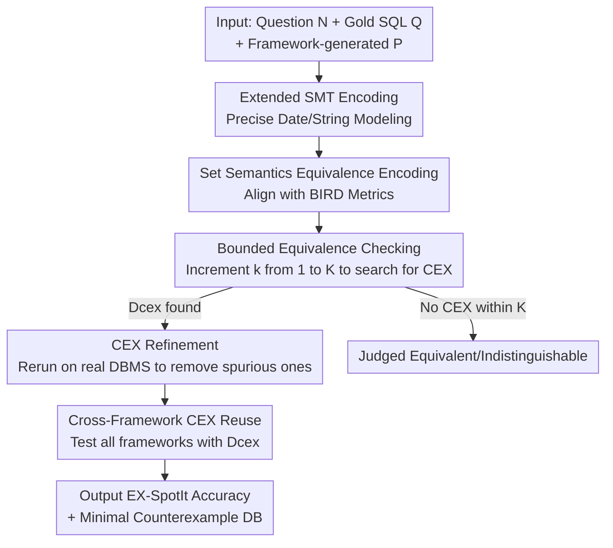

# SpotIt: Evaluating Text-to-SQL Evaluation with Formal Verification

**Conference**: ICLR2026  
**OpenReview**: [https://openreview.net/forum?id=iMkvR2ICSE](https://openreview.net/forum?id=iMkvR2ICSE)  
**Code**: To be confirmed  
**Area**: Code Intelligence / Text-to-SQL / Formal Verification  
**Keywords**: Text-to-SQL evaluation, Bounded equivalence checking, SMT encoding, Counterexample database, BIRD benchmark

## TL;DR
This paper points out that current Text-to-SQL evaluation, which relies on "comparing execution results on a single test database," is overly optimistic. It proposes SpotIt, which uses SMT-based bounded equivalence checking to actively search for a database that can distinguish the generated SQL from the gold SQL. On the BIRD benchmark, it reduced the accuracy of ten SOTA methods by 9.8%–13.5% and discovered that "mismatches are often due to errors in the gold SQL itself."

## Background & Motivation

**Background**: Text-to-SQL is a fundamental component for natural language data interfaces. Community evaluation platforms like BIRD and Spider rank various methods almost in real-time. These leaderboards serve as a bellwether for progress in the field, so "how to determine if a generated SQL is correct" directly dictates what researchers optimize for.

**Limitations of Prior Work**: The mainstream evaluation method is **test-based** Execution Accuracy (EX-TEST)—running both the generated SQL `P` and the human-annotated gold SQL `Q` on a **single static test database** $D_{test}$ and judging them correct if the result sets match. The problem is that two semantically non-equivalent queries might "luckily" return the same result simply because the test database happens to lack the data necessary to distinguish them. Thus, EX-TEST is **optimistic**—passing it does not guarantee true correctness.

**Key Challenge**: Determining whether two SQL queries are equivalent across **all** possible databases (unbounded equivalence) is generally undecidable. Consequently, researchers settle for testing on a single database. However, there is a fundamental gap between a "convenient test database" and a "true equivalence guarantee." Once the test database fails to cover the points of divergence, absolute accuracy and relative rankings on the leaderboard may become distorted.

**Goal**: (1) Provide a stricter evaluation pipeline that offers correctness guarantees superior to EX-TEST; (2) Quantify how much existing leaderboards overestimate performance and miscalculate rankings; (3) Use verification results to re-examine the flaws of the evaluation itself (e.g., errors in gold SQL, problem ambiguity).

**Key Insight**: Instead of passively trusting a static test database, one should **actively search for a database $D_{cex}$ that can distinguish `P` from `Q`**. Since unbounded equivalence is undecidable, the authors employ **bounded equivalence checking**—searching for counterexamples only within small-scale databases where "each table has at most $K$ rows." This is decidable, and small counterexamples are sufficient to expose issues.

**Core Idea**: Replace Text-to-SQL evaluation based on "comparing results on a fixed database" with "actively searching for counterexample databases using an SMT solver," and extend the validator to include string and date operators actually used in Text-to-SQL tasks.

## Method

### Overall Architecture

SpotIt is built upon the bounded equivalence checker VERIEQL. The core idea of VERIEQL is to encode the symbolic execution of two SQL queries, along with the condition "results are not equivalent," into an **SMT formula**. If the formula is satisfiable, it indicates the existence of a database where the results of the two queries differ (a counterexample $D_{cex}$); if unsatisfiable, the two queries are equivalent within the current bound.

However, the original VERIEQL lacks capabilities frequently required in Text-to-SQL: precise **date/string** encoding and implicit type conversion. Therefore, SpotIt first **extends the SMT encoding** (§4.1, Designs 1 & 2), then integrates the extended validator into a **three-stage evaluation pipeline** with **cross-framework counterexample reuse** (§4.2, Designs 3 & 4). The workflow is: given a question `N` and gold SQL `Q`, a Text-to-SQL framework generates `P`; bounded equivalence checking is performed with an incrementally increasing bound `k`; once a counterexample is found, it is cross-checked on a real DBMS to ensure it is not a "spurious counterexample"; finally, counterexamples collected from all frameworks are cross-tested to improve efficiency.

### Key Designs

**1. Precise SMT Encoding for Dates and Strings: Bridging the Gap for Real-world Operators**

The original VERIEQL crudely encodes dates as integer variables, which suffices for basic comparisons but fails for common Text-to-SQL operations like `STRFTIME` date formatting, `SubStr`, or `Like`/`PrefixOf`/`SuffixOf`. Strings and implicit type conversions (e.g., `1 + "a"`, `date("2000-01-01") + "1"`) were also unrepresentable. SpotIt decomposes a date into three integer variables `(year, month, day)` and uses constraint formulas to precisely characterize their values—years within the engine's range (0–9999 for SQLite), months $1\le m\le 12$, and days varying by month and leap year:

$$\Phi_3 = 1 \le d \;\wedge\; \big(\textstyle\bigvee_{c\in\{1,3,5,7,8,10,12\}} m=c \to d\le 31\big)\;\wedge\;\big(m=2 \to d\le 28+\mathrm{ite}(\mathrm{leap}(y),1,0)\big)\;\wedge\;\big(\textstyle\bigvee_{c\in\{4,6,9,11\}} m=c \to d\le 30\big)$$

Where $\mathrm{leap}(y)=\big(y\%4=0 \wedge (y\%100\ne 0 \vee y\%400=0)\big)$. Furthermore, it complements this with type conversions like `ToInt/ToDate/ToStr` and a set of string predicates. This step is crucial as it determines **how many questions the validator can cover**—without it, many queries involving dates/strings cannot be encoded into SMT.

**2. Equivalence Encoding under Set Semantics: Aligning with BIRD Evaluation Standards**

SQL equivalence checkers typically support bag or list semantics, but BIRD defaults to **set semantics** (comparing whether the **sets** of rows in two result tables are identical). SpotIt encodes "set equality = mutual inclusion" as SMT constraints: for result tables $R_1=[t_1,\dots,t_n]$ and $R_2=[r_1,\dots,r_m]$, it requires that every non-deleted tuple ($\neg \mathrm{Del}(t)$) in one table must have an equal non-deleted counterpart in the other. The paper provides and proves two theorems: Thm. 1 ensures that **symbolic execution is consistent with concrete execution**, and Thm. 2 ensures that the set semantics encoding correctly reflects table equivalence.

**3. Three-stage Search-Verify-Refine Pipeline: An Executable Algorithm for Finding Counterexamples**

This is the backbone of SpotIt. **① Input Stage**: The framework generates `P` for question `N`, which is fed in with gold `Q`. **② Verification Stage**: Bounded equivalence checking is performed iteratively for bound `k` from 1 to `K`. If equivalence is proved at `k`, `k` is incremented. If no counterexample is found up to `K`, it is judged "equivalent/indistinguishable within `K`." If non-equivalence is proved at some `k`, a candidate counterexample $D_{cex}$ is obtained. **③ Refinement Stage**: SMT encoding may use **over-approximation** for certain operators, or queries may have non-deterministic behavior, leading to **spurious counterexamples (CEX)**. Thus, `P` and `Q` are rerun on $D_{cex}$ using a real SQLite backend (checking $\neg\textsc{Ex-Test}(P,Q,D_{cex})$). Only if the results actually differ is the counterexample accepted.

**4. Cross-Framework Counterexample Reuse: Boosting Efficiency**

An observation is that as different frameworks are verified, a **collection of counterexample databases** that distinguish gold `Q` from various generated `P` is accumulated. These counterexamples often **generalize across frameworks**, as different models may commit similar common error patterns for the same gold SQL. SpotIt+ first runs the standard process for all frameworks to collect a set of counterexamples $D^*_{cexs}$, then performs a second pass where a framework's generated `P` is tested against counterexamples contributed by other frameworks. This treats every hard-won counterexample as a "public check case," further improving the ability to detect discrepancies (reducing accuracy by up to another 1%).

### An Example: Errors in the Gold SQL itself

Question N1 asks for the "birth date of the youngest patient with abnormal Ribonucleoprotein levels." The gold SQL's `WHERE` clause is written as `T2.rnp != '-' OR '+-'`. On the BIRD development database, this returns `1989-08-28`, matching the SQL generated by all ten frameworks, so EX-TEST judges them all correct. However, SpotIt finds a database where they differ: the string literal `'+-'` is treated as `FALSE` in a boolean context, so the condition simplifies to `T2.rnp != '-' OR FALSE`, which was not the author's intent. The **gold SQL itself is wrong**, but all ten frameworks happened to "correctly" reproduce the error or were judged correct by a lucky test case.

## Key Experimental Results

Experiments were conducted on all 1,533 question-SQL pairs in BIRD-dev, covering 11 domains. The targets were the top 10 open-source/accessible SOTA frameworks on the BIRD leaderboard. Bound limit $K=5$, with 600 seconds timeout per verification on a single core with 8GB RAM.

### Main Results: EX-TEST vs. EX-SpotIt Accuracy and Rankings

| Method | EX-TEST Acc.(%) | EX-TEST Rank | EX-SpotIt+ Acc.(%) | EX-SpotIt+ Rank |
|------|------|------|------|------|
| CSC-32B | 71.32 | 1 | 57.82 | 4 |
| GENA-2 | 70.53 | 2 | 59.13 | **1** |
| ALPHA | 69.36 | 3 | 55.02 | 6 |
| GENA-1 | 69.23 | 4 | 59.00 | 2 |
| CSC-7B | 69.17 | 5 | 57.95 | 3 |
| RSL | 67.67 | 6 | 55.80 | 5 |
| SLM | 63.43 | 10 | 50.98 | 10 |

Switching to SpotIt caused the accuracy of all methods to drop by 9.8%–13.5%. More importantly, the **rankings were reshuffled**: CSC-32B dropped from 1st to 4th, while GENA-2 rose to 1st. This suggests that test-based evaluation not only overestimates absolute scores but also distorts relative rankings. For CSC-32B, approximately 207 SQL statements passed the official test but were distinguished by SpotIt.

### Engine Coverage (Extended vs. Unextended)

| Method | SpotIt- (Original %) | SpotIt (Extended %) | Avg. Time (s) | CEX Validity (%) |
|------|------|------|------|------|
| CSC-32B | 84.83 | 94.88 | 3.24 | 94.46 |
| CHESS | 87.40 | 97.13 | 1.40 | 93.34 |
| ALPHA | 84.87 | 93.89 | 3.10 | 96.15 |

The date/string encoding extensions increased the coverage of encodable SQL pairs by about 10 percentage points. Average time for finding a counterexample was < 4 seconds, demonstrating practicality. The high CEX validity rate (up to 96.15%) indicates that the SMT encoding is sufficiently precise in practice.

### Key Findings

- **Mismatches often reveal gold SQL errors**: In a manual review of 50 samples for CSC-32B where results differed, the majority of discrepancies were caused by errors in the gold SQL, followed by model errors (26%) and problem ambiguity (10%).
- **Marginal Utility of bound $K$**: Increasing $K$ from 1 to 2 uncovers many more counterexamples, but gains diminish significantly after $K=3$. Thus, $K=5$ is a good balance between coverage and overhead.
- **Generalizability to complex benchmarks**: On 135 SQLite questions from Spider 2.0, SpotIt identified 16 and 8 "incorrectly passed" cases for OmniSQL and GPT-5, respectively. The primary bottleneck is the lack of support for operators like window functions (`OVER`).

## Highlights & Insights
- **"Evaluating the Evaluation"**: While most work focuses on improving models, this paper questions the "ruler" used to measure them. It provides provable answers using formal methods—a rare and valuable perspective.
- **Minimal CEX as Interpretability Tools**: Bounded verification guarantees that counterexample databases are minimal, making the source of discrepancy (date interpretation, `DISTINCT` usage, etc.) immediately obvious.
- **Efficiency via Reuse**: Cross-framework CEX reuse is a simple yet effective engineering trick that treats expensive SMT search results as a communal resource.

## Limitations & Future Work
- **Inherent Limitation of Boundedness**: Equivalence within $K$ does not grant global equivalence. It is theoretically possible to miss discrepancies that only appear in larger databases.
- **Incomplete Operator Coverage**: Lack of support for window functions (`OVER`) limits the support rate on complex benchmarks like Spider 2.0.
- **Dependence on Gold SQL**: The framework assumes the gold SQL is the ground truth. When the natural language question is ambiguous (10% of cases), binary equivalence checking becomes less meaningful.

## Related Work & Insights
- **vs. Test-based Eval (BIRD, Spider official metrics)**: These rely on a single static database (convenient but optimistic), while SpotIt actively searches for distinguishing databases (stricter with correctness guarantees).
- **vs. VERIEQL (He et al., 2024)**: VERIEQL is the base checker but lacks precise date/string modeling. SpotIt extends its SQL subset significantly to make it viable for real-world Text-to-SQL evaluation.
- **vs. Unbounded Equivalence Checking**: Unbounded checking is generally undecidable and supports a narrower SQL subset. Bounded checking trades completeness for decidability and the ability to generate small, readable counterexamples.

## Rating
- Novelty: ⭐⭐⭐⭐⭐ Unique perspective in applying formal verification to evaluate Text-to-SQL benchmarks.
- Experimental Thoroughness: ⭐⭐⭐⭐ Solid testing across 10 SOTA models and multiple benchmarks; restricted only by operator coverage.
- Writing Quality: ⭐⭐⭐⭐⭐ Clear progression from motivation to findings; well-explained theorems and examples.
- Value: ⭐⭐⭐⭐⭐ Directly addresses the trustworthiness of community leaderboards; highly adoptable by evaluation platforms.

<!-- RELATED:START -->

## Related Papers

- [\[ACL 2026\] PV-SQL: Synergizing Database Probing and Rule-based Verification for Text-to-SQL Agents](../../ACL2026/code_intelligence/pv-sql_synergizing_database_probing_and_rule-based_verification_for_text-to-sql_.md)
- [\[ACL 2026\] R$^3$-SQL: Ranking Reward and Resampling for Text-to-SQL](../../ACL2026/code_intelligence/r3-sql_ranking_reward_and_resampling_for_text-to-sql.md)
- [\[ICLR 2026\] Local Success Does Not Compose: Benchmarking Large Language Models for Compositional Formal Verification](local_success_does_not_compose_benchmarking_large_language_models_for_compositio.md)
- [\[ACL 2026\] PExA: Parallel Exploration Agent for Complex Text-to-SQL](../../ACL2026/code_intelligence/pexa_parallel_exploration_agent_for_complex_text-to-sql.md)
- [\[ACL 2025\] STaR-SQL: Self-Taught Reasoner for Text-to-SQL](../../ACL2025/code_intelligence/star-sql_self-taught_reasoner_for_text-to-sql.md)

<!-- RELATED:END -->
