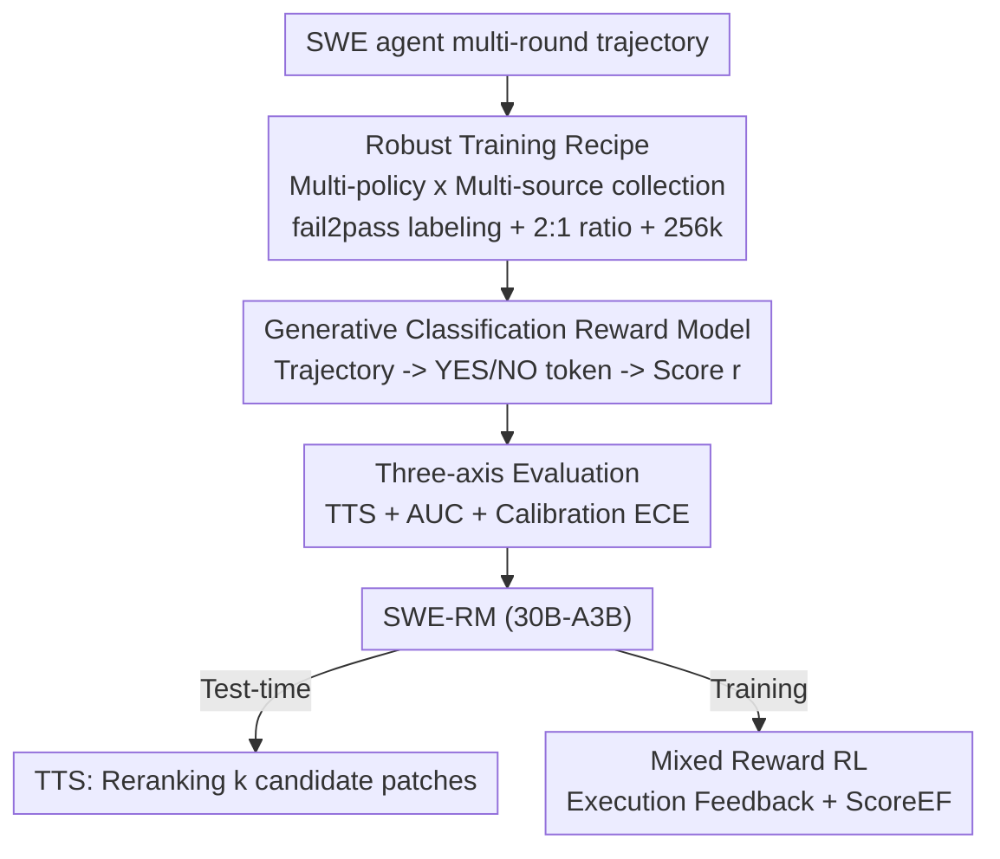

# SWE-RM: Execution-Free Feedback for Software Engineering Agents

**Conference**: ICLR 2026  
**OpenReview**: [https://openreview.net/forum?id=H9wMe1G76j](https://openreview.net/forum?id=H9wMe1G76j)  
**Code**: None  
**Area**: Code Intelligence / Agent / Reward Model / Reinforcement Learning  
**Keywords**: SWE Agent, Reward Model, Execution-Free Feedback, Calibration, Test-time Scaling

## TL;DR
This paper points out that "strong Test-Time Scaling (TTS) performance" does not guarantee that a reward model will be effective in reinforcement learning (RL). It proposes to evaluate reward models through three dimensions: **TTS + Discriminability (AUC) + Calibration (ECE)**. Based on this, it trains SWE-RM (30B-A3B), an execution-free reward model that improves Qwen3-Coder-Max from 67.0% to 74.6% (open-source SOTA) via TTS on SWE-Bench Verified, and provides an additional 3% gain when used as an RL reward compared to pure execution feedback.

## Background & Motivation
**Background**: When training software engineering (SWE) coding agents, feedback signals mainly come from two categories. One is **execution-based** validators, which run unit tests and provide signals based on pass/fail status, widely used for RL and TTS (e.g., Agentless, R2E-Gym, DeepSWE). The other is **execution-free** validators, essentially reward models that provide a continuous score for a trajectory without requiring a sandbox (e.g., SWE-Gym Verifier, OpenHands Critic).

**Limitations of Prior Work**: Execution-based feedback has two major drawbacks. First, **signals are sparse and binary**: only 0/1, making it impossible to distinguish between two successful (or unsuccessful) trajectories, which is unfriendly to fine-grained reward shaping in RL. Second, it **depends on high-quality unit tests**: tests extracted from real GitHub repositories are often too specific or irrelevant to the target issue, and model-generated tests lack rigorous verification, leading to a large amount of code data being unusable for training due to the lack of reliable tests.

**Key Challenge**: While execution-free reward models could provide continuous, fine-grained scores to alleviate these problems, they have been **under-explored** in the SWE scenario. Traditionally, only one metric is used to evaluate reward models: TTS (the ability to select the correct trajectory in best-of-k). However, the authors discovered a counter-intuitive phenomenon: **two validators with nearly identical TTS performance results in drastically different RL outcomes**—one leads to steady improvement, while the other causes the training to collapse (Figure 2). This indicates that TTS only characterizes "top-1 ranking ability" and misses properties essential for RL.

**Goal**: To determine which properties decide the effectiveness of a reward model in RL and to train a "versatile" reward model that performs well in both TTS and RL.

**Key Insight**: In RL, agents produce many near-correct or partially correct trajectories. A reward model must provide correct signals across the **entire distribution**, not just rank the best one first. Additionally, its score is treated as a "probability of correctness" to shape rewards; if the score is not well-calibrated (e.g., a normalized score of 0.9 actually has only a 60% probability of being correct), it toxicates reward shaping.

**Core Idea**: Complement the blind spots of TTS with **Discriminability (AUC)** and **Calibration (ECE)**. Using these three axes as training objectives, the authors systematically ablate data scale, positive-to-negative ratios, policy mixtures, data sources, and context lengths to develop SWE-RM.

## Method

### Overall Architecture
The goal of SWE-RM is to produce a "versatile" execution-free reward model. The input is a **complete multi-round trajectory** (screenshots, commands, patches, etc.) from an SWE agent, and the output is a continuous score $r\in[0,1]$, which can be used for reranking candidate patches (TTS) and as a dense reward in RL training. The pipeline consists of data generation, training format, model selection metrics, and application strategies.

The key methodological innovation lies not in the network architecture (using Qwen3-30B-A3B MoE as the base) but in the **evaluation criteria**: the authors first prove that relying solely on TTS leads to choosing the wrong reward model, then introduce AUC (discriminability) + ECE (calibration) to form a three-axis evaluation. This guidance is used for large-scale ablation to determine the training recipe. The resulting SWE-RM is used for TTS reranking and as a supplement to execution feedback to form a **mixed reward** for RL.

### Key Designs

**1. Generative Classification Reward Model: Converting "Trajectory Correctness" into the Probability of a Special Token**

Regarding how execution-free validators provide continuous scores, Ours adopts the generative classification paradigm from SWE-Gym but in a cleaner implementation. The model consumes the entire multi-round trajectory and is prompted to output a **single special token**: `YES` (issue resolved) or `NO` (not resolved). Training involves standard next-token prediction loss on this token. During inference, instead of taking a hard label, the log probabilities $l_y, l_n$ of the two tokens are read and normalized via softmax into a continuous reward:

$$r = \frac{\exp(l_y)}{\exp(l_y) + \exp(l_n)} \in [0, 1].$$

Thus, the reward model naturally provides its confidence in the trajectory's correctness rather than a rigid 0/1, which is the core advantage of execution-free feedback over execution feedback: it is **continuous and fine-grained**, distinguishing between multiple successful or failed trajectories.

**2. Three-axis Evaluation: TTS + Discriminability (AUC) + Calibration (ECE) for Proper RL Reward Model Selection**

This is the soul of the paper. The authors found that looking at TTS alone leads to wrong choices: in Figure 2, two validators with nearly identical TTS yield vastly different RL results. TTS only measures top-1 ranking ability, missing two essentials for RL. First is **Discriminability**—in RL, agents produce many near-miss trajectories; the validator must separate "resolved" from "unresolved" across the whole distribution to avoid noisy rewards. This is measured by **AUC** (the ROC area for binary classification of resolved vs. unresolved). Second is **Calibration**—RL treats the score as the probability of correctness; over/under-confidence misleads the policy. This is measured by **ECE (Expected Calibration Error)**, where lower is better.

The empirical evidence is compelling: two validators with almost the same TTS gain (+4.7% vs +4.5%) had an AUC difference of 0.095 (0.764 vs 0.669, Figure 3). In terms of calibration, one had ECE=0.077 and the other 0.210 (Figure 4); the latter frequently assigned low scores to resolved trajectories and high scores to unresolved ones, with heavily overlapping distributions. This "poor discriminability + lack of calibration" explains why TTS looked fine but gave misleading signals in RL. The three metrics are complementary: TTS for top-1 ranking, AUC for overall discriminability, and ECE for confidence reliability.

**3. Robust Training Recipe: Scaling, 2:1 Ratios, Mixed Policies, and 256k Context**

Using the three axes as a compass, the authors conducted large-scale ablations. **Data Scale**: Due to the massive output space of SWE interactions and OOD generalization challenges, TTS only increases stably with k when samples exceed 20k; fewer than 5k samples can lead to degradation (one wrongly scored trajectory ruins the resolve rate). Scale also significantly improves calibration—ECE at 500 samples is 0.481, seven times higher than at 100k samples (0.067). **Positive-to-Negative Ratio**: With a fixed total, a 2:1 ratio performed best across AUC/ECE/TTS. **Policy and Data Sources**: While on-policy data (sampled by Flash/Max) might be stronger in one aspect, **Mix-Policy** (including off-policy from Claude-3.5-Sonnet) is more stable and generalizes better. On data sources, SWE-rebench provides the highest quality, while SWE-smith and SWE-Gym improve calibration and amplify the scale effect. **Context Length**: While previous validators were capped at 32k, Ours extends to **256k** for the first time—only at 128k can 99%+ of trajectories be scored without truncation, which significantly improves TTS (RM@32 reaches 74.4% at 256k).

**4. Mixed Reward RL: Combining Execution-Free Continuous Scores with Execution Reliability**

How is SWE-RM used in RL? The authors use GSPO (more stable for MoE RL) to train Qwen3-30B-A3B, overlaying the execution-free score $\text{Score}_{EF}\in[0,1]$ onto execution results to form a mixed reward:

$$r(q,\tau_i)=\begin{cases}1+\text{Score}_{EF}, & \text{issue resolved}\\ -0.5+\text{Score}_{EF}, & \text{unfinished}\\ 0+\text{Score}_{EF}, & \text{else}\end{cases}$$

The intuition is: execution feedback provides a reliable "right/wrong" skeleton (preventing poor late-stage convergence due to unverified signals), while the execution-free score provides continuous fine-grained gradients within each interval (easing the sparsity/early-stopping issues of pure execution). This combination accelerates training and raises the performance ceiling.

### Loss & Training
The reward model is supervised using standard next-token prediction loss on the `YES`/`NO` special tokens. The base model is Qwen3-30B-A3B (MoE, 30B total / 3B active parameters). RL utilizes GSPO + verl/Megatron + SGLang rollout, with OpenHands as the agent scaffold. RL evaluation only uses greedy generation (pass@1) for a single trajectory.

## Key Experimental Results

### Main Results (TTS, SWE-Bench Verified, Table 4)
EB=Execution-based, EF=Execution-free; Metrics: AUC / ECE↓ / RM@32.

| Validator | Type | Flash AUC | Flash ECE | Flash RM@32 | Max RM@32 |
|-----------|------|-----------|-----------|-------------|-----------|
| Agentless | EB | - | - | 52.6% | 65.0% |
| SWE-Gym | EF | 0.776 | 0.223 | 51.2% | 65.4% |
| DeepSWE-EF | EF | 0.758 | 0.124 | 53.2% | 66.2% |
| **SWE-RM-30A3B** | EF | **0.783** | **0.051** | **62.0%** | **74.6%** |

Ours leads across all three metrics: Qwen3-Coder-Flash pass@1 improves from 51.6% to 62.0%, and Max from 67.0% to 74.6%, achieving a new open-source SOTA. It also performs best on OpenHands-LM-32B, showing cross-policy generalization.

### RL Results (pass@1, SWE-Bench Verified, Figure 7 + Table 5)

| Feedback Type | SWE-Bench Verified | Live(Lite) | Multilingual | Terminal Bench |
|---------------|--------------------|-----------|--------------|----------------|
| Mixed (SWE-RM + Exec) | **54.8%** | **22.4** | **35.7** | **32.5** |
| EF Only | - | 20.4 | 33.0 | 31.3 |
| Execution Only | 51.8% | 20.0 | 33.3 | 30.0 |
| Poorly Calibrated RM | Sudden Drop | 12.0 | 21.0 | 15.0 |

Mixed feedback outperforms pure execution by ~3% (54.8% vs 51.8%) and is faster and more stable. It is the best across four SWE tasks. **Reward models with poor calibration result in significant performance drops**, validating the importance of calibration.

### Ablation Study

| Configuration | Key Metric | Explanation |
|---------------|------------|-------------|
| 100k vs 500 samples | ECE 0.067 vs 0.481 | Scale difference in calibration is 7x; <5k leads to degradation with k |
| Ratio 2:1 vs 1:1 | RM@32 62.0% vs 60.8% | 2:1 is the best all-around and saves rare positive samples |
| Mix-Policy vs On/Off | ECE 0.033 Lowest | Mix-policy is more stable for generalization and calibration |
| Context 256k vs 32k | RM@32 74.4% vs 67.4% | 256k allows 100% of trajectories to be scored |

### Key Findings
- **TTS is an insufficient metric**: Two validators with nearly identical TTS had an AUC difference of 0.095 and a 3x difference in ECE, leading to success vs failure in RL.
- **Calibration is more critical than expected**: Using a poorly calibrated RM as an RL reward leads to significant drops across all downstream tasks.
- **Data scale supports both discriminability and calibration**: AUC and ECE improve with data volume, though gains diminish from 25k to 100k.

## Highlights & Insights
- **Redefining a "Good Reward Model"**: Decoupling "selecting the best" (TTS) from "providing reliable signals across the distribution" (AUC+ECE). This debunks the common assumption that TTS equals validator quality, an insight transferable to any scenario using RMs for RL (math, agents, multimodal).
- **Calibration as a First-class Citizen**: While many RM works only compare ranking/accuracy, this paper elevates ECE to the same level as performance, using reliability diagrams to visualize the "pitfalls" of treating scores as probabilities for reward shaping.
- **Practical Mixed Reward Design**: Using execution-free continuous scores within intervals provided by execution results creates a "skeleton + fine-grained gradient" structure that prevents collapse and accelerates training.
- **256k Long Context Scoring**: The first to extend execution-free validators to 256k, directly solving the bottleneck where complex trajectories exceed the window and cannot be scored.

## Limitations & Future Work
- **Weak late-stage convergence for pure EF**: The authors observed that pure SWE-RM feedback is fast initially but has poor terminal convergence due to unverified signals, thus still requiring execution feedback.
- **Reward Model base cost**: The 30B-A3B MoE validator requires continuous inference during RL training, entailing significant compute overhead not fully discussed.
- **Benchmarking focus on SWE-Bench**: While supplemental benchmarks were used, the focus remains on Python issue-fixing; generalization to broader SWE tasks (frontend, config, large refactoring) is not yet verified.
- **Trade-offs between the three axes**: AUC, ECE, and TTS are occasionally misaligned; choosing between them when they conflict still relies on empirical recipes rather than a unified objective function.

## Related Work & Insights
- **vs SWE-Gym Verifier**: Also a generative classification EF validator, but SWE-Gym only optimizes/evaluates TTS with a 32k context. Ours points out TTS is insufficient, adds AUC+ECE, and extends to 256k, outperforming in both TTS and calibration.
- **vs DeepSWE (Hybrid-TTS)**: DeepSWE uses a hybrid of execution and execution-free for test-time reranking. Ours is stronger on TTS and **first to integrate execution-free feedback into SWE agentic RL**, verifying it provides finer gradients than 0/1.
- **vs Math RLVR**: Math has ground-truth answers and clean rule-based rewards. SWE's execution feedback suffers from noisy tests and sparse signals; Ours bridges this gap with a well-calibrated execution-free reward.

## Rating
- Novelty: ⭐⭐⭐⭐⭐ Decisively analyzes the insufficiency of TTS, proposes the three-axis evaluation, and is first to bring EF feedback to SWE RL.
- Experimental Thoroughness: ⭐⭐⭐⭐⭐ Comprehensive ablations across scale, ratios, policies, and contexts + TTS/RL scenarios + multiple benchmarks.
- Writing Quality: ⭐⭐⭐⭐ Motivations are logically progressive with strong visualizations; some minor repetition in sections.
- Value: ⭐⭐⭐⭐⭐ Provides a reusable evaluation standard and training recipe for SWE agent reward modeling, achieving open-source SOTA.

<!-- RELATED:START -->

## Related Papers

- [\[ICLR 2026\] Ambig-SWE: Interactive Agents to Overcome Underspecificity in Software Engineering](ambig-swe_interactive_agents_to_overcome_underspecificity_in_software_engineerin.md)
- [\[ICLR 2026\] Process-Level Trajectory Evaluation for Environment Configuration in Software Engineering Agents](process-level_trajectory_evaluation_for_environment_configuration_in_software_en.md)
- [\[ICML 2025\] Training Software Engineering Agents and Verifiers with SWE-Gym](../../ICML2025/code_intelligence/training_software_engineering_agents_and_verifiers_with_swe-gym.md)
- [\[ICLR 2026\] BOAD: Discovering Hierarchical Software Engineering Agents via Bandit Optimization](boad_discovering_hierarchical_software_engineering_agents_via_bandit_optimizatio.md)
- [\[ICLR 2026\] Kimi-Dev: Agentless Training as Skill Prior for SWE-agents](kimi-dev_agentless_training_as_skill_prior_for_swe-agents.md)

<!-- RELATED:END -->
