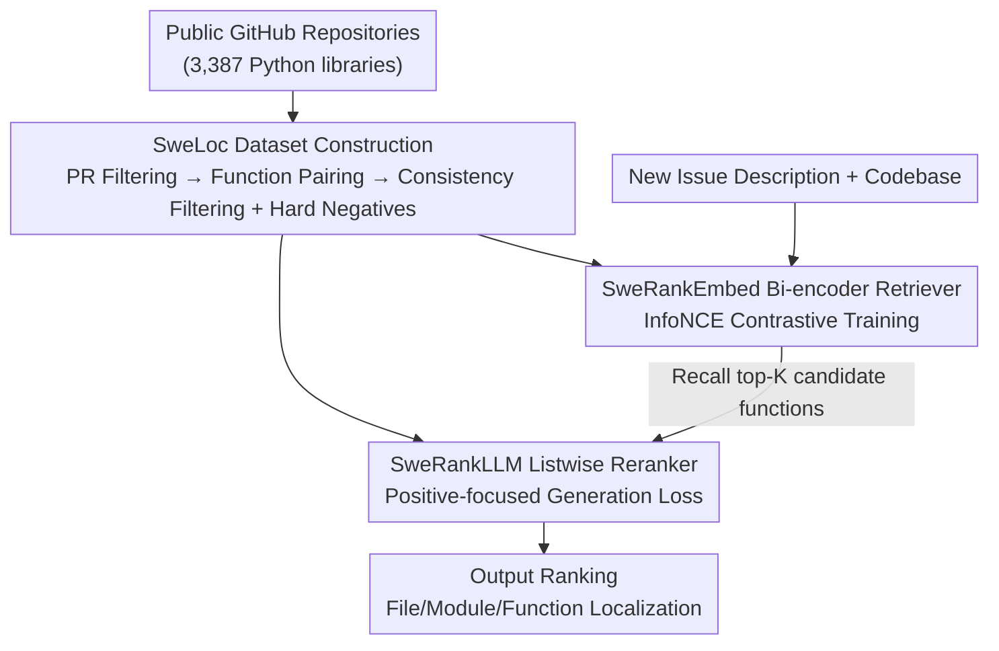

# SweRank: Software Issue Localization via Code Ranking

**Conference**: ICLR 2026  
**OpenReview**: [https://openreview.net/forum?id=OnkRqbNhe3](https://openreview.net/forum?id=OnkRqbNhe3)  
**Code**: https://github.com/SalesforceAIResearch/SweRank  
**Area**: Code Intelligence / Information Retrieval  
**Keywords**: Software Issue Localization, Code Ranking, Retrieve-and-Rerank, Contrastive Learning, Listwise Reranking

## TL;DR
SweRank reframes "finding functions to be modified based on bug reports" from expensive multi-step LLM agent reasoning into a one-time "retrieve-and-rerank" problem. By training a bi-encoder retriever (SweRankEmbed) and a listwise LLM reranker (SweRankLLM) on a self-constructed large-scale dataset, SweLoc, it achieves SOTA localization accuracy across file, module, and function granularities on SWE-Bench-Lite and LocBench at a significantly lower cost than Claude-3.5 agents.

## Background & Motivation
**Background**: Software issue localization is the first step in automated bug fixing. Given a natural language problem description (bug report or feature request), the goal is to precisely identify which files, classes, or functions should be modified within the entire codebase. If this step fails, even the strongest patch generation models are ineffective. Currently, the most prominent approach treats this as an agent reasoning problem, where an agent based on closed-source LLMs (e.g., Claude-3.5) iteratively issues commands like `read-file`, `grep`, or `traverse-graph` to explore the codebase and analyze dependencies.

**Limitations of Prior Work**: While agent-based methods are accurate, they are costly. They typically require 7–10 interaction rounds with an LLM, costing approximately \$0.66 per sample in API fees with high latency. Furthermore, agent trajectories are fragile; they rely heavily on temperature sampling and complex tool orchestration. A single error in the chain (e.g., a misleading intermediate query or incomplete code observation) can derail the entire localization process.

**Key Challenge**: An alternative, more efficient path is to treat localization as an information retrieval problem, using code ranking models to score and rank candidate code snippets based on relevance in a single pass. However, existing code ranking models are mostly trained for "query-to-code" (finding implementations by functionality) or "code-to-code" (finding semantically similar code). The queries in issue localization are fundamentally different: they are long and verbose (SWE-Bench issues average ~460 tokens, while CodeSearchNet queries average ~12 tokens), describing "observed erroneous behavior/system failures" rather than "desired functionality." Models trained on conventional code retrieval data fail to align this "failure description → erroneous code" mapping.

**Goal**: To create an issue localization framework that is both efficient (single-pass ranking using open-source models) and accurate (surpassing closed-source agents), while filling the training data gap with a large-scale dataset specifically characterizing the relationship between "verbose failure descriptions" and "buggy functions."

**Core Idea**: Replace multi-step agent reasoning with a classic "retrieve-and-rerank" architecture and train these ranking models on SweLoc, a dataset automatically constructed for issue localization. This allows the models to directly learn to align lengthy bug descriptions with the actual problematic functions.

## Method

### Overall Architecture
The core of SweRank involves two parallel tracks: data and modeling. The data track is **SweLoc**, which automatically mines "issue description ↔ function modified by the corresponding PR" pairs from public GitHub repositories. After consistency filtering and hard negative mining, it produces high-quality ⟨query, positive, negative set⟩ triplets. The modeling track is the **SweRank ranking framework**, employing a standard two-stage retrieve-and-rerank approach. The first stage, **SweRankEmbed** (bi-encoder retriever), encodes functions and issues into the same vector space to rapidly recall top-K candidates via cosine similarity. The second stage, **SweRankLLM** (listwise LLM reranker), processes the issue and the K candidates to produce a more precise ranking. Both components are fine-tuned on SweLoc using contrastive loss and a "positive-focused" listwise generation loss, respectively.

### Key Designs

**1. SweLoc: Automatically Refining GitHub "Repair History" into Localization Training Data**

To address the fundamental mismatch between existing code retrieval data and issue localization, the authors constructed SweLoc in three phases. First, **PR Filtering**: Starting from repositories corresponding to the top 11,000 PyPI packages, they selected those with at least 80% Python code, excluded repositories overlapping with SWE-Bench/LocBench to prevent data leakage, and deduplicated based on source code similarity, resulting in 3,387 repositories. Following the SWE-Bench methodology, they extracted PRs that resolved a linked issue and modified test files (indicating a verified fix), collecting issue descriptions and code snapshots from the PR base commit, totaling 67,341 (PR, codebase) pairs. Then, **Localization Processing**: The issue description serves as the query, each function modified in the PR acts as a positive example (generating N training samples if N functions were modified), and unmodified functions within the same codebase serve as negative sources.

The third phase—**Consistency Filtering + Hard Negative Mining**—is critical for data quality. Since issue descriptions in open-source repositories are often vague, they can introduce noisy labels. The authors use a pre-trained embedding model, CodeRankEmbed, to calculate the similarity between issue $t_i$, positive function $c_i$, and other functions $F_i$ in the library. They only retain samples where the positive example $c_i$ ranks within the top-$K$ ($K=20$) in $F_i$. If a positive function cannot even rank in the top 20 based on semantics, the sample is likely noise and is discarded. Simultaneously, they select hard negatives $B_i=\{c_j^-\}_{j=1}^{M}$ ($M=15$) by taking functions most similar to the query that were not actually modified, forcing the model to distinguish between "looks similar" and "is actually relevant." Ablations show $K=20$ balances quality and quantity, whereas no filtering ($K=\text{None}$) results in fine-tuned performance lower than the pre-trained model.

**2. SweRankEmbed: Aligning Verbose Bug Descriptions to Erroneous Functions via Contrastive Learning**

In the retrieval phase, the bi-encoder aims to quickly recall a small set of candidates from a large codebase. It encodes the issue and functions into dense vectors (using the last hidden state of the encoder) in a shared vector space. Training employs the InfoNCE contrastive loss: for a positive pair $(h_i, h_i^+)$, the goal is to make the similarity between issue vector $h_i$ and positive code vector $h_i^+$ higher than its similarity with other positives in the batch $h_k^+$ ($k\neq i$) and all hard negatives $h_{kj}^-$:

$$\mathcal{L}_{CL} = -\log\frac{\exp(h_i\cdot h_i^+)}{\sum_{h_k\in(H_B\cup H)}\exp(h_i\cdot h_k)}$$

The denominator sums over the positive example and $N(M{+}1)-1$ negatives (where $N$ is the number of positive pairs in a batch and $M$ is the number of hard negatives per issue), effectively treating "others' positives" and "self-mined hard negatives" as negatives. The SweRankEmbed-Small (137M, initialized by CodeRankEmbed) already outperforms previous 7B embedding models, while the Large version (7B, initialized by GTE-Qwen2-7B-Instruct) brings recall close to agent-level performance.

**3. SweRankLLM: Training Listwise Rerankers via "Focus-on-Positive"**

In the reranking phase, the goal is to precisely re-rank the top-K recalled candidates. Listwise reranking is superior to pointwise scoring because it considers the relative relevance of all candidates simultaneously. Typically, training a listwise LLM reranker requires a supervised target sequence of candidate indices from most to least relevant. However, SweLoc only identifies which sample is positive and does not provide a complete ranking among negatives.

Ours solves this by assigning numeric IDs (1 to $M+1$) to each function in the candidate set $c_i^+\cup\{c_{i,j}^-\}_{j=1}^{M}$. Let the positive ID be $I_i^+$. The model is **only trained to correctly generate the ID ranked at the first position**:

$$\mathcal{L}_{LM} = -\log\big(P_\theta(I_i^+\mid x)\big)$$

where $x$ is the input concatenated from the issue and the numbered candidate functions. A key detail: during training, **the EOS (End of Sentence) token is intentionally omitted** after predicting $I_i^+$. This preserves the model's ability to continue generating a full ranked list during inference. This modification allows any listwise reranker to be fine-tuned on issue localization data despite lacking full ranking labels. SweRankLLM-Small (7B) and Large (32B) achieve new SOTA localization accuracy across all three granularities.

## Key Experimental Results

### Main Results
The evaluation sets are SWE-Bench-Lite (retaining 274 samples with function changes) and LocBench (560 samples spanning bug reports, feature requests, security, and performance issues). The metric is Acc@k—localization is successful only if the top-k results **fully cover** all relevant code locations. File, module, and function granularities are evaluated.

Representative figures on SWE-Bench-Lite (rerankers use SweRankEmbed-Large as retriever):

| Type | Method | Model | File Acc@1 | Module Acc@5 | Function Acc@10 |
|------|------|------|-----------|--------------|-----------------|
| Agent | LocAgent | Claude-3.5 | 77.74 | 86.50 | 77.37 |
| Retriever | CodeRankEmbed (137M) | — | 52.55 | 71.90 | 58.76 |
| Retriever | GTE-Qwen2-7B (7B) | — | 65.33 | 76.28 | 70.44 |
| Retriever | **SweRankEmbed-Small (137M)** | Ours | 66.42 | 79.56 | 74.45 |
| Retriever | **SweRankEmbed-Large (7B)** | Ours | 72.63 | 84.31 | 82.12 |
| +Rerank | **SweRankLLM-Small (7B)** | Ours | 78.10 | 89.05 | 86.13 |
| +Rerank | **SweRankLLM-Large (32B)** | Ours | **83.21** | **90.88** | **88.69** |

Even the 137M SweRankEmbed-Small outperforms all previous 7B embedding models. SweRankEmbed-Large's function-level Acc@10 surpasses LocAgent (Claude-3.5). Combined with SweRankLLM, SOTA is achieved across all granularities (only surpassed by closed-source GPT-4o reranking). LocBench shows similar trends, with SweRank generalizing well to security/performance categories despite being trained primarily on bug reports.

### Ablation Study

| Configuration | Key Metric | Description |
|------|---------|------|
| Consistency Filtering $K=20$ | Best | Balance between quality and quantity |
| Relaxed $K$ (Larger) | Decrease | More samples but higher noise |
| No Filtering $K=\text{None}$ | Below Pre-trained | Noisy samples harm the model |
| Data Volume 5% → 100% | Monotonic Increase | Significant gains with only 5% data; more is better |

The "enhancement" capability of SweLoc (fine-tuning existing models, Func. Acc@10 before → after):

| Base Retriever | Pre-training Data | Acc@10 Change |
|-----------|-----------|-------------|
| CodeRankEmbed | English + Code | 59.5 → 72.3 (+12.8) |
| Arctic-Embed | English | 53.7 → 71.9 (+17.4) |
| Arctic-Embed-v2.0 | Multilingual | 62.0 → 70.1 (+8.1) |

### Key Findings
- **Data quality is more critical than quantity**: Consistency filtering is core; without it, fine-tuned models may underperform their pre-trained baselines.
- **Weaker baselines gain more**: Arctic-Embed (pure English) saw the largest gain (+17.4) when fine-tuned on SweLoc, suggesting SweLoc is a universal resource for boosting issue localization.
- **Cost-performance ratio crushes agents**: SWE-agent/OpenHands cost ~$0.46–$0.83 per sample with Claude-3.5, while SweRank uses open-source models for single-pass ranking, achieving higher accuracy at lower costs.
- **Effectiveness of "positive-focused" listwise training**: Training only on the first generated token and omitting EOS allows listwise rerankers to adapt to data lacking full ranking labels.

## Highlights & Insights
- **Revisiting Paridigms**: In an era of "agent-everything," Ours proves that for localization—essentially a ranking task—a well-trained "retrieve-and-rerank" pipeline is faster, more accurate, and cheaper, provided the data is right.
- **Transferable Listwise Trick**: The "supervise top-1 ID + omit EOS" method is applicable to any listwise reranking scenario where only positive labels are available.
- **Weak Supervision from PRs**: Using "PR modified test files" as a proxy for verified fixes to filter high-quality samples is an excellent way to mine the open-source ecosystem.
- **Effective Consistency Filter**: Using a pre-trained embedding model to "self-check" (discarding positives that can't rank in the top-K) is a low-cost de-noising strategy for weakly supervised labels.

## Limitations & Future Work
- **Primarily Bug Report Training**: While generalizing to LocBench, coverage for non-bug categories remains limited.
- **Python-Only**: Data is limited to Python; cross-language (Java, C++, Rust) transferability is not yet verified.
- **Function Granularity Ceiling**: Success is defined as locating the modified function, but real fixes can be spread across multiple files/functions. Single-pass ranking may struggle with such dispersed localization compared to multi-hop agents.
- **Recall Dependency**: Reranking is bounded by the retriever's top-K recall. If the correct function is not recalled, the reranker cannot fix it.

## Related Work & Insights
- **vs. LocAgent / SWE-agent / OpenHands (Agent Path)**: Agents rely on multi-turn LLM commands for multi-hop reasoning; they are accurate but slow, expensive, and fragile. SweRank flattens localization into a single-pass ranking, significantly reducing cost and latency while maintaining robustness.
- **vs. CodeRankEmbed / CodeRankLLM (General Code Ranking)**: These are trained for query-to-code/code-to-code and do not account for verbose, failure-oriented bug reports. By initializing with these models and fine-tuning on SweLoc, SweRank significantly outperforms them on localization tasks.
- **vs. Traditional Spectral Localization / Program Analysis (SFL, Slicing)**: Traditional methods rely on test coverage and structural stats, requiring precise program models and missing natural language context. SweRank leverages the rich linguistic signal in bug reports.

## Rating
- Novelty: ⭐⭐⭐⭐ The framework is classic retrieve-and-rerank, but the combination of targeted data generation and the single-positive listwise training trick is highly effective.
- Experimental Thoroughness: ⭐⭐⭐⭐⭐ Comprehensive comparison across two benchmarks, three granularities, cost-performance metrics, and multidimensional ablations.
- Writing Quality: ⭐⭐⭐⭐ Clear motivation, well-explained methodology, and strong illustrative support.
- Value: ⭐⭐⭐⭐⭐ The SweLoc dataset and open-source models are tangible resources for the community with immediate industrial applicability.

<!-- RELATED:START -->

## Related Papers

- [\[ICLR 2026\] Improving Code Localization with Repository Memory](improving_code_localization_with_repository_memory.md)
- [\[ACL 2026\] Learning Adaptive Parallel Execution for Efficient Code Localization](../../ACL2026/code_intelligence/learning_adaptive_parallel_execution_for_efficient_code_localization.md)
- [\[ACL 2026\] R$^3$-SQL: Ranking Reward and Resampling for Text-to-SQL](../../ACL2026/code_intelligence/r3-sql_ranking_reward_and_resampling_for_text-to-sql.md)
- [\[ICLR 2026\] From Assistant to Independent Developer — Are GPTs Ready for Software Development?](from_assistant_to_independent_developer_are_gpts_ready_for_software_development.md)
- [\[ICLR 2026\] Ambig-SWE: Interactive Agents to Overcome Underspecificity in Software Engineering](ambig-swe_interactive_agents_to_overcome_underspecificity_in_software_engineerin.md)

<!-- RELATED:END -->
