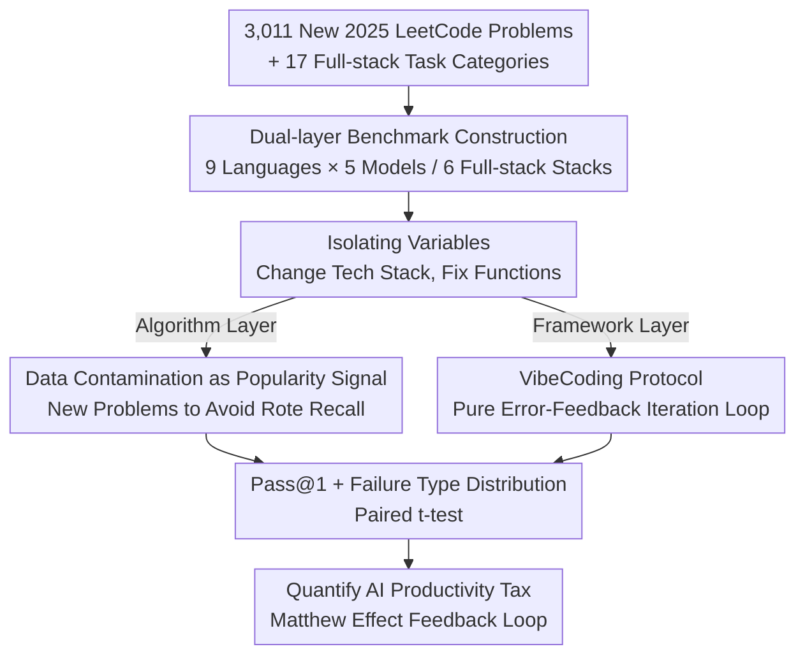

# The Matthew Effect of AI Programming Assistants: A Hidden Bias in Software Evolution

**Conference**: ICLR 2026  
**OpenReview**: [https://openreview.net/forum?id=QjkJdcbSDe](https://openreview.net/forum?id=QjkJdcbSDe)  
**Code**: None  
**Area**: Code Intelligence / Empirical Study / AI Programming Assistants  
**Keywords**: Matthew Effect, AI Programming Assistants, Language Popularity, Framework Selection, Training Data Bias

## TL;DR
This paper conducts a large-scale empirical study using 130,000+ code generation requests and hundreds of full-stack framework tasks. It quantifies how AI programming assistants yield significantly higher success rates for mainstream languages and frameworks compared to niche technologies. This reveals a feedback loop consistent with the "Matthew Effect"—ecosystems with abundant data receive superior AI support, further reinforcing their dominant status.

## Background & Motivation
**Background**: LLMs have permeated the daily routines of nearly all developers, giving rise to two new paradigms: "vibe coding" (iterating with prompts rather than line-by-line coding) and "agentic coding" (autonomous agents performing end-to-end planning and execution). The academic community has generally remained optimistic that LLMs would act as the "Great Equalizer," narrowing the skill gap for junior developers and making specific syntax irrelevant.

**Limitations of Prior Work**: Past research has almost exclusively focused on "short-term, micro" evaluations—measuring model performance on narrow benchmarks or single-language datasets, with a focus on prompt design and code quality. However, the long-term, ecosystem-level impact of LLM-driven development on software engineering's "iterative dynamics" has lacked systematic study. Scattered observations suggest a serious issue: StarCoder's training corpus is nearly 40% Python, with many languages relegated to the margins; AI assistants show a 48% completion rate for NumPy and a 58% preference for Python in performance-sensitive tasks (even when Rust is objectively more suitable).

**Key Challenge**: LLMs are trained on massive public datasets; their capabilities are naturally proportional to the exposure a language or framework receives in that corpus. This creates a fundamental tension: Are AI assistants "lowering barriers and empowering innovation," or are they "unintentionally reinforcing existing dominant hierarchies"? The "Great Equalizer" hypothesis—that syntax will become irrelevant—has never been empirically tested.

**Goal**: This paper breaks down the problem into two layers for quantification: (1) Language level: Does popularity predict the success rate of AI code generation? (2) Framework level: Even when a niche technology is more suitable for a scenario, does the AI still lean towards mainstream stacks?

**Key Insight**: The authors use a "controlled variable" approach to isolate the "popularity" factor. They cleverly treat "data contamination" (the overlap between test tasks and training corpora) as a direct signal of popularity. By deliberately choosing LeetCode problems released in 2025, they suppress "rote recall" while aligning contamination gaps with contemporary popularity trends, thereby establishing a clear causal chain: "Popularity $\rightarrow$ Training Coverage $\rightarrow$ AI Performance."

**Core Idea**: Construct the first "Algorithm Task $\times$ Framework Task" dual-layer benchmark to prove the existence of a "rich-get-richer" Matthew Effect in AI programming assistants, where a measurable "AI productivity tax" is highly correlated with ecosystem popularity.

## Method

### Overall Architecture
The paper does not propose a new model but designs a **dual-layer empirical evaluation pipeline** to answer whether AI assistants amplify popularity hierarchies. The system consists of two parallel tracks: The upper track is the **language-level algorithm task**—3,011 LeetCode problems across 9 languages are processed using 5 commercial LLMs, cleaned into executable code, and submitted to the LeetCode evaluation system, with Pass@1 as the primary metric. The lower track is the **framework-level full-stack task**—using three real-world AI programming tools (Cursor, Copilot, CodeBuddy) under a strict VibeCoding protocol to implement CRUD and high-concurrency applications across 6 mainstream full-stack combinations and various "technical forks," using "required iterations / completion status" as metrics. Both layers isolate popularity by "changing the tech stack while keeping functional requirements constant."

### Key Designs

**1. Dual-layer benchmark building: Algorithms as "canaries in the coal mine", Frameworks for "architectural judgment"**

A single evaluation layer cannot capture ecosystem bias: pure algorithm problems lack real-world engineering, while pure framework tasks introduce too much noise. The authors construct the first dual-layer benchmark. The algorithm layer selects 9 languages (spanning mainstream to niche based on the June 2025 TIOBE index: Python, C++, C, Java, JavaScript, Go, Rust, Erlang, Racket). It crawls 3,011 problems (765 easy, 1,526 medium, 720 hard) from LeetCode, resulting in $3011 \times 9 \times 5 = 135{,}495$ generation requests. This serves as the "canary": if basic logic fails to compile, complex engineering is impossible. The framework layer uses two levels: "General CRUD" via 6 mainstream stacks (Vue+Spring, React+Express, Django, etc.) to establish a baseline, and "Technical Forks" where architectural trade-offs are forced (e.g., Go/Rust should be better for high concurrency) to test if models can overcome popularity bias.

**2. Isolating popularity with controlled variables: Tech stack changes, functional requirements fixed**

To strip "popularity" from "task difficulty" and "model capability," all other variables must be fixed. The authors apply a **unified core method**: in the algorithm layer, the same problem is formatted with consistent prompt templates, switching only the target language. In the framework layer, the same functional requirement (e.g., a "Library Management System") is implemented across 6 stacks, with prompts changing only the tech stack and providing no additional syntax or architectural guidance. Consequently, differences in success rates can only be attributed to the training exposure of the technology.

**3. Data contamination as a direct signal: Selecting 2025 problems**

How can "popularity" be objectively measured? The authors utilize "data contamination"—usually seen as a flaw—as a signal. A technology's representation in the training corpus is characterized by the "overlap between test tasks and training data." By selecting only new 2025 LeetCode problems, the models are prevented from "rote recall" of widely circulated old problems. This ensures that observed "contamination gaps" align with **contemporary** trends rather than historical remnants, establishing a clear causality: Language Popularity $\rightarrow$ Training Data Coverage $\rightarrow$ AI Performance.

**4. VibeCoding protocol: Autonomous iteration loop with raw error feedback**

The framework layer measures the "AI's ability to complete a job autonomously," which requires excluding human error correction. The authors designed a strict VibeCoding protocol: using Agent/Auto modes of Cursor (Claude-4-Sonnet), CodeBuddy (Claude-4-Sonnet), and Copilot (GPT-5). Initial prompts provide only functional requirements and tech stacks. Throughout the experiment, **no code is manually written, no architecture input is provided, and no errors are corrected by humans**. The only allowed interaction is feeding back the **raw, unedited error messages** from dependency installation, compilation, or runtime back into the dialogue to trigger automatic debugging until completion or the iteration limit is reached.

## Key Experimental Results

### Main Results (Algorithm Layer Pass@1, Selection)

| Model | Python | C++ | Java | Go | Rust | Erlang | Racket |
|------|--------|-----|------|-----|------|--------|--------|
| DeepSeek-V3 | 79.81% | 78.81% | 79.38% | 76.82% | 71.24% | 24.31% | 20.82% |
| Gemini-2.5-Flash | 67.92% | 68.65% | 68.65% | 50.22% | 51.81% | 1.26% | 17.10% |
| Gemini-2.0-Flash | 62.94% | 64.26% | 65.86% | 55.90% | 50.38% | 0% | 11.06% |
| GPT-4o-mini | 41.98% | 41.68% | 45.50% | 39.22% | 24.05% | 1.16% | 1.99% |
| Qwen3-Turbo | 37.00% | 30.22% | 32.55% | 33.15% | 2.19% | 0% | 3.25% |

Mainstream languages (Python/JS/Java/C/C++) generally exceed 60% Pass@1 on top models, while Erlang/Racket often fall below 25% or even approach 0%. **Language popularity is a better predictor of success than model capability itself.**

### Key Findings
- **Difficulty Amplification Effect**: The gap widens non-linearly with problem difficulty. In Easy problems, the mainstream vs. niche gap is 45–82 percentage points; for Hard problems, it expands to 58–95 points. In Hard problems, mainstream languages achieve 50–63%, while niche languages scores only 0–6%.
- **Failure Mechanism**: Mainstream language failures are often "Wrong Answer" or "Runtime Error" (logical slips). Niche language failures are dominated by **Compile Error**—the models cannot even produce syntactically correct code, indicating that insufficient training exposure prevents the internalization of basic coding idioms.
- **Framework Matthew Effect**: Vue+Spring and Django typically resolve tasks within 1–3 attempts. Svelte+FastAPI and SolidJS+Actix have much higher failure rates, often requiring >5 attempts or failing entirely. Even when Go/Rust should be superior for high concurrency, models lean toward Python/JS solutions.
- **Cost of Convergence**: Mainstream stacks (A) usually converge in 1–2 rounds of correction; niche/emerging stacks (C) often require 5–10 rounds of guidance just to run—ecosystem popularity dominates the reliability of AI-generated code.

## Highlights & Insights
- **Inverting "Data Contamination" as a Signal**: Instead of trying to eliminate contamination, the authors use it as a probe for language popularity. Choosing 2025 problems to anchor contemporary trends is a brilliant methodological stroke.
- **Failure Distribution Insight**: The contrast between Compile Errors in niche languages and Wrong Answers in mainstream ones is profound. it identifies the root of the bias as "failing to learn syntax" rather than a lack of "logical strength."
- **Transferable Dual-Indicator Design**: Using algorithms for "lower bound" detection and frameworks for "autonomous cost" creates a robust framework for evaluating agent reliability in long-tail domains.
- **Purity of the VibeCoding Protocol**: Zero manual coding and feeding back only raw errors eliminates the most significant confounding variable: "human implicit error correction."

## Limitations & Future Work
- **Causality Challenge**: Isolating "AI-specific amplification" from "existing structural bias" remains an open question; the paper measures an "AI productivity tax" but cannot prove AI is the sole cause of ecosystem shifts.
- **LeetCode Representativeness**: Algorithm problems are "canaries" and do not cover full software complexity; high compile error rates are a necessary but not sufficient signal of capability.
- **Framework Sample Size**: 17 tasks per stack is relatively small, and "iteration count" as a metric has inherent subjectivity compared to the algorithm layer's 130,000+ requests.
- **Future Directions**: Introducing issue/PR-level tasks from real open-source projects and performing quantitative regressions on training corpus proportions would strengthen the causal narrative.

## Related Work & Insights
- **vs HumanEval / Copilot Evals**: Previous work noted popularity correlations but with small problem sets and few languages. This work scales to 3,011 problems and 9 languages with 130,000+ requests.
- **vs XCODEEVAL**: Large-scale multilingual benchmarks often contain noise from automated collection; this paper focuses on "how popularity impacts performance" as a controlled variable.
- **vs AgentBench**: This study extends the concern of closed-source model dominance and agent reasoning to the ecosystem level, providing empirical evidence for the feedback loop in software evolution.

## Rating
- Novelty: ⭐⭐⭐⭐ 
- Experimental Thoroughness: ⭐⭐⭐⭐ 
- Writing Quality: ⭐⭐⭐⭐ 
- Value: ⭐⭐⭐⭐⭐ 

<!-- RELATED:START -->

## Related Papers

- [\[ICLR 2026\] InnoGym: Benchmarking the Innovation Potential of AI Agents](innogym_benchmarking_the_innovation_potential_of_ai_agents.md)
- [\[ICML 2026\] Physics Is All You Need? A Case Study in Physicist-Supervised AI Development of Scientific Software](../../ICML2026/code_intelligence/physics_is_all_you_need_a_case_study_in_physicist-supervised_ai_development_of_s.md)
- [\[ICLR 2026\] Multi-LCB: Extending LiveCodeBench to Multiple Programming Languages](multi-lcb_extending_livecodebench_to_multiple_programming_languages.md)
- [\[ACL 2025\] Tree-of-Evolution: Tree-Structured Instruction Evolution for Code Generation in Large Language Models](../../ACL2025/code_intelligence/tree_of_evolution_code_gen.md)
- [\[ACL 2026\] From If-Statements to ML Pipelines: Revisiting Bias in Code-Generation](../../ACL2026/code_intelligence/from_if-statements_to_ml_pipelines_revisiting_bias_in_code-generation.md)

<!-- RELATED:END -->
