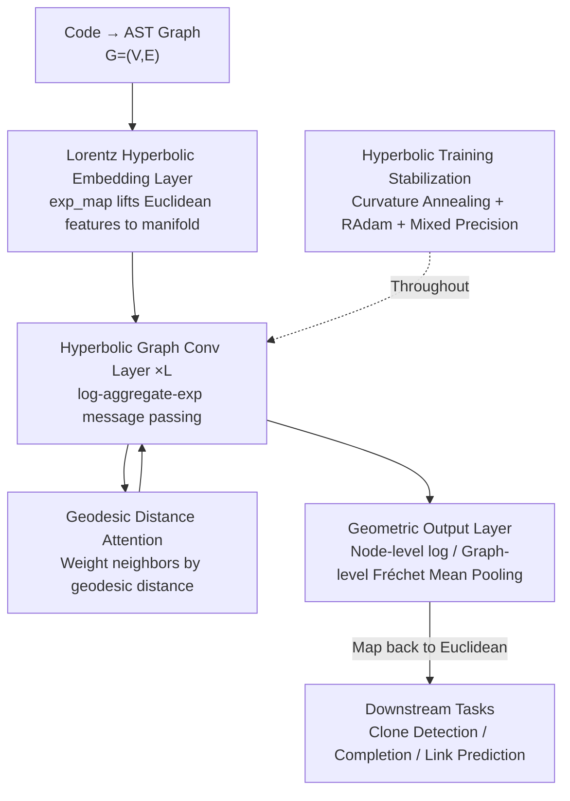

# The Natural Geometry of Code: Hyperbolic Representation Learning for Program Reasoning

**Conference**: ICLR 2026  
**OpenReview**: [https://openreview.net/forum?id=oq4jXWaFyH](https://openreview.net/forum?id=oq4jXWaFyH)  
**Code**: None  
**Area**: Code Intelligence / Graph Representation Learning / Hyperbolic Geometry  
**Keywords**: Hyperbolic Representation Learning, Lorentz Model, Abstract Syntax Tree, Graph Neural Network, Program Reasoning

## TL;DR
This paper argues that the "natural geometry" of code is hyperbolic space. It proposes HypeCodeNet, a graph neural network operating natively on the numerically stable Lorentz model. Using hyperbolic embedding layers, tangent-space message passing, and geodesic attention, it learns low-distortion hierarchical representations for ASTs. HypeCodeNet outperforms Euclidean models across clone detection, code completion, and link prediction tasks, achieving parity with a 768-dimensional SOTA using only 32 dimensions.

## Background & Motivation

**Background**: From sequence models like CodeBERT and CodeT5 to graph-aware models like GraphCodeBERT and UniXcoder that introduce data flow graphs, mainstream code representation methods embed source code structures into **Euclidean space**. While incorporating structural information provides gains, these models are fundamentally built on the assumption that "Euclidean geometry can faithfully represent code structure."

**Limitations of Prior Work**: The Abstract Syntax Tree (AST) of source code is inherently a **tree-like structure**, where the number of nodes grows exponentially with depth. However, the volume of Euclidean space only grows **polynomially** with its radius. Forcing an exponentially expanding tree into a polynomially expanding space inevitably results in high representation distortion. Classical results like Bourgain's Theorem show that such distortion "flattens" tree hierarchies, obscuring critical semantic information such as variable scope and logical nesting. Increasing dimensions only mitigates this; it cannot eliminate the geometric bottleneck.

**Key Challenge**: There is a fundamental geometric mismatch between the **exponential growth** of code hierarchies and the **polynomial growth** of Euclidean volume. The issue lies not in the network architecture's capacity, but in the **choice of the representation space itself**.

**Goal**: To find a representation space that "naturally matches" the geometric hierarchy of code and to build an end-to-end, general-purpose code representation framework applicable to various program reasoning tasks.

**Key Insight**: The volume of hyperbolic space (a manifold with constant negative curvature) grows **exponentially** with its radius, perfectly mirroring the exponential growth of nodes in a tree. This property allows for embedding hierarchical structures with extremely low distortion—a phenomenon repeatedly validated in NLP and CV for hierarchical data modeling, but remaining largely unexplored for source code (prior work only covers narrow tasks like code retrieval or software evolution, lacking a general end-to-end framework).

**Core Idea**: Use **hyperbolic geometry instead of Euclidean geometry** as the foundation for code representation. Construct a native hyperbolic GNN (HypeCodeNet) on the numerically stable Lorentz model to preserve the AST's hierarchical structure with low distortion.

## Method

### Overall Architecture

The core challenge HypeCodeNet addresses is how to maintain representation learning **entirely within the hyperbolic manifold** rather than projecting back and forth from Euclidean space. The workflow is: parse code into an AST graph $G=(V,E)$; use a **hyperbolic embedding layer** to "lift" the initial Euclidean features of each node onto the Lorentz manifold; stack multiple **hyperbolic graph convolutional layers** that follow the "log → aggregate → exp" paradigm for message passing and geodesic attention in the tangent space; finally, use a **geometric output layer** to map representations back to Euclidean space (via log mapping for node-level tasks or Fréchet mean pooling for graph-level tasks) for classification. Throughout the process, **hyperbolic training stabilization** techniques (curvature annealing, Riemannian Adam, mixed precision) are employed to prevent numerical instability.

### Key Designs

**1. Lorentz Model Hyperbolic Embedding Layer: Stably lifting Euclidean features to a negative curvature manifold**

To perform deep learning in hyperbolic space, one must choose a numerically stable model. While the Poincaré ball is common, it is unstable near the boundary. This paper adopts the **Lorentz model**: a $d$-dimensional manifold defined as $\mathcal{L}^d_c = \{x \in \mathbb{R}^{d+1} \mid \langle x,x\rangle_{\mathcal{L}} = 1/c,\ x_0>0\}$, where $\langle x,y\rangle_{\mathcal{L}} = -x_0 y_0 + \sum_i x_i y_i$ is the Lorentz inner product and $c<0$ is the curvature. The geodesic distance between two points is $d_c(u,v) = \frac{1}{\sqrt{-c}}\,\mathrm{arcosh}(c\langle u,v\rangle_{\mathcal{L}})$.

The embedding layer maps Euclidean features $x^E_v$ (from BPE tokenization) to the manifold. It first applies an MLP to get $z^E_v = \mathrm{MLP}(x^E_v)$, then uses a mapping $\iota_{o_c}$ to place it in the tangent space at the origin $o_c=(1/\sqrt{-c},0,\dots,0)$, and finally applies the exponential map $\exp^c_{o_c}$ to project the vector onto the manifold: $h^{(0)}_v = \exp^c_{o_c}(\gamma\cdot\iota_{o_c}(\mathrm{MLP}(x^E_v)))$. A key trick is using a small coefficient $\gamma\approx 10^{-2}$ to ensure initial node positions are **near the origin**, avoiding the manifold edges where vanishing gradients and numerical explosions occur.

**2. log-aggregate-exp Hyperbolic Graph Convolution: Linear algebra in tangent space**

Curved manifolds lack a global vector space, so neighbor representations cannot be added directly as in Euclidean GNNs. The core mechanism is the "**log → aggregate → exp**" paradigm: for a central node $v$, the logarithmic map $\log^c_{h^{(l)}_v}$ projects each neighbor $h^{(l)}_u$ into the local tangent space of $v$, yielding Euclidean vectors $m^{(l)}_{u\to v} = \log^c_{h^{(l)}_v}(h^{(l)}_u)$. These vectors represent geodesic paths from $v$ to $u$, transforming geometric relationships into standard linear algebra. After aggregation, the update is projected back to the manifold via $h^{(l+1)}_v = \exp^c_{h^{(l)}_v}(\hat{m}^{(l)}_v)$.

This design integrates standard GNN components in a "geometrically correct" manner: self-loops are realized by including the node itself in the neighborhood $N^+(v)$ (where $\log^c_{h_v}(h_v)=0$); the exponential map naturally acts as a **residual connection** by applying updates relative to the current position $h^{(l)}_v$; and LayerNorm is applied to aggregated messages to stabilize magnitudes. The complexity per layer is $O(|E|d + |V|d^2)$, which is fully parallelizable on GPUs.

**3. Geodesic Distance Attention: Using "structural proximity" as a natural inductive bias**

To determine neighbor weights during aggregation, this paper uses multi-head attention where scores are based directly on **geodesic distance**: the score for nodes $u,v$ in head $k$ is $e^{(k)}_{uv} = -\,d_c(h^{(l)}_u,h^{(l)}_v)^2/\sigma_k$, where $\sigma_k$ is a learnable temperature. These are normalized via softmax to $\alpha^{(k)}_{uv}$.

The elegance of this design is that attention weights are no longer based solely on learned similarity but instead encode the inductive bias that **geodesic proximity implies structural relevance**. In hyperbolic space, hierarchically close AST nodes have smaller geodesic distances, allowing attention to naturally focus on structurally related nodes—a hierarchical prior that is difficult for Euclidean attention to express explicitly.

**4. Hyperbolic Training Stabilization & Geometric Pooling**

Hyperbolic deep networks are sensitive to numerical precision. This paper utilizes several strategies. **Curvature Annealing**: Curvature $c$ is a trainable parameter initialized near zero (e.g., $-10^{-6}$) to mimic Euclidean geometry initially, then annealed toward $-1$. Since the Lorentz model smoothly collapses to Euclidean space as $c\to 0^-$, this provides a stable learning trajectory. **Riemannian Adam**: Standard Adam is curvature-unaware; RAdam calculates gradients in the correct tangent space and uses parallel transport to move momentum buffers, ensuring faster and more stable convergence. **Mixed Precision**: Geodesic operations use FP64 to prevent overflows/underflows, while linear transformations use FP32 for efficiency.

At the output, node-level tasks project back via the origin log map $z^{out}_v = \log^c_{o_c}(h^{(L)}_v)$. For graph-level tasks, simple averaging is undefined; thus, the **Fréchet Mean**—the geometric generalization of the mean on Riemannian manifolds—is calculated iteratively. This ensures the pooled graph representation is not distorted by Euclidean averaging.

### Loss & Training
The model is implemented using Geoopt (PyTorch) with a hidden dimension of 768. The optimizer is RAdam with a learning rate of $5\times10^{-5}$ and linear warmup. Specific losses for clone detection, completion, and link prediction follow standard formulations (detailed in Appendix D of the original paper). 

## Key Experimental Results

### Main Results

HypeCodeNet sets new performance standards across three categories of program reasoning tasks. Its advantage is most prominent in **Clone Detection** on BigCloneBench, which requires deep semantic understanding of Type-3/4 clones:

| Task | Dataset | Metric | Ours | Prev. SOTA (CodeFORMER) | Gain |
|------|--------|------|------|------|------|
| Clone Detection | BigCloneBench (Java) | F1 | **0.940** | 0.928 | +0.012 |
| Clone Detection | POJ-104 (C/C++) | Accuracy | **0.981** | 0.974 | +0.007 |
| Code Completion | CodeXGLUE Python | Accuracy | **45.0** | 44.0 | +1.0 |
| Code Completion | CodeXGLUE Java | Accuracy | **42.2** | 41.4 | +0.8 |
| Link Prediction | GitHub Java Call Graph | AUC | **0.965** | 0.915 | +0.050 |
| Link Prediction | GitHub Java Call Graph | Hits@10 | **0.820** | 0.768 | +0.052 |

In **Link Prediction**, HypeCodeNet outperforms the runner-up by 5 AUC points. Since call graphs are highly hierarchical, this "qualitative leap" suggests that the correct geometric inductive bias is transformative for structural reasoning.

### Ablation Study
Breakdown of performance on BigCloneBench (F1):

| Configuration | F1 | Description |
|------|----|----|
| Full Model | 0.940 | Complete model |
| HypeCodeNet-Euclidean | 0.923 | Replacing hyperbolic operators with Euclidean |
| w/o Geodesic Attention | 0.932 | Removing distance-based attention |
| w/o Curvature Annealing | 0.935 | Removing annealing strategy |
| dim=32 | 0.928 | Equaling 768-dim CodeFORMER with only 32 dims |
| dim=128 | 0.938 | Surpassing all rivals at 128 dims |

### Key Findings
- **Geometry is the Primary Driver**: Switching to Euclidean operators (HypeCodeNet-Euclidean) drops F1 from 0.940 to 0.923, reverting to baseline levels. This proves gains stem from the hyperbolic geometry rather than architecture complexity.
- **Low-dimensional Efficiency**: The model achieves parity with SOTA at 32 dimensions (0.928). Because hyperbolic volume grows exponentially, it can accommodate hierarchical AST structures with much lower dimensionality and distortion than Euclidean models.
- **Stabilization is Essential**: Removing geodesic attention or curvature annealing leads to performance degradation (0.932 / 0.935), confirming their necessity for stable learning in curved spaces.

## Highlights & Insights
- **Geometric Alignment**: The paper identifies geometric mismatch (exponential tree growth vs. polynomial Euclidean volume) as a fundamental bottleneck, offering a more profound insight than simply increasing network capacity.
- **General Template**: The log-aggregate-exp paradigm serves as a universal template for porting Euclidean GNN components (attention, residuals, LayerNorm) to manifolds.
- **Geodesic Inductive Bias**: Using distance-based attention scores elegantly bakes the structural prior into the model, reducing the burden of learning similarities from scratch.
- **Engineering Value**: The ability to achieve high performance in low dimensions (e.g., 32-dim) has significant implications for large-scale code retrieval and storage efficiency.

## Limitations & Future Work
- **Ours** lacks open-source code, and its stability relies on a complex set of engineering tricks (FP64, annealing, etc.), leading to high reproduction costs.
- Many details (specific losses, Fréchet algorithm) are relegated to the appendix, requiring careful reading for full comprehension.
- Performance depends heavily on reliable **AST/Call Graph parsers**; robustness to incomplete or dynamic code is unexplored.
- Lack of direct comparison with the latest decoder-only Code LLMs.
- Future work: Integration of hyperbolic biases with sequence-based LLMs and scalability testing on larger/wider ASTs.

## Related Work & Insights
- **vs. GraphCodeBERT / UniXcoder**: These models use Euclidean graph info but suffer from high distortion when embedding trees. Ours changes the underlying space, leading to significant gains in link prediction.
- **vs. CodeGNN**: Even with graph-native structures, Euclidean models fall short. This underscores that "the choice of geometry is as important as the choice of structure."
- **vs. Nickel & Kiela**: While those works established hyperbolic tree embeddings, HypeCodeNet is the first to provide a general end-to-end hyperbolic framework specifically for source code reasoning.

## Rating
- **Novelty**: ⭐⭐⭐⭐⭐ First end-to-end hyperbolic code representation framework; identifies geometric mismatch as the core bottleneck.
- **Experimental Thoroughness**: ⭐⭐⭐⭐ Comprehensive tasks and dimension ablations, though lacks comparison with the latest LLMs.
- **Writing Quality**: ⭐⭐⭐⭐ Clear motivation and consistent formulas; some details could be moved from the appendix to the main text.
- **Value**: ⭐⭐⭐⭐ Significant insights into low-dimensional efficiency and geometric inductive biases for hierarchical graph learning.

<!-- RELATED:START -->

## Related Papers

- [\[ICML 2026\] UniRTL: Unified Code and Graph for Robust RTL Representation Learning](../../ICML2026/code_intelligence/unirtl_unifying_code_and_graph_for_robust_rtl_representation_learning.md)
- [\[NeurIPS 2025\] CodeCrash: Exposing LLM Fragility to Misleading Natural Language in Code Reasoning](../../NeurIPS2025/code_intelligence/codecrash_exposing_llm_fragility_to_misleading_natural_language_in_code_reasonin.md)
- [\[ACL 2026\] The Path Not Taken: Duality in Reasoning about Program Execution](../../ACL2026/code_intelligence/the_path_not_taken_duality_in_reasoning_about_program_execution.md)
- [\[ICLR 2026\] Agnostics: Learning to Synthesize Code in Any Programming Language with a Universal Reinforcement Learning Environment](agnostics_learning_to_synthesize_code_in_any_programming_language_with_a_univers.md)
- [\[ICLR 2026\] RefineStat: Efficient Exploration for Probabilistic Program Synthesis](refinestat_efficient_exploration_for_probabilistic_program_synthesis.md)

<!-- RELATED:END -->
